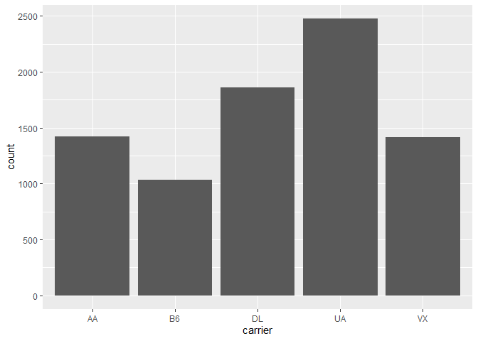

## Install Packages

```r
options(repos = c(CRAN = "http://cran.rstudio.com"))
install.packages("tidyverse")
```

```
## Installing package into 'C:/Users/Derrick/Documents/R/win-library/4.0'
## (as 'lib' is unspecified)
```

```
## package 'tidyverse' successfully unpacked and MD5 sums checked
## 
## The downloaded binary packages are in
## 	C:\Users\Derrick\AppData\Local\Temp\RtmpWGloVA\downloaded_packages
```

```r
install.packages("nycflights13")
```

```
## Installing package into 'C:/Users/Derrick/Documents/R/win-library/4.0'
## (as 'lib' is unspecified)
```

```
## package 'nycflights13' successfully unpacked and MD5 sums checked
## 
## The downloaded binary packages are in
## 	C:\Users\Derrick\AppData\Local\Temp\RtmpWGloVA\downloaded_packages
```

## Working directory

```r
getwd()
```

```
## [1] "C:/Users/Derrick/Documents/GitHub/BIS15W2021_dtran/lab1"
```

## Session Info

```r
sessionInfo()
```

```
## R version 4.0.3 (2020-10-10)
## Platform: x86_64-w64-mingw32/x64 (64-bit)
## Running under: Windows 10 x64 (build 18363)
## 
## Matrix products: default
## 
## locale:
## [1] LC_COLLATE=English_United States.1252 
## [2] LC_CTYPE=English_United States.1252   
## [3] LC_MONETARY=English_United States.1252
## [4] LC_NUMERIC=C                          
## [5] LC_TIME=English_United States.1252    
## 
## attached base packages:
## [1] stats     graphics  grDevices utils     datasets  methods   base     
## 
## loaded via a namespace (and not attached):
##  [1] compiler_4.0.3  magrittr_2.0.1  tools_4.0.3     htmltools_0.5.0
##  [5] yaml_2.2.1      stringi_1.5.3   rmarkdown_2.6   knitr_1.30     
##  [9] stringr_1.4.0   xfun_0.19       digest_0.6.27   rlang_0.4.9    
## [13] evaluate_0.14
```

## Load the libraries

```r
library(nycflights13)
library(tidyverse)
```

```
## -- Attaching packages --------------------------------------- tidyverse 1.3.0 --
```

```
## v ggplot2 3.3.3     v purrr   0.3.4
## v tibble  3.0.4     v dplyr   1.0.2
## v tidyr   1.1.2     v stringr 1.4.0
## v readr   1.4.0     v forcats 0.5.0
```

```
## -- Conflicts ------------------------------------------ tidyverse_conflicts() --
## x dplyr::filter() masks stats::filter()
## x dplyr::lag()    masks stats::lag()
```

## nycflights13

```r
flights
```

```
## # A tibble: 336,776 x 19
##     year month   day dep_time sched_dep_time dep_delay arr_time sched_arr_time
##    <int> <int> <int>    <int>          <int>     <dbl>    <int>          <int>
##  1  2013     1     1      517            515         2      830            819
##  2  2013     1     1      533            529         4      850            830
##  3  2013     1     1      542            540         2      923            850
##  4  2013     1     1      544            545        -1     1004           1022
##  5  2013     1     1      554            600        -6      812            837
##  6  2013     1     1      554            558        -4      740            728
##  7  2013     1     1      555            600        -5      913            854
##  8  2013     1     1      557            600        -3      709            723
##  9  2013     1     1      557            600        -3      838            846
## 10  2013     1     1      558            600        -2      753            745
## # ... with 336,766 more rows, and 11 more variables: arr_delay <dbl>,
## #   carrier <chr>, flight <int>, tailnum <chr>, origin <chr>, dest <chr>,
## #   air_time <dbl>, distance <dbl>, hour <dbl>, minute <dbl>, time_hour <dttm>
```

## Filter
Flights between JFK and SFO airports.

```r
flights %>% 
  filter(origin=="JFK" & dest=="SFO")
```

```
## # A tibble: 8,204 x 19
##     year month   day dep_time sched_dep_time dep_delay arr_time sched_arr_time
##    <int> <int> <int>    <int>          <int>     <dbl>    <int>          <int>
##  1  2013     1     1      611            600        11      945            931
##  2  2013     1     1      655            700        -5     1037           1045
##  3  2013     1     1      729            730        -1     1049           1115
##  4  2013     1     1      734            737        -3     1047           1113
##  5  2013     1     1      745            745         0     1135           1125
##  6  2013     1     1      803            800         3     1132           1144
##  7  2013     1     1     1029           1030        -1     1427           1355
##  8  2013     1     1     1031           1030         1     1353           1415
##  9  2013     1     1     1112           1100        12     1440           1438
## 10  2013     1     1     1124           1100        24     1435           1431
## # ... with 8,194 more rows, and 11 more variables: arr_delay <dbl>,
## #   carrier <chr>, flight <int>, tailnum <chr>, origin <chr>, dest <chr>,
## #   air_time <dbl>, distance <dbl>, hour <dbl>, minute <dbl>, time_hour <dttm>
```

##Plot
Count of flights between JFK and SFO airports by carrier.

```r
flights %>% 
  filter(origin=="JFK" & dest=="SFO") %>% 
  ggplot(aes(x=carrier))+
  geom_bar()
```

<!-- -->
