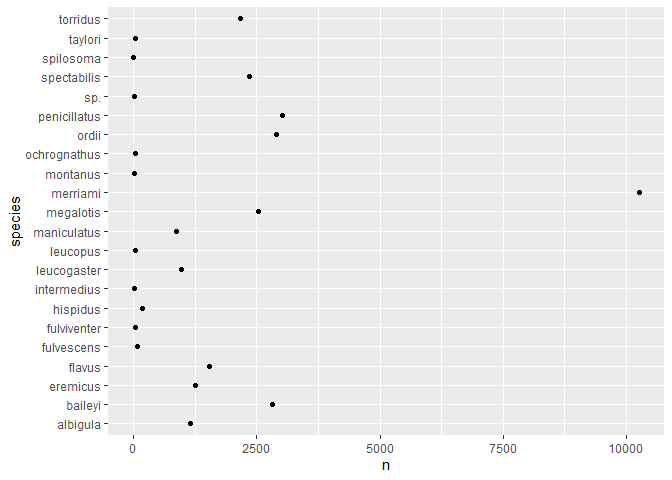

## Instructions
Answer the following questions and complete the exercises in RMarkdown. Please embed all of your code and push your final work to your repository. Your final lab report should be organized, clean, and run free from errors. Remember, you must remove the `#` for the included code chunks to run. Be sure to add your name to the author header above. For any included plots, make sure they are clearly labeled. You are free to use any plot type that you feel best communicates the results of your analysis.  

Make sure to use the formatting conventions of RMarkdown to make your report neat and clean!  

## Load the libraries

```r
library(tidyverse)
library(janitor)
library(here)
library(naniar)
```

## Desert Ecology
For this assignment, we are going to use a modified data set on [desert ecology](http://esapubs.org/archive/ecol/E090/118/). The data are from: S. K. Morgan Ernest, Thomas J. Valone, and James H. Brown. 2009. Long-term monitoring and experimental manipulation of a Chihuahuan Desert ecosystem near Portal, Arizona, USA. Ecology 90:1708.

```r
deserts <- read_csv(here("lab10", "data", "surveys_complete.csv"))
```

```
## 
## -- Column specification --------------------------------------------------------
## cols(
##   record_id = col_double(),
##   month = col_double(),
##   day = col_double(),
##   year = col_double(),
##   plot_id = col_double(),
##   species_id = col_character(),
##   sex = col_character(),
##   hindfoot_length = col_double(),
##   weight = col_double(),
##   genus = col_character(),
##   species = col_character(),
##   taxa = col_character(),
##   plot_type = col_character()
## )
```

```r
clean_names(deserts)
```

```
## # A tibble: 34,786 x 13
##    record_id month   day  year plot_id species_id sex   hindfoot_length weight
##        <dbl> <dbl> <dbl> <dbl>   <dbl> <chr>      <chr>           <dbl>  <dbl>
##  1         1     7    16  1977       2 NL         M                  32     NA
##  2         2     7    16  1977       3 NL         M                  33     NA
##  3         3     7    16  1977       2 DM         F                  37     NA
##  4         4     7    16  1977       7 DM         M                  36     NA
##  5         5     7    16  1977       3 DM         M                  35     NA
##  6         6     7    16  1977       1 PF         M                  14     NA
##  7         7     7    16  1977       2 PE         F                  NA     NA
##  8         8     7    16  1977       1 DM         M                  37     NA
##  9         9     7    16  1977       1 DM         F                  34     NA
## 10        10     7    16  1977       6 PF         F                  20     NA
## # ... with 34,776 more rows, and 4 more variables: genus <chr>, species <chr>,
## #   taxa <chr>, plot_type <chr>
```

1. Use the function(s) of your choice to get an idea of its structure, including how NA's are treated. Are the data tidy?  

```r
skimr::skim(deserts)
```


Table: Data summary

|                         |        |
|:------------------------|:-------|
|Name                     |deserts |
|Number of rows           |34786   |
|Number of columns        |13      |
|_______________________  |        |
|Column type frequency:   |        |
|character                |6       |
|numeric                  |7       |
|________________________ |        |
|Group variables          |None    |


**Variable type: character**

|skim_variable | n_missing| complete_rate| min| max| empty| n_unique| whitespace|
|:-------------|---------:|-------------:|---:|---:|-----:|--------:|----------:|
|species_id    |         0|          1.00|   2|   2|     0|       48|          0|
|sex           |      1748|          0.95|   1|   1|     0|        2|          0|
|genus         |         0|          1.00|   6|  16|     0|       26|          0|
|species       |         0|          1.00|   3|  15|     0|       40|          0|
|taxa          |         0|          1.00|   4|   7|     0|        4|          0|
|plot_type     |         0|          1.00|   7|  25|     0|        5|          0|


**Variable type: numeric**

|skim_variable   | n_missing| complete_rate|     mean|       sd|   p0|     p25|     p50|      p75|  p100|hist  |
|:---------------|---------:|-------------:|--------:|--------:|----:|-------:|-------:|--------:|-----:|:-----|
|record_id       |         0|          1.00| 17804.20| 10229.68|    1| 8964.25| 17761.5| 26654.75| 35548|▇▇▇▇▇ |
|month           |         0|          1.00|     6.47|     3.40|    1|    4.00|     6.0|    10.00|    12|▇▆▆▅▇ |
|day             |         0|          1.00|    16.10|     8.25|    1|    9.00|    16.0|    23.00|    31|▆▇▇▇▆ |
|year            |         0|          1.00|  1990.50|     7.47| 1977| 1984.00|  1990.0|  1997.00|  2002|▇▆▇▇▇ |
|plot_id         |         0|          1.00|    11.34|     6.79|    1|    5.00|    11.0|    17.00|    24|▇▆▇▆▅ |
|hindfoot_length |      3348|          0.90|    29.29|     9.56|    2|   21.00|    32.0|    36.00|    70|▁▇▇▁▁ |
|weight          |      2503|          0.93|    42.67|    36.63|    4|   20.00|    37.0|    48.00|   280|▇▁▁▁▁ |

```r
summary(deserts)
```

```
##    record_id         month             day            year         plot_id     
##  Min.   :    1   Min.   : 1.000   Min.   : 1.0   Min.   :1977   Min.   : 1.00  
##  1st Qu.: 8964   1st Qu.: 4.000   1st Qu.: 9.0   1st Qu.:1984   1st Qu.: 5.00  
##  Median :17762   Median : 6.000   Median :16.0   Median :1990   Median :11.00  
##  Mean   :17804   Mean   : 6.474   Mean   :16.1   Mean   :1990   Mean   :11.34  
##  3rd Qu.:26655   3rd Qu.:10.000   3rd Qu.:23.0   3rd Qu.:1997   3rd Qu.:17.00  
##  Max.   :35548   Max.   :12.000   Max.   :31.0   Max.   :2002   Max.   :24.00  
##                                                                                
##   species_id            sex            hindfoot_length     weight      
##  Length:34786       Length:34786       Min.   : 2.00   Min.   :  4.00  
##  Class :character   Class :character   1st Qu.:21.00   1st Qu.: 20.00  
##  Mode  :character   Mode  :character   Median :32.00   Median : 37.00  
##                                        Mean   :29.29   Mean   : 42.67  
##                                        3rd Qu.:36.00   3rd Qu.: 48.00  
##                                        Max.   :70.00   Max.   :280.00  
##                                        NA's   :3348    NA's   :2503    
##     genus             species              taxa            plot_type        
##  Length:34786       Length:34786       Length:34786       Length:34786      
##  Class :character   Class :character   Class :character   Class :character  
##  Mode  :character   Mode  :character   Mode  :character   Mode  :character  
##                                                                             
##                                                                             
##                                                                             
## 
```
<style>
div.blue { background-color:#e6f0ff; border-radius: 5px; padding: 20px;}
</style>
<div class = "blue">

2. How many genera and species are represented in the data? What are the total number of observations? Which species is most/ least frequently sampled in the study?

```r
names(deserts)
```

```
##  [1] "record_id"       "month"           "day"             "year"           
##  [5] "plot_id"         "species_id"      "sex"             "hindfoot_length"
##  [9] "weight"          "genus"           "species"         "taxa"           
## [13] "plot_type"
```

```r
deserts%>%
  count(species,genus)%>%
  arrange(desc(n))
```

```
## # A tibble: 48 x 3
##    species      genus               n
##    <chr>        <chr>           <int>
##  1 merriami     Dipodomys       10596
##  2 penicillatus Chaetodipus      3123
##  3 ordii        Dipodomys        3027
##  4 baileyi      Chaetodipus      2891
##  5 megalotis    Reithrodontomys  2609
##  6 spectabilis  Dipodomys        2504
##  7 torridus     Onychomys        2249
##  8 flavus       Perognathus      1597
##  9 eremicus     Peromyscus       1299
## 10 albigula     Neotoma          1252
## # ... with 38 more rows
```

```r
deserts%>%
  count(species,genus)%>%
  arrange(n)
```

```
## # A tibble: 48 x 3
##    species      genus               n
##    <chr>        <chr>           <int>
##  1 clarki       Sceloporus          1
##  2 scutalatus   Crotalus            1
##  3 tereticaudus Spermophilus        1
##  4 tigris       Cnemidophorus       1
##  5 uniparens    Cnemidophorus       1
##  6 viridis      Crotalus            1
##  7 leucophrys   Zonotrichia         2
##  8 savannarum   Ammodramus          2
##  9 sp.          Reithrodontomys     2
## 10 sp.          Lizard              4
## # ... with 38 more rows
```
</div>

3. What is the proportion of taxa included in this study? Show a table and plot that reflects this count.

```r
deserts%>%
  ggplot(aes(x=taxa))+
  geom_bar()
```

<!-- -->

4. For the taxa included in the study, use the fill option to show the proportion of individuals sampled by `plot_type.`

```r
deserts%>%
  ggplot(aes(x=taxa,fill=species))+
  geom_bar()
```

<!-- -->

```r
deserts%>%
  ggplot(aes(x=taxa,fill=plot_type))+
  geom_bar()
```

<!-- -->

5. What is the range of weight for each species included in the study? Remove any observations of weight that are NA so they do not show up in the plot.


```r
names(deserts)
```

```
##  [1] "record_id"       "month"           "day"             "year"           
##  [5] "plot_id"         "species_id"      "sex"             "hindfoot_length"
##  [9] "weight"          "genus"           "species"         "taxa"           
## [13] "plot_type"
```


```r
deserts%>%
  filter(weight!= "NA")%>%
  ggplot(aes(x=weight,fill=species))+
  geom_boxplot()
```

<!-- -->
<style>
div.blue { background-color:#e6f0ff; border-radius: 5px; padding: 20px;}
</style>
<div class = "blue">

6. Add another layer to your answer from #4 using `geom_point` to get an idea of how many measurements were taken for each species.

```r
deserts%>%
  filter(weight!= "NA")%>%
  count(species)%>%
  ggplot(aes(x=species,y=n))+
  geom_point()+
  coord_flip()
```

<!-- -->

```r
deserts%>%
  filter(weight!= "NA")%>%
  ggplot(aes(x=weight,fill=species))+
  geom_bar(position = "dodge")+
  coord_flip()
```

```
## Warning: position_dodge requires non-overlapping x intervals
```

<!-- -->

7. [Dipodomys merriami](https://en.wikipedia.org/wiki/Merriam's_kangaroo_rat) is the most frequently sampled animal in the study. How have the number of observations of this species changed over the years included in the study?

```r
structure(deserts)
```

```
## # A tibble: 34,786 x 13
##    record_id month   day  year plot_id species_id sex   hindfoot_length weight
##        <dbl> <dbl> <dbl> <dbl>   <dbl> <chr>      <chr>           <dbl>  <dbl>
##  1         1     7    16  1977       2 NL         M                  32     NA
##  2         2     7    16  1977       3 NL         M                  33     NA
##  3         3     7    16  1977       2 DM         F                  37     NA
##  4         4     7    16  1977       7 DM         M                  36     NA
##  5         5     7    16  1977       3 DM         M                  35     NA
##  6         6     7    16  1977       1 PF         M                  14     NA
##  7         7     7    16  1977       2 PE         F                  NA     NA
##  8         8     7    16  1977       1 DM         M                  37     NA
##  9         9     7    16  1977       1 DM         F                  34     NA
## 10        10     7    16  1977       6 PF         F                  20     NA
## # ... with 34,776 more rows, and 4 more variables: genus <chr>, species <chr>,
## #   taxa <chr>, plot_type <chr>
```


```r
deserts%>%
  count(species,year)%>%
  ggplot(aes(x=year,fill=species,y=n))+
  geom_col()+
  coord_flip()
```

<!-- -->
</div>
8. What is the relationship between `weight` and `hindfoot` length? Consider whether or not over plotting is an issue.

```r
deserts%>%
  filter(weight!="NA",hindfoot_length!="NA")%>%
  ggplot(aes(x=weight,y=hindfoot_length))+
  geom_point(size=1)+
  labs(title = "Hindfoot Length Vs Weight",
       x = "Weight",
       y= "Length")+
    theme(plot.title = element_text(size = rel(1.5), hjust = 0.5))
```

<!-- -->


#it seems like there is a positive correlation up until weight reaches 100 and then it platueas 

<style>
div.blue { background-color:#e6f0ff; border-radius: 5px; padding: 20px;}
</style>
<div class = "blue">

9. Which two species have, on average, the highest weight? Once you have identified them, make a new column that is a ratio of `weight` to `hindfoot_length`. Make a plot that shows the range of this new ratio and fill by sex.

```r
deserts%>%
  filter(weight!="NA")%>%
  summarise(species,weight,sex)%>%
  arrange(desc(weight))%>%
  group_by(species)%>%
  summarise(avg_top_2=mean(weight,na.rm=T))%>%
  arrange(desc(avg_top_2))
```

```
## # A tibble: 22 x 2
##    species      avg_top_2
##    <chr>            <dbl>
##  1 albigula         159. 
##  2 spectabilis      120. 
##  3 spilosoma         93.5
##  4 hispidus          65.6
##  5 fulviventer       58.9
##  6 ochrognathus      55.4
##  7 ordii             48.9
##  8 merriami          43.2
##  9 baileyi           31.7
## 10 leucogaster       31.6
## # ... with 12 more rows
```

```r
deserts%>%
  filter(species=="albigula"|species=="spectabilis")%>%
  filter(hindfoot_length!="NA"|hindfoot_length!=0)%>%
  group_by(sex)%>%
  summarise(weight_height_ratio=weight/hindfoot_length)%>%
  ggplot(aes(x=weight_height_ratio,fill=sex,na.rm=T))+
  geom_bar()
```

```
## `summarise()` has grouped output by 'sex'. You can override using the `.groups` argument.
```

```
## Warning: Removed 134 rows containing non-finite values (stat_count).
```

```
## Warning: position_stack requires non-overlapping x intervals
```

<!-- -->
</div>

10. Make one plot of your choice! Make sure to include at least two of the aesthetics options you have learned.

compare weights between male and females

```r
deserts%>%
  filter(taxa!="NA")%>%
  filter(weight!="NA")%>%
  filter(weight!=0)%>%
  group_by(species)%>%
  summarise(avg_weight=mean(weight,na.rm=T))%>%
  ggplot(aes(x=avg_weight,fill=species))+
  geom_bar()+
  labs(title="Observation of Weight Acorss Taxas",
       x="Weight",y=NULL)+
  theme(plot.title = element_text(size = rel(1.5), hjust = 0.5))+
  theme(axis.text.x = element_text(angle = 60, hjust = 1))
```

```
## Warning: position_stack requires non-overlapping x intervals
```

<!-- -->


```r
deserts%>%
  filter(taxa!="NA")%>%
  filter(weight!="NA")%>%
  filter(weight!=0)%>%
  group_by(species)%>%
  summarise(avg_weight=mean(weight,na.rm=T))%>%
  ggplot(aes(x=avg_weight,color=species))+
  geom_bar()+
  labs(title="Observation of Weight Acorss Taxas",
       x="Weight",y=NULL)+
  theme(plot.title = element_text(size = rel(1.5), hjust = 0.5))+
  theme(axis.text.x = element_text(angle = 60, hjust = 1))
```

```
## Warning: position_stack requires non-overlapping x intervals
```

<!-- -->

## Push your final code to GitHub!
Please be sure that you check the `keep md` file in the knit preferences. 
