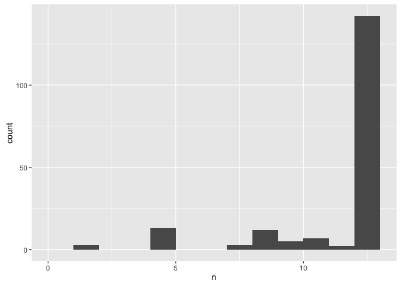

`r format(Sys.Date())`  


```r
suppressPackageStartupMessages(library(dplyr))
library(tidyr)
library(ggplot2)
library(readr)

gap_dat <- read_tsv("07_gap-merged-with-continent.tsv") %>% 
  mutate(country = factor(country),
         continent = factor(continent)) %>% 
  select(country, year, pop, gdpPercap, lifeExp, continent)
gap_dat %>% str()
```

```
## Classes 'tbl_df', 'tbl' and 'data.frame':	3313 obs. of  6 variables:
##  $ country  : Factor w/ 187 levels "Afghanistan",..: 1 1 1 1 1 1 1 1 1 1 ...
##  $ year     : int  1952 1957 1962 1967 1972 1977 1982 1987 1992 1997 ...
##  $ pop      : int  8425333 9240934 10267083 11537966 13079460 14880372 12881816 13867957 16317921 22227415 ...
##  $ gdpPercap: num  779 821 853 836 740 ...
##  $ lifeExp  : num  28.8 30.3 32 34 36.1 ...
##  $ continent: Factor w/ 6 levels "Africa","Americas",..: 3 3 3 3 3 3 3 3 3 3 ...
```

During data exploration, I learned that most countries have data every five 
years, e.g. 1952, 1957, 1962, and so on. Let's make that official.


```r
gap_dat <- gap_dat %>%
  filter(year %% 5 == 2)
gap_dat %>% str()
```

```
## Classes 'tbl_df', 'tbl' and 'data.frame':	2013 obs. of  6 variables:
##  $ country  : Factor w/ 187 levels "Afghanistan",..: 1 1 1 1 1 1 1 1 1 1 ...
##  $ year     : int  1952 1957 1962 1967 1972 1977 1982 1987 1992 1997 ...
##  $ pop      : int  8425333 9240934 10267083 11537966 13079460 14880372 12881816 13867957 16317921 22227415 ...
##  $ gdpPercap: num  779 821 853 836 740 ...
##  $ lifeExp  : num  28.8 30.3 32 34 36.1 ...
##  $ continent: Factor w/ 6 levels "Africa","Americas",..: 3 3 3 3 3 3 3 3 3 3 ...
```

Number of distinct values for year.


```r
(n_years <- gap_dat$year %>% n_distinct())
```

```
## [1] 12
```

Does every country contribute data for all years?


```r
country_freq <- gap_dat %>%
  count(country)
country_freq$n %>% table()
```

```
## .
##   1   4   7   8   9  10  11  12 
##   3  13   3  12   5   7   2 142
```

No.


```r
ggplot(country_freq, aes(x = n)) + geom_histogram(binwidth = 1)
```

\ 

Most countries do contribute data for 12 years. Who contributes less?


```r
country_freq %>%
  filter(n < 12) %>%
  arrange(n) %>% 
  print(n = nrow(.))
```

```
## Source: local data frame [45 x 2]
## 
##                  country     n
##                   (fctr) (int)
## 1          French Guiana     1
## 2             Guadeloupe     1
## 3             Martinique     1
## 4                Armenia     4
## 5             Azerbaijan     4
## 6                Belarus     4
## 7                Estonia     4
## 8             Kazakhstan     4
## 9              Lithuania     4
## 10               Moldova     4
## 11                Russia     4
## 12            Tajikistan     4
## 13           Timor-Leste     4
## 14          Turkmenistan     4
## 15               Ukraine     4
## 16            Uzbekistan     4
## 17                 Samoa     7
## 18                 Tonga     7
## 19               Vanuatu     7
## 20                 Aruba     8
## 21                Bhutan     8
## 22                Brunei     8
## 23                Cyprus     8
## 24               Grenada     8
## 25          Macao, China     8
## 26              Maldives     8
## 27 Micronesia, Fed. Sts.     8
## 28  Netherlands Antilles     8
## 29                 Qatar     8
## 30              Suriname     8
## 31  United Arab Emirates     8
## 32      French Polynesia     9
## 33               Georgia     9
## 34                Latvia     9
## 35         New Caledonia     9
## 36       Solomon Islands     9
## 37               Bahamas    10
## 38              Barbados    10
## 39                Belize    10
## 40                  Fiji    10
## 41                Guyana    10
## 42                 Malta    10
## 43      Papua New Guinea    10
## 44            Cape Verde    11
## 45            Luxembourg    11
```

I will let these countries go.


```r
gap_dat <- country_freq %>% 
  filter(n > 11) %>% 
  left_join(gap_dat) %>% 
  select(-n) %>% 
  droplevels() %>%
  arrange(country, year)
```

```
## Joining by: "country"
```

```r
gap_dat %>% str()
```

```
## Classes 'tbl_df', 'tbl' and 'data.frame':	1704 obs. of  6 variables:
##  $ country  : Factor w/ 142 levels "Afghanistan",..: 1 1 1 1 1 1 1 1 1 1 ...
##  $ year     : int  1952 1957 1962 1967 1972 1977 1982 1987 1992 1997 ...
##  $ pop      : int  8425333 9240934 10267083 11537966 13079460 14880372 12881816 13867957 16317921 22227415 ...
##  $ gdpPercap: num  779 821 853 836 740 ...
##  $ lifeExp  : num  28.8 30.3 32 34 36.1 ...
##  $ continent: Factor w/ 5 levels "Africa","Americas",..: 3 3 3 3 3 3 3 3 3 3 ...
```

```r
## match variable order of the past
gap_dat <- gap_dat %>% 
  select(country, continent, year, lifeExp, pop, gdpPercap)

write_tsv(gap_dat,"08_gap-every-five-years.tsv")
```


---
title: "08_filter-every-five-years.R"
author: "jenny"
date: "Wed Dec 30 08:26:01 2015"
---
