## Instructions
Answer the following questions and complete the exercises in RMarkdown. Please embed all of your code and push your final work to your repository. Your final lab report should be organized, clean, and run free from errors. Remember, you must remove the `#` for the included code chunks to run. Be sure to add your name to the author header above. For any included plots, make sure they are clearly labeled. You are free to use any plot type that you feel best communicates the results of your analysis.  

**In this homework, you should make use of the aesthetics you have learned. It's OK to be flashy!**

Make sure to use the formatting conventions of RMarkdown to make your report neat and clean!  

## Load the libraries

```r
library(tidyverse)
library(janitor)
library(here)
library(naniar)
library(RColorBrewer)
library(paletteer)
```

## Resources
The idea for this assignment came from [Rebecca Barter's](http://www.rebeccabarter.com/blog/2017-11-17-ggplot2_tutorial/) ggplot tutorial so if you get stuck this is a good place to have a look.  

## Gapminder
For this assignment, we are going to use the dataset [gapminder](https://cran.r-project.org/web/packages/gapminder/index.html). Gapminder includes information about economics, population, and life expectancy from countries all over the world. You will need to install it before use. This is the same data that we will use for midterm 2 so this is good practice.

```r
library("gapminder")
```

```r
glimpse(gapminder)
```

```
## Rows: 1,704
## Columns: 6
## $ country   <fct> Afghanistan, Afghanistan, Afghanistan, Afghanistan, Afgha...
## $ continent <fct> Asia, Asia, Asia, Asia, Asia, Asia, Asia, Asia, Asia, Asi...
## $ year      <int> 1952, 1957, 1962, 1967, 1972, 1977, 1982, 1987, 1992, 199...
## $ lifeExp   <dbl> 28.801, 30.332, 31.997, 34.020, 36.088, 38.438, 39.854, 4...
## $ pop       <int> 8425333, 9240934, 10267083, 11537966, 13079460, 14880372,...
## $ gdpPercap <dbl> 779.4453, 820.8530, 853.1007, 836.1971, 739.9811, 786.113...
```

```r
#i wanna change year to be a factor i remember that being important in class
```

```r
summary(gapminder)
```

```
##         country        continent        year         lifeExp     
##  Afghanistan:  12   Africa  :624   Min.   :1952   Min.   :23.60  
##  Albania    :  12   Americas:300   1st Qu.:1966   1st Qu.:48.20  
##  Algeria    :  12   Asia    :396   Median :1980   Median :60.71  
##  Angola     :  12   Europe  :360   Mean   :1980   Mean   :59.47  
##  Argentina  :  12   Oceania : 24   3rd Qu.:1993   3rd Qu.:70.85  
##  Australia  :  12                  Max.   :2007   Max.   :82.60  
##  (Other)    :1632                                                
##       pop              gdpPercap       
##  Min.   :6.001e+04   Min.   :   241.2  
##  1st Qu.:2.794e+06   1st Qu.:  1202.1  
##  Median :7.024e+06   Median :  3531.8  
##  Mean   :2.960e+07   Mean   :  7215.3  
##  3rd Qu.:1.959e+07   3rd Qu.:  9325.5  
##  Max.   :1.319e+09   Max.   :113523.1  
## 
```

```r
clean_names(gapminder)
```

```
## # A tibble: 1,704 x 6
##    country     continent  year life_exp      pop gdp_percap
##    <fct>       <fct>     <int>    <dbl>    <int>      <dbl>
##  1 Afghanistan Asia       1952     28.8  8425333       779.
##  2 Afghanistan Asia       1957     30.3  9240934       821.
##  3 Afghanistan Asia       1962     32.0 10267083       853.
##  4 Afghanistan Asia       1967     34.0 11537966       836.
##  5 Afghanistan Asia       1972     36.1 13079460       740.
##  6 Afghanistan Asia       1977     38.4 14880372       786.
##  7 Afghanistan Asia       1982     39.9 12881816       978.
##  8 Afghanistan Asia       1987     40.8 13867957       852.
##  9 Afghanistan Asia       1992     41.7 16317921       649.
## 10 Afghanistan Asia       1997     41.8 22227415       635.
## # ... with 1,694 more rows
```

```r
structure(gapminder)
```

```
## # A tibble: 1,704 x 6
##    country     continent  year lifeExp      pop gdpPercap
##    <fct>       <fct>     <int>   <dbl>    <int>     <dbl>
##  1 Afghanistan Asia       1952    28.8  8425333      779.
##  2 Afghanistan Asia       1957    30.3  9240934      821.
##  3 Afghanistan Asia       1962    32.0 10267083      853.
##  4 Afghanistan Asia       1967    34.0 11537966      836.
##  5 Afghanistan Asia       1972    36.1 13079460      740.
##  6 Afghanistan Asia       1977    38.4 14880372      786.
##  7 Afghanistan Asia       1982    39.9 12881816      978.
##  8 Afghanistan Asia       1987    40.8 13867957      852.
##  9 Afghanistan Asia       1992    41.7 16317921      649.
## 10 Afghanistan Asia       1997    41.8 22227415      635.
## # ... with 1,694 more rows
```

## Questions
The questions below are open-ended and have many possible solutions. Your approach should, where appropriate, include numerical summaries and visuals. Be creative; assume you are building an analysis that you would ultimately present to an audience of stakeholders. Feel free to try out different `geoms` if they more clearly present your results.  

**1. Use the function(s) of your choice to get an idea of the overall structure of the data frame, including its dimensions, column names, variable classes, etc. As part of this, determine how NA's are treated in the data.**  

```r
names(gapminder)
```

```
## [1] "country"   "continent" "year"      "lifeExp"   "pop"       "gdpPercap"
```

```r
summary(gapminder)
```

```
##         country        continent        year         lifeExp     
##  Afghanistan:  12   Africa  :624   Min.   :1952   Min.   :23.60  
##  Albania    :  12   Americas:300   1st Qu.:1966   1st Qu.:48.20  
##  Algeria    :  12   Asia    :396   Median :1980   Median :60.71  
##  Angola     :  12   Europe  :360   Mean   :1980   Mean   :59.47  
##  Argentina  :  12   Oceania : 24   3rd Qu.:1993   3rd Qu.:70.85  
##  Australia  :  12                  Max.   :2007   Max.   :82.60  
##  (Other)    :1632                                                
##       pop              gdpPercap       
##  Min.   :6.001e+04   Min.   :   241.2  
##  1st Qu.:2.794e+06   1st Qu.:  1202.1  
##  Median :7.024e+06   Median :  3531.8  
##  Mean   :2.960e+07   Mean   :  7215.3  
##  3rd Qu.:1.959e+07   3rd Qu.:  9325.5  
##  Max.   :1.319e+09   Max.   :113523.1  
## 
```

```r
gapminder%>%
  count("NA")
```

```
## # A tibble: 1 x 2
##   `"NA"`     n
##   <chr>  <int>
## 1 NA      1704
```

```r
#so im looking at the data it looks fine to work with, I think i'll just filter out NA's and see what happens first
```


```r
gapminder_working<-gapminder%>%
  filter(gapminder!="NA")
gapminder_working
```

```
## # A tibble: 1,704 x 6
##    country     continent  year lifeExp      pop gdpPercap
##    <fct>       <fct>     <int>   <dbl>    <int>     <dbl>
##  1 Afghanistan Asia       1952    28.8  8425333      779.
##  2 Afghanistan Asia       1957    30.3  9240934      821.
##  3 Afghanistan Asia       1962    32.0 10267083      853.
##  4 Afghanistan Asia       1967    34.0 11537966      836.
##  5 Afghanistan Asia       1972    36.1 13079460      740.
##  6 Afghanistan Asia       1977    38.4 14880372      786.
##  7 Afghanistan Asia       1982    39.9 12881816      978.
##  8 Afghanistan Asia       1987    40.8 13867957      852.
##  9 Afghanistan Asia       1992    41.7 16317921      649.
## 10 Afghanistan Asia       1997    41.8 22227415      635.
## # ... with 1,694 more rows
```

**2. Among the interesting variables in gapminder is life expectancy. How has global life expectancy changed between 1952 and 2007?**

```r
names(gapminder_working)
```

```
## [1] "country"   "continent" "year"      "lifeExp"   "pop"       "gdpPercap"
```


```r
gapminder_working%>%
  group_by(year)%>%
  summarise(avg_life=mean(lifeExp,na.rm=T))
```

```
## `summarise()` ungrouping output (override with `.groups` argument)
```

```
## # A tibble: 12 x 2
##     year avg_life
##    <int>    <dbl>
##  1  1952     49.1
##  2  1957     51.5
##  3  1962     53.6
##  4  1967     55.7
##  5  1972     57.6
##  6  1977     59.6
##  7  1982     61.5
##  8  1987     63.2
##  9  1992     64.2
## 10  1997     65.0
## 11  2002     65.7
## 12  2007     67.0
```

```r
gapminder_working%>%
  filter(year>=1952|year<=2007)%>%
  group_by(year)%>%
  summarise(avg_life=mean(lifeExp,na.rm=T))%>%
  ggplot(aes(x=year,y=avg_life))+
  geom_point()
```

```
## `summarise()` ungrouping output (override with `.groups` argument)
```

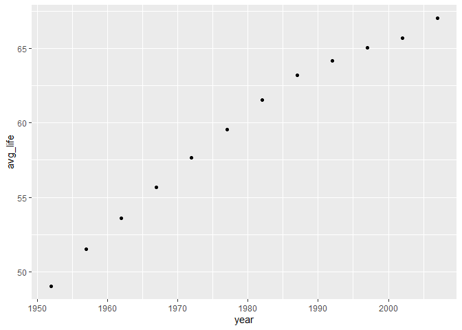<!-- -->

```r
gapminder_working%>%
  filter(year>=1952|year<=2007)%>%
  group_by(year)%>%
  summarise(avg_life=mean(lifeExp,na.rm=T))%>%
  ggplot(aes(x=year,y=avg_life))+
  geom_col(alpha=0.6,color="black",fill="wheat2")+
  theme(legend.position = "bottom",
        axis.text.x = element_text(angle = 60, hjust=1))+
  labs(title = "Life Expectancy Over Time",
       x = "Year",
       y= "Life Expectancy",
       fill= "country")
```

```
## `summarise()` ungrouping output (override with `.groups` argument)
```

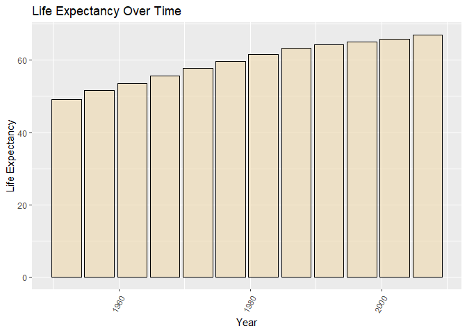<!-- -->

**3. How do the distributions of life expectancy compare for the years 1952 and 2007?**

```r
gapminder_working%>%
  filter(year==1952|year==2007)%>%
  ggplot(aes(x=year,y=lifeExp))+
  geom_col(alpha=0.6,color="black",fill="wheat2")+
  theme(legend.position = "bottom",
        axis.text.x = element_text(angle = 60, hjust=1))+
  labs(title = "Life Expectancy Over Time",
       x = "Year",
       y= "Life Expectancy")
```

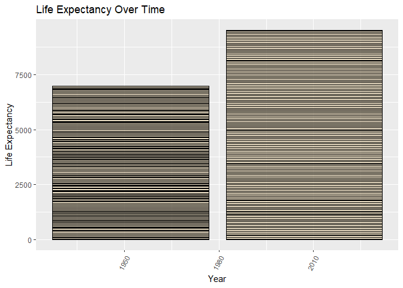<!-- -->

**4. Your answer above doesn't tell the whole story since life expectancy varies by region. Make a summary that shows the min, mean, and max life expectancy by continent for all years represented in the data.**


```r
summary(gapminder)
```

```
##         country        continent        year         lifeExp     
##  Afghanistan:  12   Africa  :624   Min.   :1952   Min.   :23.60  
##  Albania    :  12   Americas:300   1st Qu.:1966   1st Qu.:48.20  
##  Algeria    :  12   Asia    :396   Median :1980   Median :60.71  
##  Angola     :  12   Europe  :360   Mean   :1980   Mean   :59.47  
##  Argentina  :  12   Oceania : 24   3rd Qu.:1993   3rd Qu.:70.85  
##  Australia  :  12                  Max.   :2007   Max.   :82.60  
##  (Other)    :1632                                                
##       pop              gdpPercap       
##  Min.   :6.001e+04   Min.   :   241.2  
##  1st Qu.:2.794e+06   1st Qu.:  1202.1  
##  Median :7.024e+06   Median :  3531.8  
##  Mean   :2.960e+07   Mean   :  7215.3  
##  3rd Qu.:1.959e+07   3rd Qu.:  9325.5  
##  Max.   :1.319e+09   Max.   :113523.1  
## 
```

```r
library(gtools)
quartiles<- quantcut(gapminder_working$lifeExp)
table(quartiles)
```

```
## quartiles
## [23.6,48.2] (48.2,60.7] (60.7,70.8] (70.8,82.6] 
##         426         426         426         426
```


```r
gapminder_working%>%
  group_by(continent)%>%
  summarise(min_exp=min(lifeExp),max_exp=max(lifeExp),avg_life=mean(lifeExp))
```

```
## `summarise()` ungrouping output (override with `.groups` argument)
```

```
## # A tibble: 5 x 4
##   continent min_exp max_exp avg_life
##   <fct>       <dbl>   <dbl>    <dbl>
## 1 Africa       23.6    76.4     48.9
## 2 Americas     37.6    80.7     64.7
## 3 Asia         28.8    82.6     60.1
## 4 Europe       43.6    81.8     71.9
## 5 Oceania      69.1    81.2     74.3
```

```r
gapminder_working%>%
  group_by(continent)%>%
  summarise(min_exp=min(lifeExp),max_exp=max(lifeExp),avg_life=mean(lifeExp))%>%
  ggplot(aes(x=continent,fill=avg_life,y=max_exp))+
  geom_col()+
  theme(axis.text.x = element_text(angle = 60, hjust=1))+
  labs(title = "Summary of life expectancy per continent",
       x = "Continent",
       y= "Max Life Expectancy")
```

```
## `summarise()` ungrouping output (override with `.groups` argument)
```

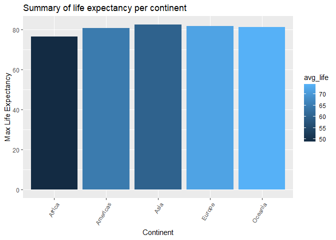<!-- -->


```r
gapminder_working%>%
  group_by(continent)%>%
  summarise(min_exp=min(lifeExp),max_exp=max(lifeExp),avg_life=mean(lifeExp))%>%
  ggplot(aes(x=continent,fill=max_exp,y=avg_life))+
  geom_col( color = "black")+theme(axis.text.x = element_text(angle = 60, hjust=1))+
  labs(title = "Summary of life expectancy per continent",
       x = "Continent",
       y= "Average Life Expectancy")
```

```
## `summarise()` ungrouping output (override with `.groups` argument)
```

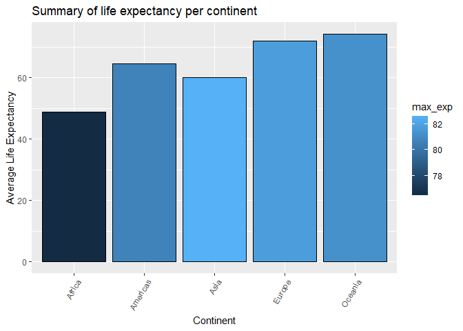<!-- -->


```r
my_palette <- paletteer_d("ggsci::hallmarks_light_cosmic")
```


**5. How has life expectancy changed between 1952-2007 for each continent?**

```r
gapminder_working%>%
  filter(year>=1952|year<=2007)%>%
  group_by(year,continent,lifeExp)%>%
  summarise(avg_life_exp=mean(lifeExp,na.rm=T))%>%
  ggplot(aes(x=year,fill=continent,y=avg_life_exp))+
  geom_col(position = "dodge")
```

```
## `summarise()` regrouping output by 'year', 'continent' (override with `.groups` argument)
```

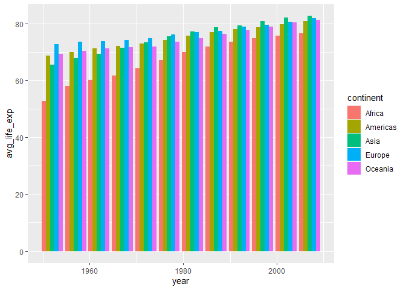<!-- -->

**6. We are interested in the relationship between per capita GDP and life expectancy; i.e. does having more money help you live longer?**

```r
gapminder_working%>%
  group_by(continent,lifeExp)%>%
  summarise(avg_gdp=mean(mean(gdpPercap,na.rm=T)),avg_life_exp=mean(lifeExp,na.rm=T))%>%
  ggplot(aes(x=avg_life_exp,y=avg_gdp))+
  geom_point()
```

```
## `summarise()` regrouping output by 'continent' (override with `.groups` argument)
```

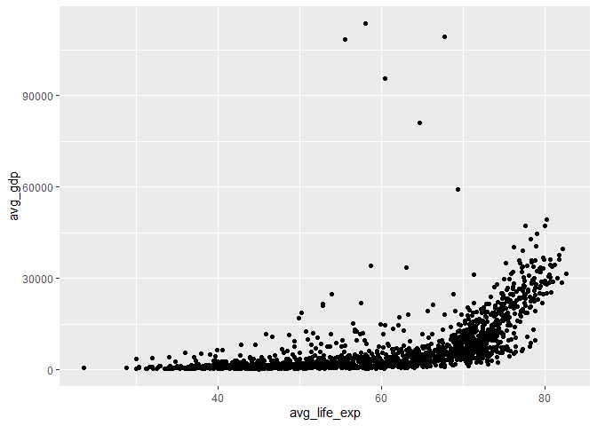<!-- -->

**7. Which countries have had the largest population growth since 1952?**


```r
gapminder_working%>%
  filter(year==1952|year==2007)%>%
  select(country,pop,year)%>%
  group_by(country)%>%
  mutate(growth=pop-lag(pop,default = pop[1]))%>%
  filter(year==2007)%>%
  summarise(country,growth)%>%
  arrange(desc(growth))
```

```
## `summarise()` ungrouping output (override with `.groups` argument)
```

```
## # A tibble: 142 x 2
##    country          growth
##    <fct>             <int>
##  1 China         762419569
##  2 India         738396331
##  3 United States 143586947
##  4 Indonesia     141495000
##  5 Brazil        133408087
##  6 Pakistan      127924057
##  7 Bangladesh    103561480
##  8 Nigeria       101912068
##  9 Mexico         78556574
## 10 Philippines    68638596
## # ... with 132 more rows
```


```r
gapminder_working%>%
  filter(year==1952|year==2007)%>%
  select(country,pop,year)%>%
  group_by(country)%>%
  mutate(growth=pop-lag(pop,default = pop[1]))%>%
  filter(year==2007)%>%
  summarise(country,growth)%>%
  top_n(5)%>%
  arrange(desc(growth))
```

```
## `summarise()` ungrouping output (override with `.groups` argument)
```

```
## Selecting by growth
```

```
## # A tibble: 5 x 2
##   country          growth
##   <fct>             <int>
## 1 China         762419569
## 2 India         738396331
## 3 United States 143586947
## 4 Indonesia     141495000
## 5 Brazil        133408087
```


**8. Use your results from the question above to plot population growth for the top five countries since 1952.**

```r
gapminder_working%>%
  filter(year==1952|year==2007)%>%
  select(country,pop,year)%>%
  group_by(country)%>%
  mutate(growth=pop-lag(pop,default = pop[1]))%>%
  filter(year==2007)%>%
  summarise(country,growth)%>%
  top_n(5)%>%
  ggplot(aes(x=country,y=growth))+
  geom_col()
```

```
## `summarise()` ungrouping output (override with `.groups` argument)
```

```
## Selecting by growth
```

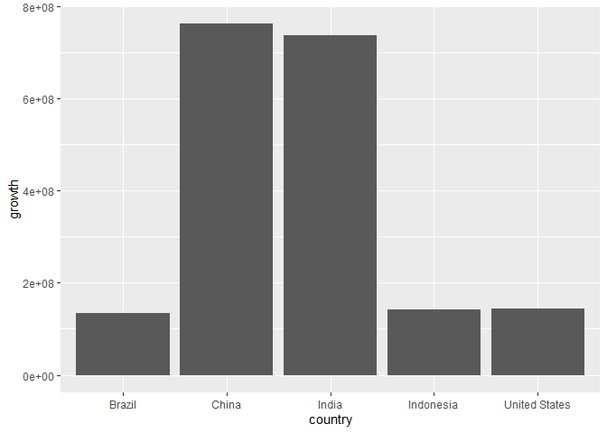<!-- -->

```r
gapminder_working%>%
  filter(year==1952|year==2007)%>%
  select(country,pop,year)%>%
  group_by(country)%>%
  mutate(growth=pop-lag(pop,default = pop[1]))%>%
  filter(year==2007)%>%
  summarise(country,growth)%>%
  top_n(5)%>%
  ggplot(aes(x=country,y=growth))+
  geom_point()
```

```
## `summarise()` ungrouping output (override with `.groups` argument)
```

```
## Selecting by growth
```

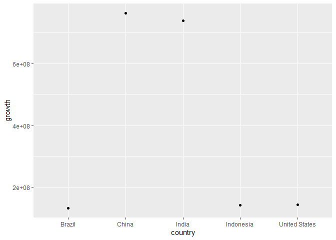<!-- -->

**9. How does per-capita GDP growth compare between these same five countries?**

```r
gapminder_working%>%
  filter(year==1952|year==2007)%>%
  select(country,pop,year,gdpPercap)%>%
  group_by(country)%>%
  mutate(growth_gdp=gdpPercap-lag(gdpPercap,default = 0))%>%
  filter(year==2007)%>%
  summarise(country,growth_gdp)%>%
  top_n(5)%>%
  arrange(desc(growth_gdp))
```

```
## `summarise()` ungrouping output (override with `.groups` argument)
```

```
## Selecting by growth_gdp
```

```
## # A tibble: 5 x 2
##   country          growth_gdp
##   <fct>                 <dbl>
## 1 Singapore            44828.
## 2 Norway               39262.
## 3 Hong Kong, China     36671.
## 4 Ireland              35466.
## 5 Austria              29989.
```

```r
gapminder_working%>%
  filter(year==1952|year==2007)%>%
  select(country,pop,year,gdpPercap)%>%
  group_by(country)%>%
  mutate(growth_gdp=gdpPercap-lag(gdpPercap,default = gdpPercap[1]))%>%
  summarise(country,growth_gdp)%>%
  arrange(desc(growth_gdp))
```

```
## `summarise()` regrouping output by 'country' (override with `.groups` argument)
```

```
## # A tibble: 284 x 2
## # Groups:   country [142]
##    country          growth_gdp
##    <fct>                 <dbl>
##  1 Singapore            44828.
##  2 Norway               39262.
##  3 Hong Kong, China     36671.
##  4 Ireland              35466.
##  5 Austria              29989.
##  6 United States        28961.
##  7 Iceland              28913.
##  8 Japan                28439.
##  9 Netherlands          27856.
## 10 Taiwan               27511.
## # ... with 274 more rows
```

```r
gapminder_working%>%
  filter(year==1952|year==2007)%>%
  select(country,pop,year,gdpPercap)%>%
  group_by(country)%>%
  mutate(growth_gdp=gdpPercap-lag(gdpPercap,default = gdpPercap[1]))%>%
  summarise(country,growth_gdp)%>%
  arrange(desc(growth_gdp))%>%
  top_n(5)
```

```
## `summarise()` regrouping output by 'country' (override with `.groups` argument)
```

```
## Selecting by growth_gdp
```

```
## # A tibble: 284 x 2
## # Groups:   country [142]
##    country          growth_gdp
##    <fct>                 <dbl>
##  1 Singapore            44828.
##  2 Norway               39262.
##  3 Hong Kong, China     36671.
##  4 Ireland              35466.
##  5 Austria              29989.
##  6 United States        28961.
##  7 Iceland              28913.
##  8 Japan                28439.
##  9 Netherlands          27856.
## 10 Taiwan               27511.
## # ... with 274 more rows
```


**10. Make one plot of your choice that uses faceting!**

```r
pp2<-gapminder_working%>%
  ggplot(aes(x=lifeExp))+
  geom_density()
```


```r
pp2
```

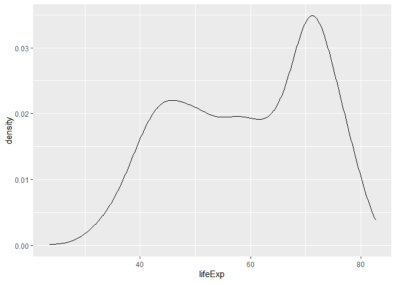<!-- -->


```r
pp2+facet_wrap(~continent)
```

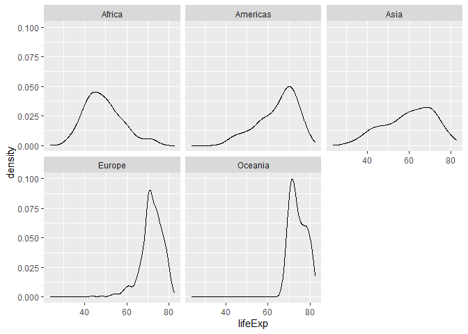<!-- -->

```r
pp3<-gapminder_working%>%
  ggplot(aes(x=pop))+
  geom_density()

pp3
```

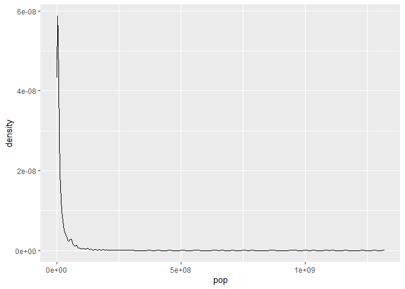<!-- -->

```r
pp3+facet_wrap(~continent)
```

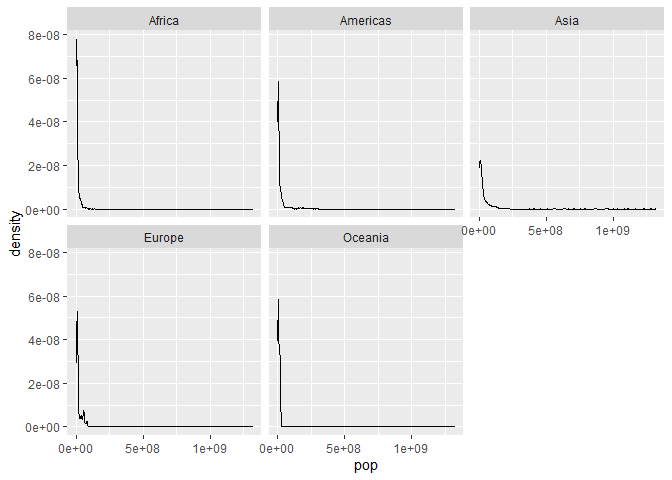<!-- -->


## Push your final code to GitHub!
Please be sure that you check the `keep md` file in the knit preferences. 
