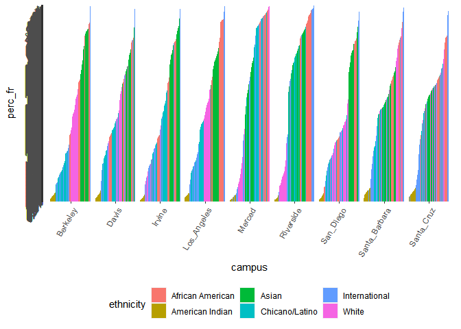

## Instructions
Answer the following questions and complete the exercises in RMarkdown. Please embed all of your code and push your final work to your repository. Your final lab report should be organized, clean, and run free from errors. Remember, you must remove the `#` for the included code chunks to run. Be sure to add your name to the author header above. For any included plots, make sure they are clearly labeled. You are free to use any plot type that you feel best communicates the results of your analysis.  

Make sure to use the formatting conventions of RMarkdown to make your report neat and clean!  

## Libraries

```r
if (!require("tidyverse")) install.packages('tidyverse')
```

```
## Loading required package: tidyverse
```

```
## -- Attaching packages --------------------------------------- tidyverse 1.3.0 --
```

```
## v ggplot2 3.3.3     v purrr   0.3.4
## v tibble  3.0.6     v dplyr   1.0.4
## v tidyr   1.1.2     v stringr 1.4.0
## v readr   1.4.0     v forcats 0.5.1
```

```
## -- Conflicts ------------------------------------------ tidyverse_conflicts() --
## x dplyr::filter() masks stats::filter()
## x dplyr::lag()    masks stats::lag()
```


```r
library("tidyverse")
library("shiny")
library("shinydashboard")
library("janitor")
library("naniar")
```

## Data
The data for this assignment come from the [University of California Information Center](https://www.universityofcalifornia.edu/infocenter). Admissions data were collected for the years 2010-2019 for each UC campus. Admissions are broken down into three categories: applications, admits, and enrollees. The number of individuals in each category are presented by demographic.  

```r
UC_admit <- readr::read_csv("data/UC_admit.csv")
```

```
## 
## -- Column specification --------------------------------------------------------
## cols(
##   Campus = col_character(),
##   Academic_Yr = col_double(),
##   Category = col_character(),
##   Ethnicity = col_character(),
##   `Perc FR` = col_character(),
##   FilteredCountFR = col_double()
## )
```


**1. Use the function(s) of your choice to get an idea of the overall structure of the data frame, including its dimensions, column names, variable classes, etc. As part of this, determine if there are NA's and how they are treated.**  

the NA's are treated as Unknown and All probably refers to total applicants, though i am not sure what it is referring to but i will leave it in for now. I would like to include them still in the data set but I will probably filter it out


```r
UC_admit_td<-UC_admit%>%
  filter(Ethnicity!="Unknown")%>%
  filter(Ethnicity!="All")
UC_admit_td<-clean_names(UC_admit_td)
UC_admit_td<-
transform(UC_admit_td,category=as.factor(category))
transform(UC_admit_td,ethnicity=as.factor(ethnicity))
```

```
##             campus academic_yr   category        ethnicity perc_fr
## 1            Davis        2019 Applicants    International  21.16%
## 2            Davis        2019 Applicants            White  18.39%
## 3            Davis        2019 Applicants            Asian  30.76%
## 4            Davis        2019 Applicants   Chicano/Latino  22.44%
## 5            Davis        2019 Applicants  American Indian   0.35%
## 6            Davis        2019 Applicants African American   4.39%
## 7            Davis        2018 Applicants    International  19.87%
## 8            Davis        2018 Applicants            White  18.96%
## 9            Davis        2018 Applicants            Asian  30.63%
## 10           Davis        2018 Applicants   Chicano/Latino  22.74%
## 11           Davis        2018 Applicants  American Indian   0.43%
## 12           Davis        2018 Applicants African American   4.53%
## 13           Davis        2017 Applicants    International  19.63%
## 14           Davis        2017 Applicants            White  20.29%
## 15           Davis        2017 Applicants            Asian  29.97%
## 16           Davis        2017 Applicants   Chicano/Latino  22.51%
## 17           Davis        2017 Applicants  American Indian   0.47%
## 18           Davis        2017 Applicants African American   4.57%
## 19           Davis        2016 Applicants    International  19.75%
## 20           Davis        2016 Applicants            White  20.85%
## 21           Davis        2016 Applicants            Asian  29.91%
## 22           Davis        2016 Applicants   Chicano/Latino  21.70%
## 23           Davis        2016 Applicants  American Indian   0.46%
## 24           Davis        2016 Applicants African American   4.61%
## 25           Davis        2015 Applicants    International  17.40%
## 26           Davis        2015 Applicants            White  21.68%
## 27           Davis        2015 Applicants            Asian  31.99%
## 28           Davis        2015 Applicants   Chicano/Latino  21.17%
## 29           Davis        2015 Applicants  American Indian   0.49%
## 30           Davis        2015 Applicants African American   4.36%
## 31           Davis        2014 Applicants    International  15.55%
## 32           Davis        2014 Applicants            White  23.22%
## 33           Davis        2014 Applicants            Asian  33.25%
## 34           Davis        2014 Applicants   Chicano/Latino  20.54%
## 35           Davis        2014 Applicants  American Indian   0.62%
## 36           Davis        2014 Applicants African American   4.21%
## 37           Davis        2013 Applicants    International  11.99%
## 38           Davis        2013 Applicants            White  25.03%
## 39           Davis        2013 Applicants            Asian  34.50%
## 40           Davis        2013 Applicants   Chicano/Latino  20.63%
## 41           Davis        2013 Applicants  American Indian   0.57%
## 42           Davis        2013 Applicants African American   4.38%
## 43           Davis        2012 Applicants    International   8.31%
## 44           Davis        2012 Applicants            White  26.58%
## 45           Davis        2012 Applicants            Asian  36.75%
## 46           Davis        2012 Applicants   Chicano/Latino  20.51%
## 47           Davis        2012 Applicants  American Indian   0.64%
## 48           Davis        2012 Applicants African American   4.57%
## 49           Davis        2011 Applicants    International   4.47%
## 50           Davis        2011 Applicants            White  30.31%
## 51           Davis        2011 Applicants            Asian  37.47%
## 52           Davis        2011 Applicants   Chicano/Latino  20.26%
## 53           Davis        2011 Applicants  American Indian   0.66%
## 54           Davis        2011 Applicants African American   4.39%
## 55           Davis        2010 Applicants    International   3.77%
## 56           Davis        2010 Applicants            White  31.24%
## 57           Davis        2010 Applicants            Asian  36.41%
## 58           Davis        2010 Applicants   Chicano/Latino  17.88%
## 59           Davis        2010 Applicants  American Indian   0.82%
## 60           Davis        2010 Applicants African American   4.43%
## 61           Davis        2019     Admits    International  22.69%
## 62           Davis        2019     Admits            White  20.51%
## 63           Davis        2019     Admits            Asian  32.01%
## 64           Davis        2019     Admits   Chicano/Latino  18.46%
## 65           Davis        2019     Admits  American Indian   0.40%
## 66           Davis        2019     Admits African American   3.17%
## 67           Davis        2018     Admits    International  26.98%
## 68           Davis        2018     Admits            White  19.77%
## 69           Davis        2018     Admits            Asian  29.26%
## 70           Davis        2018     Admits   Chicano/Latino  17.52%
## 71           Davis        2018     Admits  American Indian   0.42%
## 72           Davis        2018     Admits African American   3.03%
## 73           Davis        2017     Admits    International  26.97%
## 74           Davis        2017     Admits            White  20.86%
## 75           Davis        2017     Admits            Asian  28.98%
## 76           Davis        2017     Admits   Chicano/Latino  17.01%
## 77           Davis        2017     Admits  American Indian   0.46%
## 78           Davis        2017     Admits African American   2.91%
## 79           Davis        2016     Admits    International  23.05%
## 80           Davis        2016     Admits            White  22.94%
## 81           Davis        2016     Admits            Asian  30.53%
## 82           Davis        2016     Admits   Chicano/Latino  16.91%
## 83           Davis        2016     Admits  American Indian   0.46%
## 84           Davis        2016     Admits African American   2.97%
## 85           Davis        2015     Admits    International  23.11%
## 86           Davis        2015     Admits            White  22.97%
## 87           Davis        2015     Admits            Asian  32.07%
## 88           Davis        2015     Admits   Chicano/Latino  15.55%
## 89           Davis        2015     Admits  American Indian   0.50%
## 90           Davis        2015     Admits African American   2.68%
## 91           Davis        2014     Admits    International  17.23%
## 92           Davis        2014     Admits            White  25.35%
## 93           Davis        2014     Admits            Asian  34.92%
## 94           Davis        2014     Admits   Chicano/Latino  16.25%
## 95           Davis        2014     Admits  American Indian   0.61%
## 96           Davis        2014     Admits African American   2.47%
## 97           Davis        2013     Admits    International  13.84%
## 98           Davis        2013     Admits            White  28.26%
## 99           Davis        2013     Admits            Asian  35.88%
## 100          Davis        2013     Admits   Chicano/Latino  15.41%
## 101          Davis        2013     Admits  American Indian   0.55%
## 102          Davis        2013     Admits African American   2.54%
## 103          Davis        2012     Admits    International   9.53%
## 104          Davis        2012     Admits            White  29.81%
## 105          Davis        2012     Admits            Asian  38.88%
## 106          Davis        2012     Admits   Chicano/Latino  15.51%
## 107          Davis        2012     Admits  American Indian   0.54%
## 108          Davis        2012     Admits African American   2.59%
## 109          Davis        2011     Admits    International   6.62%
## 110          Davis        2011     Admits            White  30.50%
## 111          Davis        2011     Admits            Asian  39.38%
## 112          Davis        2011     Admits   Chicano/Latino  17.35%
## 113          Davis        2011     Admits  American Indian   0.64%
## 114          Davis        2011     Admits African American   2.85%
## 115          Davis        2010     Admits    International   3.82%
## 116          Davis        2010     Admits            White  32.12%
## 117          Davis        2010     Admits            Asian  38.02%
## 118          Davis        2010     Admits   Chicano/Latino  16.45%
## 119          Davis        2010     Admits  American Indian   0.86%
## 120          Davis        2010     Admits African American   2.81%
## 121          Davis        2019  Enrollees    International  13.08%
## 122          Davis        2019  Enrollees            White  20.65%
## 123          Davis        2019  Enrollees            Asian  35.67%
## 124          Davis        2019  Enrollees   Chicano/Latino  24.59%
## 125          Davis        2019  Enrollees  American Indian   0.37%
## 126          Davis        2019  Enrollees African American   3.51%
## 127          Davis        2018  Enrollees    International  19.24%
## 128          Davis        2018  Enrollees            White  19.26%
## 129          Davis        2018  Enrollees            Asian  31.21%
## 130          Davis        2018  Enrollees   Chicano/Latino  24.23%
## 131          Davis        2018  Enrollees  American Indian   0.44%
## 132          Davis        2018  Enrollees African American   3.46%
## 133          Davis        2017  Enrollees    International  22.03%
## 134          Davis        2017  Enrollees            White  19.90%
## 135          Davis        2017  Enrollees            Asian  28.29%
## 136          Davis        2017  Enrollees   Chicano/Latino  24.11%
## 137          Davis        2017  Enrollees  American Indian   0.41%
## 138          Davis        2017  Enrollees African American   3.24%
## 139          Davis        2016  Enrollees    International  15.10%
## 140          Davis        2016  Enrollees            White  23.50%
## 141          Davis        2016  Enrollees            Asian  31.38%
## 142          Davis        2016  Enrollees   Chicano/Latino  24.18%
## 143          Davis        2016  Enrollees  American Indian   0.40%
## 144          Davis        2016  Enrollees African American   3.05%
## 145          Davis        2015  Enrollees    International  17.73%
## 146          Davis        2015  Enrollees            White  22.95%
## 147          Davis        2015  Enrollees            Asian  32.15%
## 148          Davis        2015  Enrollees   Chicano/Latino  20.86%
## 149          Davis        2015  Enrollees  American Indian   0.54%
## 150          Davis        2015  Enrollees African American   3.17%
## 151          Davis        2014  Enrollees    International  11.10%
## 152          Davis        2014  Enrollees            White  24.62%
## 153          Davis        2014  Enrollees            Asian  36.53%
## 154          Davis        2014  Enrollees   Chicano/Latino  21.44%
## 155          Davis        2014  Enrollees  American Indian   0.74%
## 156          Davis        2014  Enrollees African American   2.88%
## 157          Davis        2013  Enrollees    International   9.84%
## 158          Davis        2013  Enrollees            White  27.58%
## 159          Davis        2013  Enrollees            Asian  37.30%
## 160          Davis        2013  Enrollees   Chicano/Latino  18.76%
## 161          Davis        2013  Enrollees  American Indian   0.70%
## 162          Davis        2013  Enrollees African American   2.89%
## 163          Davis        2012  Enrollees    International   5.40%
## 164          Davis        2012  Enrollees            White  29.38%
## 165          Davis        2012  Enrollees            Asian  41.53%
## 166          Davis        2012  Enrollees   Chicano/Latino  17.40%
## 167          Davis        2012  Enrollees  American Indian   0.65%
## 168          Davis        2012  Enrollees African American   3.05%
## 169          Davis        2011  Enrollees    International   3.93%
## 170          Davis        2011  Enrollees            White  28.31%
## 171          Davis        2011  Enrollees            Asian  44.19%
## 172          Davis        2011  Enrollees   Chicano/Latino  18.19%
## 173          Davis        2011  Enrollees  American Indian   0.72%
## 174          Davis        2011  Enrollees African American   2.76%
## 175          Davis        2010  Enrollees    International   1.42%
## 176          Davis        2010  Enrollees            White  30.13%
## 177          Davis        2010  Enrollees            Asian  41.06%
## 178          Davis        2010  Enrollees   Chicano/Latino  18.24%
## 179          Davis        2010  Enrollees  American Indian   1.00%
## 180          Davis        2010  Enrollees African American   3.15%
## 181       Berkeley        2019 Applicants    International  19.49%
## 182       Berkeley        2019 Applicants            White  20.61%
## 183       Berkeley        2019 Applicants            Asian  33.31%
## 184       Berkeley        2019 Applicants   Chicano/Latino  18.17%
## 185       Berkeley        2019 Applicants  American Indian   0.39%
## 186       Berkeley        2019 Applicants African American   4.99%
## 187       Berkeley        2018 Applicants    International  19.04%
## 188       Berkeley        2018 Applicants            White  21.10%
## 189       Berkeley        2018 Applicants            Asian  32.55%
## 190       Berkeley        2018 Applicants   Chicano/Latino  18.18%
## 191       Berkeley        2018 Applicants  American Indian   0.43%
## 192       Berkeley        2018 Applicants African American   5.29%
## 193       Berkeley        2017 Applicants    International  18.15%
## 194       Berkeley        2017 Applicants            White  23.58%
## 195       Berkeley        2017 Applicants            Asian  30.77%
## 196       Berkeley        2017 Applicants   Chicano/Latino  18.68%
## 197       Berkeley        2017 Applicants  American Indian   0.50%
## 198       Berkeley        2017 Applicants African American   5.22%
## 199       Berkeley        2016 Applicants    International  18.94%
## 200       Berkeley        2016 Applicants            White  24.11%
## 201       Berkeley        2016 Applicants            Asian  30.19%
## 202       Berkeley        2016 Applicants   Chicano/Latino  17.83%
## 203       Berkeley        2016 Applicants  American Indian   0.51%
## 204       Berkeley        2016 Applicants African American   5.11%
## 205       Berkeley        2015 Applicants    International  19.05%
## 206       Berkeley        2015 Applicants            White  23.81%
## 207       Berkeley        2015 Applicants            Asian  30.88%
## 208       Berkeley        2015 Applicants   Chicano/Latino  17.57%
## 209       Berkeley        2015 Applicants  American Indian   0.53%
## 210       Berkeley        2015 Applicants African American   5.00%
## 211       Berkeley        2014 Applicants    International  18.59%
## 212       Berkeley        2014 Applicants            White  24.12%
## 213       Berkeley        2014 Applicants            Asian  31.31%
## 214       Berkeley        2014 Applicants   Chicano/Latino  17.78%
## 215       Berkeley        2014 Applicants  American Indian   0.60%
## 216       Berkeley        2014 Applicants African American   4.80%
## 217       Berkeley        2013 Applicants    International  17.13%
## 218       Berkeley        2013 Applicants            White  24.90%
## 219       Berkeley        2013 Applicants            Asian  31.25%
## 220       Berkeley        2013 Applicants   Chicano/Latino  18.20%
## 221       Berkeley        2013 Applicants  American Indian   0.48%
## 222       Berkeley        2013 Applicants African American   4.99%
## 223       Berkeley        2012 Applicants    International  15.29%
## 224       Berkeley        2012 Applicants            White  24.96%
## 225       Berkeley        2012 Applicants            Asian  33.31%
## 226       Berkeley        2012 Applicants   Chicano/Latino  18.01%
## 227       Berkeley        2012 Applicants  American Indian   0.60%
## 228       Berkeley        2012 Applicants African American   5.07%
## 229       Berkeley        2011 Applicants    International  11.95%
## 230       Berkeley        2011 Applicants            White  27.56%
## 231       Berkeley        2011 Applicants            Asian  34.66%
## 232       Berkeley        2011 Applicants   Chicano/Latino  17.79%
## 233       Berkeley        2011 Applicants  American Indian   0.62%
## 234       Berkeley        2011 Applicants African American   5.00%
## 235       Berkeley        2010 Applicants    International   9.78%
## 236       Berkeley        2010 Applicants            White  28.13%
## 237       Berkeley        2010 Applicants            Asian  34.41%
## 238       Berkeley        2010 Applicants   Chicano/Latino  16.30%
## 239       Berkeley        2010 Applicants  American Indian   0.70%
## 240       Berkeley        2010 Applicants African American   5.28%
## 241       Berkeley        2019     Admits    International  10.81%
## 242       Berkeley        2019     Admits            White  22.57%
## 243       Berkeley        2019     Admits            Asian  41.87%
## 244       Berkeley        2019     Admits   Chicano/Latino  15.98%
## 245       Berkeley        2019     Admits  American Indian   0.57%
## 246       Berkeley        2019     Admits African American   3.56%
## 247       Berkeley        2018     Admits    International  10.92%
## 248       Berkeley        2018     Admits            White  23.42%
## 249       Berkeley        2018     Admits            Asian  40.43%
## 250       Berkeley        2018     Admits   Chicano/Latino  15.66%
## 251       Berkeley        2018     Admits  American Indian   0.39%
## 252       Berkeley        2018     Admits African American   3.93%
## 253       Berkeley        2017     Admits    International   8.93%
## 254       Berkeley        2017     Admits            White  27.13%
## 255       Berkeley        2017     Admits            Asian  40.52%
## 256       Berkeley        2017     Admits   Chicano/Latino  14.55%
## 257       Berkeley        2017     Admits  American Indian   0.63%
## 258       Berkeley        2017     Admits African American   3.39%
## 259       Berkeley        2016     Admits    International   8.07%
## 260       Berkeley        2016     Admits            White  27.38%
## 261       Berkeley        2016     Admits            Asian  41.41%
## 262       Berkeley        2016     Admits   Chicano/Latino  13.84%
## 263       Berkeley        2016     Admits  American Indian   0.55%
## 264       Berkeley        2016     Admits African American   3.32%
## 265       Berkeley        2015     Admits    International  10.58%
## 266       Berkeley        2015     Admits            White  26.25%
## 267       Berkeley        2015     Admits            Asian  40.41%
## 268       Berkeley        2015     Admits   Chicano/Latino  14.04%
## 269       Berkeley        2015     Admits  American Indian   0.56%
## 270       Berkeley        2015     Admits African American   3.22%
## 271       Berkeley        2014     Admits    International  12.77%
## 272       Berkeley        2014     Admits            White  26.90%
## 273       Berkeley        2014     Admits            Asian  38.74%
## 274       Berkeley        2014     Admits   Chicano/Latino  13.66%
## 275       Berkeley        2014     Admits  American Indian   0.76%
## 276       Berkeley        2014     Admits African American   2.87%
## 277       Berkeley        2013     Admits    International  15.00%
## 278       Berkeley        2013     Admits            White  27.29%
## 279       Berkeley        2013     Admits            Asian  38.03%
## 280       Berkeley        2013     Admits   Chicano/Latino  11.97%
## 281       Berkeley        2013     Admits  American Indian   0.50%
## 282       Berkeley        2013     Admits African American   3.04%
## 283       Berkeley        2012     Admits    International  11.36%
## 284       Berkeley        2012     Admits            White  27.02%
## 285       Berkeley        2012     Admits            Asian  40.16%
## 286       Berkeley        2012     Admits   Chicano/Latino  13.59%
## 287       Berkeley        2012     Admits  American Indian   0.68%
## 288       Berkeley        2012     Admits African American   3.29%
## 289       Berkeley        2011     Admits    International  12.70%
## 290       Berkeley        2011     Admits            White  28.81%
## 291       Berkeley        2011     Admits            Asian  39.29%
## 292       Berkeley        2011     Admits   Chicano/Latino  12.22%
## 293       Berkeley        2011     Admits  American Indian   0.67%
## 294       Berkeley        2011     Admits African American   3.09%
## 295       Berkeley        2010     Admits    International  10.69%
## 296       Berkeley        2010     Admits            White  30.45%
## 297       Berkeley        2010     Admits            Asian  37.01%
## 298       Berkeley        2010     Admits   Chicano/Latino  11.27%
## 299       Berkeley        2010     Admits  American Indian   0.74%
## 300       Berkeley        2010     Admits African American   3.12%
## 301       Berkeley        2019  Enrollees    International  13.14%
## 302       Berkeley        2019  Enrollees            White  21.06%
## 303       Berkeley        2019  Enrollees            Asian  42.95%
## 304       Berkeley        2019  Enrollees   Chicano/Latino  15.06%
## 305       Berkeley        2019  Enrollees  American Indian   0.37%
## 306       Berkeley        2019  Enrollees African American   2.76%
## 307       Berkeley        2018  Enrollees    International  13.29%
## 308       Berkeley        2018  Enrollees            White  21.24%
## 309       Berkeley        2018  Enrollees            Asian  41.63%
## 310       Berkeley        2018  Enrollees   Chicano/Latino  15.57%
## 311       Berkeley        2018  Enrollees  American Indian   0.33%
## 312       Berkeley        2018  Enrollees African American   3.14%
## 313       Berkeley        2017  Enrollees    International  10.93%
## 314       Berkeley        2017  Enrollees            White  24.53%
## 315       Berkeley        2017  Enrollees            Asian  42.08%
## 316       Berkeley        2017  Enrollees   Chicano/Latino  14.45%
## 317       Berkeley        2017  Enrollees  American Indian   0.38%
## 318       Berkeley        2017  Enrollees African American   2.92%
## 319       Berkeley        2016  Enrollees    International   9.37%
## 320       Berkeley        2016  Enrollees            White  25.62%
## 321       Berkeley        2016  Enrollees            Asian  43.17%
## 322       Berkeley        2016  Enrollees   Chicano/Latino  13.48%
## 323       Berkeley        2016  Enrollees  American Indian   0.35%
## 324       Berkeley        2016  Enrollees African American   2.75%
## 325       Berkeley        2015  Enrollees    International  12.38%
## 326       Berkeley        2015  Enrollees            White  24.20%
## 327       Berkeley        2015  Enrollees            Asian  42.05%
## 328       Berkeley        2015  Enrollees   Chicano/Latino  13.37%
## 329       Berkeley        2015  Enrollees  American Indian   0.49%
## 330       Berkeley        2015  Enrollees African American   2.79%
## 331       Berkeley        2014  Enrollees    International  13.68%
## 332       Berkeley        2014  Enrollees            White  24.73%
## 333       Berkeley        2014  Enrollees            Asian  39.75%
## 334       Berkeley        2014  Enrollees   Chicano/Latino  14.42%
## 335       Berkeley        2014  Enrollees  American Indian   0.77%
## 336       Berkeley        2014  Enrollees African American   2.91%
## 337       Berkeley        2013  Enrollees    International  18.02%
## 338       Berkeley        2013  Enrollees            White  24.61%
## 339       Berkeley        2013  Enrollees            Asian  38.76%
## 340       Berkeley        2013  Enrollees   Chicano/Latino  11.90%
## 341       Berkeley        2013  Enrollees  American Indian   0.38%
## 342       Berkeley        2013  Enrollees African American   2.76%
## 343       Berkeley        2012  Enrollees    International  12.69%
## 344       Berkeley        2012  Enrollees            White  24.07%
## 345       Berkeley        2012  Enrollees            Asian  42.84%
## 346       Berkeley        2012  Enrollees   Chicano/Latino  12.97%
## 347       Berkeley        2012  Enrollees  American Indian   0.70%
## 348       Berkeley        2012  Enrollees African American   3.41%
## 349       Berkeley        2011  Enrollees    International  14.88%
## 350       Berkeley        2011  Enrollees            White  26.76%
## 351       Berkeley        2011  Enrollees            Asian  41.48%
## 352       Berkeley        2011  Enrollees   Chicano/Latino  10.92%
## 353       Berkeley        2011  Enrollees  American Indian   0.74%
## 354       Berkeley        2011  Enrollees African American   2.93%
## 355       Berkeley        2010  Enrollees    International  12.46%
## 356       Berkeley        2010  Enrollees            White  27.91%
## 357       Berkeley        2010  Enrollees            Asian  39.50%
## 358       Berkeley        2010  Enrollees   Chicano/Latino  10.37%
## 359       Berkeley        2010  Enrollees  American Indian   0.68%
## 360       Berkeley        2010  Enrollees African American   2.99%
## 361         Irvine        2019 Applicants    International  18.91%
## 362         Irvine        2019 Applicants            White  13.74%
## 363         Irvine        2019 Applicants            Asian  32.79%
## 364         Irvine        2019 Applicants   Chicano/Latino  27.77%
## 365         Irvine        2019 Applicants  American Indian   0.28%
## 366         Irvine        2019 Applicants African American   4.24%
## 367         Irvine        2018 Applicants    International  18.41%
## 368         Irvine        2018 Applicants            White  13.70%
## 369         Irvine        2018 Applicants            Asian  32.48%
## 370         Irvine        2018 Applicants   Chicano/Latino  28.06%
## 371         Irvine        2018 Applicants  American Indian   0.35%
## 372         Irvine        2018 Applicants African American   4.46%
## 373         Irvine        2017 Applicants    International  18.75%
## 374         Irvine        2017 Applicants            White  14.39%
## 375         Irvine        2017 Applicants            Asian  31.53%
## 376         Irvine        2017 Applicants   Chicano/Latino  28.29%
## 377         Irvine        2017 Applicants  American Indian   0.37%
## 378         Irvine        2017 Applicants African American   4.28%
## 379         Irvine        2016 Applicants    International  18.85%
## 380         Irvine        2016 Applicants            White  14.63%
## 381         Irvine        2016 Applicants            Asian  32.28%
## 382         Irvine        2016 Applicants   Chicano/Latino  27.07%
## 383         Irvine        2016 Applicants  American Indian   0.38%
## 384         Irvine        2016 Applicants African American   4.32%
## 385         Irvine        2015 Applicants    International  16.62%
## 386         Irvine        2015 Applicants            White  15.00%
## 387         Irvine        2015 Applicants            Asian  34.58%
## 388         Irvine        2015 Applicants   Chicano/Latino  26.49%
## 389         Irvine        2015 Applicants  American Indian   0.39%
## 390         Irvine        2015 Applicants African American   4.33%
## 391         Irvine        2014 Applicants    International  15.39%
## 392         Irvine        2014 Applicants            White  15.58%
## 393         Irvine        2014 Applicants            Asian  36.04%
## 394         Irvine        2014 Applicants   Chicano/Latino  25.94%
## 395         Irvine        2014 Applicants  American Indian   0.46%
## 396         Irvine        2014 Applicants African American   4.32%
## 397         Irvine        2013 Applicants    International  12.14%
## 398         Irvine        2013 Applicants            White  16.62%
## 399         Irvine        2013 Applicants            Asian  37.74%
## 400         Irvine        2013 Applicants   Chicano/Latino  26.40%
## 401         Irvine        2013 Applicants  American Indian   0.44%
## 402         Irvine        2013 Applicants African American   4.15%
## 403         Irvine        2012 Applicants    International   8.07%
## 404         Irvine        2012 Applicants            White  18.34%
## 405         Irvine        2012 Applicants            Asian  41.01%
## 406         Irvine        2012 Applicants   Chicano/Latino  25.33%
## 407         Irvine        2012 Applicants  American Indian   0.50%
## 408         Irvine        2012 Applicants African American   4.54%
## 409         Irvine        2011 Applicants    International   4.77%
## 410         Irvine        2011 Applicants            White  20.88%
## 411         Irvine        2011 Applicants            Asian  42.73%
## 412         Irvine        2011 Applicants   Chicano/Latino  24.50%
## 413         Irvine        2011 Applicants  American Indian   0.52%
## 414         Irvine        2011 Applicants African American   4.49%
## 415         Irvine        2010 Applicants    International   4.16%
## 416         Irvine        2010 Applicants            White  21.36%
## 417         Irvine        2010 Applicants            Asian  43.31%
## 418         Irvine        2010 Applicants   Chicano/Latino  21.62%
## 419         Irvine        2010 Applicants  American Indian   0.62%
## 420         Irvine        2010 Applicants African American   4.27%
## 421         Irvine        2019     Admits    International  28.82%
## 422         Irvine        2019     Admits            White  12.62%
## 423         Irvine        2019     Admits            Asian  35.24%
## 424         Irvine        2019     Admits   Chicano/Latino  17.45%
## 425         Irvine        2019     Admits  American Indian   0.24%
## 426         Irvine        2019     Admits African American   3.03%
## 427         Irvine        2018     Admits    International  24.70%
## 428         Irvine        2018     Admits            White  13.59%
## 429         Irvine        2018     Admits            Asian  36.70%
## 430         Irvine        2018     Admits   Chicano/Latino  18.01%
## 431         Irvine        2018     Admits  American Indian   0.31%
## 432         Irvine        2018     Admits African American   3.65%
## 433         Irvine        2017     Admits    International  23.14%
## 434         Irvine        2017     Admits            White  15.47%
## 435         Irvine        2017     Admits            Asian  36.55%
## 436         Irvine        2017     Admits   Chicano/Latino  18.90%
## 437         Irvine        2017     Admits  American Indian   0.33%
## 438         Irvine        2017     Admits African American   2.82%
## 439         Irvine        2016     Admits    International  23.46%
## 440         Irvine        2016     Admits            White  15.34%
## 441         Irvine        2016     Admits            Asian  35.86%
## 442         Irvine        2016     Admits   Chicano/Latino  19.55%
## 443         Irvine        2016     Admits  American Indian   0.30%
## 444         Irvine        2016     Admits African American   2.73%
## 445         Irvine        2015     Admits    International  23.47%
## 446         Irvine        2015     Admits            White  15.21%
## 447         Irvine        2015     Admits            Asian  35.74%
## 448         Irvine        2015     Admits   Chicano/Latino  19.69%
## 449         Irvine        2015     Admits  American Indian   0.33%
## 450         Irvine        2015     Admits African American   2.67%
## 451         Irvine        2014     Admits    International  17.83%
## 452         Irvine        2014     Admits            White  16.32%
## 453         Irvine        2014     Admits            Asian  39.28%
## 454         Irvine        2014     Admits   Chicano/Latino  20.94%
## 455         Irvine        2014     Admits  American Indian   0.37%
## 456         Irvine        2014     Admits African American   2.68%
## 457         Irvine        2013     Admits    International  14.92%
## 458         Irvine        2013     Admits            White  17.60%
## 459         Irvine        2013     Admits            Asian  41.63%
## 460         Irvine        2013     Admits   Chicano/Latino  19.99%
## 461         Irvine        2013     Admits  American Indian   0.38%
## 462         Irvine        2013     Admits African American   2.46%
## 463         Irvine        2012     Admits    International  10.96%
## 464         Irvine        2012     Admits            White  19.45%
## 465         Irvine        2012     Admits            Asian  43.94%
## 466         Irvine        2012     Admits   Chicano/Latino  19.53%
## 467         Irvine        2012     Admits  American Indian   0.46%
## 468         Irvine        2012     Admits African American   3.11%
## 469         Irvine        2011     Admits    International   6.20%
## 470         Irvine        2011     Admits            White  23.14%
## 471         Irvine        2011     Admits            Asian  44.88%
## 472         Irvine        2011     Admits   Chicano/Latino  19.79%
## 473         Irvine        2011     Admits  American Indian   0.56%
## 474         Irvine        2011     Admits African American   3.17%
## 475         Irvine        2010     Admits    International   4.08%
## 476         Irvine        2010     Admits            White  23.54%
## 477         Irvine        2010     Admits            Asian  47.72%
## 478         Irvine        2010     Admits   Chicano/Latino  16.54%
## 479         Irvine        2010     Admits  American Indian   0.68%
## 480         Irvine        2010     Admits African American   2.31%
## 481         Irvine        2019  Enrollees    International  19.34%
## 482         Irvine        2019  Enrollees            White  10.58%
## 483         Irvine        2019  Enrollees            Asian  39.33%
## 484         Irvine        2019  Enrollees   Chicano/Latino  25.98%
## 485         Irvine        2019  Enrollees  American Indian   0.20%
## 486         Irvine        2019  Enrollees African American   2.98%
## 487         Irvine        2018  Enrollees    International  19.32%
## 488         Irvine        2018  Enrollees            White  10.17%
## 489         Irvine        2018  Enrollees            Asian  40.53%
## 490         Irvine        2018  Enrollees   Chicano/Latino  22.96%
## 491         Irvine        2018  Enrollees  American Indian   0.28%
## 492         Irvine        2018  Enrollees African American   4.49%
## 493         Irvine        2017  Enrollees    International  17.88%
## 494         Irvine        2017  Enrollees            White  11.18%
## 495         Irvine        2017  Enrollees            Asian  40.21%
## 496         Irvine        2017  Enrollees   Chicano/Latino  25.53%
## 497         Irvine        2017  Enrollees  American Indian   0.14%
## 498         Irvine        2017  Enrollees African American   3.24%
## 499         Irvine        2016  Enrollees    International  22.32%
## 500         Irvine        2016  Enrollees            White  11.17%
## 501         Irvine        2016  Enrollees            Asian  36.22%
## 502         Irvine        2016  Enrollees   Chicano/Latino  25.48%
## 503         Irvine        2016  Enrollees  American Indian   0.20%
## 504         Irvine        2016  Enrollees African American   2.81%
## 505         Irvine        2015  Enrollees    International  20.76%
## 506         Irvine        2015  Enrollees            White  11.69%
## 507         Irvine        2015  Enrollees            Asian  34.36%
## 508         Irvine        2015  Enrollees   Chicano/Latino  28.30%
## 509         Irvine        2015  Enrollees  American Indian   0.21%
## 510         Irvine        2015  Enrollees African American   3.04%
## 511         Irvine        2014  Enrollees    International  15.23%
## 512         Irvine        2014  Enrollees            White  12.14%
## 513         Irvine        2014  Enrollees            Asian  39.47%
## 514         Irvine        2014  Enrollees   Chicano/Latino  28.59%
## 515         Irvine        2014  Enrollees  American Indian   0.24%
## 516         Irvine        2014  Enrollees African American   2.58%
## 517         Irvine        2013  Enrollees    International  14.34%
## 518         Irvine        2013  Enrollees            White  12.29%
## 519         Irvine        2013  Enrollees            Asian  42.89%
## 520         Irvine        2013  Enrollees   Chicano/Latino  25.73%
## 521         Irvine        2013  Enrollees  American Indian   0.24%
## 522         Irvine        2013  Enrollees African American   2.18%
## 523         Irvine        2012  Enrollees    International  10.50%
## 524         Irvine        2012  Enrollees            White  12.39%
## 525         Irvine        2012  Enrollees            Asian  47.35%
## 526         Irvine        2012  Enrollees   Chicano/Latino  24.58%
## 527         Irvine        2012  Enrollees  American Indian   0.28%
## 528         Irvine        2012  Enrollees African American   3.27%
## 529         Irvine        2011  Enrollees    International   4.75%
## 530         Irvine        2011  Enrollees            White  15.21%
## 531         Irvine        2011  Enrollees            Asian  51.10%
## 532         Irvine        2011  Enrollees   Chicano/Latino  24.22%
## 533         Irvine        2011  Enrollees  American Indian   0.43%
## 534         Irvine        2011  Enrollees African American   2.80%
## 535         Irvine        2010  Enrollees    International   2.45%
## 536         Irvine        2010  Enrollees            White  19.13%
## 537         Irvine        2010  Enrollees            Asian  53.57%
## 538         Irvine        2010  Enrollees   Chicano/Latino  17.75%
## 539         Irvine        2010  Enrollees  American Indian   0.52%
## 540         Irvine        2010  Enrollees African American   2.31%
## 541    Los_Angeles        2019 Applicants    International  16.76%
## 542    Los_Angeles        2019 Applicants            White  20.92%
## 543    Los_Angeles        2019 Applicants            Asian  31.18%
## 544    Los_Angeles        2019 Applicants   Chicano/Latino  22.27%
## 545    Los_Angeles        2019 Applicants  American Indian   0.41%
## 546    Los_Angeles        2019 Applicants African American   5.67%
## 547    Los_Angeles        2018 Applicants    International  17.07%
## 548    Los_Angeles        2018 Applicants            White  21.02%
## 549    Los_Angeles        2018 Applicants            Asian  29.98%
## 550    Los_Angeles        2018 Applicants   Chicano/Latino  22.54%
## 551    Los_Angeles        2018 Applicants  American Indian   0.45%
## 552    Los_Angeles        2018 Applicants African American   5.85%
## 553    Los_Angeles        2017 Applicants    International  17.43%
## 554    Los_Angeles        2017 Applicants            White  22.09%
## 555    Los_Angeles        2017 Applicants            Asian  28.78%
## 556    Los_Angeles        2017 Applicants   Chicano/Latino  22.61%
## 557    Los_Angeles        2017 Applicants  American Indian   0.50%
## 558    Los_Angeles        2017 Applicants African American   5.70%
## 559    Los_Angeles        2016 Applicants    International  18.02%
## 560    Los_Angeles        2016 Applicants            White  22.51%
## 561    Los_Angeles        2016 Applicants            Asian  28.56%
## 562    Los_Angeles        2016 Applicants   Chicano/Latino  21.69%
## 563    Los_Angeles        2016 Applicants  American Indian   0.51%
## 564    Los_Angeles        2016 Applicants African American   5.71%
## 565    Los_Angeles        2015 Applicants    International  17.68%
## 566    Los_Angeles        2015 Applicants            White  22.68%
## 567    Los_Angeles        2015 Applicants            Asian  29.30%
## 568    Los_Angeles        2015 Applicants   Chicano/Latino  21.11%
## 569    Los_Angeles        2015 Applicants  American Indian   0.52%
## 570    Los_Angeles        2015 Applicants African American   5.70%
## 571    Los_Angeles        2014 Applicants    International  17.34%
## 572    Los_Angeles        2014 Applicants            White  23.03%
## 573    Los_Angeles        2014 Applicants            Asian  29.82%
## 574    Los_Angeles        2014 Applicants   Chicano/Latino  21.27%
## 575    Los_Angeles        2014 Applicants  American Indian   0.58%
## 576    Los_Angeles        2014 Applicants African American   5.38%
## 577    Los_Angeles        2013 Applicants    International  16.02%
## 578    Los_Angeles        2013 Applicants            White  23.19%
## 579    Los_Angeles        2013 Applicants            Asian  29.98%
## 580    Los_Angeles        2013 Applicants   Chicano/Latino  21.99%
## 581    Los_Angeles        2013 Applicants  American Indian   0.53%
## 582    Los_Angeles        2013 Applicants African American   5.46%
## 583    Los_Angeles        2012 Applicants    International  13.59%
## 584    Los_Angeles        2012 Applicants            White  23.49%
## 585    Los_Angeles        2012 Applicants            Asian  32.56%
## 586    Los_Angeles        2012 Applicants   Chicano/Latino  21.67%
## 587    Los_Angeles        2012 Applicants  American Indian   0.58%
## 588    Los_Angeles        2012 Applicants African American   5.61%
## 589    Los_Angeles        2011 Applicants    International   9.46%
## 590    Los_Angeles        2011 Applicants            White  26.08%
## 591    Los_Angeles        2011 Applicants            Asian  34.41%
## 592    Los_Angeles        2011 Applicants   Chicano/Latino  21.75%
## 593    Los_Angeles        2011 Applicants  American Indian   0.59%
## 594    Los_Angeles        2011 Applicants African American   5.40%
## 595    Los_Angeles        2010 Applicants    International   7.25%
## 596    Los_Angeles        2010 Applicants            White  26.87%
## 597    Los_Angeles        2010 Applicants            Asian  34.65%
## 598    Los_Angeles        2010 Applicants   Chicano/Latino  19.82%
## 599    Los_Angeles        2010 Applicants  American Indian   0.68%
## 600    Los_Angeles        2010 Applicants African American   5.58%
## 601    Los_Angeles        2019     Admits    International  11.41%
## 602    Los_Angeles        2019     Admits            White  23.80%
## 603    Los_Angeles        2019     Admits            Asian  38.26%
## 604    Los_Angeles        2019     Admits   Chicano/Latino  16.41%
## 605    Los_Angeles        2019     Admits  American Indian   0.69%
## 606    Los_Angeles        2019     Admits African American   5.35%
## 607    Los_Angeles        2018     Admits    International  13.86%
## 608    Los_Angeles        2018     Admits            White  24.47%
## 609    Los_Angeles        2018     Admits            Asian  36.91%
## 610    Los_Angeles        2018     Admits   Chicano/Latino  14.85%
## 611    Los_Angeles        2018     Admits  American Indian   0.70%
## 612    Los_Angeles        2018     Admits African American   4.64%
## 613    Los_Angeles        2017     Admits    International  14.00%
## 614    Los_Angeles        2017     Admits            White  25.66%
## 615    Los_Angeles        2017     Admits            Asian  35.56%
## 616    Los_Angeles        2017     Admits   Chicano/Latino  15.44%
## 617    Los_Angeles        2017     Admits  American Indian   0.55%
## 618    Los_Angeles        2017     Admits African American   4.51%
## 619    Los_Angeles        2016     Admits    International  14.11%
## 620    Los_Angeles        2016     Admits            White  25.04%
## 621    Los_Angeles        2016     Admits            Asian  35.19%
## 622    Los_Angeles        2016     Admits   Chicano/Latino  16.20%
## 623    Los_Angeles        2016     Admits  American Indian   0.59%
## 624    Los_Angeles        2016     Admits African American   4.52%
## 625    Los_Angeles        2015     Admits    International  14.77%
## 626    Los_Angeles        2015     Admits            White  25.26%
## 627    Los_Angeles        2015     Admits            Asian  36.04%
## 628    Los_Angeles        2015     Admits   Chicano/Latino  15.06%
## 629    Los_Angeles        2015     Admits  American Indian   0.53%
## 630    Los_Angeles        2015     Admits African American   3.98%
## 631    Los_Angeles        2014     Admits    International  15.90%
## 632    Los_Angeles        2014     Admits            White  26.12%
## 633    Los_Angeles        2014     Admits            Asian  35.40%
## 634    Los_Angeles        2014     Admits   Chicano/Latino  14.67%
## 635    Los_Angeles        2014     Admits  American Indian   0.53%
## 636    Los_Angeles        2014     Admits African American   3.69%
## 637    Los_Angeles        2013     Admits    International  15.98%
## 638    Los_Angeles        2013     Admits            White  26.33%
## 639    Los_Angeles        2013     Admits            Asian  35.58%
## 640    Los_Angeles        2013     Admits   Chicano/Latino  14.16%
## 641    Los_Angeles        2013     Admits  American Indian   0.49%
## 642    Los_Angeles        2013     Admits African American   3.53%
## 643    Los_Angeles        2012     Admits    International  19.65%
## 644    Los_Angeles        2012     Admits            White  24.44%
## 645    Los_Angeles        2012     Admits            Asian  35.57%
## 646    Los_Angeles        2012     Admits   Chicano/Latino  13.74%
## 647    Los_Angeles        2012     Admits  American Indian   0.57%
## 648    Los_Angeles        2012     Admits African American   3.13%
## 649    Los_Angeles        2011     Admits    International  14.96%
## 650    Los_Angeles        2011     Admits            White  27.42%
## 651    Los_Angeles        2011     Admits            Asian  37.95%
## 652    Los_Angeles        2011     Admits   Chicano/Latino  13.12%
## 653    Los_Angeles        2011     Admits  American Indian   0.53%
## 654    Los_Angeles        2011     Admits African American   2.96%
## 655    Los_Angeles        2010     Admits    International   9.65%
## 656    Los_Angeles        2010     Admits            White  28.70%
## 657    Los_Angeles        2010     Admits            Asian  38.60%
## 658    Los_Angeles        2010     Admits   Chicano/Latino  13.11%
## 659    Los_Angeles        2010     Admits  American Indian   0.61%
## 660    Los_Angeles        2010     Admits African American   3.33%
## 661    Los_Angeles        2019  Enrollees    International   9.14%
## 662    Los_Angeles        2019  Enrollees            White  24.80%
## 663    Los_Angeles        2019  Enrollees            Asian  35.46%
## 664    Los_Angeles        2019  Enrollees   Chicano/Latino  20.63%
## 665    Los_Angeles        2019  Enrollees  American Indian   0.68%
## 666    Los_Angeles        2019  Enrollees African American   5.98%
## 667    Los_Angeles        2018  Enrollees    International  10.45%
## 668    Los_Angeles        2018  Enrollees            White  25.58%
## 669    Los_Angeles        2018  Enrollees            Asian  34.49%
## 670    Los_Angeles        2018  Enrollees   Chicano/Latino  19.02%
## 671    Los_Angeles        2018  Enrollees  American Indian   0.77%
## 672    Los_Angeles        2018  Enrollees African American   5.82%
## 673    Los_Angeles        2017  Enrollees    International  11.00%
## 674    Los_Angeles        2017  Enrollees            White  26.22%
## 675    Los_Angeles        2017  Enrollees            Asian  31.68%
## 676    Los_Angeles        2017  Enrollees   Chicano/Latino  21.65%
## 677    Los_Angeles        2017  Enrollees  American Indian   0.50%
## 678    Los_Angeles        2017  Enrollees African American   5.52%
## 679    Los_Angeles        2016  Enrollees    International  11.37%
## 680    Los_Angeles        2016  Enrollees            White  24.22%
## 681    Los_Angeles        2016  Enrollees            Asian  32.16%
## 682    Los_Angeles        2016  Enrollees   Chicano/Latino  22.38%
## 683    Los_Angeles        2016  Enrollees  American Indian   0.61%
## 684    Los_Angeles        2016  Enrollees African American   5.99%
## 685    Los_Angeles        2015  Enrollees    International  11.20%
## 686    Los_Angeles        2015  Enrollees            White  25.91%
## 687    Los_Angeles        2015  Enrollees            Asian  33.96%
## 688    Los_Angeles        2015  Enrollees   Chicano/Latino  19.80%
## 689    Los_Angeles        2015  Enrollees  American Indian   0.49%
## 690    Los_Angeles        2015  Enrollees African American   4.91%
## 691    Los_Angeles        2014  Enrollees    International  12.16%
## 692    Los_Angeles        2014  Enrollees            White  26.23%
## 693    Los_Angeles        2014  Enrollees            Asian  33.83%
## 694    Los_Angeles        2014  Enrollees   Chicano/Latino  19.83%
## 695    Los_Angeles        2014  Enrollees  American Indian   0.52%
## 696    Los_Angeles        2014  Enrollees African American   4.51%
## 697    Los_Angeles        2013  Enrollees    International  11.41%
## 698    Los_Angeles        2013  Enrollees            White  26.61%
## 699    Los_Angeles        2013  Enrollees            Asian  34.18%
## 700    Los_Angeles        2013  Enrollees   Chicano/Latino  19.38%
## 701    Los_Angeles        2013  Enrollees  American Indian   0.54%
## 702    Los_Angeles        2013  Enrollees African American   4.27%
## 703    Los_Angeles        2012  Enrollees    International  18.11%
## 704    Los_Angeles        2012  Enrollees            White  23.74%
## 705    Los_Angeles        2012  Enrollees            Asian  33.45%
## 706    Los_Angeles        2012  Enrollees   Chicano/Latino  18.11%
## 707    Los_Angeles        2012  Enrollees  American Indian   0.48%
## 708    Los_Angeles        2012  Enrollees African American   3.59%
## 709    Los_Angeles        2011  Enrollees    International  10.20%
## 710    Los_Angeles        2011  Enrollees            White  28.81%
## 711    Los_Angeles        2011  Enrollees            Asian  37.12%
## 712    Los_Angeles        2011  Enrollees   Chicano/Latino  16.84%
## 713    Los_Angeles        2011  Enrollees  American Indian   0.57%
## 714    Los_Angeles        2011  Enrollees African American   3.85%
## 715    Los_Angeles        2010  Enrollees    International   6.10%
## 716    Los_Angeles        2010  Enrollees            White  29.31%
## 717    Los_Angeles        2010  Enrollees            Asian  38.65%
## 718    Los_Angeles        2010  Enrollees   Chicano/Latino  16.01%
## 719    Los_Angeles        2010  Enrollees  American Indian   0.56%
## 720    Los_Angeles        2010  Enrollees African American   4.18%
## 721         Merced        2019 Applicants    International   5.48%
## 722         Merced        2019 Applicants            White   9.23%
## 723         Merced        2019 Applicants            Asian  25.44%
## 724         Merced        2019 Applicants   Chicano/Latino  50.81%
## 725         Merced        2019 Applicants  American Indian   0.30%
## 726         Merced        2019 Applicants African American   6.47%
## 727         Merced        2018 Applicants    International   4.81%
## 728         Merced        2018 Applicants            White   9.53%
## 729         Merced        2018 Applicants            Asian  24.36%
## 730         Merced        2018 Applicants   Chicano/Latino  51.84%
## 731         Merced        2018 Applicants  American Indian   0.31%
## 732         Merced        2018 Applicants African American   6.64%
## 733         Merced        2017 Applicants    International   5.78%
## 734         Merced        2017 Applicants            White  10.63%
## 735         Merced        2017 Applicants            Asian  24.42%
## 736         Merced        2017 Applicants   Chicano/Latino  49.63%
## 737         Merced        2017 Applicants  American Indian   0.36%
## 738         Merced        2017 Applicants African American   6.90%
## 739         Merced        2016 Applicants    International   6.38%
## 740         Merced        2016 Applicants            White  11.07%
## 741         Merced        2016 Applicants            Asian  26.38%
## 742         Merced        2016 Applicants   Chicano/Latino  47.05%
## 743         Merced        2016 Applicants  American Indian   0.33%
## 744         Merced        2016 Applicants African American   6.59%
## 745         Merced        2015 Applicants    International   5.44%
## 746         Merced        2015 Applicants            White  11.68%
## 747         Merced        2015 Applicants            Asian  28.59%
## 748         Merced        2015 Applicants   Chicano/Latino  44.83%
## 749         Merced        2015 Applicants  American Indian   0.40%
## 750         Merced        2015 Applicants African American   6.61%
## 751         Merced        2014 Applicants    International   5.18%
## 752         Merced        2014 Applicants            White  12.62%
## 753         Merced        2014 Applicants            Asian  29.91%
## 754         Merced        2014 Applicants   Chicano/Latino  43.31%
## 755         Merced        2014 Applicants  American Indian   0.43%
## 756         Merced        2014 Applicants African American   6.39%
## 757         Merced        2013 Applicants    International   3.26%
## 758         Merced        2013 Applicants            White  13.36%
## 759         Merced        2013 Applicants            Asian  30.55%
## 760         Merced        2013 Applicants   Chicano/Latino  43.59%
## 761         Merced        2013 Applicants  American Indian   0.52%
## 762         Merced        2013 Applicants African American   6.59%
## 763         Merced        2012 Applicants    International   3.13%
## 764         Merced        2012 Applicants            White  15.26%
## 765         Merced        2012 Applicants            Asian  32.06%
## 766         Merced        2012 Applicants   Chicano/Latino  39.66%
## 767         Merced        2012 Applicants  American Indian   0.49%
## 768         Merced        2012 Applicants African American   7.36%
## 769         Merced        2011 Applicants    International   2.43%
## 770         Merced        2011 Applicants            White  18.64%
## 771         Merced        2011 Applicants            Asian  33.33%
## 772         Merced        2011 Applicants   Chicano/Latino  35.55%
## 773         Merced        2011 Applicants  American Indian   0.56%
## 774         Merced        2011 Applicants African American   7.31%
## 775         Merced        2010 Applicants    International   1.38%
## 776         Merced        2010 Applicants            White  29.43%
## 777         Merced        2010 Applicants            Asian  30.18%
## 778         Merced        2010 Applicants   Chicano/Latino  27.19%
## 779         Merced        2010 Applicants  American Indian   0.89%
## 780         Merced        2010 Applicants African American   6.06%
## 781         Merced        2019     Admits    International   3.72%
## 782         Merced        2019     Admits            White  10.81%
## 783         Merced        2019     Admits            Asian  28.77%
## 784         Merced        2019     Admits   Chicano/Latino  48.61%
## 785         Merced        2019     Admits  American Indian   0.31%
## 786         Merced        2019     Admits African American   5.47%
## 787         Merced        2018     Admits    International   3.29%
## 788         Merced        2018     Admits            White  10.90%
## 789         Merced        2018     Admits            Asian  27.93%
## 790         Merced        2018     Admits   Chicano/Latino  49.59%
## 791         Merced        2018     Admits  American Indian   0.36%
## 792         Merced        2018     Admits African American   5.47%
## 793         Merced        2017     Admits    International   3.71%
## 794         Merced        2017     Admits            White  12.39%
## 795         Merced        2017     Admits            Asian  27.90%
## 796         Merced        2017     Admits   Chicano/Latino  47.58%
## 797         Merced        2017     Admits  American Indian   0.40%
## 798         Merced        2017     Admits African American   5.67%
## 799         Merced        2016     Admits    International   4.39%
## 800         Merced        2016     Admits            White  12.74%
## 801         Merced        2016     Admits            Asian  29.61%
## 802         Merced        2016     Admits   Chicano/Latino  45.17%
## 803         Merced        2016     Admits  American Indian   0.34%
## 804         Merced        2016     Admits African American   5.45%
## 805         Merced        2015     Admits    International   3.69%
## 806         Merced        2015     Admits            White  14.14%
## 807         Merced        2015     Admits            Asian  33.07%
## 808         Merced        2015     Admits   Chicano/Latino  41.30%
## 809         Merced        2015     Admits  American Indian   0.48%
## 810         Merced        2015     Admits African American   4.81%
## 811         Merced        2014     Admits    International   2.87%
## 812         Merced        2014     Admits            White  15.51%
## 813         Merced        2014     Admits            Asian  34.23%
## 814         Merced        2014     Admits   Chicano/Latino  39.56%
## 815         Merced        2014     Admits  American Indian   0.52%
## 816         Merced        2014     Admits African American   5.20%
## 817         Merced        2013     Admits    International   1.87%
## 818         Merced        2013     Admits            White  16.60%
## 819         Merced        2013     Admits            Asian  34.33%
## 820         Merced        2013     Admits   Chicano/Latino  39.11%
## 821         Merced        2013     Admits  American Indian   0.55%
## 822         Merced        2013     Admits African American   5.13%
## 823         Merced        2012     Admits    International   2.02%
## 824         Merced        2012     Admits            White  17.31%
## 825         Merced        2012     Admits            Asian  34.61%
## 826         Merced        2012     Admits   Chicano/Latino  37.38%
## 827         Merced        2012     Admits  American Indian   0.55%
## 828         Merced        2012     Admits African American   5.98%
## 829         Merced        2011     Admits    International   1.79%
## 830         Merced        2011     Admits            White  20.81%
## 831         Merced        2011     Admits            Asian  35.21%
## 832         Merced        2011     Admits   Chicano/Latino  33.12%
## 833         Merced        2011     Admits  American Indian   0.59%
## 834         Merced        2011     Admits African American   6.31%
## 835         Merced        2010     Admits    International   1.02%
## 836         Merced        2010     Admits            White  31.96%
## 837         Merced        2010     Admits            Asian  30.46%
## 838         Merced        2010     Admits   Chicano/Latino  25.46%
## 839         Merced        2010     Admits  American Indian   0.93%
## 840         Merced        2010     Admits African American   5.23%
## 841         Merced        2019  Enrollees    International   0.57%
## 842         Merced        2019  Enrollees            White   6.89%
## 843         Merced        2019  Enrollees            Asian  21.14%
## 844         Merced        2019  Enrollees   Chicano/Latino  63.09%
## 845         Merced        2019  Enrollees  American Indian   0.24%
## 846         Merced        2019  Enrollees African American   6.37%
## 847         Merced        2018  Enrollees    International   0.36%
## 848         Merced        2018  Enrollees            White   7.63%
## 849         Merced        2018  Enrollees            Asian  20.78%
## 850         Merced        2018  Enrollees   Chicano/Latino  62.33%
## 851         Merced        2018  Enrollees  American Indian   0.45%
## 852         Merced        2018  Enrollees African American   6.64%
## 853         Merced        2017  Enrollees    International   0.35%
## 854         Merced        2017  Enrollees            White   8.42%
## 855         Merced        2017  Enrollees            Asian  19.11%
## 856         Merced        2017  Enrollees   Chicano/Latino  62.87%
## 857         Merced        2017  Enrollees  American Indian   0.57%
## 858         Merced        2017  Enrollees African American   6.98%
## 859         Merced        2016  Enrollees    International   0.54%
## 860         Merced        2016  Enrollees            White   9.18%
## 861         Merced        2016  Enrollees            Asian  20.36%
## 862         Merced        2016  Enrollees   Chicano/Latino  60.40%
## 863         Merced        2016  Enrollees  American Indian   0.20%
## 864         Merced        2016  Enrollees African American   7.62%
## 865         Merced        2015  Enrollees    International   0.39%
## 866         Merced        2015  Enrollees            White  10.51%
## 867         Merced        2015  Enrollees            Asian  23.32%
## 868         Merced        2015  Enrollees   Chicano/Latino  58.61%
## 869         Merced        2015  Enrollees  American Indian   0.34%
## 870         Merced        2015  Enrollees African American   5.31%
## 871         Merced        2014  Enrollees    International   0.06%
## 872         Merced        2014  Enrollees            White  11.28%
## 873         Merced        2014  Enrollees            Asian  27.72%
## 874         Merced        2014  Enrollees   Chicano/Latino  52.16%
## 875         Merced        2014  Enrollees  American Indian   0.64%
## 876         Merced        2014  Enrollees African American   6.45%
## 877         Merced        2013  Enrollees    International   0.12%
## 878         Merced        2013  Enrollees            White  11.73%
## 879         Merced        2013  Enrollees            Asian  23.88%
## 880         Merced        2013  Enrollees   Chicano/Latino  55.20%
## 881         Merced        2013  Enrollees  American Indian   0.54%
## 882         Merced        2013  Enrollees African American   6.23%
## 883         Merced        2012  Enrollees    International    <NA>
## 884         Merced        2012  Enrollees            White  12.87%
## 885         Merced        2012  Enrollees            Asian  27.82%
## 886         Merced        2012  Enrollees   Chicano/Latino  47.72%
## 887         Merced        2012  Enrollees  American Indian   0.60%
## 888         Merced        2012  Enrollees African American   8.78%
## 889         Merced        2011  Enrollees    International   0.07%
## 890         Merced        2011  Enrollees            White  14.08%
## 891         Merced        2011  Enrollees            Asian  30.86%
## 892         Merced        2011  Enrollees   Chicano/Latino  43.20%
## 893         Merced        2011  Enrollees  American Indian   0.55%
## 894         Merced        2011  Enrollees African American   9.78%
## 895         Merced        2010  Enrollees    International   0.67%
## 896         Merced        2010  Enrollees            White  16.95%
## 897         Merced        2010  Enrollees            Asian  31.59%
## 898         Merced        2010  Enrollees   Chicano/Latino  38.83%
## 899         Merced        2010  Enrollees  American Indian   0.67%
## 900         Merced        2010  Enrollees African American   7.69%
## 901      Riverside        2019 Applicants    International   9.91%
## 902      Riverside        2019 Applicants            White   9.99%
## 903      Riverside        2019 Applicants            Asian  30.40%
## 904      Riverside        2019 Applicants   Chicano/Latino  41.19%
## 905      Riverside        2019 Applicants  American Indian   0.27%
## 906      Riverside        2019 Applicants African American   6.12%
## 907      Riverside        2018 Applicants    International   7.71%
## 908      Riverside        2018 Applicants            White  10.10%
## 909      Riverside        2018 Applicants            Asian  30.27%
## 910      Riverside        2018 Applicants   Chicano/Latino  42.53%
## 911      Riverside        2018 Applicants  American Indian   0.31%
## 912      Riverside        2018 Applicants African American   6.62%
## 913      Riverside        2017 Applicants    International   8.55%
## 914      Riverside        2017 Applicants            White  10.74%
## 915      Riverside        2017 Applicants            Asian  29.61%
## 916      Riverside        2017 Applicants   Chicano/Latino  41.89%
## 917      Riverside        2017 Applicants  American Indian   0.38%
## 918      Riverside        2017 Applicants African American   6.49%
## 919      Riverside        2016 Applicants    International  10.03%
## 920      Riverside        2016 Applicants            White  12.01%
## 921      Riverside        2016 Applicants            Asian  30.20%
## 922      Riverside        2016 Applicants   Chicano/Latino  38.52%
## 923      Riverside        2016 Applicants  American Indian   0.27%
## 924      Riverside        2016 Applicants African American   6.71%
## 925      Riverside        2015 Applicants    International   8.82%
## 926      Riverside        2015 Applicants            White  11.59%
## 927      Riverside        2015 Applicants            Asian  32.39%
## 928      Riverside        2015 Applicants   Chicano/Latino  37.74%
## 929      Riverside        2015 Applicants  American Indian   0.37%
## 930      Riverside        2015 Applicants African American   6.60%
## 931      Riverside        2014 Applicants    International   9.40%
## 932      Riverside        2014 Applicants            White  12.16%
## 933      Riverside        2014 Applicants            Asian  33.25%
## 934      Riverside        2014 Applicants   Chicano/Latino  36.17%
## 935      Riverside        2014 Applicants  American Indian   0.39%
## 936      Riverside        2014 Applicants African American   6.53%
## 937      Riverside        2013 Applicants    International   7.57%
## 938      Riverside        2013 Applicants            White  12.83%
## 939      Riverside        2013 Applicants            Asian  32.98%
## 940      Riverside        2013 Applicants   Chicano/Latino  36.99%
## 941      Riverside        2013 Applicants  American Indian   0.44%
## 942      Riverside        2013 Applicants African American   7.00%
## 943      Riverside        2012 Applicants    International   4.99%
## 944      Riverside        2012 Applicants            White  13.58%
## 945      Riverside        2012 Applicants            Asian  34.87%
## 946      Riverside        2012 Applicants   Chicano/Latino  36.67%
## 947      Riverside        2012 Applicants  American Indian   0.42%
## 948      Riverside        2012 Applicants African American   7.56%
## 949      Riverside        2011 Applicants    International   2.95%
## 950      Riverside        2011 Applicants            White  16.35%
## 951      Riverside        2011 Applicants            Asian  35.70%
## 952      Riverside        2011 Applicants   Chicano/Latino  34.81%
## 953      Riverside        2011 Applicants  American Indian   0.43%
## 954      Riverside        2011 Applicants African American   7.84%
## 955      Riverside        2010 Applicants    International   2.95%
## 956      Riverside        2010 Applicants            White  17.65%
## 957      Riverside        2010 Applicants            Asian  37.44%
## 958      Riverside        2010 Applicants   Chicano/Latino  30.23%
## 959      Riverside        2010 Applicants  American Indian   0.54%
## 960      Riverside        2010 Applicants African American   6.99%
## 961      Riverside        2019     Admits    International   9.93%
## 962      Riverside        2019     Admits            White  12.32%
## 963      Riverside        2019     Admits            Asian  39.79%
## 964      Riverside        2019     Admits   Chicano/Latino  31.12%
## 965      Riverside        2019     Admits  American Indian   0.27%
## 966      Riverside        2019     Admits African American   4.20%
## 967      Riverside        2018     Admits    International   7.82%
## 968      Riverside        2018     Admits            White  12.72%
## 969      Riverside        2018     Admits            Asian  40.70%
## 970      Riverside        2018     Admits   Chicano/Latino  31.01%
## 971      Riverside        2018     Admits  American Indian   0.33%
## 972      Riverside        2018     Admits African American   4.75%
## 973      Riverside        2017     Admits    International   8.26%
## 974      Riverside        2017     Admits            White  13.48%
## 975      Riverside        2017     Admits            Asian  38.15%
## 976      Riverside        2017     Admits   Chicano/Latino  32.27%
## 977      Riverside        2017     Admits  American Indian   0.38%
## 978      Riverside        2017     Admits African American   4.84%
## 979      Riverside        2016     Admits    International   8.71%
## 980      Riverside        2016     Admits            White  14.26%
## 981      Riverside        2016     Admits            Asian  36.12%
## 982      Riverside        2016     Admits   Chicano/Latino  32.94%
## 983      Riverside        2016     Admits  American Indian   0.28%
## 984      Riverside        2016     Admits African American   5.24%
## 985      Riverside        2015     Admits    International   7.55%
## 986      Riverside        2015     Admits            White  13.99%
## 987      Riverside        2015     Admits            Asian  41.32%
## 988      Riverside        2015     Admits   Chicano/Latino  29.33%
## 989      Riverside        2015     Admits  American Indian   0.42%
## 990      Riverside        2015     Admits African American   4.58%
## 991      Riverside        2014     Admits    International   8.64%
## 992      Riverside        2014     Admits            White  14.74%
## 993      Riverside        2014     Admits            Asian  40.65%
## 994      Riverside        2014     Admits   Chicano/Latino  28.65%
## 995      Riverside        2014     Admits  American Indian   0.42%
## 996      Riverside        2014     Admits African American   4.61%
## 997      Riverside        2013     Admits    International   6.55%
## 998      Riverside        2013     Admits            White  15.51%
## 999      Riverside        2013     Admits            Asian  40.28%
## 1000     Riverside        2013     Admits   Chicano/Latino  29.73%
## 1001     Riverside        2013     Admits  American Indian   0.43%
## 1002     Riverside        2013     Admits African American   4.92%
## 1003     Riverside        2012     Admits    International   5.07%
## 1004     Riverside        2012     Admits            White  16.12%
## 1005     Riverside        2012     Admits            Asian  41.07%
## 1006     Riverside        2012     Admits   Chicano/Latino  29.97%
## 1007     Riverside        2012     Admits  American Indian   0.45%
## 1008     Riverside        2012     Admits African American   5.29%
## 1009     Riverside        2011     Admits    International   3.50%
## 1010     Riverside        2011     Admits            White  18.57%
## 1011     Riverside        2011     Admits            Asian  39.40%
## 1012     Riverside        2011     Admits   Chicano/Latino  30.54%
## 1013     Riverside        2011     Admits  American Indian   0.46%
## 1014     Riverside        2011     Admits African American   5.51%
## 1015     Riverside        2010     Admits    International   1.95%
## 1016     Riverside        2010     Admits            White  19.69%
## 1017     Riverside        2010     Admits            Asian  40.17%
## 1018     Riverside        2010     Admits   Chicano/Latino  28.15%
## 1019     Riverside        2010     Admits  American Indian   0.57%
## 1020     Riverside        2010     Admits African American   5.15%
## 1021     Riverside        2019  Enrollees    International   3.29%
## 1022     Riverside        2019  Enrollees            White  10.19%
## 1023     Riverside        2019  Enrollees            Asian  44.57%
## 1024     Riverside        2019  Enrollees   Chicano/Latino  35.27%
## 1025     Riverside        2019  Enrollees  American Indian   0.19%
## 1026     Riverside        2019  Enrollees African American   4.79%
## 1027     Riverside        2018  Enrollees    International   2.89%
## 1028     Riverside        2018  Enrollees            White  10.00%
## 1029     Riverside        2018  Enrollees            Asian  42.68%
## 1030     Riverside        2018  Enrollees   Chicano/Latino  37.09%
## 1031     Riverside        2018  Enrollees  American Indian   0.31%
## 1032     Riverside        2018  Enrollees African American   4.92%
## 1033     Riverside        2017  Enrollees    International   2.94%
## 1034     Riverside        2017  Enrollees            White  10.70%
## 1035     Riverside        2017  Enrollees            Asian  39.51%
## 1036     Riverside        2017  Enrollees   Chicano/Latino  39.07%
## 1037     Riverside        2017  Enrollees  American Indian   0.28%
## 1038     Riverside        2017  Enrollees African American   5.31%
## 1039     Riverside        2016  Enrollees    International   2.56%
## 1040     Riverside        2016  Enrollees            White  10.12%
## 1041     Riverside        2016  Enrollees            Asian  33.41%
## 1042     Riverside        2016  Enrollees   Chicano/Latino  45.82%
## 1043     Riverside        2016  Enrollees  American Indian   0.30%
## 1044     Riverside        2016  Enrollees African American   6.05%
## 1045     Riverside        2015  Enrollees    International   2.41%
## 1046     Riverside        2015  Enrollees            White  11.44%
## 1047     Riverside        2015  Enrollees            Asian  42.62%
## 1048     Riverside        2015  Enrollees   Chicano/Latino  36.09%
## 1049     Riverside        2015  Enrollees  American Indian   0.35%
## 1050     Riverside        2015  Enrollees African American   5.01%
## 1051     Riverside        2014  Enrollees    International   3.41%
## 1052     Riverside        2014  Enrollees            White  12.48%
## 1053     Riverside        2014  Enrollees            Asian  42.64%
## 1054     Riverside        2014  Enrollees   Chicano/Latino  33.93%
## 1055     Riverside        2014  Enrollees  American Indian   0.42%
## 1056     Riverside        2014  Enrollees African American   5.47%
## 1057     Riverside        2013  Enrollees    International   2.12%
## 1058     Riverside        2013  Enrollees            White  10.97%
## 1059     Riverside        2013  Enrollees            Asian  43.18%
## 1060     Riverside        2013  Enrollees   Chicano/Latino  35.66%
## 1061     Riverside        2013  Enrollees  American Indian   0.36%
## 1062     Riverside        2013  Enrollees African American   5.57%
## 1063     Riverside        2012  Enrollees    International   2.63%
## 1064     Riverside        2012  Enrollees            White  12.44%
## 1065     Riverside        2012  Enrollees            Asian  40.70%
## 1066     Riverside        2012  Enrollees   Chicano/Latino  35.65%
## 1067     Riverside        2012  Enrollees  American Indian   0.27%
## 1068     Riverside        2012  Enrollees African American   6.74%
## 1069     Riverside        2011  Enrollees    International   1.53%
## 1070     Riverside        2011  Enrollees            White  12.72%
## 1071     Riverside        2011  Enrollees            Asian  38.37%
## 1072     Riverside        2011  Enrollees   Chicano/Latino  39.30%
## 1073     Riverside        2011  Enrollees  American Indian   0.27%
## 1074     Riverside        2011  Enrollees African American   6.30%
## 1075     Riverside        2010  Enrollees    International   0.78%
## 1076     Riverside        2010  Enrollees            White  13.05%
## 1077     Riverside        2010  Enrollees            Asian  40.14%
## 1078     Riverside        2010  Enrollees   Chicano/Latino  35.44%
## 1079     Riverside        2010  Enrollees  American Indian   0.45%
## 1080     Riverside        2010  Enrollees African American   6.71%
## 1081     San_Diego        2019 Applicants    International  20.03%
## 1082     San_Diego        2019 Applicants            White  19.38%
## 1083     San_Diego        2019 Applicants            Asian  31.58%
## 1084     San_Diego        2019 Applicants   Chicano/Latino  21.49%
## 1085     San_Diego        2019 Applicants  American Indian   0.35%
## 1086     San_Diego        2019 Applicants African American   4.59%
## 1087     San_Diego        2018 Applicants    International  20.17%
## 1088     San_Diego        2018 Applicants            White  19.51%
## 1089     San_Diego        2018 Applicants            Asian  31.30%
## 1090     San_Diego        2018 Applicants   Chicano/Latino  21.26%
## 1091     San_Diego        2018 Applicants  American Indian   0.42%
## 1092     San_Diego        2018 Applicants African American   4.42%
## 1093     San_Diego        2017 Applicants    International  20.25%
## 1094     San_Diego        2017 Applicants            White  20.39%
## 1095     San_Diego        2017 Applicants            Asian  30.48%
## 1096     San_Diego        2017 Applicants   Chicano/Latino  21.26%
## 1097     San_Diego        2017 Applicants  American Indian   0.43%
## 1098     San_Diego        2017 Applicants African American   4.51%
## 1099     San_Diego        2016 Applicants    International  20.60%
## 1100     San_Diego        2016 Applicants            White  20.90%
## 1101     San_Diego        2016 Applicants            Asian  30.53%
## 1102     San_Diego        2016 Applicants   Chicano/Latino  20.31%
## 1103     San_Diego        2016 Applicants  American Indian   0.45%
## 1104     San_Diego        2016 Applicants African American   4.36%
## 1105     San_Diego        2015 Applicants    International  18.83%
## 1106     San_Diego        2015 Applicants            White  21.31%
## 1107     San_Diego        2015 Applicants            Asian  32.18%
## 1108     San_Diego        2015 Applicants   Chicano/Latino  19.93%
## 1109     San_Diego        2015 Applicants  American Indian   0.49%
## 1110     San_Diego        2015 Applicants African American   4.31%
## 1111     San_Diego        2014 Applicants    International  17.44%
## 1112     San_Diego        2014 Applicants            White  22.26%
## 1113     San_Diego        2014 Applicants            Asian  33.32%
## 1114     San_Diego        2014 Applicants   Chicano/Latino  19.83%
## 1115     San_Diego        2014 Applicants  American Indian   0.58%
## 1116     San_Diego        2014 Applicants African American   4.07%
## 1117     San_Diego        2013 Applicants    International  14.62%
## 1118     San_Diego        2013 Applicants            White  23.16%
## 1119     San_Diego        2013 Applicants            Asian  34.06%
## 1120     San_Diego        2013 Applicants   Chicano/Latino  20.34%
## 1121     San_Diego        2013 Applicants  American Indian   0.53%
## 1122     San_Diego        2013 Applicants African American   4.40%
## 1123     San_Diego        2012 Applicants    International  11.15%
## 1124     San_Diego        2012 Applicants            White  23.72%
## 1125     San_Diego        2012 Applicants            Asian  37.25%
## 1126     San_Diego        2012 Applicants   Chicano/Latino  20.18%
## 1127     San_Diego        2012 Applicants  American Indian   0.61%
## 1128     San_Diego        2012 Applicants African American   4.55%
## 1129     San_Diego        2011 Applicants    International   7.09%
## 1130     San_Diego        2011 Applicants            White  26.75%
## 1131     San_Diego        2011 Applicants            Asian  39.23%
## 1132     San_Diego        2011 Applicants   Chicano/Latino  19.99%
## 1133     San_Diego        2011 Applicants  American Indian   0.60%
## 1134     San_Diego        2011 Applicants African American   4.04%
## 1135     San_Diego        2010 Applicants    International   5.53%
## 1136     San_Diego        2010 Applicants            White  27.57%
## 1137     San_Diego        2010 Applicants            Asian  39.99%
## 1138     San_Diego        2010 Applicants   Chicano/Latino  17.06%
## 1139     San_Diego        2010 Applicants  American Indian   0.67%
## 1140     San_Diego        2010 Applicants African American   4.03%
## 1141     San_Diego        2019     Admits    International  18.14%
## 1142     San_Diego        2019     Admits            White  21.40%
## 1143     San_Diego        2019     Admits            Asian  35.80%
## 1144     San_Diego        2019     Admits   Chicano/Latino  17.81%
## 1145     San_Diego        2019     Admits  American Indian   0.36%
## 1146     San_Diego        2019     Admits African American   3.19%
## 1147     San_Diego        2018     Admits    International  19.33%
## 1148     San_Diego        2018     Admits            White  21.56%
## 1149     San_Diego        2018     Admits            Asian  34.98%
## 1150     San_Diego        2018     Admits   Chicano/Latino  17.63%
## 1151     San_Diego        2018     Admits  American Indian   0.37%
## 1152     San_Diego        2018     Admits African American   2.66%
## 1153     San_Diego        2017     Admits    International  19.16%
## 1154     San_Diego        2017     Admits            White  22.12%
## 1155     San_Diego        2017     Admits            Asian  35.79%
## 1156     San_Diego        2017     Admits   Chicano/Latino  16.48%
## 1157     San_Diego        2017     Admits  American Indian   0.42%
## 1158     San_Diego        2017     Admits African American   2.60%
## 1159     San_Diego        2016     Admits    International  18.73%
## 1160     San_Diego        2016     Admits            White  22.44%
## 1161     San_Diego        2016     Admits            Asian  35.85%
## 1162     San_Diego        2016     Admits   Chicano/Latino  16.46%
## 1163     San_Diego        2016     Admits  American Indian   0.40%
## 1164     San_Diego        2016     Admits African American   2.52%
## 1165     San_Diego        2015     Admits    International  21.63%
## 1166     San_Diego        2015     Admits            White  22.92%
## 1167     San_Diego        2015     Admits            Asian  36.75%
## 1168     San_Diego        2015     Admits   Chicano/Latino  12.51%
## 1169     San_Diego        2015     Admits  American Indian   0.41%
## 1170     San_Diego        2015     Admits African American   2.06%
## 1171     San_Diego        2014     Admits    International  20.50%
## 1172     San_Diego        2014     Admits            White  22.41%
## 1173     San_Diego        2014     Admits            Asian  37.30%
## 1174     San_Diego        2014     Admits   Chicano/Latino  14.31%
## 1175     San_Diego        2014     Admits  American Indian   0.42%
## 1176     San_Diego        2014     Admits African American   1.89%
## 1177     San_Diego        2013     Admits    International  16.72%
## 1178     San_Diego        2013     Admits            White  25.94%
## 1179     San_Diego        2013     Admits            Asian  37.93%
## 1180     San_Diego        2013     Admits   Chicano/Latino  13.21%
## 1181     San_Diego        2013     Admits  American Indian   0.49%
## 1182     San_Diego        2013     Admits African American   2.23%
## 1183     San_Diego        2012     Admits    International  15.50%
## 1184     San_Diego        2012     Admits            White  25.40%
## 1185     San_Diego        2012     Admits            Asian  40.94%
## 1186     San_Diego        2012     Admits   Chicano/Latino  12.42%
## 1187     San_Diego        2012     Admits  American Indian   0.52%
## 1188     San_Diego        2012     Admits African American   2.16%
## 1189     San_Diego        2011     Admits    International  11.08%
## 1190     San_Diego        2011     Admits            White  26.48%
## 1191     San_Diego        2011     Admits            Asian  41.30%
## 1192     San_Diego        2011     Admits   Chicano/Latino  16.22%
## 1193     San_Diego        2011     Admits  American Indian   0.42%
## 1194     San_Diego        2011     Admits African American   2.07%
## 1195     San_Diego        2010     Admits    International   6.78%
## 1196     San_Diego        2010     Admits            White  26.12%
## 1197     San_Diego        2010     Admits            Asian  45.16%
## 1198     San_Diego        2010     Admits   Chicano/Latino  13.72%
## 1199     San_Diego        2010     Admits  American Indian   0.58%
## 1200     San_Diego        2010     Admits African American   2.05%
## 1201     San_Diego        2019  Enrollees    International  16.34%
## 1202     San_Diego        2019  Enrollees            White  17.44%
## 1203     San_Diego        2019  Enrollees            Asian  36.89%
## 1204     San_Diego        2019  Enrollees   Chicano/Latino  23.76%
## 1205     San_Diego        2019  Enrollees  American Indian   0.43%
## 1206     San_Diego        2019  Enrollees African American   2.98%
## 1207     San_Diego        2018  Enrollees    International  16.51%
## 1208     San_Diego        2018  Enrollees            White  17.58%
## 1209     San_Diego        2018  Enrollees            Asian  38.11%
## 1210     San_Diego        2018  Enrollees   Chicano/Latino  22.41%
## 1211     San_Diego        2018  Enrollees  American Indian   0.30%
## 1212     San_Diego        2018  Enrollees African American   2.45%
## 1213     San_Diego        2017  Enrollees    International  17.41%
## 1214     San_Diego        2017  Enrollees            White  17.97%
## 1215     San_Diego        2017  Enrollees            Asian  37.01%
## 1216     San_Diego        2017  Enrollees   Chicano/Latino  22.83%
## 1217     San_Diego        2017  Enrollees  American Indian   0.30%
## 1218     San_Diego        2017  Enrollees African American   2.28%
## 1219     San_Diego        2016  Enrollees    International  20.54%
## 1220     San_Diego        2016  Enrollees            White  15.51%
## 1221     San_Diego        2016  Enrollees            Asian  37.61%
## 1222     San_Diego        2016  Enrollees   Chicano/Latino  20.87%
## 1223     San_Diego        2016  Enrollees  American Indian   0.40%
## 1224     San_Diego        2016  Enrollees African American   2.56%
## 1225     San_Diego        2015  Enrollees    International  23.85%
## 1226     San_Diego        2015  Enrollees            White  17.12%
## 1227     San_Diego        2015  Enrollees            Asian  40.29%
## 1228     San_Diego        2015  Enrollees   Chicano/Latino  13.70%
## 1229     San_Diego        2015  Enrollees  American Indian   0.42%
## 1230     San_Diego        2015  Enrollees African American   1.51%
## 1231     San_Diego        2014  Enrollees    International  19.67%
## 1232     San_Diego        2014  Enrollees            White  16.64%
## 1233     San_Diego        2014  Enrollees            Asian  41.71%
## 1234     San_Diego        2014  Enrollees   Chicano/Latino  17.45%
## 1235     San_Diego        2014  Enrollees  American Indian   0.30%
## 1236     San_Diego        2014  Enrollees African American   1.79%
## 1237     San_Diego        2013  Enrollees    International  15.44%
## 1238     San_Diego        2013  Enrollees            White  19.85%
## 1239     San_Diego        2013  Enrollees            Asian  43.80%
## 1240     San_Diego        2013  Enrollees   Chicano/Latino  15.68%
## 1241     San_Diego        2013  Enrollees  American Indian   0.36%
## 1242     San_Diego        2013  Enrollees African American   2.22%
## 1243     San_Diego        2012  Enrollees    International  14.45%
## 1244     San_Diego        2012  Enrollees            White  20.73%
## 1245     San_Diego        2012  Enrollees            Asian  46.82%
## 1246     San_Diego        2012  Enrollees   Chicano/Latino  13.47%
## 1247     San_Diego        2012  Enrollees  American Indian   0.31%
## 1248     San_Diego        2012  Enrollees African American   1.95%
## 1249     San_Diego        2011  Enrollees    International  10.08%
## 1250     San_Diego        2011  Enrollees            White  19.89%
## 1251     San_Diego        2011  Enrollees            Asian  45.88%
## 1252     San_Diego        2011  Enrollees   Chicano/Latino  20.79%
## 1253     San_Diego        2011  Enrollees  American Indian   0.23%
## 1254     San_Diego        2011  Enrollees African American   1.80%
## 1255     San_Diego        2010  Enrollees    International   4.03%
## 1256     San_Diego        2010  Enrollees            White  19.81%
## 1257     San_Diego        2010  Enrollees            Asian  54.32%
## 1258     San_Diego        2010  Enrollees   Chicano/Latino  15.13%
## 1259     San_Diego        2010  Enrollees  American Indian   0.56%
## 1260     San_Diego        2010  Enrollees African American   1.57%
## 1261 Santa_Barbara        2019 Applicants    International  18.28%
## 1262 Santa_Barbara        2019 Applicants            White  22.67%
## 1263 Santa_Barbara        2019 Applicants            Asian  27.71%
## 1264 Santa_Barbara        2019 Applicants   Chicano/Latino  23.90%
## 1265 Santa_Barbara        2019 Applicants  American Indian   0.40%
## 1266 Santa_Barbara        2019 Applicants African American   4.44%
## 1267 Santa_Barbara        2018 Applicants    International  17.39%
## 1268 Santa_Barbara        2018 Applicants            White  23.12%
## 1269 Santa_Barbara        2018 Applicants            Asian  26.92%
## 1270 Santa_Barbara        2018 Applicants   Chicano/Latino  24.68%
## 1271 Santa_Barbara        2018 Applicants  American Indian   0.48%
## 1272 Santa_Barbara        2018 Applicants African American   4.52%
## 1273 Santa_Barbara        2017 Applicants    International  17.77%
## 1274 Santa_Barbara        2017 Applicants            White  24.53%
## 1275 Santa_Barbara        2017 Applicants            Asian  25.22%
## 1276 Santa_Barbara        2017 Applicants   Chicano/Latino  24.73%
## 1277 Santa_Barbara        2017 Applicants  American Indian   0.55%
## 1278 Santa_Barbara        2017 Applicants African American   4.47%
## 1279 Santa_Barbara        2016 Applicants    International  17.21%
## 1280 Santa_Barbara        2016 Applicants            White  24.95%
## 1281 Santa_Barbara        2016 Applicants            Asian  25.29%
## 1282 Santa_Barbara        2016 Applicants   Chicano/Latino  24.53%
## 1283 Santa_Barbara        2016 Applicants  American Indian   0.55%
## 1284 Santa_Barbara        2016 Applicants African American   4.62%
## 1285 Santa_Barbara        2015 Applicants    International  15.47%
## 1286 Santa_Barbara        2015 Applicants            White  25.55%
## 1287 Santa_Barbara        2015 Applicants            Asian  25.94%
## 1288 Santa_Barbara        2015 Applicants   Chicano/Latino  24.69%
## 1289 Santa_Barbara        2015 Applicants  American Indian   0.65%
## 1290 Santa_Barbara        2015 Applicants African American   4.76%
## 1291 Santa_Barbara        2014 Applicants    International  13.94%
## 1292 Santa_Barbara        2014 Applicants            White  27.13%
## 1293 Santa_Barbara        2014 Applicants            Asian  26.14%
## 1294 Santa_Barbara        2014 Applicants   Chicano/Latino  24.93%
## 1295 Santa_Barbara        2014 Applicants  American Indian   0.68%
## 1296 Santa_Barbara        2014 Applicants African American   4.65%
## 1297 Santa_Barbara        2013 Applicants    International  10.73%
## 1298 Santa_Barbara        2013 Applicants            White  28.76%
## 1299 Santa_Barbara        2013 Applicants            Asian  26.02%
## 1300 Santa_Barbara        2013 Applicants   Chicano/Latino  26.15%
## 1301 Santa_Barbara        2013 Applicants  American Indian   0.62%
## 1302 Santa_Barbara        2013 Applicants African American   4.91%
## 1303 Santa_Barbara        2012 Applicants    International   7.46%
## 1304 Santa_Barbara        2012 Applicants            White  30.91%
## 1305 Santa_Barbara        2012 Applicants            Asian  27.41%
## 1306 Santa_Barbara        2012 Applicants   Chicano/Latino  25.30%
## 1307 Santa_Barbara        2012 Applicants  American Indian   0.72%
## 1308 Santa_Barbara        2012 Applicants African American   5.45%
## 1309 Santa_Barbara        2011 Applicants    International   4.03%
## 1310 Santa_Barbara        2011 Applicants            White  34.35%
## 1311 Santa_Barbara        2011 Applicants            Asian  27.54%
## 1312 Santa_Barbara        2011 Applicants   Chicano/Latino  25.65%
## 1313 Santa_Barbara        2011 Applicants  American Indian   0.79%
## 1314 Santa_Barbara        2011 Applicants African American   5.19%
## 1315 Santa_Barbara        2010 Applicants    International   3.00%
## 1316 Santa_Barbara        2010 Applicants            White  35.20%
## 1317 Santa_Barbara        2010 Applicants            Asian  27.31%
## 1318 Santa_Barbara        2010 Applicants   Chicano/Latino  23.07%
## 1319 Santa_Barbara        2010 Applicants  American Indian   0.89%
## 1320 Santa_Barbara        2010 Applicants African American   5.05%
## 1321 Santa_Barbara        2019     Admits    International  21.23%
## 1322 Santa_Barbara        2019     Admits            White  22.52%
## 1323 Santa_Barbara        2019     Admits            Asian  30.33%
## 1324 Santa_Barbara        2019     Admits   Chicano/Latino  19.01%
## 1325 Santa_Barbara        2019     Admits  American Indian   0.48%
## 1326 Santa_Barbara        2019     Admits African American   3.25%
## 1327 Santa_Barbara        2018     Admits    International  18.41%
## 1328 Santa_Barbara        2018     Admits            White  24.93%
## 1329 Santa_Barbara        2018     Admits            Asian  30.33%
## 1330 Santa_Barbara        2018     Admits   Chicano/Latino  18.90%
## 1331 Santa_Barbara        2018     Admits  American Indian   0.58%
## 1332 Santa_Barbara        2018     Admits African American   3.35%
## 1333 Santa_Barbara        2017     Admits    International  16.77%
## 1334 Santa_Barbara        2017     Admits            White  26.48%
## 1335 Santa_Barbara        2017     Admits            Asian  29.70%
## 1336 Santa_Barbara        2017     Admits   Chicano/Latino  18.99%
## 1337 Santa_Barbara        2017     Admits  American Indian   0.71%
## 1338 Santa_Barbara        2017     Admits African American   3.91%
## 1339 Santa_Barbara        2016     Admits    International  15.21%
## 1340 Santa_Barbara        2016     Admits            White  28.68%
## 1341 Santa_Barbara        2016     Admits            Asian  30.52%
## 1342 Santa_Barbara        2016     Admits   Chicano/Latino  18.13%
## 1343 Santa_Barbara        2016     Admits  American Indian   0.64%
## 1344 Santa_Barbara        2016     Admits African American   3.36%
## 1345 Santa_Barbara        2015     Admits    International  11.83%
## 1346 Santa_Barbara        2015     Admits            White  29.14%
## 1347 Santa_Barbara        2015     Admits            Asian  31.59%
## 1348 Santa_Barbara        2015     Admits   Chicano/Latino  19.65%
## 1349 Santa_Barbara        2015     Admits  American Indian   0.79%
## 1350 Santa_Barbara        2015     Admits African American   3.35%
## 1351 Santa_Barbara        2014     Admits    International  11.67%
## 1352 Santa_Barbara        2014     Admits            White  30.70%
## 1353 Santa_Barbara        2014     Admits            Asian  30.54%
## 1354 Santa_Barbara        2014     Admits   Chicano/Latino  19.92%
## 1355 Santa_Barbara        2014     Admits  American Indian   0.77%
## 1356 Santa_Barbara        2014     Admits African American   3.25%
## 1357 Santa_Barbara        2013     Admits    International   9.29%
## 1358 Santa_Barbara        2013     Admits            White  34.13%
## 1359 Santa_Barbara        2013     Admits            Asian  29.64%
## 1360 Santa_Barbara        2013     Admits   Chicano/Latino  19.28%
## 1361 Santa_Barbara        2013     Admits  American Indian   0.71%
## 1362 Santa_Barbara        2013     Admits African American   3.39%
## 1363 Santa_Barbara        2012     Admits    International   8.81%
## 1364 Santa_Barbara        2012     Admits            White  34.86%
## 1365 Santa_Barbara        2012     Admits            Asian  29.96%
## 1366 Santa_Barbara        2012     Admits   Chicano/Latino  18.99%
## 1367 Santa_Barbara        2012     Admits  American Indian   0.81%
## 1368 Santa_Barbara        2012     Admits African American   3.45%
## 1369 Santa_Barbara        2011     Admits    International   4.88%
## 1370 Santa_Barbara        2011     Admits            White  38.30%
## 1371 Santa_Barbara        2011     Admits            Asian  29.28%
## 1372 Santa_Barbara        2011     Admits   Chicano/Latino  20.54%
## 1373 Santa_Barbara        2011     Admits  American Indian   0.85%
## 1374 Santa_Barbara        2011     Admits African American   3.39%
## 1375 Santa_Barbara        2010     Admits    International   2.72%
## 1376 Santa_Barbara        2010     Admits            White  39.44%
## 1377 Santa_Barbara        2010     Admits            Asian  28.06%
## 1378 Santa_Barbara        2010     Admits   Chicano/Latino  19.96%
## 1379 Santa_Barbara        2010     Admits  American Indian   0.88%
## 1380 Santa_Barbara        2010     Admits African American   3.09%
## 1381 Santa_Barbara        2019  Enrollees    International  19.21%
## 1382 Santa_Barbara        2019  Enrollees            White  26.77%
## 1383 Santa_Barbara        2019  Enrollees            Asian  24.05%
## 1384 Santa_Barbara        2019  Enrollees   Chicano/Latino  23.85%
## 1385 Santa_Barbara        2019  Enrollees  American Indian   0.63%
## 1386 Santa_Barbara        2019  Enrollees African American   3.75%
## 1387 Santa_Barbara        2018  Enrollees    International  14.21%
## 1388 Santa_Barbara        2018  Enrollees            White  26.70%
## 1389 Santa_Barbara        2018  Enrollees            Asian  26.72%
## 1390 Santa_Barbara        2018  Enrollees   Chicano/Latino  25.56%
## 1391 Santa_Barbara        2018  Enrollees  American Indian   0.90%
## 1392 Santa_Barbara        2018  Enrollees African American   3.71%
## 1393 Santa_Barbara        2017  Enrollees    International  12.18%
## 1394 Santa_Barbara        2017  Enrollees            White  30.03%
## 1395 Santa_Barbara        2017  Enrollees            Asian  24.92%
## 1396 Santa_Barbara        2017  Enrollees   Chicano/Latino  23.93%
## 1397 Santa_Barbara        2017  Enrollees  American Indian   1.04%
## 1398 Santa_Barbara        2017  Enrollees African American   5.38%
## 1399 Santa_Barbara        2016  Enrollees    International  11.05%
## 1400 Santa_Barbara        2016  Enrollees            White  31.71%
## 1401 Santa_Barbara        2016  Enrollees            Asian  25.12%
## 1402 Santa_Barbara        2016  Enrollees   Chicano/Latino  24.70%
## 1403 Santa_Barbara        2016  Enrollees  American Indian   0.84%
## 1404 Santa_Barbara        2016  Enrollees African American   4.20%
## 1405 Santa_Barbara        2015  Enrollees    International   7.49%
## 1406 Santa_Barbara        2015  Enrollees            White  30.46%
## 1407 Santa_Barbara        2015  Enrollees            Asian  26.60%
## 1408 Santa_Barbara        2015  Enrollees   Chicano/Latino  27.07%
## 1409 Santa_Barbara        2015  Enrollees  American Indian   1.14%
## 1410 Santa_Barbara        2015  Enrollees African American   4.40%
## 1411 Santa_Barbara        2014  Enrollees    International   7.18%
## 1412 Santa_Barbara        2014  Enrollees            White  32.27%
## 1413 Santa_Barbara        2014  Enrollees            Asian  27.06%
## 1414 Santa_Barbara        2014  Enrollees   Chicano/Latino  25.83%
## 1415 Santa_Barbara        2014  Enrollees  American Indian   1.10%
## 1416 Santa_Barbara        2014  Enrollees African American   3.99%
## 1417 Santa_Barbara        2013  Enrollees    International   5.58%
## 1418 Santa_Barbara        2013  Enrollees            White  36.83%
## 1419 Santa_Barbara        2013  Enrollees            Asian  25.06%
## 1420 Santa_Barbara        2013  Enrollees   Chicano/Latino  24.81%
## 1421 Santa_Barbara        2013  Enrollees  American Indian   0.80%
## 1422 Santa_Barbara        2013  Enrollees African American   4.17%
## 1423 Santa_Barbara        2012  Enrollees    International   4.60%
## 1424 Santa_Barbara        2012  Enrollees            White  35.90%
## 1425 Santa_Barbara        2012  Enrollees            Asian  27.34%
## 1426 Santa_Barbara        2012  Enrollees   Chicano/Latino  24.19%
## 1427 Santa_Barbara        2012  Enrollees  American Indian   1.24%
## 1428 Santa_Barbara        2012  Enrollees African American   4.28%
## 1429 Santa_Barbara        2011  Enrollees    International   2.37%
## 1430 Santa_Barbara        2011  Enrollees            White  39.29%
## 1431 Santa_Barbara        2011  Enrollees            Asian  26.01%
## 1432 Santa_Barbara        2011  Enrollees   Chicano/Latino  24.84%
## 1433 Santa_Barbara        2011  Enrollees  American Indian   1.07%
## 1434 Santa_Barbara        2011  Enrollees African American   3.73%
## 1435 Santa_Barbara        2010  Enrollees    International   0.97%
## 1436 Santa_Barbara        2010  Enrollees            White  43.90%
## 1437 Santa_Barbara        2010  Enrollees            Asian  21.02%
## 1438 Santa_Barbara        2010  Enrollees   Chicano/Latino  23.92%
## 1439 Santa_Barbara        2010  Enrollees  American Indian   0.99%
## 1440 Santa_Barbara        2010  Enrollees African American   3.76%
## 1441    Santa_Cruz        2019 Applicants    International  13.89%
## 1442    Santa_Cruz        2019 Applicants            White  21.80%
## 1443    Santa_Cruz        2019 Applicants            Asian  27.35%
## 1444    Santa_Cruz        2019 Applicants   Chicano/Latino  29.39%
## 1445    Santa_Cruz        2019 Applicants  American Indian   0.42%
## 1446    Santa_Cruz        2019 Applicants African American   4.65%
## 1447    Santa_Cruz        2018 Applicants    International  12.41%
## 1448    Santa_Cruz        2018 Applicants            White  22.02%
## 1449    Santa_Cruz        2018 Applicants            Asian  26.92%
## 1450    Santa_Cruz        2018 Applicants   Chicano/Latino  30.55%
## 1451    Santa_Cruz        2018 Applicants  American Indian   0.50%
## 1452    Santa_Cruz        2018 Applicants African American   4.74%
## 1453    Santa_Cruz        2017 Applicants    International  12.38%
## 1454    Santa_Cruz        2017 Applicants            White  22.77%
## 1455    Santa_Cruz        2017 Applicants            Asian  25.58%
## 1456    Santa_Cruz        2017 Applicants   Chicano/Latino  31.28%
## 1457    Santa_Cruz        2017 Applicants  American Indian   0.58%
## 1458    Santa_Cruz        2017 Applicants African American   4.84%
## 1459    Santa_Cruz        2016 Applicants    International  11.43%
## 1460    Santa_Cruz        2016 Applicants            White  24.28%
## 1461    Santa_Cruz        2016 Applicants            Asian  25.85%
## 1462    Santa_Cruz        2016 Applicants   Chicano/Latino  30.25%
## 1463    Santa_Cruz        2016 Applicants  American Indian   0.59%
## 1464    Santa_Cruz        2016 Applicants African American   4.88%
## 1465    Santa_Cruz        2015 Applicants    International  10.10%
## 1466    Santa_Cruz        2015 Applicants            White  24.93%
## 1467    Santa_Cruz        2015 Applicants            Asian  26.51%
## 1468    Santa_Cruz        2015 Applicants   Chicano/Latino  30.12%
## 1469    Santa_Cruz        2015 Applicants  American Indian   0.68%
## 1470    Santa_Cruz        2015 Applicants African American   4.71%
## 1471    Santa_Cruz        2014 Applicants    International   9.04%
## 1472    Santa_Cruz        2014 Applicants            White  26.00%
## 1473    Santa_Cruz        2014 Applicants            Asian  27.36%
## 1474    Santa_Cruz        2014 Applicants   Chicano/Latino  29.42%
## 1475    Santa_Cruz        2014 Applicants  American Indian   0.73%
## 1476    Santa_Cruz        2014 Applicants African American   4.80%
## 1477    Santa_Cruz        2013 Applicants    International   6.47%
## 1478    Santa_Cruz        2013 Applicants            White  27.92%
## 1479    Santa_Cruz        2013 Applicants            Asian  27.57%
## 1480    Santa_Cruz        2013 Applicants   Chicano/Latino  29.63%
## 1481    Santa_Cruz        2013 Applicants  American Indian   0.68%
## 1482    Santa_Cruz        2013 Applicants African American   4.88%
## 1483    Santa_Cruz        2012 Applicants    International   4.57%
## 1484    Santa_Cruz        2012 Applicants            White  31.48%
## 1485    Santa_Cruz        2012 Applicants            Asian  28.48%
## 1486    Santa_Cruz        2012 Applicants   Chicano/Latino  27.23%
## 1487    Santa_Cruz        2012 Applicants  American Indian   0.82%
## 1488    Santa_Cruz        2012 Applicants African American   4.75%
## 1489    Santa_Cruz        2011 Applicants    International   2.68%
## 1490    Santa_Cruz        2011 Applicants            White  34.80%
## 1491    Santa_Cruz        2011 Applicants            Asian  28.54%
## 1492    Santa_Cruz        2011 Applicants   Chicano/Latino  25.93%
## 1493    Santa_Cruz        2011 Applicants  American Indian   0.85%
## 1494    Santa_Cruz        2011 Applicants African American   4.69%
## 1495    Santa_Cruz        2010 Applicants    International   2.21%
## 1496    Santa_Cruz        2010 Applicants            White  36.66%
## 1497    Santa_Cruz        2010 Applicants            Asian  28.46%
## 1498    Santa_Cruz        2010 Applicants   Chicano/Latino  21.68%
## 1499    Santa_Cruz        2010 Applicants  American Indian   1.03%
## 1500    Santa_Cruz        2010 Applicants African American   4.17%
## 1501    Santa_Cruz        2019     Admits    International  19.73%
## 1502    Santa_Cruz        2019     Admits            White  25.93%
## 1503    Santa_Cruz        2019     Admits            Asian  28.66%
## 1504    Santa_Cruz        2019     Admits   Chicano/Latino  19.24%
## 1505    Santa_Cruz        2019     Admits  American Indian   0.46%
## 1506    Santa_Cruz        2019     Admits African American   3.31%
## 1507    Santa_Cruz        2018     Admits    International  19.43%
## 1508    Santa_Cruz        2018     Admits            White  25.89%
## 1509    Santa_Cruz        2018     Admits            Asian  29.82%
## 1510    Santa_Cruz        2018     Admits   Chicano/Latino  17.34%
## 1511    Santa_Cruz        2018     Admits  American Indian   0.57%
## 1512    Santa_Cruz        2018     Admits African American   3.60%
## 1513    Santa_Cruz        2017     Admits    International  17.71%
## 1514    Santa_Cruz        2017     Admits            White  27.49%
## 1515    Santa_Cruz        2017     Admits            Asian  28.96%
## 1516    Santa_Cruz        2017     Admits   Chicano/Latino  18.55%
## 1517    Santa_Cruz        2017     Admits  American Indian   0.63%
## 1518    Santa_Cruz        2017     Admits African American   3.79%
## 1519    Santa_Cruz        2016     Admits    International  12.62%
## 1520    Santa_Cruz        2016     Admits            White  29.90%
## 1521    Santa_Cruz        2016     Admits            Asian  29.65%
## 1522    Santa_Cruz        2016     Admits   Chicano/Latino  20.47%
## 1523    Santa_Cruz        2016     Admits  American Indian   0.70%
## 1524    Santa_Cruz        2016     Admits African American   3.50%
## 1525    Santa_Cruz        2015     Admits    International  13.75%
## 1526    Santa_Cruz        2015     Admits            White  29.96%
## 1527    Santa_Cruz        2015     Admits            Asian  28.96%
## 1528    Santa_Cruz        2015     Admits   Chicano/Latino  20.27%
## 1529    Santa_Cruz        2015     Admits  American Indian   0.83%
## 1530    Santa_Cruz        2015     Admits African American   2.93%
## 1531    Santa_Cruz        2014     Admits    International  10.77%
## 1532    Santa_Cruz        2014     Admits            White  30.32%
## 1533    Santa_Cruz        2014     Admits            Asian  28.14%
## 1534    Santa_Cruz        2014     Admits   Chicano/Latino  23.57%
## 1535    Santa_Cruz        2014     Admits  American Indian   0.79%
## 1536    Santa_Cruz        2014     Admits African American   3.44%
## 1537    Santa_Cruz        2013     Admits    International   7.49%
## 1538    Santa_Cruz        2013     Admits            White  32.74%
## 1539    Santa_Cruz        2013     Admits            Asian  28.90%
## 1540    Santa_Cruz        2013     Admits   Chicano/Latino  23.26%
## 1541    Santa_Cruz        2013     Admits  American Indian   0.61%
## 1542    Santa_Cruz        2013     Admits African American   3.56%
## 1543    Santa_Cruz        2012     Admits    International   3.04%
## 1544    Santa_Cruz        2012     Admits            White  34.01%
## 1545    Santa_Cruz        2012     Admits            Asian  29.25%
## 1546    Santa_Cruz        2012     Admits   Chicano/Latino  26.32%
## 1547    Santa_Cruz        2012     Admits  American Indian   0.84%
## 1548    Santa_Cruz        2012     Admits African American   3.66%
## 1549    Santa_Cruz        2011     Admits    International   1.98%
## 1550    Santa_Cruz        2011     Admits            White  38.00%
## 1551    Santa_Cruz        2011     Admits            Asian  29.21%
## 1552    Santa_Cruz        2011     Admits   Chicano/Latino  24.10%
## 1553    Santa_Cruz        2011     Admits  American Indian   0.84%
## 1554    Santa_Cruz        2011     Admits African American   3.19%
## 1555    Santa_Cruz        2010     Admits    International   1.51%
## 1556    Santa_Cruz        2010     Admits            White  39.55%
## 1557    Santa_Cruz        2010     Admits            Asian  29.33%
## 1558    Santa_Cruz        2010     Admits   Chicano/Latino  19.85%
## 1559    Santa_Cruz        2010     Admits  American Indian   1.01%
## 1560    Santa_Cruz        2010     Admits African American   2.68%
## 1561    Santa_Cruz        2019  Enrollees    International  13.07%
## 1562    Santa_Cruz        2019  Enrollees            White  31.33%
## 1563    Santa_Cruz        2019  Enrollees            Asian  26.91%
## 1564    Santa_Cruz        2019  Enrollees   Chicano/Latino  22.58%
## 1565    Santa_Cruz        2019  Enrollees  American Indian   0.65%
## 1566    Santa_Cruz        2019  Enrollees African American   3.48%
## 1567    Santa_Cruz        2018  Enrollees    International  13.40%
## 1568    Santa_Cruz        2018  Enrollees            White  27.52%
## 1569    Santa_Cruz        2018  Enrollees            Asian  29.50%
## 1570    Santa_Cruz        2018  Enrollees   Chicano/Latino  21.95%
## 1571    Santa_Cruz        2018  Enrollees  American Indian   0.57%
## 1572    Santa_Cruz        2018  Enrollees African American   4.30%
## 1573    Santa_Cruz        2017  Enrollees    International  10.92%
## 1574    Santa_Cruz        2017  Enrollees            White  29.50%
## 1575    Santa_Cruz        2017  Enrollees            Asian  27.27%
## 1576    Santa_Cruz        2017  Enrollees   Chicano/Latino  25.20%
## 1577    Santa_Cruz        2017  Enrollees  American Indian   0.67%
## 1578    Santa_Cruz        2017  Enrollees African American   4.30%
## 1579    Santa_Cruz        2016  Enrollees    International   6.80%
## 1580    Santa_Cruz        2016  Enrollees            White  31.08%
## 1581    Santa_Cruz        2016  Enrollees            Asian  29.85%
## 1582    Santa_Cruz        2016  Enrollees   Chicano/Latino  24.76%
## 1583    Santa_Cruz        2016  Enrollees  American Indian   0.81%
## 1584    Santa_Cruz        2016  Enrollees African American   3.91%
## 1585    Santa_Cruz        2015  Enrollees    International   7.96%
## 1586    Santa_Cruz        2015  Enrollees            White  29.89%
## 1587    Santa_Cruz        2015  Enrollees            Asian  29.83%
## 1588    Santa_Cruz        2015  Enrollees   Chicano/Latino  25.94%
## 1589    Santa_Cruz        2015  Enrollees  American Indian   0.77%
## 1590    Santa_Cruz        2015  Enrollees African American   3.12%
## 1591    Santa_Cruz        2014  Enrollees    International   7.09%
## 1592    Santa_Cruz        2014  Enrollees            White  29.14%
## 1593    Santa_Cruz        2014  Enrollees            Asian  26.64%
## 1594    Santa_Cruz        2014  Enrollees   Chicano/Latino  29.34%
## 1595    Santa_Cruz        2014  Enrollees  American Indian   0.55%
## 1596    Santa_Cruz        2014  Enrollees African American   4.73%
## 1597    Santa_Cruz        2013  Enrollees    International   3.64%
## 1598    Santa_Cruz        2013  Enrollees            White  30.42%
## 1599    Santa_Cruz        2013  Enrollees            Asian  24.78%
## 1600    Santa_Cruz        2013  Enrollees   Chicano/Latino  32.87%
## 1601    Santa_Cruz        2013  Enrollees  American Indian   0.48%
## 1602    Santa_Cruz        2013  Enrollees African American   4.73%
## 1603    Santa_Cruz        2012  Enrollees    International   0.50%
## 1604    Santa_Cruz        2012  Enrollees            White  31.36%
## 1605    Santa_Cruz        2012  Enrollees            Asian  27.70%
## 1606    Santa_Cruz        2012  Enrollees   Chicano/Latino  33.05%
## 1607    Santa_Cruz        2012  Enrollees  American Indian   0.94%
## 1608    Santa_Cruz        2012  Enrollees African American   3.89%
## 1609    Santa_Cruz        2011  Enrollees    International   0.33%
## 1610    Santa_Cruz        2011  Enrollees            White  36.96%
## 1611    Santa_Cruz        2011  Enrollees            Asian  27.53%
## 1612    Santa_Cruz        2011  Enrollees   Chicano/Latino  28.58%
## 1613    Santa_Cruz        2011  Enrollees  American Indian   1.00%
## 1614    Santa_Cruz        2011  Enrollees African American   3.55%
## 1615    Santa_Cruz        2010  Enrollees    International   0.33%
## 1616    Santa_Cruz        2010  Enrollees            White  38.42%
## 1617    Santa_Cruz        2010  Enrollees            Asian  27.48%
## 1618    Santa_Cruz        2010  Enrollees   Chicano/Latino  24.50%
## 1619    Santa_Cruz        2010  Enrollees  American Indian   1.19%
## 1620    Santa_Cruz        2010  Enrollees African American   2.80%
##      filtered_count_fr
## 1                16522
## 2                14360
## 3                24024
## 4                17526
## 5                  277
## 6                 3425
## 7                15507
## 8                14797
## 9                23902
## 10               17741
## 11                 334
## 12                3535
## 13               13926
## 14               14399
## 15               21262
## 16               15972
## 17                 332
## 18                3240
## 19               13536
## 20               14295
## 21               20503
## 22               14876
## 23                 313
## 24                3162
## 25               11240
## 26               14005
## 27               20666
## 28               13675
## 29                 319
## 30                2817
## 31                9413
## 32               14061
## 33               20130
## 34               12438
## 35                 376
## 36                2550
## 37                6699
## 38               13989
## 39               19281
## 40               11529
## 41                 317
## 42                2449
## 43                4138
## 44               13242
## 45               18310
## 46               10216
## 47                 319
## 48                2278
## 49                2066
## 50               14010
## 51               17317
## 52                9363
## 53                 303
## 54                2031
## 55                1634
## 56               13533
## 57               15772
## 58                7746
## 59                 355
## 60                1917
## 61                6888
## 62                6225
## 63                9717
## 64                5604
## 65                 120
## 66                 962
## 67                8646
## 68                6335
## 69                9378
## 70                5616
## 71                 134
## 72                 971
## 73                8295
## 74                6417
## 75                8915
## 76                5234
## 77                 143
## 78                 895
## 79                6680
## 80                6647
## 81                8847
## 82                4902
## 83                 133
## 84                 861
## 85                5666
## 86                5632
## 87                7864
## 88                3812
## 89                 123
## 90                 657
## 91                4210
## 92                6196
## 93                8534
## 94                3972
## 95                 150
## 96                 604
## 97                3193
## 98                6518
## 99                8275
## 100               3555
## 101                128
## 102                587
## 103               2146
## 104               6715
## 105               8757
## 106               3493
## 107                122
## 108                584
## 109               1477
## 110               6803
## 111               8782
## 112               3869
## 113                143
## 114                636
## 115                765
## 116               6437
## 117               7621
## 118               3298
## 119                173
## 120                563
## 121                779
## 122               1230
## 123               2125
## 124               1465
## 125                 22
## 126                209
## 127               1230
## 128               1231
## 129               1995
## 130               1549
## 131                 28
## 132                221
## 133               1293
## 134               1168
## 135               1660
## 136               1415
## 137                 24
## 138                190
## 139                870
## 140               1354
## 141               1808
## 142               1393
## 143                 23
## 144                176
## 145                952
## 146               1232
## 147               1726
## 148               1120
## 149                 29
## 150                170
## 151                597
## 152               1324
## 153               1964
## 154               1153
## 155                 40
## 156                155
## 157                503
## 158               1410
## 159               1907
## 160                959
## 161                 36
## 162                148
## 163                281
## 164               1530
## 165               2163
## 166                906
## 167                 34
## 168                159
## 169                185
## 170               1332
## 171               2079
## 172                856
## 173                 34
## 174                130
## 175                 64
## 176               1356
## 177               1848
## 178                821
## 179                 45
## 180                142
## 181              17035
## 182              18013
## 183              29116
## 184              15877
## 185                338
## 186               4364
## 187              17064
## 188              18911
## 189              29170
## 190              16293
## 191                382
## 192               4743
## 193              15434
## 194              20053
## 195              26166
## 196              15883
## 197                427
## 198               4439
## 199              15633
## 200              19905
## 201              24928
## 202              14724
## 203                422
## 204               4220
## 205              15027
## 206              18781
## 207              24365
## 208              13865
## 209                417
## 210               3944
## 211              13719
## 212              17795
## 213              23099
## 214              13122
## 215                444
## 216               3540
## 217              11601
## 218              16859
## 219              21157
## 220              12321
## 221                328
## 222               3381
## 223               9434
## 224              15406
## 225              20555
## 226              11117
## 227                368
## 228               3129
## 229               6330
## 230              14604
## 231              18365
## 232               9427
## 233                330
## 234               2647
## 235               4929
## 236              14170
## 237              17332
## 238               8209
## 239                352
## 240               2661
## 241               1543
## 242               3223
## 243               5978
## 244               2282
## 245                 82
## 246                508
## 247               1453
## 248               3115
## 249               5378
## 250               2083
## 251                 52
## 252                523
## 253               1299
## 254               3947
## 255               5895
## 256               2117
## 257                 92
## 258                493
## 259               1128
## 260               3827
## 261               5787
## 262               1934
## 263                 77
## 264                464
## 265               1409
## 266               3496
## 267               5383
## 268               1870
## 269                 75
## 270                429
## 271               1509
## 272               3179
## 273               4579
## 274               1615
## 275                 90
## 276                339
## 277               1789
## 278               3256
## 279               4537
## 280               1428
## 281                 60
## 282                363
## 283               1262
## 284               3001
## 285               4461
## 286               1510
## 287                 76
## 288                365
## 289               1454
## 290               3299
## 291               4500
## 292               1399
## 293                 77
## 294                354
## 295               1154
## 296               3287
## 297               3995
## 298               1217
## 299                 80
## 300                337
## 301                848
## 302               1359
## 303               2772
## 304                972
## 305                 24
## 306                178
## 307                799
## 308               1277
## 309               2503
## 310                936
## 311                 20
## 312                189
## 313                697
## 314               1565
## 315               2684
## 316                922
## 317                 24
## 318                186
## 319                586
## 320               1602
## 321               2699
## 322                843
## 323                 22
## 324                172
## 325                687
## 326               1343
## 327               2334
## 328                742
## 329                 27
## 330                155
## 331                748
## 332               1352
## 333               2173
## 334                788
## 335                 42
## 336                159
## 337                848
## 338               1158
## 339               1824
## 340                560
## 341                 18
## 342                130
## 343                528
## 344               1002
## 345               1783
## 346                540
## 347                 29
## 348                142
## 349                661
## 350               1189
## 351               1843
## 352                485
## 353                 33
## 354                130
## 355                512
## 356               1147
## 357               1623
## 358                426
## 359                 28
## 360                123
## 361              18070
## 362              13135
## 363              31336
## 364              26542
## 365                272
## 366               4052
## 367              17504
## 368              13025
## 369              30875
## 370              26673
## 371                337
## 372               4236
## 373              15952
## 374              12246
## 375              26833
## 376              24073
## 377                318
## 378               3641
## 379              14666
## 380              11385
## 381              25114
## 382              21065
## 383                292
## 384               3359
## 385              11931
## 386              10766
## 387              24817
## 388              19013
## 389                278
## 390               3105
## 391              10236
## 392              10363
## 393              23972
## 394              17253
## 395                305
## 396               2875
## 397               7370
## 398              10089
## 399              22911
## 400              16023
## 401                270
## 402               2518
## 403               4558
## 404              10363
## 405              23176
## 406              14318
## 407                282
## 408               2564
## 409               2353
## 410              10290
## 411              21058
## 412              12075
## 413                256
## 414               2212
## 415               1902
## 416               9770
## 417              19807
## 418               9886
## 419                282
## 420               1954
## 421               7309
## 422               3201
## 423               8938
## 424               4426
## 425                 60
## 426                769
## 427               6752
## 428               3714
## 429              10032
## 430               4924
## 431                 84
## 432                998
## 433               7188
## 434               4805
## 435              11354
## 436               5870
## 437                103
## 438                876
## 439               7421
## 440               4853
## 441              11343
## 442               6183
## 443                 94
## 444                864
## 445               6517
## 446               4224
## 447               9923
## 448               5467
## 449                 92
## 450                742
## 451               4437
## 452               4063
## 453               9776
## 454               5211
## 455                 93
## 456                668
## 457               3720
## 458               4388
## 459              10379
## 460               4983
## 461                 95
## 462                613
## 463               2625
## 464               4659
## 465              10526
## 466               4678
## 467                110
## 468                745
## 469               1451
## 470               5413
## 471              10498
## 472               4629
## 473                132
## 474                742
## 475                843
## 476               4867
## 477               9867
## 478               3419
## 479                141
## 480                478
## 481               1174
## 482                642
## 483               2387
## 484               1577
## 485                 12
## 486                181
## 487               1119
## 488                589
## 489               2348
## 490               1330
## 491                 16
## 492                260
## 493               1170
## 494                732
## 495               2632
## 496               1671
## 497                  9
## 498                212
## 499               1462
## 500                732
## 501               2373
## 502               1669
## 503                 13
## 504                184
## 505               1195
## 506                673
## 507               1978
## 508               1629
## 509                 12
## 510                175
## 511                828
## 512                660
## 513               2145
## 514               1554
## 515                 13
## 516                140
## 517                783
## 518                671
## 519               2342
## 520               1405
## 521                 13
## 522                119
## 523                533
## 524                629
## 525               2404
## 526               1248
## 527                 14
## 528                166
## 529                243
## 530                778
## 531               2614
## 532               1239
## 533                 22
## 534                143
## 535                108
## 536                844
## 537               2363
## 538                783
## 539                 23
## 540                102
## 541              18652
## 542              23286
## 543              34707
## 544              24788
## 545                451
## 546               6308
## 547              19419
## 548              23908
## 549              34103
## 550              25635
## 551                517
## 552               6658
## 553              17813
## 554              22578
## 555              29419
## 556              23111
## 557                514
## 558               5826
## 559              17496
## 560              21861
## 561              27732
## 562              21060
## 563                492
## 564               5541
## 565              16387
## 566              21023
## 567              27161
## 568              19569
## 569                478
## 570               5284
## 571              15003
## 572              19927
## 573              25805
## 574              18410
## 575                506
## 576               4657
## 577              12899
## 578              18673
## 579              24138
## 580              17706
## 581                428
## 582               4395
## 583               9877
## 584              17070
## 585              23666
## 586              15748
## 587                420
## 588               4080
## 589               5826
## 590              16052
## 591              21181
## 592              13390
## 593                361
## 594               3323
## 595               4182
## 596              15493
## 597              19978
## 598              11428
## 599                392
## 600               3218
## 601               1565
## 602               3266
## 603               5249
## 604               2251
## 605                 95
## 606                734
## 607               2213
## 608               3908
## 609               5894
## 610               2372
## 611                111
## 612                741
## 613               2304
## 614               4223
## 615               5851
## 616               2541
## 617                 91
## 618                742
## 619               2466
## 620               4376
## 621               6149
## 622               2831
## 623                103
## 624                790
## 625               2365
## 626               4046
## 627               5772
## 628               2412
## 629                 85
## 630                638
## 631               2553
## 632               4194
## 633               5685
## 634               2356
## 635                 85
## 636                592
## 637               2628
## 638               4330
## 639               5853
## 640               2329
## 641                 80
## 642                581
## 643               3141
## 644               3906
## 645               5685
## 646               2196
## 647                 91
## 648                500
## 649               2347
## 650               4302
## 651               5954
## 652               2058
## 653                 83
## 654                464
## 655               1263
## 656               3756
## 657               5051
## 658               1716
## 659                 80
## 660                436
## 661                541
## 662               1468
## 663               2099
## 664               1221
## 665                 40
## 666                354
## 667                652
## 668               1596
## 669               2152
## 670               1187
## 671                 48
## 672                363
## 673                664
## 674               1583
## 675               1913
## 676               1307
## 677                 30
## 678                333
## 679                744
## 680               1585
## 681               2105
## 682               1465
## 683                 40
## 684                392
## 685                636
## 686               1471
## 687               1928
## 688               1124
## 689                 28
## 690                279
## 691                701
## 692               1512
## 693               1950
## 694               1143
## 695                 30
## 696                260
## 697                650
## 698               1516
## 699               1947
## 700               1104
## 701                 31
## 702                243
## 703               1018
## 704               1334
## 705               1880
## 706               1018
## 707                 27
## 708                202
## 709                594
## 710               1678
## 711               2162
## 712                981
## 713                 33
## 714                224
## 715                283
## 716               1359
## 717               1792
## 718                742
## 719                 26
## 720                194
## 721               1394
## 722               2347
## 723               6468
## 724              12918
## 725                 76
## 726               1644
## 727               1208
## 728               2395
## 729               6122
## 730              13028
## 731                 78
## 732               1669
## 733               1305
## 734               2400
## 735               5512
## 736              11204
## 737                 82
## 738               1557
## 739               1332
## 740               2312
## 741               5511
## 742               9827
## 743                 69
## 744               1376
## 745               1026
## 746               2204
## 747               5393
## 748               8456
## 749                 76
## 750               1247
## 751                842
## 752               2053
## 753               4865
## 754               7045
## 755                 70
## 756               1040
## 757                518
## 758               2122
## 759               4853
## 760               6924
## 761                 82
## 762               1047
## 763                440
## 764               2145
## 765               4507
## 766               5575
## 767                 69
## 768               1034
## 769                369
## 770               2835
## 771               5069
## 772               5406
## 773                 85
## 774               1111
## 775                316
## 776               6739
## 777               6911
## 778               6226
## 779                204
## 780               1389
## 781                681
## 782               1977
## 783               5263
## 784               8893
## 785                 57
## 786               1000
## 787                547
## 788               1813
## 789               4644
## 790               8246
## 791                 60
## 792                909
## 793                581
## 794               1941
## 795               4370
## 796               7452
## 797                 62
## 798                888
## 799                680
## 800               1974
## 801               4587
## 802               6997
## 803                 52
## 804                845
## 805                422
## 806               1619
## 807               3786
## 808               4728
## 809                 55
## 810                551
## 811                314
## 812               1695
## 813               3741
## 814               4323
## 815                 57
## 816                568
## 817                196
## 818               1741
## 819               3600
## 820               4101
## 821                 58
## 822                538
## 823                214
## 824               1837
## 825               3673
## 826               3967
## 827                 58
## 828                635
## 829                218
## 830               2530
## 831               4282
## 832               4027
## 833                 72
## 834                767
## 835                207
## 836               6486
## 837               6182
## 838               5168
## 839                188
## 840               1061
## 841                 12
## 842                145
## 843                445
## 844               1328
## 845                  5
## 846                134
## 847                  8
## 848                169
## 849                460
## 850               1380
## 851                 10
## 852                147
## 853                  8
## 854                193
## 855                438
## 856               1441
## 857                 13
## 858                160
## 859                 11
## 860                188
## 861                417
## 862               1237
## 863                  4
## 864                156
## 865                  7
## 866                188
## 867                417
## 868               1048
## 869                  6
## 870                 95
## 871                  1
## 872                175
## 873                430
## 874                809
## 875                 10
## 876                100
## 877                  2
## 878                194
## 879                395
## 880                913
## 881                  9
## 882                103
## 883                 NA
## 884                192
## 885                415
## 886                712
## 887                  9
## 888                131
## 889                  1
## 890                203
## 891                445
## 892                623
## 893                  8
## 894                141
## 895                  9
## 896                227
## 897                423
## 898                520
## 899                  9
## 900                103
## 901               4908
## 902               4946
## 903              15052
## 904              20396
## 905                136
## 906               3032
## 907               3782
## 908               4955
## 909              14855
## 910              20874
## 911                151
## 912               3248
## 913               3736
## 914               4692
## 915              12932
## 916              18296
## 917                166
## 918               2835
## 919               4275
## 920               5120
## 921              12876
## 922              16424
## 923                116
## 924               2859
## 925               3395
## 926               4462
## 927              12472
## 928              14535
## 929                144
## 930               2541
## 931               3394
## 932               4388
## 933              12001
## 934              13056
## 935                142
## 936               2356
## 937               2635
## 938               4467
## 939              11480
## 940              12875
## 941                154
## 942               2435
## 943               1516
## 944               4126
## 945              10596
## 946              11145
## 947                129
## 948               2299
## 949                830
## 950               4593
## 951              10031
## 952               9780
## 953                120
## 954               2202
## 955                781
## 956               4675
## 957               9913
## 958               8005
## 959                143
## 960               1852
## 961               2779
## 962               3449
## 963              11136
## 964               8709
## 965                 76
## 966               1174
## 967               1941
## 968               3157
## 969              10101
## 970               7696
## 971                 83
## 972               1178
## 973               2038
## 974               3327
## 975               9414
## 976               7962
## 977                 93
## 978               1195
## 979               2438
## 980               3992
## 981              10114
## 982               9223
## 983                 77
## 984               1466
## 985               1616
## 986               2996
## 987               8847
## 988               6281
## 989                 89
## 990                981
## 991               1796
## 992               3063
## 993               8448
## 994               5954
## 995                 88
## 996                959
## 997               1355
## 998               3209
## 999               8336
## 1000              6153
## 1001                90
## 1002              1019
## 1003               955
## 1004              3037
## 1005              7738
## 1006              5648
## 1007                84
## 1008               996
## 1009               671
## 1010              3557
## 1011              7547
## 1012              5849
## 1013                88
## 1014              1055
## 1015               392
## 1016              3957
## 1017              8072
## 1018              5657
## 1019               114
## 1020              1035
## 1021               157
## 1022               487
## 1023              2129
## 1024              1685
## 1025                 9
## 1026               229
## 1027               131
## 1028               453
## 1029              1933
## 1030              1680
## 1031                14
## 1032               223
## 1033               135
## 1034               492
## 1035              1817
## 1036              1797
## 1037                13
## 1038               244
## 1039               137
## 1040               542
## 1041              1790
## 1042              2455
## 1043                16
## 1044               324
## 1045                97
## 1046               461
## 1047              1717
## 1048              1454
## 1049                14
## 1050               202
## 1051               146
## 1052               534
## 1053              1825
## 1054              1452
## 1055                18
## 1056               234
## 1057                89
## 1058               461
## 1059              1814
## 1060              1498
## 1061                15
## 1062               234
## 1063               106
## 1064               502
## 1065              1642
## 1066              1438
## 1067                11
## 1068               272
## 1069                56
## 1070               466
## 1071              1406
## 1072              1440
## 1073                10
## 1074               231
## 1075                35
## 1076               583
## 1077              1794
## 1078              1584
## 1079                20
## 1080               300
## 1081             19858
## 1082             19210
## 1083             31299
## 1084             21299
## 1085               349
## 1086              4554
## 1087             19749
## 1088             19098
## 1089             30638
## 1090             20815
## 1091               412
## 1092              4327
## 1093             17912
## 1094             18033
## 1095             26960
## 1096             18804
## 1097               382
## 1098              3989
## 1099             17346
## 1100             17599
## 1101             25710
## 1102             17105
## 1103               375
## 1104              3672
## 1105             14697
## 1106             16634
## 1107             25123
## 1108             15561
## 1109               385
## 1110              3363
## 1111             12807
## 1112             16348
## 1113             24474
## 1114             14567
## 1115               425
## 1116              2986
## 1117              9855
## 1118             15607
## 1119             22953
## 1120             13706
## 1121               357
## 1122              2964
## 1123              6782
## 1124             14429
## 1125             22659
## 1126             12273
## 1127               374
## 1128              2768
## 1129              3788
## 1130             14297
## 1131             20970
## 1132             10683
## 1133               322
## 1134              2158
## 1135              2660
## 1136             13262
## 1137             19235
## 1138              8205
## 1139               321
## 1140              1937
## 1141              5659
## 1142              6677
## 1143             11169
## 1144              5556
## 1145               112
## 1146               994
## 1147              5687
## 1148              6345
## 1149             10294
## 1150              5189
## 1151               108
## 1152               784
## 1153              5759
## 1154              6650
## 1155             10758
## 1156              4955
## 1157               127
## 1158               782
## 1159              5623
## 1160              6737
## 1161             10766
## 1162              4943
## 1163               120
## 1164               758
## 1165              5697
## 1166              6036
## 1167              9678
## 1168              3295
## 1169               108
## 1170               543
## 1171              5012
## 1172              5480
## 1173              9119
## 1174              3499
## 1175               102
## 1176               463
## 1177              4123
## 1178              6397
## 1179              9354
## 1180              3257
## 1181               121
## 1182               551
## 1183              3536
## 1184              5794
## 1185              9339
## 1186              2833
## 1187               119
## 1188               493
## 1189              2094
## 1190              5004
## 1191              7804
## 1192              3064
## 1193                80
## 1194               392
## 1195              1235
## 1196              4759
## 1197              8228
## 1198              2500
## 1199               106
## 1200               374
## 1201               983
## 1202              1049
## 1203              2219
## 1204              1429
## 1205                26
## 1206               179
## 1207              1107
## 1208              1179
## 1209              2556
## 1210              1503
## 1211                20
## 1212               164
## 1213               992
## 1214              1024
## 1215              2109
## 1216              1301
## 1217                17
## 1218               130
## 1219              1180
## 1220               891
## 1221              2161
## 1222              1199
## 1223                23
## 1224               147
## 1225              1262
## 1226               906
## 1227              2132
## 1228               725
## 1229                22
## 1230                80
## 1231               968
## 1232               819
## 1233              2053
## 1234               859
## 1235                15
## 1236                88
## 1237               807
## 1238              1038
## 1239              2290
## 1240               820
## 1241                19
## 1242               116
## 1243               661
## 1244               948
## 1245              2141
## 1246               616
## 1247                14
## 1248                89
## 1249               347
## 1250               685
## 1251              1580
## 1252               716
## 1253                 8
## 1254                62
## 1255               159
## 1256               782
## 1257              2144
## 1258               597
## 1259                22
## 1260                62
## 1261             17078
## 1262             21185
## 1263             25895
## 1264             22330
## 1265               375
## 1266              4148
## 1267             16051
## 1268             21340
## 1269             24846
## 1270             22783
## 1271               447
## 1272              4168
## 1273             14541
## 1274             20075
## 1275             20636
## 1276             20232
## 1277               448
## 1278              3658
## 1279             13267
## 1280             19239
## 1281             19503
## 1282             18915
## 1283               426
## 1284              3559
## 1285             10913
## 1286             18023
## 1287             18298
## 1288             17418
## 1289               462
## 1290              3360
## 1291              9312
## 1292             18127
## 1293             17467
## 1294             16657
## 1295               454
## 1296              3109
## 1297              6696
## 1298             17955
## 1299             16240
## 1300             16323
## 1301               384
## 1302              3065
## 1303              4121
## 1304             17079
## 1305             15146
## 1306             13979
## 1307               400
## 1308              3012
## 1309              1999
## 1310             17062
## 1311             13676
## 1312             12737
## 1313               393
## 1314              2579
## 1315              1403
## 1316             16448
## 1317             12760
## 1318             10780
## 1319               418
## 1320              2360
## 1321              5866
## 1322              6220
## 1323              8378
## 1324              5253
## 1325               132
## 1326               897
## 1327              5472
## 1328              7409
## 1329              9014
## 1330              5617
## 1331               172
## 1332               997
## 1333              4503
## 1334              7108
## 1335              7974
## 1336              5099
## 1337               190
## 1338              1049
## 1339              4194
## 1340              7909
## 1341              8418
## 1342              5000
## 1343               177
## 1344               927
## 1345              2724
## 1346              6710
## 1347              7273
## 1348              4525
## 1349               183
## 1350               771
## 1351              2833
## 1352              7454
## 1353              7416
## 1354              4837
## 1355               188
## 1356               790
## 1357              2304
## 1358              8468
## 1359              7355
## 1360              4783
## 1361               175
## 1362               841
## 1363              2164
## 1364              8559
## 1365              7358
## 1366              4662
## 1367               200
## 1368               846
## 1369              1123
## 1370              8808
## 1371              6734
## 1372              4723
## 1373               196
## 1374               780
## 1375               579
## 1376              8380
## 1377              5962
## 1378              4241
## 1379               186
## 1380               657
## 1381               948
## 1382              1321
## 1383              1187
## 1384              1177
## 1385                31
## 1386               185
## 1387               724
## 1388              1360
## 1389              1361
## 1390              1302
## 1391                46
## 1392               189
## 1393               553
## 1394              1363
## 1395              1131
## 1396              1086
## 1397                47
## 1398               244
## 1399               552
## 1400              1584
## 1401              1255
## 1402              1234
## 1403                42
## 1404               210
## 1405               335
## 1406              1363
## 1407              1190
## 1408              1211
## 1409                51
## 1410               197
## 1411               340
## 1412              1529
## 1413              1282
## 1414              1224
## 1415                52
## 1416               189
## 1417               258
## 1418              1703
## 1419              1159
## 1420              1147
## 1421                37
## 1422               193
## 1423               218
## 1424              1702
## 1425              1296
## 1426              1147
## 1427                59
## 1428               203
## 1429                97
## 1430              1610
## 1431              1066
## 1432              1018
## 1433                44
## 1434               153
## 1435                36
## 1436              1633
## 1437               782
## 1438               890
## 1439                37
## 1440               140
## 1441              7762
## 1442             12181
## 1443             15279
## 1444             16418
## 1445               237
## 1446              2598
## 1447              7027
## 1448             12468
## 1449             15242
## 1450             17298
## 1451               285
## 1452              2683
## 1453              6558
## 1454             12061
## 1455             13548
## 1456             16570
## 1457               307
## 1458              2562
## 1459              5623
## 1460             11941
## 1461             12715
## 1462             14878
## 1463               292
## 1464              2399
## 1465              4597
## 1466             11350
## 1467             12069
## 1468             13712
## 1469               309
## 1470              2144
## 1471              3681
## 1472             10588
## 1473             11144
## 1474             11981
## 1475               299
## 1476              1956
## 1477              2498
## 1478             10787
## 1479             10651
## 1480             11449
## 1481               264
## 1482              1884
## 1483              1514
## 1484             10432
## 1485              9437
## 1486              9023
## 1487               273
## 1488              1574
## 1489               757
## 1490              9823
## 1491              8056
## 1492              7320
## 1493               239
## 1494              1325
## 1495               611
## 1496             10135
## 1497              7867
## 1498              5994
## 1499               286
## 1500              1152
## 1501              5647
## 1502              7424
## 1503              8206
## 1504              5507
## 1505               132
## 1506               948
## 1507              5209
## 1508              6938
## 1509              7992
## 1510              4648
## 1511               152
## 1512               964
## 1513              4778
## 1514              7418
## 1515              7814
## 1516              5005
## 1517               169
## 1518              1024
## 1519              3591
## 1520              8507
## 1521              8437
## 1522              5824
## 1523               198
## 1524               997
## 1525              3149
## 1526              6859
## 1527              6632
## 1528              4641
## 1529               189
## 1530               670
## 1531              2444
## 1532              6881
## 1533              6387
## 1534              5350
## 1535               179
## 1536               781
## 1537              1485
## 1538              6492
## 1539              5731
## 1540              4612
## 1541               121
## 1542               705
## 1543               604
## 1544              6752
## 1545              5806
## 1546              5225
## 1547               166
## 1548               726
## 1549               377
## 1550              7219
## 1551              5548
## 1552              4578
## 1553               160
## 1554               606
## 1555               267
## 1556              6978
## 1557              5174
## 1558              3502
## 1559               178
## 1560               473
## 1561               485
## 1562              1163
## 1563               999
## 1564               838
## 1565                24
## 1566               129
## 1567               495
## 1568              1017
## 1569              1090
## 1570               811
## 1571                21
## 1572               159
## 1573               442
## 1574              1194
## 1575              1104
## 1576              1020
## 1577                27
## 1578               174
## 1579               287
## 1580              1312
## 1581              1260
## 1582              1045
## 1583                34
## 1584               165
## 1585               288
## 1586              1082
## 1587              1080
## 1588               939
## 1589                28
## 1590               113
## 1591               286
## 1592              1176
## 1593              1075
## 1594              1184
## 1595                22
## 1596               191
## 1597               120
## 1598              1004
## 1599               818
## 1600              1085
## 1601                16
## 1602               156
## 1603                19
## 1604              1200
## 1605              1060
## 1606              1265
## 1607                36
## 1608               149
## 1609                12
## 1610              1333
## 1611               993
## 1612              1031
## 1613                36
## 1614               128
## 1615                11
## 1616              1264
## 1617               904
## 1618               806
## 1619                39
## 1620                92
```

```r
transform(UC_admit_td,perc_fr=as.factor(perc_fr)) 
```

```
##             campus academic_yr   category        ethnicity perc_fr
## 1            Davis        2019 Applicants    International  21.16%
## 2            Davis        2019 Applicants            White  18.39%
## 3            Davis        2019 Applicants            Asian  30.76%
## 4            Davis        2019 Applicants   Chicano/Latino  22.44%
## 5            Davis        2019 Applicants  American Indian   0.35%
## 6            Davis        2019 Applicants African American   4.39%
## 7            Davis        2018 Applicants    International  19.87%
## 8            Davis        2018 Applicants            White  18.96%
## 9            Davis        2018 Applicants            Asian  30.63%
## 10           Davis        2018 Applicants   Chicano/Latino  22.74%
## 11           Davis        2018 Applicants  American Indian   0.43%
## 12           Davis        2018 Applicants African American   4.53%
## 13           Davis        2017 Applicants    International  19.63%
## 14           Davis        2017 Applicants            White  20.29%
## 15           Davis        2017 Applicants            Asian  29.97%
## 16           Davis        2017 Applicants   Chicano/Latino  22.51%
## 17           Davis        2017 Applicants  American Indian   0.47%
## 18           Davis        2017 Applicants African American   4.57%
## 19           Davis        2016 Applicants    International  19.75%
## 20           Davis        2016 Applicants            White  20.85%
## 21           Davis        2016 Applicants            Asian  29.91%
## 22           Davis        2016 Applicants   Chicano/Latino  21.70%
## 23           Davis        2016 Applicants  American Indian   0.46%
## 24           Davis        2016 Applicants African American   4.61%
## 25           Davis        2015 Applicants    International  17.40%
## 26           Davis        2015 Applicants            White  21.68%
## 27           Davis        2015 Applicants            Asian  31.99%
## 28           Davis        2015 Applicants   Chicano/Latino  21.17%
## 29           Davis        2015 Applicants  American Indian   0.49%
## 30           Davis        2015 Applicants African American   4.36%
## 31           Davis        2014 Applicants    International  15.55%
## 32           Davis        2014 Applicants            White  23.22%
## 33           Davis        2014 Applicants            Asian  33.25%
## 34           Davis        2014 Applicants   Chicano/Latino  20.54%
## 35           Davis        2014 Applicants  American Indian   0.62%
## 36           Davis        2014 Applicants African American   4.21%
## 37           Davis        2013 Applicants    International  11.99%
## 38           Davis        2013 Applicants            White  25.03%
## 39           Davis        2013 Applicants            Asian  34.50%
## 40           Davis        2013 Applicants   Chicano/Latino  20.63%
## 41           Davis        2013 Applicants  American Indian   0.57%
## 42           Davis        2013 Applicants African American   4.38%
## 43           Davis        2012 Applicants    International   8.31%
## 44           Davis        2012 Applicants            White  26.58%
## 45           Davis        2012 Applicants            Asian  36.75%
## 46           Davis        2012 Applicants   Chicano/Latino  20.51%
## 47           Davis        2012 Applicants  American Indian   0.64%
## 48           Davis        2012 Applicants African American   4.57%
## 49           Davis        2011 Applicants    International   4.47%
## 50           Davis        2011 Applicants            White  30.31%
## 51           Davis        2011 Applicants            Asian  37.47%
## 52           Davis        2011 Applicants   Chicano/Latino  20.26%
## 53           Davis        2011 Applicants  American Indian   0.66%
## 54           Davis        2011 Applicants African American   4.39%
## 55           Davis        2010 Applicants    International   3.77%
## 56           Davis        2010 Applicants            White  31.24%
## 57           Davis        2010 Applicants            Asian  36.41%
## 58           Davis        2010 Applicants   Chicano/Latino  17.88%
## 59           Davis        2010 Applicants  American Indian   0.82%
## 60           Davis        2010 Applicants African American   4.43%
## 61           Davis        2019     Admits    International  22.69%
## 62           Davis        2019     Admits            White  20.51%
## 63           Davis        2019     Admits            Asian  32.01%
## 64           Davis        2019     Admits   Chicano/Latino  18.46%
## 65           Davis        2019     Admits  American Indian   0.40%
## 66           Davis        2019     Admits African American   3.17%
## 67           Davis        2018     Admits    International  26.98%
## 68           Davis        2018     Admits            White  19.77%
## 69           Davis        2018     Admits            Asian  29.26%
## 70           Davis        2018     Admits   Chicano/Latino  17.52%
## 71           Davis        2018     Admits  American Indian   0.42%
## 72           Davis        2018     Admits African American   3.03%
## 73           Davis        2017     Admits    International  26.97%
## 74           Davis        2017     Admits            White  20.86%
## 75           Davis        2017     Admits            Asian  28.98%
## 76           Davis        2017     Admits   Chicano/Latino  17.01%
## 77           Davis        2017     Admits  American Indian   0.46%
## 78           Davis        2017     Admits African American   2.91%
## 79           Davis        2016     Admits    International  23.05%
## 80           Davis        2016     Admits            White  22.94%
## 81           Davis        2016     Admits            Asian  30.53%
## 82           Davis        2016     Admits   Chicano/Latino  16.91%
## 83           Davis        2016     Admits  American Indian   0.46%
## 84           Davis        2016     Admits African American   2.97%
## 85           Davis        2015     Admits    International  23.11%
## 86           Davis        2015     Admits            White  22.97%
## 87           Davis        2015     Admits            Asian  32.07%
## 88           Davis        2015     Admits   Chicano/Latino  15.55%
## 89           Davis        2015     Admits  American Indian   0.50%
## 90           Davis        2015     Admits African American   2.68%
## 91           Davis        2014     Admits    International  17.23%
## 92           Davis        2014     Admits            White  25.35%
## 93           Davis        2014     Admits            Asian  34.92%
## 94           Davis        2014     Admits   Chicano/Latino  16.25%
## 95           Davis        2014     Admits  American Indian   0.61%
## 96           Davis        2014     Admits African American   2.47%
## 97           Davis        2013     Admits    International  13.84%
## 98           Davis        2013     Admits            White  28.26%
## 99           Davis        2013     Admits            Asian  35.88%
## 100          Davis        2013     Admits   Chicano/Latino  15.41%
## 101          Davis        2013     Admits  American Indian   0.55%
## 102          Davis        2013     Admits African American   2.54%
## 103          Davis        2012     Admits    International   9.53%
## 104          Davis        2012     Admits            White  29.81%
## 105          Davis        2012     Admits            Asian  38.88%
## 106          Davis        2012     Admits   Chicano/Latino  15.51%
## 107          Davis        2012     Admits  American Indian   0.54%
## 108          Davis        2012     Admits African American   2.59%
## 109          Davis        2011     Admits    International   6.62%
## 110          Davis        2011     Admits            White  30.50%
## 111          Davis        2011     Admits            Asian  39.38%
## 112          Davis        2011     Admits   Chicano/Latino  17.35%
## 113          Davis        2011     Admits  American Indian   0.64%
## 114          Davis        2011     Admits African American   2.85%
## 115          Davis        2010     Admits    International   3.82%
## 116          Davis        2010     Admits            White  32.12%
## 117          Davis        2010     Admits            Asian  38.02%
## 118          Davis        2010     Admits   Chicano/Latino  16.45%
## 119          Davis        2010     Admits  American Indian   0.86%
## 120          Davis        2010     Admits African American   2.81%
## 121          Davis        2019  Enrollees    International  13.08%
## 122          Davis        2019  Enrollees            White  20.65%
## 123          Davis        2019  Enrollees            Asian  35.67%
## 124          Davis        2019  Enrollees   Chicano/Latino  24.59%
## 125          Davis        2019  Enrollees  American Indian   0.37%
## 126          Davis        2019  Enrollees African American   3.51%
## 127          Davis        2018  Enrollees    International  19.24%
## 128          Davis        2018  Enrollees            White  19.26%
## 129          Davis        2018  Enrollees            Asian  31.21%
## 130          Davis        2018  Enrollees   Chicano/Latino  24.23%
## 131          Davis        2018  Enrollees  American Indian   0.44%
## 132          Davis        2018  Enrollees African American   3.46%
## 133          Davis        2017  Enrollees    International  22.03%
## 134          Davis        2017  Enrollees            White  19.90%
## 135          Davis        2017  Enrollees            Asian  28.29%
## 136          Davis        2017  Enrollees   Chicano/Latino  24.11%
## 137          Davis        2017  Enrollees  American Indian   0.41%
## 138          Davis        2017  Enrollees African American   3.24%
## 139          Davis        2016  Enrollees    International  15.10%
## 140          Davis        2016  Enrollees            White  23.50%
## 141          Davis        2016  Enrollees            Asian  31.38%
## 142          Davis        2016  Enrollees   Chicano/Latino  24.18%
## 143          Davis        2016  Enrollees  American Indian   0.40%
## 144          Davis        2016  Enrollees African American   3.05%
## 145          Davis        2015  Enrollees    International  17.73%
## 146          Davis        2015  Enrollees            White  22.95%
## 147          Davis        2015  Enrollees            Asian  32.15%
## 148          Davis        2015  Enrollees   Chicano/Latino  20.86%
## 149          Davis        2015  Enrollees  American Indian   0.54%
## 150          Davis        2015  Enrollees African American   3.17%
## 151          Davis        2014  Enrollees    International  11.10%
## 152          Davis        2014  Enrollees            White  24.62%
## 153          Davis        2014  Enrollees            Asian  36.53%
## 154          Davis        2014  Enrollees   Chicano/Latino  21.44%
## 155          Davis        2014  Enrollees  American Indian   0.74%
## 156          Davis        2014  Enrollees African American   2.88%
## 157          Davis        2013  Enrollees    International   9.84%
## 158          Davis        2013  Enrollees            White  27.58%
## 159          Davis        2013  Enrollees            Asian  37.30%
## 160          Davis        2013  Enrollees   Chicano/Latino  18.76%
## 161          Davis        2013  Enrollees  American Indian   0.70%
## 162          Davis        2013  Enrollees African American   2.89%
## 163          Davis        2012  Enrollees    International   5.40%
## 164          Davis        2012  Enrollees            White  29.38%
## 165          Davis        2012  Enrollees            Asian  41.53%
## 166          Davis        2012  Enrollees   Chicano/Latino  17.40%
## 167          Davis        2012  Enrollees  American Indian   0.65%
## 168          Davis        2012  Enrollees African American   3.05%
## 169          Davis        2011  Enrollees    International   3.93%
## 170          Davis        2011  Enrollees            White  28.31%
## 171          Davis        2011  Enrollees            Asian  44.19%
## 172          Davis        2011  Enrollees   Chicano/Latino  18.19%
## 173          Davis        2011  Enrollees  American Indian   0.72%
## 174          Davis        2011  Enrollees African American   2.76%
## 175          Davis        2010  Enrollees    International   1.42%
## 176          Davis        2010  Enrollees            White  30.13%
## 177          Davis        2010  Enrollees            Asian  41.06%
## 178          Davis        2010  Enrollees   Chicano/Latino  18.24%
## 179          Davis        2010  Enrollees  American Indian   1.00%
## 180          Davis        2010  Enrollees African American   3.15%
## 181       Berkeley        2019 Applicants    International  19.49%
## 182       Berkeley        2019 Applicants            White  20.61%
## 183       Berkeley        2019 Applicants            Asian  33.31%
## 184       Berkeley        2019 Applicants   Chicano/Latino  18.17%
## 185       Berkeley        2019 Applicants  American Indian   0.39%
## 186       Berkeley        2019 Applicants African American   4.99%
## 187       Berkeley        2018 Applicants    International  19.04%
## 188       Berkeley        2018 Applicants            White  21.10%
## 189       Berkeley        2018 Applicants            Asian  32.55%
## 190       Berkeley        2018 Applicants   Chicano/Latino  18.18%
## 191       Berkeley        2018 Applicants  American Indian   0.43%
## 192       Berkeley        2018 Applicants African American   5.29%
## 193       Berkeley        2017 Applicants    International  18.15%
## 194       Berkeley        2017 Applicants            White  23.58%
## 195       Berkeley        2017 Applicants            Asian  30.77%
## 196       Berkeley        2017 Applicants   Chicano/Latino  18.68%
## 197       Berkeley        2017 Applicants  American Indian   0.50%
## 198       Berkeley        2017 Applicants African American   5.22%
## 199       Berkeley        2016 Applicants    International  18.94%
## 200       Berkeley        2016 Applicants            White  24.11%
## 201       Berkeley        2016 Applicants            Asian  30.19%
## 202       Berkeley        2016 Applicants   Chicano/Latino  17.83%
## 203       Berkeley        2016 Applicants  American Indian   0.51%
## 204       Berkeley        2016 Applicants African American   5.11%
## 205       Berkeley        2015 Applicants    International  19.05%
## 206       Berkeley        2015 Applicants            White  23.81%
## 207       Berkeley        2015 Applicants            Asian  30.88%
## 208       Berkeley        2015 Applicants   Chicano/Latino  17.57%
## 209       Berkeley        2015 Applicants  American Indian   0.53%
## 210       Berkeley        2015 Applicants African American   5.00%
## 211       Berkeley        2014 Applicants    International  18.59%
## 212       Berkeley        2014 Applicants            White  24.12%
## 213       Berkeley        2014 Applicants            Asian  31.31%
## 214       Berkeley        2014 Applicants   Chicano/Latino  17.78%
## 215       Berkeley        2014 Applicants  American Indian   0.60%
## 216       Berkeley        2014 Applicants African American   4.80%
## 217       Berkeley        2013 Applicants    International  17.13%
## 218       Berkeley        2013 Applicants            White  24.90%
## 219       Berkeley        2013 Applicants            Asian  31.25%
## 220       Berkeley        2013 Applicants   Chicano/Latino  18.20%
## 221       Berkeley        2013 Applicants  American Indian   0.48%
## 222       Berkeley        2013 Applicants African American   4.99%
## 223       Berkeley        2012 Applicants    International  15.29%
## 224       Berkeley        2012 Applicants            White  24.96%
## 225       Berkeley        2012 Applicants            Asian  33.31%
## 226       Berkeley        2012 Applicants   Chicano/Latino  18.01%
## 227       Berkeley        2012 Applicants  American Indian   0.60%
## 228       Berkeley        2012 Applicants African American   5.07%
## 229       Berkeley        2011 Applicants    International  11.95%
## 230       Berkeley        2011 Applicants            White  27.56%
## 231       Berkeley        2011 Applicants            Asian  34.66%
## 232       Berkeley        2011 Applicants   Chicano/Latino  17.79%
## 233       Berkeley        2011 Applicants  American Indian   0.62%
## 234       Berkeley        2011 Applicants African American   5.00%
## 235       Berkeley        2010 Applicants    International   9.78%
## 236       Berkeley        2010 Applicants            White  28.13%
## 237       Berkeley        2010 Applicants            Asian  34.41%
## 238       Berkeley        2010 Applicants   Chicano/Latino  16.30%
## 239       Berkeley        2010 Applicants  American Indian   0.70%
## 240       Berkeley        2010 Applicants African American   5.28%
## 241       Berkeley        2019     Admits    International  10.81%
## 242       Berkeley        2019     Admits            White  22.57%
## 243       Berkeley        2019     Admits            Asian  41.87%
## 244       Berkeley        2019     Admits   Chicano/Latino  15.98%
## 245       Berkeley        2019     Admits  American Indian   0.57%
## 246       Berkeley        2019     Admits African American   3.56%
## 247       Berkeley        2018     Admits    International  10.92%
## 248       Berkeley        2018     Admits            White  23.42%
## 249       Berkeley        2018     Admits            Asian  40.43%
## 250       Berkeley        2018     Admits   Chicano/Latino  15.66%
## 251       Berkeley        2018     Admits  American Indian   0.39%
## 252       Berkeley        2018     Admits African American   3.93%
## 253       Berkeley        2017     Admits    International   8.93%
## 254       Berkeley        2017     Admits            White  27.13%
## 255       Berkeley        2017     Admits            Asian  40.52%
## 256       Berkeley        2017     Admits   Chicano/Latino  14.55%
## 257       Berkeley        2017     Admits  American Indian   0.63%
## 258       Berkeley        2017     Admits African American   3.39%
## 259       Berkeley        2016     Admits    International   8.07%
## 260       Berkeley        2016     Admits            White  27.38%
## 261       Berkeley        2016     Admits            Asian  41.41%
## 262       Berkeley        2016     Admits   Chicano/Latino  13.84%
## 263       Berkeley        2016     Admits  American Indian   0.55%
## 264       Berkeley        2016     Admits African American   3.32%
## 265       Berkeley        2015     Admits    International  10.58%
## 266       Berkeley        2015     Admits            White  26.25%
## 267       Berkeley        2015     Admits            Asian  40.41%
## 268       Berkeley        2015     Admits   Chicano/Latino  14.04%
## 269       Berkeley        2015     Admits  American Indian   0.56%
## 270       Berkeley        2015     Admits African American   3.22%
## 271       Berkeley        2014     Admits    International  12.77%
## 272       Berkeley        2014     Admits            White  26.90%
## 273       Berkeley        2014     Admits            Asian  38.74%
## 274       Berkeley        2014     Admits   Chicano/Latino  13.66%
## 275       Berkeley        2014     Admits  American Indian   0.76%
## 276       Berkeley        2014     Admits African American   2.87%
## 277       Berkeley        2013     Admits    International  15.00%
## 278       Berkeley        2013     Admits            White  27.29%
## 279       Berkeley        2013     Admits            Asian  38.03%
## 280       Berkeley        2013     Admits   Chicano/Latino  11.97%
## 281       Berkeley        2013     Admits  American Indian   0.50%
## 282       Berkeley        2013     Admits African American   3.04%
## 283       Berkeley        2012     Admits    International  11.36%
## 284       Berkeley        2012     Admits            White  27.02%
## 285       Berkeley        2012     Admits            Asian  40.16%
## 286       Berkeley        2012     Admits   Chicano/Latino  13.59%
## 287       Berkeley        2012     Admits  American Indian   0.68%
## 288       Berkeley        2012     Admits African American   3.29%
## 289       Berkeley        2011     Admits    International  12.70%
## 290       Berkeley        2011     Admits            White  28.81%
## 291       Berkeley        2011     Admits            Asian  39.29%
## 292       Berkeley        2011     Admits   Chicano/Latino  12.22%
## 293       Berkeley        2011     Admits  American Indian   0.67%
## 294       Berkeley        2011     Admits African American   3.09%
## 295       Berkeley        2010     Admits    International  10.69%
## 296       Berkeley        2010     Admits            White  30.45%
## 297       Berkeley        2010     Admits            Asian  37.01%
## 298       Berkeley        2010     Admits   Chicano/Latino  11.27%
## 299       Berkeley        2010     Admits  American Indian   0.74%
## 300       Berkeley        2010     Admits African American   3.12%
## 301       Berkeley        2019  Enrollees    International  13.14%
## 302       Berkeley        2019  Enrollees            White  21.06%
## 303       Berkeley        2019  Enrollees            Asian  42.95%
## 304       Berkeley        2019  Enrollees   Chicano/Latino  15.06%
## 305       Berkeley        2019  Enrollees  American Indian   0.37%
## 306       Berkeley        2019  Enrollees African American   2.76%
## 307       Berkeley        2018  Enrollees    International  13.29%
## 308       Berkeley        2018  Enrollees            White  21.24%
## 309       Berkeley        2018  Enrollees            Asian  41.63%
## 310       Berkeley        2018  Enrollees   Chicano/Latino  15.57%
## 311       Berkeley        2018  Enrollees  American Indian   0.33%
## 312       Berkeley        2018  Enrollees African American   3.14%
## 313       Berkeley        2017  Enrollees    International  10.93%
## 314       Berkeley        2017  Enrollees            White  24.53%
## 315       Berkeley        2017  Enrollees            Asian  42.08%
## 316       Berkeley        2017  Enrollees   Chicano/Latino  14.45%
## 317       Berkeley        2017  Enrollees  American Indian   0.38%
## 318       Berkeley        2017  Enrollees African American   2.92%
## 319       Berkeley        2016  Enrollees    International   9.37%
## 320       Berkeley        2016  Enrollees            White  25.62%
## 321       Berkeley        2016  Enrollees            Asian  43.17%
## 322       Berkeley        2016  Enrollees   Chicano/Latino  13.48%
## 323       Berkeley        2016  Enrollees  American Indian   0.35%
## 324       Berkeley        2016  Enrollees African American   2.75%
## 325       Berkeley        2015  Enrollees    International  12.38%
## 326       Berkeley        2015  Enrollees            White  24.20%
## 327       Berkeley        2015  Enrollees            Asian  42.05%
## 328       Berkeley        2015  Enrollees   Chicano/Latino  13.37%
## 329       Berkeley        2015  Enrollees  American Indian   0.49%
## 330       Berkeley        2015  Enrollees African American   2.79%
## 331       Berkeley        2014  Enrollees    International  13.68%
## 332       Berkeley        2014  Enrollees            White  24.73%
## 333       Berkeley        2014  Enrollees            Asian  39.75%
## 334       Berkeley        2014  Enrollees   Chicano/Latino  14.42%
## 335       Berkeley        2014  Enrollees  American Indian   0.77%
## 336       Berkeley        2014  Enrollees African American   2.91%
## 337       Berkeley        2013  Enrollees    International  18.02%
## 338       Berkeley        2013  Enrollees            White  24.61%
## 339       Berkeley        2013  Enrollees            Asian  38.76%
## 340       Berkeley        2013  Enrollees   Chicano/Latino  11.90%
## 341       Berkeley        2013  Enrollees  American Indian   0.38%
## 342       Berkeley        2013  Enrollees African American   2.76%
## 343       Berkeley        2012  Enrollees    International  12.69%
## 344       Berkeley        2012  Enrollees            White  24.07%
## 345       Berkeley        2012  Enrollees            Asian  42.84%
## 346       Berkeley        2012  Enrollees   Chicano/Latino  12.97%
## 347       Berkeley        2012  Enrollees  American Indian   0.70%
## 348       Berkeley        2012  Enrollees African American   3.41%
## 349       Berkeley        2011  Enrollees    International  14.88%
## 350       Berkeley        2011  Enrollees            White  26.76%
## 351       Berkeley        2011  Enrollees            Asian  41.48%
## 352       Berkeley        2011  Enrollees   Chicano/Latino  10.92%
## 353       Berkeley        2011  Enrollees  American Indian   0.74%
## 354       Berkeley        2011  Enrollees African American   2.93%
## 355       Berkeley        2010  Enrollees    International  12.46%
## 356       Berkeley        2010  Enrollees            White  27.91%
## 357       Berkeley        2010  Enrollees            Asian  39.50%
## 358       Berkeley        2010  Enrollees   Chicano/Latino  10.37%
## 359       Berkeley        2010  Enrollees  American Indian   0.68%
## 360       Berkeley        2010  Enrollees African American   2.99%
## 361         Irvine        2019 Applicants    International  18.91%
## 362         Irvine        2019 Applicants            White  13.74%
## 363         Irvine        2019 Applicants            Asian  32.79%
## 364         Irvine        2019 Applicants   Chicano/Latino  27.77%
## 365         Irvine        2019 Applicants  American Indian   0.28%
## 366         Irvine        2019 Applicants African American   4.24%
## 367         Irvine        2018 Applicants    International  18.41%
## 368         Irvine        2018 Applicants            White  13.70%
## 369         Irvine        2018 Applicants            Asian  32.48%
## 370         Irvine        2018 Applicants   Chicano/Latino  28.06%
## 371         Irvine        2018 Applicants  American Indian   0.35%
## 372         Irvine        2018 Applicants African American   4.46%
## 373         Irvine        2017 Applicants    International  18.75%
## 374         Irvine        2017 Applicants            White  14.39%
## 375         Irvine        2017 Applicants            Asian  31.53%
## 376         Irvine        2017 Applicants   Chicano/Latino  28.29%
## 377         Irvine        2017 Applicants  American Indian   0.37%
## 378         Irvine        2017 Applicants African American   4.28%
## 379         Irvine        2016 Applicants    International  18.85%
## 380         Irvine        2016 Applicants            White  14.63%
## 381         Irvine        2016 Applicants            Asian  32.28%
## 382         Irvine        2016 Applicants   Chicano/Latino  27.07%
## 383         Irvine        2016 Applicants  American Indian   0.38%
## 384         Irvine        2016 Applicants African American   4.32%
## 385         Irvine        2015 Applicants    International  16.62%
## 386         Irvine        2015 Applicants            White  15.00%
## 387         Irvine        2015 Applicants            Asian  34.58%
## 388         Irvine        2015 Applicants   Chicano/Latino  26.49%
## 389         Irvine        2015 Applicants  American Indian   0.39%
## 390         Irvine        2015 Applicants African American   4.33%
## 391         Irvine        2014 Applicants    International  15.39%
## 392         Irvine        2014 Applicants            White  15.58%
## 393         Irvine        2014 Applicants            Asian  36.04%
## 394         Irvine        2014 Applicants   Chicano/Latino  25.94%
## 395         Irvine        2014 Applicants  American Indian   0.46%
## 396         Irvine        2014 Applicants African American   4.32%
## 397         Irvine        2013 Applicants    International  12.14%
## 398         Irvine        2013 Applicants            White  16.62%
## 399         Irvine        2013 Applicants            Asian  37.74%
## 400         Irvine        2013 Applicants   Chicano/Latino  26.40%
## 401         Irvine        2013 Applicants  American Indian   0.44%
## 402         Irvine        2013 Applicants African American   4.15%
## 403         Irvine        2012 Applicants    International   8.07%
## 404         Irvine        2012 Applicants            White  18.34%
## 405         Irvine        2012 Applicants            Asian  41.01%
## 406         Irvine        2012 Applicants   Chicano/Latino  25.33%
## 407         Irvine        2012 Applicants  American Indian   0.50%
## 408         Irvine        2012 Applicants African American   4.54%
## 409         Irvine        2011 Applicants    International   4.77%
## 410         Irvine        2011 Applicants            White  20.88%
## 411         Irvine        2011 Applicants            Asian  42.73%
## 412         Irvine        2011 Applicants   Chicano/Latino  24.50%
## 413         Irvine        2011 Applicants  American Indian   0.52%
## 414         Irvine        2011 Applicants African American   4.49%
## 415         Irvine        2010 Applicants    International   4.16%
## 416         Irvine        2010 Applicants            White  21.36%
## 417         Irvine        2010 Applicants            Asian  43.31%
## 418         Irvine        2010 Applicants   Chicano/Latino  21.62%
## 419         Irvine        2010 Applicants  American Indian   0.62%
## 420         Irvine        2010 Applicants African American   4.27%
## 421         Irvine        2019     Admits    International  28.82%
## 422         Irvine        2019     Admits            White  12.62%
## 423         Irvine        2019     Admits            Asian  35.24%
## 424         Irvine        2019     Admits   Chicano/Latino  17.45%
## 425         Irvine        2019     Admits  American Indian   0.24%
## 426         Irvine        2019     Admits African American   3.03%
## 427         Irvine        2018     Admits    International  24.70%
## 428         Irvine        2018     Admits            White  13.59%
## 429         Irvine        2018     Admits            Asian  36.70%
## 430         Irvine        2018     Admits   Chicano/Latino  18.01%
## 431         Irvine        2018     Admits  American Indian   0.31%
## 432         Irvine        2018     Admits African American   3.65%
## 433         Irvine        2017     Admits    International  23.14%
## 434         Irvine        2017     Admits            White  15.47%
## 435         Irvine        2017     Admits            Asian  36.55%
## 436         Irvine        2017     Admits   Chicano/Latino  18.90%
## 437         Irvine        2017     Admits  American Indian   0.33%
## 438         Irvine        2017     Admits African American   2.82%
## 439         Irvine        2016     Admits    International  23.46%
## 440         Irvine        2016     Admits            White  15.34%
## 441         Irvine        2016     Admits            Asian  35.86%
## 442         Irvine        2016     Admits   Chicano/Latino  19.55%
## 443         Irvine        2016     Admits  American Indian   0.30%
## 444         Irvine        2016     Admits African American   2.73%
## 445         Irvine        2015     Admits    International  23.47%
## 446         Irvine        2015     Admits            White  15.21%
## 447         Irvine        2015     Admits            Asian  35.74%
## 448         Irvine        2015     Admits   Chicano/Latino  19.69%
## 449         Irvine        2015     Admits  American Indian   0.33%
## 450         Irvine        2015     Admits African American   2.67%
## 451         Irvine        2014     Admits    International  17.83%
## 452         Irvine        2014     Admits            White  16.32%
## 453         Irvine        2014     Admits            Asian  39.28%
## 454         Irvine        2014     Admits   Chicano/Latino  20.94%
## 455         Irvine        2014     Admits  American Indian   0.37%
## 456         Irvine        2014     Admits African American   2.68%
## 457         Irvine        2013     Admits    International  14.92%
## 458         Irvine        2013     Admits            White  17.60%
## 459         Irvine        2013     Admits            Asian  41.63%
## 460         Irvine        2013     Admits   Chicano/Latino  19.99%
## 461         Irvine        2013     Admits  American Indian   0.38%
## 462         Irvine        2013     Admits African American   2.46%
## 463         Irvine        2012     Admits    International  10.96%
## 464         Irvine        2012     Admits            White  19.45%
## 465         Irvine        2012     Admits            Asian  43.94%
## 466         Irvine        2012     Admits   Chicano/Latino  19.53%
## 467         Irvine        2012     Admits  American Indian   0.46%
## 468         Irvine        2012     Admits African American   3.11%
## 469         Irvine        2011     Admits    International   6.20%
## 470         Irvine        2011     Admits            White  23.14%
## 471         Irvine        2011     Admits            Asian  44.88%
## 472         Irvine        2011     Admits   Chicano/Latino  19.79%
## 473         Irvine        2011     Admits  American Indian   0.56%
## 474         Irvine        2011     Admits African American   3.17%
## 475         Irvine        2010     Admits    International   4.08%
## 476         Irvine        2010     Admits            White  23.54%
## 477         Irvine        2010     Admits            Asian  47.72%
## 478         Irvine        2010     Admits   Chicano/Latino  16.54%
## 479         Irvine        2010     Admits  American Indian   0.68%
## 480         Irvine        2010     Admits African American   2.31%
## 481         Irvine        2019  Enrollees    International  19.34%
## 482         Irvine        2019  Enrollees            White  10.58%
## 483         Irvine        2019  Enrollees            Asian  39.33%
## 484         Irvine        2019  Enrollees   Chicano/Latino  25.98%
## 485         Irvine        2019  Enrollees  American Indian   0.20%
## 486         Irvine        2019  Enrollees African American   2.98%
## 487         Irvine        2018  Enrollees    International  19.32%
## 488         Irvine        2018  Enrollees            White  10.17%
## 489         Irvine        2018  Enrollees            Asian  40.53%
## 490         Irvine        2018  Enrollees   Chicano/Latino  22.96%
## 491         Irvine        2018  Enrollees  American Indian   0.28%
## 492         Irvine        2018  Enrollees African American   4.49%
## 493         Irvine        2017  Enrollees    International  17.88%
## 494         Irvine        2017  Enrollees            White  11.18%
## 495         Irvine        2017  Enrollees            Asian  40.21%
## 496         Irvine        2017  Enrollees   Chicano/Latino  25.53%
## 497         Irvine        2017  Enrollees  American Indian   0.14%
## 498         Irvine        2017  Enrollees African American   3.24%
## 499         Irvine        2016  Enrollees    International  22.32%
## 500         Irvine        2016  Enrollees            White  11.17%
## 501         Irvine        2016  Enrollees            Asian  36.22%
## 502         Irvine        2016  Enrollees   Chicano/Latino  25.48%
## 503         Irvine        2016  Enrollees  American Indian   0.20%
## 504         Irvine        2016  Enrollees African American   2.81%
## 505         Irvine        2015  Enrollees    International  20.76%
## 506         Irvine        2015  Enrollees            White  11.69%
## 507         Irvine        2015  Enrollees            Asian  34.36%
## 508         Irvine        2015  Enrollees   Chicano/Latino  28.30%
## 509         Irvine        2015  Enrollees  American Indian   0.21%
## 510         Irvine        2015  Enrollees African American   3.04%
## 511         Irvine        2014  Enrollees    International  15.23%
## 512         Irvine        2014  Enrollees            White  12.14%
## 513         Irvine        2014  Enrollees            Asian  39.47%
## 514         Irvine        2014  Enrollees   Chicano/Latino  28.59%
## 515         Irvine        2014  Enrollees  American Indian   0.24%
## 516         Irvine        2014  Enrollees African American   2.58%
## 517         Irvine        2013  Enrollees    International  14.34%
## 518         Irvine        2013  Enrollees            White  12.29%
## 519         Irvine        2013  Enrollees            Asian  42.89%
## 520         Irvine        2013  Enrollees   Chicano/Latino  25.73%
## 521         Irvine        2013  Enrollees  American Indian   0.24%
## 522         Irvine        2013  Enrollees African American   2.18%
## 523         Irvine        2012  Enrollees    International  10.50%
## 524         Irvine        2012  Enrollees            White  12.39%
## 525         Irvine        2012  Enrollees            Asian  47.35%
## 526         Irvine        2012  Enrollees   Chicano/Latino  24.58%
## 527         Irvine        2012  Enrollees  American Indian   0.28%
## 528         Irvine        2012  Enrollees African American   3.27%
## 529         Irvine        2011  Enrollees    International   4.75%
## 530         Irvine        2011  Enrollees            White  15.21%
## 531         Irvine        2011  Enrollees            Asian  51.10%
## 532         Irvine        2011  Enrollees   Chicano/Latino  24.22%
## 533         Irvine        2011  Enrollees  American Indian   0.43%
## 534         Irvine        2011  Enrollees African American   2.80%
## 535         Irvine        2010  Enrollees    International   2.45%
## 536         Irvine        2010  Enrollees            White  19.13%
## 537         Irvine        2010  Enrollees            Asian  53.57%
## 538         Irvine        2010  Enrollees   Chicano/Latino  17.75%
## 539         Irvine        2010  Enrollees  American Indian   0.52%
## 540         Irvine        2010  Enrollees African American   2.31%
## 541    Los_Angeles        2019 Applicants    International  16.76%
## 542    Los_Angeles        2019 Applicants            White  20.92%
## 543    Los_Angeles        2019 Applicants            Asian  31.18%
## 544    Los_Angeles        2019 Applicants   Chicano/Latino  22.27%
## 545    Los_Angeles        2019 Applicants  American Indian   0.41%
## 546    Los_Angeles        2019 Applicants African American   5.67%
## 547    Los_Angeles        2018 Applicants    International  17.07%
## 548    Los_Angeles        2018 Applicants            White  21.02%
## 549    Los_Angeles        2018 Applicants            Asian  29.98%
## 550    Los_Angeles        2018 Applicants   Chicano/Latino  22.54%
## 551    Los_Angeles        2018 Applicants  American Indian   0.45%
## 552    Los_Angeles        2018 Applicants African American   5.85%
## 553    Los_Angeles        2017 Applicants    International  17.43%
## 554    Los_Angeles        2017 Applicants            White  22.09%
## 555    Los_Angeles        2017 Applicants            Asian  28.78%
## 556    Los_Angeles        2017 Applicants   Chicano/Latino  22.61%
## 557    Los_Angeles        2017 Applicants  American Indian   0.50%
## 558    Los_Angeles        2017 Applicants African American   5.70%
## 559    Los_Angeles        2016 Applicants    International  18.02%
## 560    Los_Angeles        2016 Applicants            White  22.51%
## 561    Los_Angeles        2016 Applicants            Asian  28.56%
## 562    Los_Angeles        2016 Applicants   Chicano/Latino  21.69%
## 563    Los_Angeles        2016 Applicants  American Indian   0.51%
## 564    Los_Angeles        2016 Applicants African American   5.71%
## 565    Los_Angeles        2015 Applicants    International  17.68%
## 566    Los_Angeles        2015 Applicants            White  22.68%
## 567    Los_Angeles        2015 Applicants            Asian  29.30%
## 568    Los_Angeles        2015 Applicants   Chicano/Latino  21.11%
## 569    Los_Angeles        2015 Applicants  American Indian   0.52%
## 570    Los_Angeles        2015 Applicants African American   5.70%
## 571    Los_Angeles        2014 Applicants    International  17.34%
## 572    Los_Angeles        2014 Applicants            White  23.03%
## 573    Los_Angeles        2014 Applicants            Asian  29.82%
## 574    Los_Angeles        2014 Applicants   Chicano/Latino  21.27%
## 575    Los_Angeles        2014 Applicants  American Indian   0.58%
## 576    Los_Angeles        2014 Applicants African American   5.38%
## 577    Los_Angeles        2013 Applicants    International  16.02%
## 578    Los_Angeles        2013 Applicants            White  23.19%
## 579    Los_Angeles        2013 Applicants            Asian  29.98%
## 580    Los_Angeles        2013 Applicants   Chicano/Latino  21.99%
## 581    Los_Angeles        2013 Applicants  American Indian   0.53%
## 582    Los_Angeles        2013 Applicants African American   5.46%
## 583    Los_Angeles        2012 Applicants    International  13.59%
## 584    Los_Angeles        2012 Applicants            White  23.49%
## 585    Los_Angeles        2012 Applicants            Asian  32.56%
## 586    Los_Angeles        2012 Applicants   Chicano/Latino  21.67%
## 587    Los_Angeles        2012 Applicants  American Indian   0.58%
## 588    Los_Angeles        2012 Applicants African American   5.61%
## 589    Los_Angeles        2011 Applicants    International   9.46%
## 590    Los_Angeles        2011 Applicants            White  26.08%
## 591    Los_Angeles        2011 Applicants            Asian  34.41%
## 592    Los_Angeles        2011 Applicants   Chicano/Latino  21.75%
## 593    Los_Angeles        2011 Applicants  American Indian   0.59%
## 594    Los_Angeles        2011 Applicants African American   5.40%
## 595    Los_Angeles        2010 Applicants    International   7.25%
## 596    Los_Angeles        2010 Applicants            White  26.87%
## 597    Los_Angeles        2010 Applicants            Asian  34.65%
## 598    Los_Angeles        2010 Applicants   Chicano/Latino  19.82%
## 599    Los_Angeles        2010 Applicants  American Indian   0.68%
## 600    Los_Angeles        2010 Applicants African American   5.58%
## 601    Los_Angeles        2019     Admits    International  11.41%
## 602    Los_Angeles        2019     Admits            White  23.80%
## 603    Los_Angeles        2019     Admits            Asian  38.26%
## 604    Los_Angeles        2019     Admits   Chicano/Latino  16.41%
## 605    Los_Angeles        2019     Admits  American Indian   0.69%
## 606    Los_Angeles        2019     Admits African American   5.35%
## 607    Los_Angeles        2018     Admits    International  13.86%
## 608    Los_Angeles        2018     Admits            White  24.47%
## 609    Los_Angeles        2018     Admits            Asian  36.91%
## 610    Los_Angeles        2018     Admits   Chicano/Latino  14.85%
## 611    Los_Angeles        2018     Admits  American Indian   0.70%
## 612    Los_Angeles        2018     Admits African American   4.64%
## 613    Los_Angeles        2017     Admits    International  14.00%
## 614    Los_Angeles        2017     Admits            White  25.66%
## 615    Los_Angeles        2017     Admits            Asian  35.56%
## 616    Los_Angeles        2017     Admits   Chicano/Latino  15.44%
## 617    Los_Angeles        2017     Admits  American Indian   0.55%
## 618    Los_Angeles        2017     Admits African American   4.51%
## 619    Los_Angeles        2016     Admits    International  14.11%
## 620    Los_Angeles        2016     Admits            White  25.04%
## 621    Los_Angeles        2016     Admits            Asian  35.19%
## 622    Los_Angeles        2016     Admits   Chicano/Latino  16.20%
## 623    Los_Angeles        2016     Admits  American Indian   0.59%
## 624    Los_Angeles        2016     Admits African American   4.52%
## 625    Los_Angeles        2015     Admits    International  14.77%
## 626    Los_Angeles        2015     Admits            White  25.26%
## 627    Los_Angeles        2015     Admits            Asian  36.04%
## 628    Los_Angeles        2015     Admits   Chicano/Latino  15.06%
## 629    Los_Angeles        2015     Admits  American Indian   0.53%
## 630    Los_Angeles        2015     Admits African American   3.98%
## 631    Los_Angeles        2014     Admits    International  15.90%
## 632    Los_Angeles        2014     Admits            White  26.12%
## 633    Los_Angeles        2014     Admits            Asian  35.40%
## 634    Los_Angeles        2014     Admits   Chicano/Latino  14.67%
## 635    Los_Angeles        2014     Admits  American Indian   0.53%
## 636    Los_Angeles        2014     Admits African American   3.69%
## 637    Los_Angeles        2013     Admits    International  15.98%
## 638    Los_Angeles        2013     Admits            White  26.33%
## 639    Los_Angeles        2013     Admits            Asian  35.58%
## 640    Los_Angeles        2013     Admits   Chicano/Latino  14.16%
## 641    Los_Angeles        2013     Admits  American Indian   0.49%
## 642    Los_Angeles        2013     Admits African American   3.53%
## 643    Los_Angeles        2012     Admits    International  19.65%
## 644    Los_Angeles        2012     Admits            White  24.44%
## 645    Los_Angeles        2012     Admits            Asian  35.57%
## 646    Los_Angeles        2012     Admits   Chicano/Latino  13.74%
## 647    Los_Angeles        2012     Admits  American Indian   0.57%
## 648    Los_Angeles        2012     Admits African American   3.13%
## 649    Los_Angeles        2011     Admits    International  14.96%
## 650    Los_Angeles        2011     Admits            White  27.42%
## 651    Los_Angeles        2011     Admits            Asian  37.95%
## 652    Los_Angeles        2011     Admits   Chicano/Latino  13.12%
## 653    Los_Angeles        2011     Admits  American Indian   0.53%
## 654    Los_Angeles        2011     Admits African American   2.96%
## 655    Los_Angeles        2010     Admits    International   9.65%
## 656    Los_Angeles        2010     Admits            White  28.70%
## 657    Los_Angeles        2010     Admits            Asian  38.60%
## 658    Los_Angeles        2010     Admits   Chicano/Latino  13.11%
## 659    Los_Angeles        2010     Admits  American Indian   0.61%
## 660    Los_Angeles        2010     Admits African American   3.33%
## 661    Los_Angeles        2019  Enrollees    International   9.14%
## 662    Los_Angeles        2019  Enrollees            White  24.80%
## 663    Los_Angeles        2019  Enrollees            Asian  35.46%
## 664    Los_Angeles        2019  Enrollees   Chicano/Latino  20.63%
## 665    Los_Angeles        2019  Enrollees  American Indian   0.68%
## 666    Los_Angeles        2019  Enrollees African American   5.98%
## 667    Los_Angeles        2018  Enrollees    International  10.45%
## 668    Los_Angeles        2018  Enrollees            White  25.58%
## 669    Los_Angeles        2018  Enrollees            Asian  34.49%
## 670    Los_Angeles        2018  Enrollees   Chicano/Latino  19.02%
## 671    Los_Angeles        2018  Enrollees  American Indian   0.77%
## 672    Los_Angeles        2018  Enrollees African American   5.82%
## 673    Los_Angeles        2017  Enrollees    International  11.00%
## 674    Los_Angeles        2017  Enrollees            White  26.22%
## 675    Los_Angeles        2017  Enrollees            Asian  31.68%
## 676    Los_Angeles        2017  Enrollees   Chicano/Latino  21.65%
## 677    Los_Angeles        2017  Enrollees  American Indian   0.50%
## 678    Los_Angeles        2017  Enrollees African American   5.52%
## 679    Los_Angeles        2016  Enrollees    International  11.37%
## 680    Los_Angeles        2016  Enrollees            White  24.22%
## 681    Los_Angeles        2016  Enrollees            Asian  32.16%
## 682    Los_Angeles        2016  Enrollees   Chicano/Latino  22.38%
## 683    Los_Angeles        2016  Enrollees  American Indian   0.61%
## 684    Los_Angeles        2016  Enrollees African American   5.99%
## 685    Los_Angeles        2015  Enrollees    International  11.20%
## 686    Los_Angeles        2015  Enrollees            White  25.91%
## 687    Los_Angeles        2015  Enrollees            Asian  33.96%
## 688    Los_Angeles        2015  Enrollees   Chicano/Latino  19.80%
## 689    Los_Angeles        2015  Enrollees  American Indian   0.49%
## 690    Los_Angeles        2015  Enrollees African American   4.91%
## 691    Los_Angeles        2014  Enrollees    International  12.16%
## 692    Los_Angeles        2014  Enrollees            White  26.23%
## 693    Los_Angeles        2014  Enrollees            Asian  33.83%
## 694    Los_Angeles        2014  Enrollees   Chicano/Latino  19.83%
## 695    Los_Angeles        2014  Enrollees  American Indian   0.52%
## 696    Los_Angeles        2014  Enrollees African American   4.51%
## 697    Los_Angeles        2013  Enrollees    International  11.41%
## 698    Los_Angeles        2013  Enrollees            White  26.61%
## 699    Los_Angeles        2013  Enrollees            Asian  34.18%
## 700    Los_Angeles        2013  Enrollees   Chicano/Latino  19.38%
## 701    Los_Angeles        2013  Enrollees  American Indian   0.54%
## 702    Los_Angeles        2013  Enrollees African American   4.27%
## 703    Los_Angeles        2012  Enrollees    International  18.11%
## 704    Los_Angeles        2012  Enrollees            White  23.74%
## 705    Los_Angeles        2012  Enrollees            Asian  33.45%
## 706    Los_Angeles        2012  Enrollees   Chicano/Latino  18.11%
## 707    Los_Angeles        2012  Enrollees  American Indian   0.48%
## 708    Los_Angeles        2012  Enrollees African American   3.59%
## 709    Los_Angeles        2011  Enrollees    International  10.20%
## 710    Los_Angeles        2011  Enrollees            White  28.81%
## 711    Los_Angeles        2011  Enrollees            Asian  37.12%
## 712    Los_Angeles        2011  Enrollees   Chicano/Latino  16.84%
## 713    Los_Angeles        2011  Enrollees  American Indian   0.57%
## 714    Los_Angeles        2011  Enrollees African American   3.85%
## 715    Los_Angeles        2010  Enrollees    International   6.10%
## 716    Los_Angeles        2010  Enrollees            White  29.31%
## 717    Los_Angeles        2010  Enrollees            Asian  38.65%
## 718    Los_Angeles        2010  Enrollees   Chicano/Latino  16.01%
## 719    Los_Angeles        2010  Enrollees  American Indian   0.56%
## 720    Los_Angeles        2010  Enrollees African American   4.18%
## 721         Merced        2019 Applicants    International   5.48%
## 722         Merced        2019 Applicants            White   9.23%
## 723         Merced        2019 Applicants            Asian  25.44%
## 724         Merced        2019 Applicants   Chicano/Latino  50.81%
## 725         Merced        2019 Applicants  American Indian   0.30%
## 726         Merced        2019 Applicants African American   6.47%
## 727         Merced        2018 Applicants    International   4.81%
## 728         Merced        2018 Applicants            White   9.53%
## 729         Merced        2018 Applicants            Asian  24.36%
## 730         Merced        2018 Applicants   Chicano/Latino  51.84%
## 731         Merced        2018 Applicants  American Indian   0.31%
## 732         Merced        2018 Applicants African American   6.64%
## 733         Merced        2017 Applicants    International   5.78%
## 734         Merced        2017 Applicants            White  10.63%
## 735         Merced        2017 Applicants            Asian  24.42%
## 736         Merced        2017 Applicants   Chicano/Latino  49.63%
## 737         Merced        2017 Applicants  American Indian   0.36%
## 738         Merced        2017 Applicants African American   6.90%
## 739         Merced        2016 Applicants    International   6.38%
## 740         Merced        2016 Applicants            White  11.07%
## 741         Merced        2016 Applicants            Asian  26.38%
## 742         Merced        2016 Applicants   Chicano/Latino  47.05%
## 743         Merced        2016 Applicants  American Indian   0.33%
## 744         Merced        2016 Applicants African American   6.59%
## 745         Merced        2015 Applicants    International   5.44%
## 746         Merced        2015 Applicants            White  11.68%
## 747         Merced        2015 Applicants            Asian  28.59%
## 748         Merced        2015 Applicants   Chicano/Latino  44.83%
## 749         Merced        2015 Applicants  American Indian   0.40%
## 750         Merced        2015 Applicants African American   6.61%
## 751         Merced        2014 Applicants    International   5.18%
## 752         Merced        2014 Applicants            White  12.62%
## 753         Merced        2014 Applicants            Asian  29.91%
## 754         Merced        2014 Applicants   Chicano/Latino  43.31%
## 755         Merced        2014 Applicants  American Indian   0.43%
## 756         Merced        2014 Applicants African American   6.39%
## 757         Merced        2013 Applicants    International   3.26%
## 758         Merced        2013 Applicants            White  13.36%
## 759         Merced        2013 Applicants            Asian  30.55%
## 760         Merced        2013 Applicants   Chicano/Latino  43.59%
## 761         Merced        2013 Applicants  American Indian   0.52%
## 762         Merced        2013 Applicants African American   6.59%
## 763         Merced        2012 Applicants    International   3.13%
## 764         Merced        2012 Applicants            White  15.26%
## 765         Merced        2012 Applicants            Asian  32.06%
## 766         Merced        2012 Applicants   Chicano/Latino  39.66%
## 767         Merced        2012 Applicants  American Indian   0.49%
## 768         Merced        2012 Applicants African American   7.36%
## 769         Merced        2011 Applicants    International   2.43%
## 770         Merced        2011 Applicants            White  18.64%
## 771         Merced        2011 Applicants            Asian  33.33%
## 772         Merced        2011 Applicants   Chicano/Latino  35.55%
## 773         Merced        2011 Applicants  American Indian   0.56%
## 774         Merced        2011 Applicants African American   7.31%
## 775         Merced        2010 Applicants    International   1.38%
## 776         Merced        2010 Applicants            White  29.43%
## 777         Merced        2010 Applicants            Asian  30.18%
## 778         Merced        2010 Applicants   Chicano/Latino  27.19%
## 779         Merced        2010 Applicants  American Indian   0.89%
## 780         Merced        2010 Applicants African American   6.06%
## 781         Merced        2019     Admits    International   3.72%
## 782         Merced        2019     Admits            White  10.81%
## 783         Merced        2019     Admits            Asian  28.77%
## 784         Merced        2019     Admits   Chicano/Latino  48.61%
## 785         Merced        2019     Admits  American Indian   0.31%
## 786         Merced        2019     Admits African American   5.47%
## 787         Merced        2018     Admits    International   3.29%
## 788         Merced        2018     Admits            White  10.90%
## 789         Merced        2018     Admits            Asian  27.93%
## 790         Merced        2018     Admits   Chicano/Latino  49.59%
## 791         Merced        2018     Admits  American Indian   0.36%
## 792         Merced        2018     Admits African American   5.47%
## 793         Merced        2017     Admits    International   3.71%
## 794         Merced        2017     Admits            White  12.39%
## 795         Merced        2017     Admits            Asian  27.90%
## 796         Merced        2017     Admits   Chicano/Latino  47.58%
## 797         Merced        2017     Admits  American Indian   0.40%
## 798         Merced        2017     Admits African American   5.67%
## 799         Merced        2016     Admits    International   4.39%
## 800         Merced        2016     Admits            White  12.74%
## 801         Merced        2016     Admits            Asian  29.61%
## 802         Merced        2016     Admits   Chicano/Latino  45.17%
## 803         Merced        2016     Admits  American Indian   0.34%
## 804         Merced        2016     Admits African American   5.45%
## 805         Merced        2015     Admits    International   3.69%
## 806         Merced        2015     Admits            White  14.14%
## 807         Merced        2015     Admits            Asian  33.07%
## 808         Merced        2015     Admits   Chicano/Latino  41.30%
## 809         Merced        2015     Admits  American Indian   0.48%
## 810         Merced        2015     Admits African American   4.81%
## 811         Merced        2014     Admits    International   2.87%
## 812         Merced        2014     Admits            White  15.51%
## 813         Merced        2014     Admits            Asian  34.23%
## 814         Merced        2014     Admits   Chicano/Latino  39.56%
## 815         Merced        2014     Admits  American Indian   0.52%
## 816         Merced        2014     Admits African American   5.20%
## 817         Merced        2013     Admits    International   1.87%
## 818         Merced        2013     Admits            White  16.60%
## 819         Merced        2013     Admits            Asian  34.33%
## 820         Merced        2013     Admits   Chicano/Latino  39.11%
## 821         Merced        2013     Admits  American Indian   0.55%
## 822         Merced        2013     Admits African American   5.13%
## 823         Merced        2012     Admits    International   2.02%
## 824         Merced        2012     Admits            White  17.31%
## 825         Merced        2012     Admits            Asian  34.61%
## 826         Merced        2012     Admits   Chicano/Latino  37.38%
## 827         Merced        2012     Admits  American Indian   0.55%
## 828         Merced        2012     Admits African American   5.98%
## 829         Merced        2011     Admits    International   1.79%
## 830         Merced        2011     Admits            White  20.81%
## 831         Merced        2011     Admits            Asian  35.21%
## 832         Merced        2011     Admits   Chicano/Latino  33.12%
## 833         Merced        2011     Admits  American Indian   0.59%
## 834         Merced        2011     Admits African American   6.31%
## 835         Merced        2010     Admits    International   1.02%
## 836         Merced        2010     Admits            White  31.96%
## 837         Merced        2010     Admits            Asian  30.46%
## 838         Merced        2010     Admits   Chicano/Latino  25.46%
## 839         Merced        2010     Admits  American Indian   0.93%
## 840         Merced        2010     Admits African American   5.23%
## 841         Merced        2019  Enrollees    International   0.57%
## 842         Merced        2019  Enrollees            White   6.89%
## 843         Merced        2019  Enrollees            Asian  21.14%
## 844         Merced        2019  Enrollees   Chicano/Latino  63.09%
## 845         Merced        2019  Enrollees  American Indian   0.24%
## 846         Merced        2019  Enrollees African American   6.37%
## 847         Merced        2018  Enrollees    International   0.36%
## 848         Merced        2018  Enrollees            White   7.63%
## 849         Merced        2018  Enrollees            Asian  20.78%
## 850         Merced        2018  Enrollees   Chicano/Latino  62.33%
## 851         Merced        2018  Enrollees  American Indian   0.45%
## 852         Merced        2018  Enrollees African American   6.64%
## 853         Merced        2017  Enrollees    International   0.35%
## 854         Merced        2017  Enrollees            White   8.42%
## 855         Merced        2017  Enrollees            Asian  19.11%
## 856         Merced        2017  Enrollees   Chicano/Latino  62.87%
## 857         Merced        2017  Enrollees  American Indian   0.57%
## 858         Merced        2017  Enrollees African American   6.98%
## 859         Merced        2016  Enrollees    International   0.54%
## 860         Merced        2016  Enrollees            White   9.18%
## 861         Merced        2016  Enrollees            Asian  20.36%
## 862         Merced        2016  Enrollees   Chicano/Latino  60.40%
## 863         Merced        2016  Enrollees  American Indian   0.20%
## 864         Merced        2016  Enrollees African American   7.62%
## 865         Merced        2015  Enrollees    International   0.39%
## 866         Merced        2015  Enrollees            White  10.51%
## 867         Merced        2015  Enrollees            Asian  23.32%
## 868         Merced        2015  Enrollees   Chicano/Latino  58.61%
## 869         Merced        2015  Enrollees  American Indian   0.34%
## 870         Merced        2015  Enrollees African American   5.31%
## 871         Merced        2014  Enrollees    International   0.06%
## 872         Merced        2014  Enrollees            White  11.28%
## 873         Merced        2014  Enrollees            Asian  27.72%
## 874         Merced        2014  Enrollees   Chicano/Latino  52.16%
## 875         Merced        2014  Enrollees  American Indian   0.64%
## 876         Merced        2014  Enrollees African American   6.45%
## 877         Merced        2013  Enrollees    International   0.12%
## 878         Merced        2013  Enrollees            White  11.73%
## 879         Merced        2013  Enrollees            Asian  23.88%
## 880         Merced        2013  Enrollees   Chicano/Latino  55.20%
## 881         Merced        2013  Enrollees  American Indian   0.54%
## 882         Merced        2013  Enrollees African American   6.23%
## 883         Merced        2012  Enrollees    International    <NA>
## 884         Merced        2012  Enrollees            White  12.87%
## 885         Merced        2012  Enrollees            Asian  27.82%
## 886         Merced        2012  Enrollees   Chicano/Latino  47.72%
## 887         Merced        2012  Enrollees  American Indian   0.60%
## 888         Merced        2012  Enrollees African American   8.78%
## 889         Merced        2011  Enrollees    International   0.07%
## 890         Merced        2011  Enrollees            White  14.08%
## 891         Merced        2011  Enrollees            Asian  30.86%
## 892         Merced        2011  Enrollees   Chicano/Latino  43.20%
## 893         Merced        2011  Enrollees  American Indian   0.55%
## 894         Merced        2011  Enrollees African American   9.78%
## 895         Merced        2010  Enrollees    International   0.67%
## 896         Merced        2010  Enrollees            White  16.95%
## 897         Merced        2010  Enrollees            Asian  31.59%
## 898         Merced        2010  Enrollees   Chicano/Latino  38.83%
## 899         Merced        2010  Enrollees  American Indian   0.67%
## 900         Merced        2010  Enrollees African American   7.69%
## 901      Riverside        2019 Applicants    International   9.91%
## 902      Riverside        2019 Applicants            White   9.99%
## 903      Riverside        2019 Applicants            Asian  30.40%
## 904      Riverside        2019 Applicants   Chicano/Latino  41.19%
## 905      Riverside        2019 Applicants  American Indian   0.27%
## 906      Riverside        2019 Applicants African American   6.12%
## 907      Riverside        2018 Applicants    International   7.71%
## 908      Riverside        2018 Applicants            White  10.10%
## 909      Riverside        2018 Applicants            Asian  30.27%
## 910      Riverside        2018 Applicants   Chicano/Latino  42.53%
## 911      Riverside        2018 Applicants  American Indian   0.31%
## 912      Riverside        2018 Applicants African American   6.62%
## 913      Riverside        2017 Applicants    International   8.55%
## 914      Riverside        2017 Applicants            White  10.74%
## 915      Riverside        2017 Applicants            Asian  29.61%
## 916      Riverside        2017 Applicants   Chicano/Latino  41.89%
## 917      Riverside        2017 Applicants  American Indian   0.38%
## 918      Riverside        2017 Applicants African American   6.49%
## 919      Riverside        2016 Applicants    International  10.03%
## 920      Riverside        2016 Applicants            White  12.01%
## 921      Riverside        2016 Applicants            Asian  30.20%
## 922      Riverside        2016 Applicants   Chicano/Latino  38.52%
## 923      Riverside        2016 Applicants  American Indian   0.27%
## 924      Riverside        2016 Applicants African American   6.71%
## 925      Riverside        2015 Applicants    International   8.82%
## 926      Riverside        2015 Applicants            White  11.59%
## 927      Riverside        2015 Applicants            Asian  32.39%
## 928      Riverside        2015 Applicants   Chicano/Latino  37.74%
## 929      Riverside        2015 Applicants  American Indian   0.37%
## 930      Riverside        2015 Applicants African American   6.60%
## 931      Riverside        2014 Applicants    International   9.40%
## 932      Riverside        2014 Applicants            White  12.16%
## 933      Riverside        2014 Applicants            Asian  33.25%
## 934      Riverside        2014 Applicants   Chicano/Latino  36.17%
## 935      Riverside        2014 Applicants  American Indian   0.39%
## 936      Riverside        2014 Applicants African American   6.53%
## 937      Riverside        2013 Applicants    International   7.57%
## 938      Riverside        2013 Applicants            White  12.83%
## 939      Riverside        2013 Applicants            Asian  32.98%
## 940      Riverside        2013 Applicants   Chicano/Latino  36.99%
## 941      Riverside        2013 Applicants  American Indian   0.44%
## 942      Riverside        2013 Applicants African American   7.00%
## 943      Riverside        2012 Applicants    International   4.99%
## 944      Riverside        2012 Applicants            White  13.58%
## 945      Riverside        2012 Applicants            Asian  34.87%
## 946      Riverside        2012 Applicants   Chicano/Latino  36.67%
## 947      Riverside        2012 Applicants  American Indian   0.42%
## 948      Riverside        2012 Applicants African American   7.56%
## 949      Riverside        2011 Applicants    International   2.95%
## 950      Riverside        2011 Applicants            White  16.35%
## 951      Riverside        2011 Applicants            Asian  35.70%
## 952      Riverside        2011 Applicants   Chicano/Latino  34.81%
## 953      Riverside        2011 Applicants  American Indian   0.43%
## 954      Riverside        2011 Applicants African American   7.84%
## 955      Riverside        2010 Applicants    International   2.95%
## 956      Riverside        2010 Applicants            White  17.65%
## 957      Riverside        2010 Applicants            Asian  37.44%
## 958      Riverside        2010 Applicants   Chicano/Latino  30.23%
## 959      Riverside        2010 Applicants  American Indian   0.54%
## 960      Riverside        2010 Applicants African American   6.99%
## 961      Riverside        2019     Admits    International   9.93%
## 962      Riverside        2019     Admits            White  12.32%
## 963      Riverside        2019     Admits            Asian  39.79%
## 964      Riverside        2019     Admits   Chicano/Latino  31.12%
## 965      Riverside        2019     Admits  American Indian   0.27%
## 966      Riverside        2019     Admits African American   4.20%
## 967      Riverside        2018     Admits    International   7.82%
## 968      Riverside        2018     Admits            White  12.72%
## 969      Riverside        2018     Admits            Asian  40.70%
## 970      Riverside        2018     Admits   Chicano/Latino  31.01%
## 971      Riverside        2018     Admits  American Indian   0.33%
## 972      Riverside        2018     Admits African American   4.75%
## 973      Riverside        2017     Admits    International   8.26%
## 974      Riverside        2017     Admits            White  13.48%
## 975      Riverside        2017     Admits            Asian  38.15%
## 976      Riverside        2017     Admits   Chicano/Latino  32.27%
## 977      Riverside        2017     Admits  American Indian   0.38%
## 978      Riverside        2017     Admits African American   4.84%
## 979      Riverside        2016     Admits    International   8.71%
## 980      Riverside        2016     Admits            White  14.26%
## 981      Riverside        2016     Admits            Asian  36.12%
## 982      Riverside        2016     Admits   Chicano/Latino  32.94%
## 983      Riverside        2016     Admits  American Indian   0.28%
## 984      Riverside        2016     Admits African American   5.24%
## 985      Riverside        2015     Admits    International   7.55%
## 986      Riverside        2015     Admits            White  13.99%
## 987      Riverside        2015     Admits            Asian  41.32%
## 988      Riverside        2015     Admits   Chicano/Latino  29.33%
## 989      Riverside        2015     Admits  American Indian   0.42%
## 990      Riverside        2015     Admits African American   4.58%
## 991      Riverside        2014     Admits    International   8.64%
## 992      Riverside        2014     Admits            White  14.74%
## 993      Riverside        2014     Admits            Asian  40.65%
## 994      Riverside        2014     Admits   Chicano/Latino  28.65%
## 995      Riverside        2014     Admits  American Indian   0.42%
## 996      Riverside        2014     Admits African American   4.61%
## 997      Riverside        2013     Admits    International   6.55%
## 998      Riverside        2013     Admits            White  15.51%
## 999      Riverside        2013     Admits            Asian  40.28%
## 1000     Riverside        2013     Admits   Chicano/Latino  29.73%
## 1001     Riverside        2013     Admits  American Indian   0.43%
## 1002     Riverside        2013     Admits African American   4.92%
## 1003     Riverside        2012     Admits    International   5.07%
## 1004     Riverside        2012     Admits            White  16.12%
## 1005     Riverside        2012     Admits            Asian  41.07%
## 1006     Riverside        2012     Admits   Chicano/Latino  29.97%
## 1007     Riverside        2012     Admits  American Indian   0.45%
## 1008     Riverside        2012     Admits African American   5.29%
## 1009     Riverside        2011     Admits    International   3.50%
## 1010     Riverside        2011     Admits            White  18.57%
## 1011     Riverside        2011     Admits            Asian  39.40%
## 1012     Riverside        2011     Admits   Chicano/Latino  30.54%
## 1013     Riverside        2011     Admits  American Indian   0.46%
## 1014     Riverside        2011     Admits African American   5.51%
## 1015     Riverside        2010     Admits    International   1.95%
## 1016     Riverside        2010     Admits            White  19.69%
## 1017     Riverside        2010     Admits            Asian  40.17%
## 1018     Riverside        2010     Admits   Chicano/Latino  28.15%
## 1019     Riverside        2010     Admits  American Indian   0.57%
## 1020     Riverside        2010     Admits African American   5.15%
## 1021     Riverside        2019  Enrollees    International   3.29%
## 1022     Riverside        2019  Enrollees            White  10.19%
## 1023     Riverside        2019  Enrollees            Asian  44.57%
## 1024     Riverside        2019  Enrollees   Chicano/Latino  35.27%
## 1025     Riverside        2019  Enrollees  American Indian   0.19%
## 1026     Riverside        2019  Enrollees African American   4.79%
## 1027     Riverside        2018  Enrollees    International   2.89%
## 1028     Riverside        2018  Enrollees            White  10.00%
## 1029     Riverside        2018  Enrollees            Asian  42.68%
## 1030     Riverside        2018  Enrollees   Chicano/Latino  37.09%
## 1031     Riverside        2018  Enrollees  American Indian   0.31%
## 1032     Riverside        2018  Enrollees African American   4.92%
## 1033     Riverside        2017  Enrollees    International   2.94%
## 1034     Riverside        2017  Enrollees            White  10.70%
## 1035     Riverside        2017  Enrollees            Asian  39.51%
## 1036     Riverside        2017  Enrollees   Chicano/Latino  39.07%
## 1037     Riverside        2017  Enrollees  American Indian   0.28%
## 1038     Riverside        2017  Enrollees African American   5.31%
## 1039     Riverside        2016  Enrollees    International   2.56%
## 1040     Riverside        2016  Enrollees            White  10.12%
## 1041     Riverside        2016  Enrollees            Asian  33.41%
## 1042     Riverside        2016  Enrollees   Chicano/Latino  45.82%
## 1043     Riverside        2016  Enrollees  American Indian   0.30%
## 1044     Riverside        2016  Enrollees African American   6.05%
## 1045     Riverside        2015  Enrollees    International   2.41%
## 1046     Riverside        2015  Enrollees            White  11.44%
## 1047     Riverside        2015  Enrollees            Asian  42.62%
## 1048     Riverside        2015  Enrollees   Chicano/Latino  36.09%
## 1049     Riverside        2015  Enrollees  American Indian   0.35%
## 1050     Riverside        2015  Enrollees African American   5.01%
## 1051     Riverside        2014  Enrollees    International   3.41%
## 1052     Riverside        2014  Enrollees            White  12.48%
## 1053     Riverside        2014  Enrollees            Asian  42.64%
## 1054     Riverside        2014  Enrollees   Chicano/Latino  33.93%
## 1055     Riverside        2014  Enrollees  American Indian   0.42%
## 1056     Riverside        2014  Enrollees African American   5.47%
## 1057     Riverside        2013  Enrollees    International   2.12%
## 1058     Riverside        2013  Enrollees            White  10.97%
## 1059     Riverside        2013  Enrollees            Asian  43.18%
## 1060     Riverside        2013  Enrollees   Chicano/Latino  35.66%
## 1061     Riverside        2013  Enrollees  American Indian   0.36%
## 1062     Riverside        2013  Enrollees African American   5.57%
## 1063     Riverside        2012  Enrollees    International   2.63%
## 1064     Riverside        2012  Enrollees            White  12.44%
## 1065     Riverside        2012  Enrollees            Asian  40.70%
## 1066     Riverside        2012  Enrollees   Chicano/Latino  35.65%
## 1067     Riverside        2012  Enrollees  American Indian   0.27%
## 1068     Riverside        2012  Enrollees African American   6.74%
## 1069     Riverside        2011  Enrollees    International   1.53%
## 1070     Riverside        2011  Enrollees            White  12.72%
## 1071     Riverside        2011  Enrollees            Asian  38.37%
## 1072     Riverside        2011  Enrollees   Chicano/Latino  39.30%
## 1073     Riverside        2011  Enrollees  American Indian   0.27%
## 1074     Riverside        2011  Enrollees African American   6.30%
## 1075     Riverside        2010  Enrollees    International   0.78%
## 1076     Riverside        2010  Enrollees            White  13.05%
## 1077     Riverside        2010  Enrollees            Asian  40.14%
## 1078     Riverside        2010  Enrollees   Chicano/Latino  35.44%
## 1079     Riverside        2010  Enrollees  American Indian   0.45%
## 1080     Riverside        2010  Enrollees African American   6.71%
## 1081     San_Diego        2019 Applicants    International  20.03%
## 1082     San_Diego        2019 Applicants            White  19.38%
## 1083     San_Diego        2019 Applicants            Asian  31.58%
## 1084     San_Diego        2019 Applicants   Chicano/Latino  21.49%
## 1085     San_Diego        2019 Applicants  American Indian   0.35%
## 1086     San_Diego        2019 Applicants African American   4.59%
## 1087     San_Diego        2018 Applicants    International  20.17%
## 1088     San_Diego        2018 Applicants            White  19.51%
## 1089     San_Diego        2018 Applicants            Asian  31.30%
## 1090     San_Diego        2018 Applicants   Chicano/Latino  21.26%
## 1091     San_Diego        2018 Applicants  American Indian   0.42%
## 1092     San_Diego        2018 Applicants African American   4.42%
## 1093     San_Diego        2017 Applicants    International  20.25%
## 1094     San_Diego        2017 Applicants            White  20.39%
## 1095     San_Diego        2017 Applicants            Asian  30.48%
## 1096     San_Diego        2017 Applicants   Chicano/Latino  21.26%
## 1097     San_Diego        2017 Applicants  American Indian   0.43%
## 1098     San_Diego        2017 Applicants African American   4.51%
## 1099     San_Diego        2016 Applicants    International  20.60%
## 1100     San_Diego        2016 Applicants            White  20.90%
## 1101     San_Diego        2016 Applicants            Asian  30.53%
## 1102     San_Diego        2016 Applicants   Chicano/Latino  20.31%
## 1103     San_Diego        2016 Applicants  American Indian   0.45%
## 1104     San_Diego        2016 Applicants African American   4.36%
## 1105     San_Diego        2015 Applicants    International  18.83%
## 1106     San_Diego        2015 Applicants            White  21.31%
## 1107     San_Diego        2015 Applicants            Asian  32.18%
## 1108     San_Diego        2015 Applicants   Chicano/Latino  19.93%
## 1109     San_Diego        2015 Applicants  American Indian   0.49%
## 1110     San_Diego        2015 Applicants African American   4.31%
## 1111     San_Diego        2014 Applicants    International  17.44%
## 1112     San_Diego        2014 Applicants            White  22.26%
## 1113     San_Diego        2014 Applicants            Asian  33.32%
## 1114     San_Diego        2014 Applicants   Chicano/Latino  19.83%
## 1115     San_Diego        2014 Applicants  American Indian   0.58%
## 1116     San_Diego        2014 Applicants African American   4.07%
## 1117     San_Diego        2013 Applicants    International  14.62%
## 1118     San_Diego        2013 Applicants            White  23.16%
## 1119     San_Diego        2013 Applicants            Asian  34.06%
## 1120     San_Diego        2013 Applicants   Chicano/Latino  20.34%
## 1121     San_Diego        2013 Applicants  American Indian   0.53%
## 1122     San_Diego        2013 Applicants African American   4.40%
## 1123     San_Diego        2012 Applicants    International  11.15%
## 1124     San_Diego        2012 Applicants            White  23.72%
## 1125     San_Diego        2012 Applicants            Asian  37.25%
## 1126     San_Diego        2012 Applicants   Chicano/Latino  20.18%
## 1127     San_Diego        2012 Applicants  American Indian   0.61%
## 1128     San_Diego        2012 Applicants African American   4.55%
## 1129     San_Diego        2011 Applicants    International   7.09%
## 1130     San_Diego        2011 Applicants            White  26.75%
## 1131     San_Diego        2011 Applicants            Asian  39.23%
## 1132     San_Diego        2011 Applicants   Chicano/Latino  19.99%
## 1133     San_Diego        2011 Applicants  American Indian   0.60%
## 1134     San_Diego        2011 Applicants African American   4.04%
## 1135     San_Diego        2010 Applicants    International   5.53%
## 1136     San_Diego        2010 Applicants            White  27.57%
## 1137     San_Diego        2010 Applicants            Asian  39.99%
## 1138     San_Diego        2010 Applicants   Chicano/Latino  17.06%
## 1139     San_Diego        2010 Applicants  American Indian   0.67%
## 1140     San_Diego        2010 Applicants African American   4.03%
## 1141     San_Diego        2019     Admits    International  18.14%
## 1142     San_Diego        2019     Admits            White  21.40%
## 1143     San_Diego        2019     Admits            Asian  35.80%
## 1144     San_Diego        2019     Admits   Chicano/Latino  17.81%
## 1145     San_Diego        2019     Admits  American Indian   0.36%
## 1146     San_Diego        2019     Admits African American   3.19%
## 1147     San_Diego        2018     Admits    International  19.33%
## 1148     San_Diego        2018     Admits            White  21.56%
## 1149     San_Diego        2018     Admits            Asian  34.98%
## 1150     San_Diego        2018     Admits   Chicano/Latino  17.63%
## 1151     San_Diego        2018     Admits  American Indian   0.37%
## 1152     San_Diego        2018     Admits African American   2.66%
## 1153     San_Diego        2017     Admits    International  19.16%
## 1154     San_Diego        2017     Admits            White  22.12%
## 1155     San_Diego        2017     Admits            Asian  35.79%
## 1156     San_Diego        2017     Admits   Chicano/Latino  16.48%
## 1157     San_Diego        2017     Admits  American Indian   0.42%
## 1158     San_Diego        2017     Admits African American   2.60%
## 1159     San_Diego        2016     Admits    International  18.73%
## 1160     San_Diego        2016     Admits            White  22.44%
## 1161     San_Diego        2016     Admits            Asian  35.85%
## 1162     San_Diego        2016     Admits   Chicano/Latino  16.46%
## 1163     San_Diego        2016     Admits  American Indian   0.40%
## 1164     San_Diego        2016     Admits African American   2.52%
## 1165     San_Diego        2015     Admits    International  21.63%
## 1166     San_Diego        2015     Admits            White  22.92%
## 1167     San_Diego        2015     Admits            Asian  36.75%
## 1168     San_Diego        2015     Admits   Chicano/Latino  12.51%
## 1169     San_Diego        2015     Admits  American Indian   0.41%
## 1170     San_Diego        2015     Admits African American   2.06%
## 1171     San_Diego        2014     Admits    International  20.50%
## 1172     San_Diego        2014     Admits            White  22.41%
## 1173     San_Diego        2014     Admits            Asian  37.30%
## 1174     San_Diego        2014     Admits   Chicano/Latino  14.31%
## 1175     San_Diego        2014     Admits  American Indian   0.42%
## 1176     San_Diego        2014     Admits African American   1.89%
## 1177     San_Diego        2013     Admits    International  16.72%
## 1178     San_Diego        2013     Admits            White  25.94%
## 1179     San_Diego        2013     Admits            Asian  37.93%
## 1180     San_Diego        2013     Admits   Chicano/Latino  13.21%
## 1181     San_Diego        2013     Admits  American Indian   0.49%
## 1182     San_Diego        2013     Admits African American   2.23%
## 1183     San_Diego        2012     Admits    International  15.50%
## 1184     San_Diego        2012     Admits            White  25.40%
## 1185     San_Diego        2012     Admits            Asian  40.94%
## 1186     San_Diego        2012     Admits   Chicano/Latino  12.42%
## 1187     San_Diego        2012     Admits  American Indian   0.52%
## 1188     San_Diego        2012     Admits African American   2.16%
## 1189     San_Diego        2011     Admits    International  11.08%
## 1190     San_Diego        2011     Admits            White  26.48%
## 1191     San_Diego        2011     Admits            Asian  41.30%
## 1192     San_Diego        2011     Admits   Chicano/Latino  16.22%
## 1193     San_Diego        2011     Admits  American Indian   0.42%
## 1194     San_Diego        2011     Admits African American   2.07%
## 1195     San_Diego        2010     Admits    International   6.78%
## 1196     San_Diego        2010     Admits            White  26.12%
## 1197     San_Diego        2010     Admits            Asian  45.16%
## 1198     San_Diego        2010     Admits   Chicano/Latino  13.72%
## 1199     San_Diego        2010     Admits  American Indian   0.58%
## 1200     San_Diego        2010     Admits African American   2.05%
## 1201     San_Diego        2019  Enrollees    International  16.34%
## 1202     San_Diego        2019  Enrollees            White  17.44%
## 1203     San_Diego        2019  Enrollees            Asian  36.89%
## 1204     San_Diego        2019  Enrollees   Chicano/Latino  23.76%
## 1205     San_Diego        2019  Enrollees  American Indian   0.43%
## 1206     San_Diego        2019  Enrollees African American   2.98%
## 1207     San_Diego        2018  Enrollees    International  16.51%
## 1208     San_Diego        2018  Enrollees            White  17.58%
## 1209     San_Diego        2018  Enrollees            Asian  38.11%
## 1210     San_Diego        2018  Enrollees   Chicano/Latino  22.41%
## 1211     San_Diego        2018  Enrollees  American Indian   0.30%
## 1212     San_Diego        2018  Enrollees African American   2.45%
## 1213     San_Diego        2017  Enrollees    International  17.41%
## 1214     San_Diego        2017  Enrollees            White  17.97%
## 1215     San_Diego        2017  Enrollees            Asian  37.01%
## 1216     San_Diego        2017  Enrollees   Chicano/Latino  22.83%
## 1217     San_Diego        2017  Enrollees  American Indian   0.30%
## 1218     San_Diego        2017  Enrollees African American   2.28%
## 1219     San_Diego        2016  Enrollees    International  20.54%
## 1220     San_Diego        2016  Enrollees            White  15.51%
## 1221     San_Diego        2016  Enrollees            Asian  37.61%
## 1222     San_Diego        2016  Enrollees   Chicano/Latino  20.87%
## 1223     San_Diego        2016  Enrollees  American Indian   0.40%
## 1224     San_Diego        2016  Enrollees African American   2.56%
## 1225     San_Diego        2015  Enrollees    International  23.85%
## 1226     San_Diego        2015  Enrollees            White  17.12%
## 1227     San_Diego        2015  Enrollees            Asian  40.29%
## 1228     San_Diego        2015  Enrollees   Chicano/Latino  13.70%
## 1229     San_Diego        2015  Enrollees  American Indian   0.42%
## 1230     San_Diego        2015  Enrollees African American   1.51%
## 1231     San_Diego        2014  Enrollees    International  19.67%
## 1232     San_Diego        2014  Enrollees            White  16.64%
## 1233     San_Diego        2014  Enrollees            Asian  41.71%
## 1234     San_Diego        2014  Enrollees   Chicano/Latino  17.45%
## 1235     San_Diego        2014  Enrollees  American Indian   0.30%
## 1236     San_Diego        2014  Enrollees African American   1.79%
## 1237     San_Diego        2013  Enrollees    International  15.44%
## 1238     San_Diego        2013  Enrollees            White  19.85%
## 1239     San_Diego        2013  Enrollees            Asian  43.80%
## 1240     San_Diego        2013  Enrollees   Chicano/Latino  15.68%
## 1241     San_Diego        2013  Enrollees  American Indian   0.36%
## 1242     San_Diego        2013  Enrollees African American   2.22%
## 1243     San_Diego        2012  Enrollees    International  14.45%
## 1244     San_Diego        2012  Enrollees            White  20.73%
## 1245     San_Diego        2012  Enrollees            Asian  46.82%
## 1246     San_Diego        2012  Enrollees   Chicano/Latino  13.47%
## 1247     San_Diego        2012  Enrollees  American Indian   0.31%
## 1248     San_Diego        2012  Enrollees African American   1.95%
## 1249     San_Diego        2011  Enrollees    International  10.08%
## 1250     San_Diego        2011  Enrollees            White  19.89%
## 1251     San_Diego        2011  Enrollees            Asian  45.88%
## 1252     San_Diego        2011  Enrollees   Chicano/Latino  20.79%
## 1253     San_Diego        2011  Enrollees  American Indian   0.23%
## 1254     San_Diego        2011  Enrollees African American   1.80%
## 1255     San_Diego        2010  Enrollees    International   4.03%
## 1256     San_Diego        2010  Enrollees            White  19.81%
## 1257     San_Diego        2010  Enrollees            Asian  54.32%
## 1258     San_Diego        2010  Enrollees   Chicano/Latino  15.13%
## 1259     San_Diego        2010  Enrollees  American Indian   0.56%
## 1260     San_Diego        2010  Enrollees African American   1.57%
## 1261 Santa_Barbara        2019 Applicants    International  18.28%
## 1262 Santa_Barbara        2019 Applicants            White  22.67%
## 1263 Santa_Barbara        2019 Applicants            Asian  27.71%
## 1264 Santa_Barbara        2019 Applicants   Chicano/Latino  23.90%
## 1265 Santa_Barbara        2019 Applicants  American Indian   0.40%
## 1266 Santa_Barbara        2019 Applicants African American   4.44%
## 1267 Santa_Barbara        2018 Applicants    International  17.39%
## 1268 Santa_Barbara        2018 Applicants            White  23.12%
## 1269 Santa_Barbara        2018 Applicants            Asian  26.92%
## 1270 Santa_Barbara        2018 Applicants   Chicano/Latino  24.68%
## 1271 Santa_Barbara        2018 Applicants  American Indian   0.48%
## 1272 Santa_Barbara        2018 Applicants African American   4.52%
## 1273 Santa_Barbara        2017 Applicants    International  17.77%
## 1274 Santa_Barbara        2017 Applicants            White  24.53%
## 1275 Santa_Barbara        2017 Applicants            Asian  25.22%
## 1276 Santa_Barbara        2017 Applicants   Chicano/Latino  24.73%
## 1277 Santa_Barbara        2017 Applicants  American Indian   0.55%
## 1278 Santa_Barbara        2017 Applicants African American   4.47%
## 1279 Santa_Barbara        2016 Applicants    International  17.21%
## 1280 Santa_Barbara        2016 Applicants            White  24.95%
## 1281 Santa_Barbara        2016 Applicants            Asian  25.29%
## 1282 Santa_Barbara        2016 Applicants   Chicano/Latino  24.53%
## 1283 Santa_Barbara        2016 Applicants  American Indian   0.55%
## 1284 Santa_Barbara        2016 Applicants African American   4.62%
## 1285 Santa_Barbara        2015 Applicants    International  15.47%
## 1286 Santa_Barbara        2015 Applicants            White  25.55%
## 1287 Santa_Barbara        2015 Applicants            Asian  25.94%
## 1288 Santa_Barbara        2015 Applicants   Chicano/Latino  24.69%
## 1289 Santa_Barbara        2015 Applicants  American Indian   0.65%
## 1290 Santa_Barbara        2015 Applicants African American   4.76%
## 1291 Santa_Barbara        2014 Applicants    International  13.94%
## 1292 Santa_Barbara        2014 Applicants            White  27.13%
## 1293 Santa_Barbara        2014 Applicants            Asian  26.14%
## 1294 Santa_Barbara        2014 Applicants   Chicano/Latino  24.93%
## 1295 Santa_Barbara        2014 Applicants  American Indian   0.68%
## 1296 Santa_Barbara        2014 Applicants African American   4.65%
## 1297 Santa_Barbara        2013 Applicants    International  10.73%
## 1298 Santa_Barbara        2013 Applicants            White  28.76%
## 1299 Santa_Barbara        2013 Applicants            Asian  26.02%
## 1300 Santa_Barbara        2013 Applicants   Chicano/Latino  26.15%
## 1301 Santa_Barbara        2013 Applicants  American Indian   0.62%
## 1302 Santa_Barbara        2013 Applicants African American   4.91%
## 1303 Santa_Barbara        2012 Applicants    International   7.46%
## 1304 Santa_Barbara        2012 Applicants            White  30.91%
## 1305 Santa_Barbara        2012 Applicants            Asian  27.41%
## 1306 Santa_Barbara        2012 Applicants   Chicano/Latino  25.30%
## 1307 Santa_Barbara        2012 Applicants  American Indian   0.72%
## 1308 Santa_Barbara        2012 Applicants African American   5.45%
## 1309 Santa_Barbara        2011 Applicants    International   4.03%
## 1310 Santa_Barbara        2011 Applicants            White  34.35%
## 1311 Santa_Barbara        2011 Applicants            Asian  27.54%
## 1312 Santa_Barbara        2011 Applicants   Chicano/Latino  25.65%
## 1313 Santa_Barbara        2011 Applicants  American Indian   0.79%
## 1314 Santa_Barbara        2011 Applicants African American   5.19%
## 1315 Santa_Barbara        2010 Applicants    International   3.00%
## 1316 Santa_Barbara        2010 Applicants            White  35.20%
## 1317 Santa_Barbara        2010 Applicants            Asian  27.31%
## 1318 Santa_Barbara        2010 Applicants   Chicano/Latino  23.07%
## 1319 Santa_Barbara        2010 Applicants  American Indian   0.89%
## 1320 Santa_Barbara        2010 Applicants African American   5.05%
## 1321 Santa_Barbara        2019     Admits    International  21.23%
## 1322 Santa_Barbara        2019     Admits            White  22.52%
## 1323 Santa_Barbara        2019     Admits            Asian  30.33%
## 1324 Santa_Barbara        2019     Admits   Chicano/Latino  19.01%
## 1325 Santa_Barbara        2019     Admits  American Indian   0.48%
## 1326 Santa_Barbara        2019     Admits African American   3.25%
## 1327 Santa_Barbara        2018     Admits    International  18.41%
## 1328 Santa_Barbara        2018     Admits            White  24.93%
## 1329 Santa_Barbara        2018     Admits            Asian  30.33%
## 1330 Santa_Barbara        2018     Admits   Chicano/Latino  18.90%
## 1331 Santa_Barbara        2018     Admits  American Indian   0.58%
## 1332 Santa_Barbara        2018     Admits African American   3.35%
## 1333 Santa_Barbara        2017     Admits    International  16.77%
## 1334 Santa_Barbara        2017     Admits            White  26.48%
## 1335 Santa_Barbara        2017     Admits            Asian  29.70%
## 1336 Santa_Barbara        2017     Admits   Chicano/Latino  18.99%
## 1337 Santa_Barbara        2017     Admits  American Indian   0.71%
## 1338 Santa_Barbara        2017     Admits African American   3.91%
## 1339 Santa_Barbara        2016     Admits    International  15.21%
## 1340 Santa_Barbara        2016     Admits            White  28.68%
## 1341 Santa_Barbara        2016     Admits            Asian  30.52%
## 1342 Santa_Barbara        2016     Admits   Chicano/Latino  18.13%
## 1343 Santa_Barbara        2016     Admits  American Indian   0.64%
## 1344 Santa_Barbara        2016     Admits African American   3.36%
## 1345 Santa_Barbara        2015     Admits    International  11.83%
## 1346 Santa_Barbara        2015     Admits            White  29.14%
## 1347 Santa_Barbara        2015     Admits            Asian  31.59%
## 1348 Santa_Barbara        2015     Admits   Chicano/Latino  19.65%
## 1349 Santa_Barbara        2015     Admits  American Indian   0.79%
## 1350 Santa_Barbara        2015     Admits African American   3.35%
## 1351 Santa_Barbara        2014     Admits    International  11.67%
## 1352 Santa_Barbara        2014     Admits            White  30.70%
## 1353 Santa_Barbara        2014     Admits            Asian  30.54%
## 1354 Santa_Barbara        2014     Admits   Chicano/Latino  19.92%
## 1355 Santa_Barbara        2014     Admits  American Indian   0.77%
## 1356 Santa_Barbara        2014     Admits African American   3.25%
## 1357 Santa_Barbara        2013     Admits    International   9.29%
## 1358 Santa_Barbara        2013     Admits            White  34.13%
## 1359 Santa_Barbara        2013     Admits            Asian  29.64%
## 1360 Santa_Barbara        2013     Admits   Chicano/Latino  19.28%
## 1361 Santa_Barbara        2013     Admits  American Indian   0.71%
## 1362 Santa_Barbara        2013     Admits African American   3.39%
## 1363 Santa_Barbara        2012     Admits    International   8.81%
## 1364 Santa_Barbara        2012     Admits            White  34.86%
## 1365 Santa_Barbara        2012     Admits            Asian  29.96%
## 1366 Santa_Barbara        2012     Admits   Chicano/Latino  18.99%
## 1367 Santa_Barbara        2012     Admits  American Indian   0.81%
## 1368 Santa_Barbara        2012     Admits African American   3.45%
## 1369 Santa_Barbara        2011     Admits    International   4.88%
## 1370 Santa_Barbara        2011     Admits            White  38.30%
## 1371 Santa_Barbara        2011     Admits            Asian  29.28%
## 1372 Santa_Barbara        2011     Admits   Chicano/Latino  20.54%
## 1373 Santa_Barbara        2011     Admits  American Indian   0.85%
## 1374 Santa_Barbara        2011     Admits African American   3.39%
## 1375 Santa_Barbara        2010     Admits    International   2.72%
## 1376 Santa_Barbara        2010     Admits            White  39.44%
## 1377 Santa_Barbara        2010     Admits            Asian  28.06%
## 1378 Santa_Barbara        2010     Admits   Chicano/Latino  19.96%
## 1379 Santa_Barbara        2010     Admits  American Indian   0.88%
## 1380 Santa_Barbara        2010     Admits African American   3.09%
## 1381 Santa_Barbara        2019  Enrollees    International  19.21%
## 1382 Santa_Barbara        2019  Enrollees            White  26.77%
## 1383 Santa_Barbara        2019  Enrollees            Asian  24.05%
## 1384 Santa_Barbara        2019  Enrollees   Chicano/Latino  23.85%
## 1385 Santa_Barbara        2019  Enrollees  American Indian   0.63%
## 1386 Santa_Barbara        2019  Enrollees African American   3.75%
## 1387 Santa_Barbara        2018  Enrollees    International  14.21%
## 1388 Santa_Barbara        2018  Enrollees            White  26.70%
## 1389 Santa_Barbara        2018  Enrollees            Asian  26.72%
## 1390 Santa_Barbara        2018  Enrollees   Chicano/Latino  25.56%
## 1391 Santa_Barbara        2018  Enrollees  American Indian   0.90%
## 1392 Santa_Barbara        2018  Enrollees African American   3.71%
## 1393 Santa_Barbara        2017  Enrollees    International  12.18%
## 1394 Santa_Barbara        2017  Enrollees            White  30.03%
## 1395 Santa_Barbara        2017  Enrollees            Asian  24.92%
## 1396 Santa_Barbara        2017  Enrollees   Chicano/Latino  23.93%
## 1397 Santa_Barbara        2017  Enrollees  American Indian   1.04%
## 1398 Santa_Barbara        2017  Enrollees African American   5.38%
## 1399 Santa_Barbara        2016  Enrollees    International  11.05%
## 1400 Santa_Barbara        2016  Enrollees            White  31.71%
## 1401 Santa_Barbara        2016  Enrollees            Asian  25.12%
## 1402 Santa_Barbara        2016  Enrollees   Chicano/Latino  24.70%
## 1403 Santa_Barbara        2016  Enrollees  American Indian   0.84%
## 1404 Santa_Barbara        2016  Enrollees African American   4.20%
## 1405 Santa_Barbara        2015  Enrollees    International   7.49%
## 1406 Santa_Barbara        2015  Enrollees            White  30.46%
## 1407 Santa_Barbara        2015  Enrollees            Asian  26.60%
## 1408 Santa_Barbara        2015  Enrollees   Chicano/Latino  27.07%
## 1409 Santa_Barbara        2015  Enrollees  American Indian   1.14%
## 1410 Santa_Barbara        2015  Enrollees African American   4.40%
## 1411 Santa_Barbara        2014  Enrollees    International   7.18%
## 1412 Santa_Barbara        2014  Enrollees            White  32.27%
## 1413 Santa_Barbara        2014  Enrollees            Asian  27.06%
## 1414 Santa_Barbara        2014  Enrollees   Chicano/Latino  25.83%
## 1415 Santa_Barbara        2014  Enrollees  American Indian   1.10%
## 1416 Santa_Barbara        2014  Enrollees African American   3.99%
## 1417 Santa_Barbara        2013  Enrollees    International   5.58%
## 1418 Santa_Barbara        2013  Enrollees            White  36.83%
## 1419 Santa_Barbara        2013  Enrollees            Asian  25.06%
## 1420 Santa_Barbara        2013  Enrollees   Chicano/Latino  24.81%
## 1421 Santa_Barbara        2013  Enrollees  American Indian   0.80%
## 1422 Santa_Barbara        2013  Enrollees African American   4.17%
## 1423 Santa_Barbara        2012  Enrollees    International   4.60%
## 1424 Santa_Barbara        2012  Enrollees            White  35.90%
## 1425 Santa_Barbara        2012  Enrollees            Asian  27.34%
## 1426 Santa_Barbara        2012  Enrollees   Chicano/Latino  24.19%
## 1427 Santa_Barbara        2012  Enrollees  American Indian   1.24%
## 1428 Santa_Barbara        2012  Enrollees African American   4.28%
## 1429 Santa_Barbara        2011  Enrollees    International   2.37%
## 1430 Santa_Barbara        2011  Enrollees            White  39.29%
## 1431 Santa_Barbara        2011  Enrollees            Asian  26.01%
## 1432 Santa_Barbara        2011  Enrollees   Chicano/Latino  24.84%
## 1433 Santa_Barbara        2011  Enrollees  American Indian   1.07%
## 1434 Santa_Barbara        2011  Enrollees African American   3.73%
## 1435 Santa_Barbara        2010  Enrollees    International   0.97%
## 1436 Santa_Barbara        2010  Enrollees            White  43.90%
## 1437 Santa_Barbara        2010  Enrollees            Asian  21.02%
## 1438 Santa_Barbara        2010  Enrollees   Chicano/Latino  23.92%
## 1439 Santa_Barbara        2010  Enrollees  American Indian   0.99%
## 1440 Santa_Barbara        2010  Enrollees African American   3.76%
## 1441    Santa_Cruz        2019 Applicants    International  13.89%
## 1442    Santa_Cruz        2019 Applicants            White  21.80%
## 1443    Santa_Cruz        2019 Applicants            Asian  27.35%
## 1444    Santa_Cruz        2019 Applicants   Chicano/Latino  29.39%
## 1445    Santa_Cruz        2019 Applicants  American Indian   0.42%
## 1446    Santa_Cruz        2019 Applicants African American   4.65%
## 1447    Santa_Cruz        2018 Applicants    International  12.41%
## 1448    Santa_Cruz        2018 Applicants            White  22.02%
## 1449    Santa_Cruz        2018 Applicants            Asian  26.92%
## 1450    Santa_Cruz        2018 Applicants   Chicano/Latino  30.55%
## 1451    Santa_Cruz        2018 Applicants  American Indian   0.50%
## 1452    Santa_Cruz        2018 Applicants African American   4.74%
## 1453    Santa_Cruz        2017 Applicants    International  12.38%
## 1454    Santa_Cruz        2017 Applicants            White  22.77%
## 1455    Santa_Cruz        2017 Applicants            Asian  25.58%
## 1456    Santa_Cruz        2017 Applicants   Chicano/Latino  31.28%
## 1457    Santa_Cruz        2017 Applicants  American Indian   0.58%
## 1458    Santa_Cruz        2017 Applicants African American   4.84%
## 1459    Santa_Cruz        2016 Applicants    International  11.43%
## 1460    Santa_Cruz        2016 Applicants            White  24.28%
## 1461    Santa_Cruz        2016 Applicants            Asian  25.85%
## 1462    Santa_Cruz        2016 Applicants   Chicano/Latino  30.25%
## 1463    Santa_Cruz        2016 Applicants  American Indian   0.59%
## 1464    Santa_Cruz        2016 Applicants African American   4.88%
## 1465    Santa_Cruz        2015 Applicants    International  10.10%
## 1466    Santa_Cruz        2015 Applicants            White  24.93%
## 1467    Santa_Cruz        2015 Applicants            Asian  26.51%
## 1468    Santa_Cruz        2015 Applicants   Chicano/Latino  30.12%
## 1469    Santa_Cruz        2015 Applicants  American Indian   0.68%
## 1470    Santa_Cruz        2015 Applicants African American   4.71%
## 1471    Santa_Cruz        2014 Applicants    International   9.04%
## 1472    Santa_Cruz        2014 Applicants            White  26.00%
## 1473    Santa_Cruz        2014 Applicants            Asian  27.36%
## 1474    Santa_Cruz        2014 Applicants   Chicano/Latino  29.42%
## 1475    Santa_Cruz        2014 Applicants  American Indian   0.73%
## 1476    Santa_Cruz        2014 Applicants African American   4.80%
## 1477    Santa_Cruz        2013 Applicants    International   6.47%
## 1478    Santa_Cruz        2013 Applicants            White  27.92%
## 1479    Santa_Cruz        2013 Applicants            Asian  27.57%
## 1480    Santa_Cruz        2013 Applicants   Chicano/Latino  29.63%
## 1481    Santa_Cruz        2013 Applicants  American Indian   0.68%
## 1482    Santa_Cruz        2013 Applicants African American   4.88%
## 1483    Santa_Cruz        2012 Applicants    International   4.57%
## 1484    Santa_Cruz        2012 Applicants            White  31.48%
## 1485    Santa_Cruz        2012 Applicants            Asian  28.48%
## 1486    Santa_Cruz        2012 Applicants   Chicano/Latino  27.23%
## 1487    Santa_Cruz        2012 Applicants  American Indian   0.82%
## 1488    Santa_Cruz        2012 Applicants African American   4.75%
## 1489    Santa_Cruz        2011 Applicants    International   2.68%
## 1490    Santa_Cruz        2011 Applicants            White  34.80%
## 1491    Santa_Cruz        2011 Applicants            Asian  28.54%
## 1492    Santa_Cruz        2011 Applicants   Chicano/Latino  25.93%
## 1493    Santa_Cruz        2011 Applicants  American Indian   0.85%
## 1494    Santa_Cruz        2011 Applicants African American   4.69%
## 1495    Santa_Cruz        2010 Applicants    International   2.21%
## 1496    Santa_Cruz        2010 Applicants            White  36.66%
## 1497    Santa_Cruz        2010 Applicants            Asian  28.46%
## 1498    Santa_Cruz        2010 Applicants   Chicano/Latino  21.68%
## 1499    Santa_Cruz        2010 Applicants  American Indian   1.03%
## 1500    Santa_Cruz        2010 Applicants African American   4.17%
## 1501    Santa_Cruz        2019     Admits    International  19.73%
## 1502    Santa_Cruz        2019     Admits            White  25.93%
## 1503    Santa_Cruz        2019     Admits            Asian  28.66%
## 1504    Santa_Cruz        2019     Admits   Chicano/Latino  19.24%
## 1505    Santa_Cruz        2019     Admits  American Indian   0.46%
## 1506    Santa_Cruz        2019     Admits African American   3.31%
## 1507    Santa_Cruz        2018     Admits    International  19.43%
## 1508    Santa_Cruz        2018     Admits            White  25.89%
## 1509    Santa_Cruz        2018     Admits            Asian  29.82%
## 1510    Santa_Cruz        2018     Admits   Chicano/Latino  17.34%
## 1511    Santa_Cruz        2018     Admits  American Indian   0.57%
## 1512    Santa_Cruz        2018     Admits African American   3.60%
## 1513    Santa_Cruz        2017     Admits    International  17.71%
## 1514    Santa_Cruz        2017     Admits            White  27.49%
## 1515    Santa_Cruz        2017     Admits            Asian  28.96%
## 1516    Santa_Cruz        2017     Admits   Chicano/Latino  18.55%
## 1517    Santa_Cruz        2017     Admits  American Indian   0.63%
## 1518    Santa_Cruz        2017     Admits African American   3.79%
## 1519    Santa_Cruz        2016     Admits    International  12.62%
## 1520    Santa_Cruz        2016     Admits            White  29.90%
## 1521    Santa_Cruz        2016     Admits            Asian  29.65%
## 1522    Santa_Cruz        2016     Admits   Chicano/Latino  20.47%
## 1523    Santa_Cruz        2016     Admits  American Indian   0.70%
## 1524    Santa_Cruz        2016     Admits African American   3.50%
## 1525    Santa_Cruz        2015     Admits    International  13.75%
## 1526    Santa_Cruz        2015     Admits            White  29.96%
## 1527    Santa_Cruz        2015     Admits            Asian  28.96%
## 1528    Santa_Cruz        2015     Admits   Chicano/Latino  20.27%
## 1529    Santa_Cruz        2015     Admits  American Indian   0.83%
## 1530    Santa_Cruz        2015     Admits African American   2.93%
## 1531    Santa_Cruz        2014     Admits    International  10.77%
## 1532    Santa_Cruz        2014     Admits            White  30.32%
## 1533    Santa_Cruz        2014     Admits            Asian  28.14%
## 1534    Santa_Cruz        2014     Admits   Chicano/Latino  23.57%
## 1535    Santa_Cruz        2014     Admits  American Indian   0.79%
## 1536    Santa_Cruz        2014     Admits African American   3.44%
## 1537    Santa_Cruz        2013     Admits    International   7.49%
## 1538    Santa_Cruz        2013     Admits            White  32.74%
## 1539    Santa_Cruz        2013     Admits            Asian  28.90%
## 1540    Santa_Cruz        2013     Admits   Chicano/Latino  23.26%
## 1541    Santa_Cruz        2013     Admits  American Indian   0.61%
## 1542    Santa_Cruz        2013     Admits African American   3.56%
## 1543    Santa_Cruz        2012     Admits    International   3.04%
## 1544    Santa_Cruz        2012     Admits            White  34.01%
## 1545    Santa_Cruz        2012     Admits            Asian  29.25%
## 1546    Santa_Cruz        2012     Admits   Chicano/Latino  26.32%
## 1547    Santa_Cruz        2012     Admits  American Indian   0.84%
## 1548    Santa_Cruz        2012     Admits African American   3.66%
## 1549    Santa_Cruz        2011     Admits    International   1.98%
## 1550    Santa_Cruz        2011     Admits            White  38.00%
## 1551    Santa_Cruz        2011     Admits            Asian  29.21%
## 1552    Santa_Cruz        2011     Admits   Chicano/Latino  24.10%
## 1553    Santa_Cruz        2011     Admits  American Indian   0.84%
## 1554    Santa_Cruz        2011     Admits African American   3.19%
## 1555    Santa_Cruz        2010     Admits    International   1.51%
## 1556    Santa_Cruz        2010     Admits            White  39.55%
## 1557    Santa_Cruz        2010     Admits            Asian  29.33%
## 1558    Santa_Cruz        2010     Admits   Chicano/Latino  19.85%
## 1559    Santa_Cruz        2010     Admits  American Indian   1.01%
## 1560    Santa_Cruz        2010     Admits African American   2.68%
## 1561    Santa_Cruz        2019  Enrollees    International  13.07%
## 1562    Santa_Cruz        2019  Enrollees            White  31.33%
## 1563    Santa_Cruz        2019  Enrollees            Asian  26.91%
## 1564    Santa_Cruz        2019  Enrollees   Chicano/Latino  22.58%
## 1565    Santa_Cruz        2019  Enrollees  American Indian   0.65%
## 1566    Santa_Cruz        2019  Enrollees African American   3.48%
## 1567    Santa_Cruz        2018  Enrollees    International  13.40%
## 1568    Santa_Cruz        2018  Enrollees            White  27.52%
## 1569    Santa_Cruz        2018  Enrollees            Asian  29.50%
## 1570    Santa_Cruz        2018  Enrollees   Chicano/Latino  21.95%
## 1571    Santa_Cruz        2018  Enrollees  American Indian   0.57%
## 1572    Santa_Cruz        2018  Enrollees African American   4.30%
## 1573    Santa_Cruz        2017  Enrollees    International  10.92%
## 1574    Santa_Cruz        2017  Enrollees            White  29.50%
## 1575    Santa_Cruz        2017  Enrollees            Asian  27.27%
## 1576    Santa_Cruz        2017  Enrollees   Chicano/Latino  25.20%
## 1577    Santa_Cruz        2017  Enrollees  American Indian   0.67%
## 1578    Santa_Cruz        2017  Enrollees African American   4.30%
## 1579    Santa_Cruz        2016  Enrollees    International   6.80%
## 1580    Santa_Cruz        2016  Enrollees            White  31.08%
## 1581    Santa_Cruz        2016  Enrollees            Asian  29.85%
## 1582    Santa_Cruz        2016  Enrollees   Chicano/Latino  24.76%
## 1583    Santa_Cruz        2016  Enrollees  American Indian   0.81%
## 1584    Santa_Cruz        2016  Enrollees African American   3.91%
## 1585    Santa_Cruz        2015  Enrollees    International   7.96%
## 1586    Santa_Cruz        2015  Enrollees            White  29.89%
## 1587    Santa_Cruz        2015  Enrollees            Asian  29.83%
## 1588    Santa_Cruz        2015  Enrollees   Chicano/Latino  25.94%
## 1589    Santa_Cruz        2015  Enrollees  American Indian   0.77%
## 1590    Santa_Cruz        2015  Enrollees African American   3.12%
## 1591    Santa_Cruz        2014  Enrollees    International   7.09%
## 1592    Santa_Cruz        2014  Enrollees            White  29.14%
## 1593    Santa_Cruz        2014  Enrollees            Asian  26.64%
## 1594    Santa_Cruz        2014  Enrollees   Chicano/Latino  29.34%
## 1595    Santa_Cruz        2014  Enrollees  American Indian   0.55%
## 1596    Santa_Cruz        2014  Enrollees African American   4.73%
## 1597    Santa_Cruz        2013  Enrollees    International   3.64%
## 1598    Santa_Cruz        2013  Enrollees            White  30.42%
## 1599    Santa_Cruz        2013  Enrollees            Asian  24.78%
## 1600    Santa_Cruz        2013  Enrollees   Chicano/Latino  32.87%
## 1601    Santa_Cruz        2013  Enrollees  American Indian   0.48%
## 1602    Santa_Cruz        2013  Enrollees African American   4.73%
## 1603    Santa_Cruz        2012  Enrollees    International   0.50%
## 1604    Santa_Cruz        2012  Enrollees            White  31.36%
## 1605    Santa_Cruz        2012  Enrollees            Asian  27.70%
## 1606    Santa_Cruz        2012  Enrollees   Chicano/Latino  33.05%
## 1607    Santa_Cruz        2012  Enrollees  American Indian   0.94%
## 1608    Santa_Cruz        2012  Enrollees African American   3.89%
## 1609    Santa_Cruz        2011  Enrollees    International   0.33%
## 1610    Santa_Cruz        2011  Enrollees            White  36.96%
## 1611    Santa_Cruz        2011  Enrollees            Asian  27.53%
## 1612    Santa_Cruz        2011  Enrollees   Chicano/Latino  28.58%
## 1613    Santa_Cruz        2011  Enrollees  American Indian   1.00%
## 1614    Santa_Cruz        2011  Enrollees African American   3.55%
## 1615    Santa_Cruz        2010  Enrollees    International   0.33%
## 1616    Santa_Cruz        2010  Enrollees            White  38.42%
## 1617    Santa_Cruz        2010  Enrollees            Asian  27.48%
## 1618    Santa_Cruz        2010  Enrollees   Chicano/Latino  24.50%
## 1619    Santa_Cruz        2010  Enrollees  American Indian   1.19%
## 1620    Santa_Cruz        2010  Enrollees African American   2.80%
##      filtered_count_fr
## 1                16522
## 2                14360
## 3                24024
## 4                17526
## 5                  277
## 6                 3425
## 7                15507
## 8                14797
## 9                23902
## 10               17741
## 11                 334
## 12                3535
## 13               13926
## 14               14399
## 15               21262
## 16               15972
## 17                 332
## 18                3240
## 19               13536
## 20               14295
## 21               20503
## 22               14876
## 23                 313
## 24                3162
## 25               11240
## 26               14005
## 27               20666
## 28               13675
## 29                 319
## 30                2817
## 31                9413
## 32               14061
## 33               20130
## 34               12438
## 35                 376
## 36                2550
## 37                6699
## 38               13989
## 39               19281
## 40               11529
## 41                 317
## 42                2449
## 43                4138
## 44               13242
## 45               18310
## 46               10216
## 47                 319
## 48                2278
## 49                2066
## 50               14010
## 51               17317
## 52                9363
## 53                 303
## 54                2031
## 55                1634
## 56               13533
## 57               15772
## 58                7746
## 59                 355
## 60                1917
## 61                6888
## 62                6225
## 63                9717
## 64                5604
## 65                 120
## 66                 962
## 67                8646
## 68                6335
## 69                9378
## 70                5616
## 71                 134
## 72                 971
## 73                8295
## 74                6417
## 75                8915
## 76                5234
## 77                 143
## 78                 895
## 79                6680
## 80                6647
## 81                8847
## 82                4902
## 83                 133
## 84                 861
## 85                5666
## 86                5632
## 87                7864
## 88                3812
## 89                 123
## 90                 657
## 91                4210
## 92                6196
## 93                8534
## 94                3972
## 95                 150
## 96                 604
## 97                3193
## 98                6518
## 99                8275
## 100               3555
## 101                128
## 102                587
## 103               2146
## 104               6715
## 105               8757
## 106               3493
## 107                122
## 108                584
## 109               1477
## 110               6803
## 111               8782
## 112               3869
## 113                143
## 114                636
## 115                765
## 116               6437
## 117               7621
## 118               3298
## 119                173
## 120                563
## 121                779
## 122               1230
## 123               2125
## 124               1465
## 125                 22
## 126                209
## 127               1230
## 128               1231
## 129               1995
## 130               1549
## 131                 28
## 132                221
## 133               1293
## 134               1168
## 135               1660
## 136               1415
## 137                 24
## 138                190
## 139                870
## 140               1354
## 141               1808
## 142               1393
## 143                 23
## 144                176
## 145                952
## 146               1232
## 147               1726
## 148               1120
## 149                 29
## 150                170
## 151                597
## 152               1324
## 153               1964
## 154               1153
## 155                 40
## 156                155
## 157                503
## 158               1410
## 159               1907
## 160                959
## 161                 36
## 162                148
## 163                281
## 164               1530
## 165               2163
## 166                906
## 167                 34
## 168                159
## 169                185
## 170               1332
## 171               2079
## 172                856
## 173                 34
## 174                130
## 175                 64
## 176               1356
## 177               1848
## 178                821
## 179                 45
## 180                142
## 181              17035
## 182              18013
## 183              29116
## 184              15877
## 185                338
## 186               4364
## 187              17064
## 188              18911
## 189              29170
## 190              16293
## 191                382
## 192               4743
## 193              15434
## 194              20053
## 195              26166
## 196              15883
## 197                427
## 198               4439
## 199              15633
## 200              19905
## 201              24928
## 202              14724
## 203                422
## 204               4220
## 205              15027
## 206              18781
## 207              24365
## 208              13865
## 209                417
## 210               3944
## 211              13719
## 212              17795
## 213              23099
## 214              13122
## 215                444
## 216               3540
## 217              11601
## 218              16859
## 219              21157
## 220              12321
## 221                328
## 222               3381
## 223               9434
## 224              15406
## 225              20555
## 226              11117
## 227                368
## 228               3129
## 229               6330
## 230              14604
## 231              18365
## 232               9427
## 233                330
## 234               2647
## 235               4929
## 236              14170
## 237              17332
## 238               8209
## 239                352
## 240               2661
## 241               1543
## 242               3223
## 243               5978
## 244               2282
## 245                 82
## 246                508
## 247               1453
## 248               3115
## 249               5378
## 250               2083
## 251                 52
## 252                523
## 253               1299
## 254               3947
## 255               5895
## 256               2117
## 257                 92
## 258                493
## 259               1128
## 260               3827
## 261               5787
## 262               1934
## 263                 77
## 264                464
## 265               1409
## 266               3496
## 267               5383
## 268               1870
## 269                 75
## 270                429
## 271               1509
## 272               3179
## 273               4579
## 274               1615
## 275                 90
## 276                339
## 277               1789
## 278               3256
## 279               4537
## 280               1428
## 281                 60
## 282                363
## 283               1262
## 284               3001
## 285               4461
## 286               1510
## 287                 76
## 288                365
## 289               1454
## 290               3299
## 291               4500
## 292               1399
## 293                 77
## 294                354
## 295               1154
## 296               3287
## 297               3995
## 298               1217
## 299                 80
## 300                337
## 301                848
## 302               1359
## 303               2772
## 304                972
## 305                 24
## 306                178
## 307                799
## 308               1277
## 309               2503
## 310                936
## 311                 20
## 312                189
## 313                697
## 314               1565
## 315               2684
## 316                922
## 317                 24
## 318                186
## 319                586
## 320               1602
## 321               2699
## 322                843
## 323                 22
## 324                172
## 325                687
## 326               1343
## 327               2334
## 328                742
## 329                 27
## 330                155
## 331                748
## 332               1352
## 333               2173
## 334                788
## 335                 42
## 336                159
## 337                848
## 338               1158
## 339               1824
## 340                560
## 341                 18
## 342                130
## 343                528
## 344               1002
## 345               1783
## 346                540
## 347                 29
## 348                142
## 349                661
## 350               1189
## 351               1843
## 352                485
## 353                 33
## 354                130
## 355                512
## 356               1147
## 357               1623
## 358                426
## 359                 28
## 360                123
## 361              18070
## 362              13135
## 363              31336
## 364              26542
## 365                272
## 366               4052
## 367              17504
## 368              13025
## 369              30875
## 370              26673
## 371                337
## 372               4236
## 373              15952
## 374              12246
## 375              26833
## 376              24073
## 377                318
## 378               3641
## 379              14666
## 380              11385
## 381              25114
## 382              21065
## 383                292
## 384               3359
## 385              11931
## 386              10766
## 387              24817
## 388              19013
## 389                278
## 390               3105
## 391              10236
## 392              10363
## 393              23972
## 394              17253
## 395                305
## 396               2875
## 397               7370
## 398              10089
## 399              22911
## 400              16023
## 401                270
## 402               2518
## 403               4558
## 404              10363
## 405              23176
## 406              14318
## 407                282
## 408               2564
## 409               2353
## 410              10290
## 411              21058
## 412              12075
## 413                256
## 414               2212
## 415               1902
## 416               9770
## 417              19807
## 418               9886
## 419                282
## 420               1954
## 421               7309
## 422               3201
## 423               8938
## 424               4426
## 425                 60
## 426                769
## 427               6752
## 428               3714
## 429              10032
## 430               4924
## 431                 84
## 432                998
## 433               7188
## 434               4805
## 435              11354
## 436               5870
## 437                103
## 438                876
## 439               7421
## 440               4853
## 441              11343
## 442               6183
## 443                 94
## 444                864
## 445               6517
## 446               4224
## 447               9923
## 448               5467
## 449                 92
## 450                742
## 451               4437
## 452               4063
## 453               9776
## 454               5211
## 455                 93
## 456                668
## 457               3720
## 458               4388
## 459              10379
## 460               4983
## 461                 95
## 462                613
## 463               2625
## 464               4659
## 465              10526
## 466               4678
## 467                110
## 468                745
## 469               1451
## 470               5413
## 471              10498
## 472               4629
## 473                132
## 474                742
## 475                843
## 476               4867
## 477               9867
## 478               3419
## 479                141
## 480                478
## 481               1174
## 482                642
## 483               2387
## 484               1577
## 485                 12
## 486                181
## 487               1119
## 488                589
## 489               2348
## 490               1330
## 491                 16
## 492                260
## 493               1170
## 494                732
## 495               2632
## 496               1671
## 497                  9
## 498                212
## 499               1462
## 500                732
## 501               2373
## 502               1669
## 503                 13
## 504                184
## 505               1195
## 506                673
## 507               1978
## 508               1629
## 509                 12
## 510                175
## 511                828
## 512                660
## 513               2145
## 514               1554
## 515                 13
## 516                140
## 517                783
## 518                671
## 519               2342
## 520               1405
## 521                 13
## 522                119
## 523                533
## 524                629
## 525               2404
## 526               1248
## 527                 14
## 528                166
## 529                243
## 530                778
## 531               2614
## 532               1239
## 533                 22
## 534                143
## 535                108
## 536                844
## 537               2363
## 538                783
## 539                 23
## 540                102
## 541              18652
## 542              23286
## 543              34707
## 544              24788
## 545                451
## 546               6308
## 547              19419
## 548              23908
## 549              34103
## 550              25635
## 551                517
## 552               6658
## 553              17813
## 554              22578
## 555              29419
## 556              23111
## 557                514
## 558               5826
## 559              17496
## 560              21861
## 561              27732
## 562              21060
## 563                492
## 564               5541
## 565              16387
## 566              21023
## 567              27161
## 568              19569
## 569                478
## 570               5284
## 571              15003
## 572              19927
## 573              25805
## 574              18410
## 575                506
## 576               4657
## 577              12899
## 578              18673
## 579              24138
## 580              17706
## 581                428
## 582               4395
## 583               9877
## 584              17070
## 585              23666
## 586              15748
## 587                420
## 588               4080
## 589               5826
## 590              16052
## 591              21181
## 592              13390
## 593                361
## 594               3323
## 595               4182
## 596              15493
## 597              19978
## 598              11428
## 599                392
## 600               3218
## 601               1565
## 602               3266
## 603               5249
## 604               2251
## 605                 95
## 606                734
## 607               2213
## 608               3908
## 609               5894
## 610               2372
## 611                111
## 612                741
## 613               2304
## 614               4223
## 615               5851
## 616               2541
## 617                 91
## 618                742
## 619               2466
## 620               4376
## 621               6149
## 622               2831
## 623                103
## 624                790
## 625               2365
## 626               4046
## 627               5772
## 628               2412
## 629                 85
## 630                638
## 631               2553
## 632               4194
## 633               5685
## 634               2356
## 635                 85
## 636                592
## 637               2628
## 638               4330
## 639               5853
## 640               2329
## 641                 80
## 642                581
## 643               3141
## 644               3906
## 645               5685
## 646               2196
## 647                 91
## 648                500
## 649               2347
## 650               4302
## 651               5954
## 652               2058
## 653                 83
## 654                464
## 655               1263
## 656               3756
## 657               5051
## 658               1716
## 659                 80
## 660                436
## 661                541
## 662               1468
## 663               2099
## 664               1221
## 665                 40
## 666                354
## 667                652
## 668               1596
## 669               2152
## 670               1187
## 671                 48
## 672                363
## 673                664
## 674               1583
## 675               1913
## 676               1307
## 677                 30
## 678                333
## 679                744
## 680               1585
## 681               2105
## 682               1465
## 683                 40
## 684                392
## 685                636
## 686               1471
## 687               1928
## 688               1124
## 689                 28
## 690                279
## 691                701
## 692               1512
## 693               1950
## 694               1143
## 695                 30
## 696                260
## 697                650
## 698               1516
## 699               1947
## 700               1104
## 701                 31
## 702                243
## 703               1018
## 704               1334
## 705               1880
## 706               1018
## 707                 27
## 708                202
## 709                594
## 710               1678
## 711               2162
## 712                981
## 713                 33
## 714                224
## 715                283
## 716               1359
## 717               1792
## 718                742
## 719                 26
## 720                194
## 721               1394
## 722               2347
## 723               6468
## 724              12918
## 725                 76
## 726               1644
## 727               1208
## 728               2395
## 729               6122
## 730              13028
## 731                 78
## 732               1669
## 733               1305
## 734               2400
## 735               5512
## 736              11204
## 737                 82
## 738               1557
## 739               1332
## 740               2312
## 741               5511
## 742               9827
## 743                 69
## 744               1376
## 745               1026
## 746               2204
## 747               5393
## 748               8456
## 749                 76
## 750               1247
## 751                842
## 752               2053
## 753               4865
## 754               7045
## 755                 70
## 756               1040
## 757                518
## 758               2122
## 759               4853
## 760               6924
## 761                 82
## 762               1047
## 763                440
## 764               2145
## 765               4507
## 766               5575
## 767                 69
## 768               1034
## 769                369
## 770               2835
## 771               5069
## 772               5406
## 773                 85
## 774               1111
## 775                316
## 776               6739
## 777               6911
## 778               6226
## 779                204
## 780               1389
## 781                681
## 782               1977
## 783               5263
## 784               8893
## 785                 57
## 786               1000
## 787                547
## 788               1813
## 789               4644
## 790               8246
## 791                 60
## 792                909
## 793                581
## 794               1941
## 795               4370
## 796               7452
## 797                 62
## 798                888
## 799                680
## 800               1974
## 801               4587
## 802               6997
## 803                 52
## 804                845
## 805                422
## 806               1619
## 807               3786
## 808               4728
## 809                 55
## 810                551
## 811                314
## 812               1695
## 813               3741
## 814               4323
## 815                 57
## 816                568
## 817                196
## 818               1741
## 819               3600
## 820               4101
## 821                 58
## 822                538
## 823                214
## 824               1837
## 825               3673
## 826               3967
## 827                 58
## 828                635
## 829                218
## 830               2530
## 831               4282
## 832               4027
## 833                 72
## 834                767
## 835                207
## 836               6486
## 837               6182
## 838               5168
## 839                188
## 840               1061
## 841                 12
## 842                145
## 843                445
## 844               1328
## 845                  5
## 846                134
## 847                  8
## 848                169
## 849                460
## 850               1380
## 851                 10
## 852                147
## 853                  8
## 854                193
## 855                438
## 856               1441
## 857                 13
## 858                160
## 859                 11
## 860                188
## 861                417
## 862               1237
## 863                  4
## 864                156
## 865                  7
## 866                188
## 867                417
## 868               1048
## 869                  6
## 870                 95
## 871                  1
## 872                175
## 873                430
## 874                809
## 875                 10
## 876                100
## 877                  2
## 878                194
## 879                395
## 880                913
## 881                  9
## 882                103
## 883                 NA
## 884                192
## 885                415
## 886                712
## 887                  9
## 888                131
## 889                  1
## 890                203
## 891                445
## 892                623
## 893                  8
## 894                141
## 895                  9
## 896                227
## 897                423
## 898                520
## 899                  9
## 900                103
## 901               4908
## 902               4946
## 903              15052
## 904              20396
## 905                136
## 906               3032
## 907               3782
## 908               4955
## 909              14855
## 910              20874
## 911                151
## 912               3248
## 913               3736
## 914               4692
## 915              12932
## 916              18296
## 917                166
## 918               2835
## 919               4275
## 920               5120
## 921              12876
## 922              16424
## 923                116
## 924               2859
## 925               3395
## 926               4462
## 927              12472
## 928              14535
## 929                144
## 930               2541
## 931               3394
## 932               4388
## 933              12001
## 934              13056
## 935                142
## 936               2356
## 937               2635
## 938               4467
## 939              11480
## 940              12875
## 941                154
## 942               2435
## 943               1516
## 944               4126
## 945              10596
## 946              11145
## 947                129
## 948               2299
## 949                830
## 950               4593
## 951              10031
## 952               9780
## 953                120
## 954               2202
## 955                781
## 956               4675
## 957               9913
## 958               8005
## 959                143
## 960               1852
## 961               2779
## 962               3449
## 963              11136
## 964               8709
## 965                 76
## 966               1174
## 967               1941
## 968               3157
## 969              10101
## 970               7696
## 971                 83
## 972               1178
## 973               2038
## 974               3327
## 975               9414
## 976               7962
## 977                 93
## 978               1195
## 979               2438
## 980               3992
## 981              10114
## 982               9223
## 983                 77
## 984               1466
## 985               1616
## 986               2996
## 987               8847
## 988               6281
## 989                 89
## 990                981
## 991               1796
## 992               3063
## 993               8448
## 994               5954
## 995                 88
## 996                959
## 997               1355
## 998               3209
## 999               8336
## 1000              6153
## 1001                90
## 1002              1019
## 1003               955
## 1004              3037
## 1005              7738
## 1006              5648
## 1007                84
## 1008               996
## 1009               671
## 1010              3557
## 1011              7547
## 1012              5849
## 1013                88
## 1014              1055
## 1015               392
## 1016              3957
## 1017              8072
## 1018              5657
## 1019               114
## 1020              1035
## 1021               157
## 1022               487
## 1023              2129
## 1024              1685
## 1025                 9
## 1026               229
## 1027               131
## 1028               453
## 1029              1933
## 1030              1680
## 1031                14
## 1032               223
## 1033               135
## 1034               492
## 1035              1817
## 1036              1797
## 1037                13
## 1038               244
## 1039               137
## 1040               542
## 1041              1790
## 1042              2455
## 1043                16
## 1044               324
## 1045                97
## 1046               461
## 1047              1717
## 1048              1454
## 1049                14
## 1050               202
## 1051               146
## 1052               534
## 1053              1825
## 1054              1452
## 1055                18
## 1056               234
## 1057                89
## 1058               461
## 1059              1814
## 1060              1498
## 1061                15
## 1062               234
## 1063               106
## 1064               502
## 1065              1642
## 1066              1438
## 1067                11
## 1068               272
## 1069                56
## 1070               466
## 1071              1406
## 1072              1440
## 1073                10
## 1074               231
## 1075                35
## 1076               583
## 1077              1794
## 1078              1584
## 1079                20
## 1080               300
## 1081             19858
## 1082             19210
## 1083             31299
## 1084             21299
## 1085               349
## 1086              4554
## 1087             19749
## 1088             19098
## 1089             30638
## 1090             20815
## 1091               412
## 1092              4327
## 1093             17912
## 1094             18033
## 1095             26960
## 1096             18804
## 1097               382
## 1098              3989
## 1099             17346
## 1100             17599
## 1101             25710
## 1102             17105
## 1103               375
## 1104              3672
## 1105             14697
## 1106             16634
## 1107             25123
## 1108             15561
## 1109               385
## 1110              3363
## 1111             12807
## 1112             16348
## 1113             24474
## 1114             14567
## 1115               425
## 1116              2986
## 1117              9855
## 1118             15607
## 1119             22953
## 1120             13706
## 1121               357
## 1122              2964
## 1123              6782
## 1124             14429
## 1125             22659
## 1126             12273
## 1127               374
## 1128              2768
## 1129              3788
## 1130             14297
## 1131             20970
## 1132             10683
## 1133               322
## 1134              2158
## 1135              2660
## 1136             13262
## 1137             19235
## 1138              8205
## 1139               321
## 1140              1937
## 1141              5659
## 1142              6677
## 1143             11169
## 1144              5556
## 1145               112
## 1146               994
## 1147              5687
## 1148              6345
## 1149             10294
## 1150              5189
## 1151               108
## 1152               784
## 1153              5759
## 1154              6650
## 1155             10758
## 1156              4955
## 1157               127
## 1158               782
## 1159              5623
## 1160              6737
## 1161             10766
## 1162              4943
## 1163               120
## 1164               758
## 1165              5697
## 1166              6036
## 1167              9678
## 1168              3295
## 1169               108
## 1170               543
## 1171              5012
## 1172              5480
## 1173              9119
## 1174              3499
## 1175               102
## 1176               463
## 1177              4123
## 1178              6397
## 1179              9354
## 1180              3257
## 1181               121
## 1182               551
## 1183              3536
## 1184              5794
## 1185              9339
## 1186              2833
## 1187               119
## 1188               493
## 1189              2094
## 1190              5004
## 1191              7804
## 1192              3064
## 1193                80
## 1194               392
## 1195              1235
## 1196              4759
## 1197              8228
## 1198              2500
## 1199               106
## 1200               374
## 1201               983
## 1202              1049
## 1203              2219
## 1204              1429
## 1205                26
## 1206               179
## 1207              1107
## 1208              1179
## 1209              2556
## 1210              1503
## 1211                20
## 1212               164
## 1213               992
## 1214              1024
## 1215              2109
## 1216              1301
## 1217                17
## 1218               130
## 1219              1180
## 1220               891
## 1221              2161
## 1222              1199
## 1223                23
## 1224               147
## 1225              1262
## 1226               906
## 1227              2132
## 1228               725
## 1229                22
## 1230                80
## 1231               968
## 1232               819
## 1233              2053
## 1234               859
## 1235                15
## 1236                88
## 1237               807
## 1238              1038
## 1239              2290
## 1240               820
## 1241                19
## 1242               116
## 1243               661
## 1244               948
## 1245              2141
## 1246               616
## 1247                14
## 1248                89
## 1249               347
## 1250               685
## 1251              1580
## 1252               716
## 1253                 8
## 1254                62
## 1255               159
## 1256               782
## 1257              2144
## 1258               597
## 1259                22
## 1260                62
## 1261             17078
## 1262             21185
## 1263             25895
## 1264             22330
## 1265               375
## 1266              4148
## 1267             16051
## 1268             21340
## 1269             24846
## 1270             22783
## 1271               447
## 1272              4168
## 1273             14541
## 1274             20075
## 1275             20636
## 1276             20232
## 1277               448
## 1278              3658
## 1279             13267
## 1280             19239
## 1281             19503
## 1282             18915
## 1283               426
## 1284              3559
## 1285             10913
## 1286             18023
## 1287             18298
## 1288             17418
## 1289               462
## 1290              3360
## 1291              9312
## 1292             18127
## 1293             17467
## 1294             16657
## 1295               454
## 1296              3109
## 1297              6696
## 1298             17955
## 1299             16240
## 1300             16323
## 1301               384
## 1302              3065
## 1303              4121
## 1304             17079
## 1305             15146
## 1306             13979
## 1307               400
## 1308              3012
## 1309              1999
## 1310             17062
## 1311             13676
## 1312             12737
## 1313               393
## 1314              2579
## 1315              1403
## 1316             16448
## 1317             12760
## 1318             10780
## 1319               418
## 1320              2360
## 1321              5866
## 1322              6220
## 1323              8378
## 1324              5253
## 1325               132
## 1326               897
## 1327              5472
## 1328              7409
## 1329              9014
## 1330              5617
## 1331               172
## 1332               997
## 1333              4503
## 1334              7108
## 1335              7974
## 1336              5099
## 1337               190
## 1338              1049
## 1339              4194
## 1340              7909
## 1341              8418
## 1342              5000
## 1343               177
## 1344               927
## 1345              2724
## 1346              6710
## 1347              7273
## 1348              4525
## 1349               183
## 1350               771
## 1351              2833
## 1352              7454
## 1353              7416
## 1354              4837
## 1355               188
## 1356               790
## 1357              2304
## 1358              8468
## 1359              7355
## 1360              4783
## 1361               175
## 1362               841
## 1363              2164
## 1364              8559
## 1365              7358
## 1366              4662
## 1367               200
## 1368               846
## 1369              1123
## 1370              8808
## 1371              6734
## 1372              4723
## 1373               196
## 1374               780
## 1375               579
## 1376              8380
## 1377              5962
## 1378              4241
## 1379               186
## 1380               657
## 1381               948
## 1382              1321
## 1383              1187
## 1384              1177
## 1385                31
## 1386               185
## 1387               724
## 1388              1360
## 1389              1361
## 1390              1302
## 1391                46
## 1392               189
## 1393               553
## 1394              1363
## 1395              1131
## 1396              1086
## 1397                47
## 1398               244
## 1399               552
## 1400              1584
## 1401              1255
## 1402              1234
## 1403                42
## 1404               210
## 1405               335
## 1406              1363
## 1407              1190
## 1408              1211
## 1409                51
## 1410               197
## 1411               340
## 1412              1529
## 1413              1282
## 1414              1224
## 1415                52
## 1416               189
## 1417               258
## 1418              1703
## 1419              1159
## 1420              1147
## 1421                37
## 1422               193
## 1423               218
## 1424              1702
## 1425              1296
## 1426              1147
## 1427                59
## 1428               203
## 1429                97
## 1430              1610
## 1431              1066
## 1432              1018
## 1433                44
## 1434               153
## 1435                36
## 1436              1633
## 1437               782
## 1438               890
## 1439                37
## 1440               140
## 1441              7762
## 1442             12181
## 1443             15279
## 1444             16418
## 1445               237
## 1446              2598
## 1447              7027
## 1448             12468
## 1449             15242
## 1450             17298
## 1451               285
## 1452              2683
## 1453              6558
## 1454             12061
## 1455             13548
## 1456             16570
## 1457               307
## 1458              2562
## 1459              5623
## 1460             11941
## 1461             12715
## 1462             14878
## 1463               292
## 1464              2399
## 1465              4597
## 1466             11350
## 1467             12069
## 1468             13712
## 1469               309
## 1470              2144
## 1471              3681
## 1472             10588
## 1473             11144
## 1474             11981
## 1475               299
## 1476              1956
## 1477              2498
## 1478             10787
## 1479             10651
## 1480             11449
## 1481               264
## 1482              1884
## 1483              1514
## 1484             10432
## 1485              9437
## 1486              9023
## 1487               273
## 1488              1574
## 1489               757
## 1490              9823
## 1491              8056
## 1492              7320
## 1493               239
## 1494              1325
## 1495               611
## 1496             10135
## 1497              7867
## 1498              5994
## 1499               286
## 1500              1152
## 1501              5647
## 1502              7424
## 1503              8206
## 1504              5507
## 1505               132
## 1506               948
## 1507              5209
## 1508              6938
## 1509              7992
## 1510              4648
## 1511               152
## 1512               964
## 1513              4778
## 1514              7418
## 1515              7814
## 1516              5005
## 1517               169
## 1518              1024
## 1519              3591
## 1520              8507
## 1521              8437
## 1522              5824
## 1523               198
## 1524               997
## 1525              3149
## 1526              6859
## 1527              6632
## 1528              4641
## 1529               189
## 1530               670
## 1531              2444
## 1532              6881
## 1533              6387
## 1534              5350
## 1535               179
## 1536               781
## 1537              1485
## 1538              6492
## 1539              5731
## 1540              4612
## 1541               121
## 1542               705
## 1543               604
## 1544              6752
## 1545              5806
## 1546              5225
## 1547               166
## 1548               726
## 1549               377
## 1550              7219
## 1551              5548
## 1552              4578
## 1553               160
## 1554               606
## 1555               267
## 1556              6978
## 1557              5174
## 1558              3502
## 1559               178
## 1560               473
## 1561               485
## 1562              1163
## 1563               999
## 1564               838
## 1565                24
## 1566               129
## 1567               495
## 1568              1017
## 1569              1090
## 1570               811
## 1571                21
## 1572               159
## 1573               442
## 1574              1194
## 1575              1104
## 1576              1020
## 1577                27
## 1578               174
## 1579               287
## 1580              1312
## 1581              1260
## 1582              1045
## 1583                34
## 1584               165
## 1585               288
## 1586              1082
## 1587              1080
## 1588               939
## 1589                28
## 1590               113
## 1591               286
## 1592              1176
## 1593              1075
## 1594              1184
## 1595                22
## 1596               191
## 1597               120
## 1598              1004
## 1599               818
## 1600              1085
## 1601                16
## 1602               156
## 1603                19
## 1604              1200
## 1605              1060
## 1606              1265
## 1607                36
## 1608               149
## 1609                12
## 1610              1333
## 1611               993
## 1612              1031
## 1613                36
## 1614               128
## 1615                11
## 1616              1264
## 1617               904
## 1618               806
## 1619                39
## 1620                92
```

```r
transform(UC_admit_td,academic_yr=as.integer(academic_yr)) 
```

```
##             campus academic_yr   category        ethnicity perc_fr
## 1            Davis        2019 Applicants    International  21.16%
## 2            Davis        2019 Applicants            White  18.39%
## 3            Davis        2019 Applicants            Asian  30.76%
## 4            Davis        2019 Applicants   Chicano/Latino  22.44%
## 5            Davis        2019 Applicants  American Indian   0.35%
## 6            Davis        2019 Applicants African American   4.39%
## 7            Davis        2018 Applicants    International  19.87%
## 8            Davis        2018 Applicants            White  18.96%
## 9            Davis        2018 Applicants            Asian  30.63%
## 10           Davis        2018 Applicants   Chicano/Latino  22.74%
## 11           Davis        2018 Applicants  American Indian   0.43%
## 12           Davis        2018 Applicants African American   4.53%
## 13           Davis        2017 Applicants    International  19.63%
## 14           Davis        2017 Applicants            White  20.29%
## 15           Davis        2017 Applicants            Asian  29.97%
## 16           Davis        2017 Applicants   Chicano/Latino  22.51%
## 17           Davis        2017 Applicants  American Indian   0.47%
## 18           Davis        2017 Applicants African American   4.57%
## 19           Davis        2016 Applicants    International  19.75%
## 20           Davis        2016 Applicants            White  20.85%
## 21           Davis        2016 Applicants            Asian  29.91%
## 22           Davis        2016 Applicants   Chicano/Latino  21.70%
## 23           Davis        2016 Applicants  American Indian   0.46%
## 24           Davis        2016 Applicants African American   4.61%
## 25           Davis        2015 Applicants    International  17.40%
## 26           Davis        2015 Applicants            White  21.68%
## 27           Davis        2015 Applicants            Asian  31.99%
## 28           Davis        2015 Applicants   Chicano/Latino  21.17%
## 29           Davis        2015 Applicants  American Indian   0.49%
## 30           Davis        2015 Applicants African American   4.36%
## 31           Davis        2014 Applicants    International  15.55%
## 32           Davis        2014 Applicants            White  23.22%
## 33           Davis        2014 Applicants            Asian  33.25%
## 34           Davis        2014 Applicants   Chicano/Latino  20.54%
## 35           Davis        2014 Applicants  American Indian   0.62%
## 36           Davis        2014 Applicants African American   4.21%
## 37           Davis        2013 Applicants    International  11.99%
## 38           Davis        2013 Applicants            White  25.03%
## 39           Davis        2013 Applicants            Asian  34.50%
## 40           Davis        2013 Applicants   Chicano/Latino  20.63%
## 41           Davis        2013 Applicants  American Indian   0.57%
## 42           Davis        2013 Applicants African American   4.38%
## 43           Davis        2012 Applicants    International   8.31%
## 44           Davis        2012 Applicants            White  26.58%
## 45           Davis        2012 Applicants            Asian  36.75%
## 46           Davis        2012 Applicants   Chicano/Latino  20.51%
## 47           Davis        2012 Applicants  American Indian   0.64%
## 48           Davis        2012 Applicants African American   4.57%
## 49           Davis        2011 Applicants    International   4.47%
## 50           Davis        2011 Applicants            White  30.31%
## 51           Davis        2011 Applicants            Asian  37.47%
## 52           Davis        2011 Applicants   Chicano/Latino  20.26%
## 53           Davis        2011 Applicants  American Indian   0.66%
## 54           Davis        2011 Applicants African American   4.39%
## 55           Davis        2010 Applicants    International   3.77%
## 56           Davis        2010 Applicants            White  31.24%
## 57           Davis        2010 Applicants            Asian  36.41%
## 58           Davis        2010 Applicants   Chicano/Latino  17.88%
## 59           Davis        2010 Applicants  American Indian   0.82%
## 60           Davis        2010 Applicants African American   4.43%
## 61           Davis        2019     Admits    International  22.69%
## 62           Davis        2019     Admits            White  20.51%
## 63           Davis        2019     Admits            Asian  32.01%
## 64           Davis        2019     Admits   Chicano/Latino  18.46%
## 65           Davis        2019     Admits  American Indian   0.40%
## 66           Davis        2019     Admits African American   3.17%
## 67           Davis        2018     Admits    International  26.98%
## 68           Davis        2018     Admits            White  19.77%
## 69           Davis        2018     Admits            Asian  29.26%
## 70           Davis        2018     Admits   Chicano/Latino  17.52%
## 71           Davis        2018     Admits  American Indian   0.42%
## 72           Davis        2018     Admits African American   3.03%
## 73           Davis        2017     Admits    International  26.97%
## 74           Davis        2017     Admits            White  20.86%
## 75           Davis        2017     Admits            Asian  28.98%
## 76           Davis        2017     Admits   Chicano/Latino  17.01%
## 77           Davis        2017     Admits  American Indian   0.46%
## 78           Davis        2017     Admits African American   2.91%
## 79           Davis        2016     Admits    International  23.05%
## 80           Davis        2016     Admits            White  22.94%
## 81           Davis        2016     Admits            Asian  30.53%
## 82           Davis        2016     Admits   Chicano/Latino  16.91%
## 83           Davis        2016     Admits  American Indian   0.46%
## 84           Davis        2016     Admits African American   2.97%
## 85           Davis        2015     Admits    International  23.11%
## 86           Davis        2015     Admits            White  22.97%
## 87           Davis        2015     Admits            Asian  32.07%
## 88           Davis        2015     Admits   Chicano/Latino  15.55%
## 89           Davis        2015     Admits  American Indian   0.50%
## 90           Davis        2015     Admits African American   2.68%
## 91           Davis        2014     Admits    International  17.23%
## 92           Davis        2014     Admits            White  25.35%
## 93           Davis        2014     Admits            Asian  34.92%
## 94           Davis        2014     Admits   Chicano/Latino  16.25%
## 95           Davis        2014     Admits  American Indian   0.61%
## 96           Davis        2014     Admits African American   2.47%
## 97           Davis        2013     Admits    International  13.84%
## 98           Davis        2013     Admits            White  28.26%
## 99           Davis        2013     Admits            Asian  35.88%
## 100          Davis        2013     Admits   Chicano/Latino  15.41%
## 101          Davis        2013     Admits  American Indian   0.55%
## 102          Davis        2013     Admits African American   2.54%
## 103          Davis        2012     Admits    International   9.53%
## 104          Davis        2012     Admits            White  29.81%
## 105          Davis        2012     Admits            Asian  38.88%
## 106          Davis        2012     Admits   Chicano/Latino  15.51%
## 107          Davis        2012     Admits  American Indian   0.54%
## 108          Davis        2012     Admits African American   2.59%
## 109          Davis        2011     Admits    International   6.62%
## 110          Davis        2011     Admits            White  30.50%
## 111          Davis        2011     Admits            Asian  39.38%
## 112          Davis        2011     Admits   Chicano/Latino  17.35%
## 113          Davis        2011     Admits  American Indian   0.64%
## 114          Davis        2011     Admits African American   2.85%
## 115          Davis        2010     Admits    International   3.82%
## 116          Davis        2010     Admits            White  32.12%
## 117          Davis        2010     Admits            Asian  38.02%
## 118          Davis        2010     Admits   Chicano/Latino  16.45%
## 119          Davis        2010     Admits  American Indian   0.86%
## 120          Davis        2010     Admits African American   2.81%
## 121          Davis        2019  Enrollees    International  13.08%
## 122          Davis        2019  Enrollees            White  20.65%
## 123          Davis        2019  Enrollees            Asian  35.67%
## 124          Davis        2019  Enrollees   Chicano/Latino  24.59%
## 125          Davis        2019  Enrollees  American Indian   0.37%
## 126          Davis        2019  Enrollees African American   3.51%
## 127          Davis        2018  Enrollees    International  19.24%
## 128          Davis        2018  Enrollees            White  19.26%
## 129          Davis        2018  Enrollees            Asian  31.21%
## 130          Davis        2018  Enrollees   Chicano/Latino  24.23%
## 131          Davis        2018  Enrollees  American Indian   0.44%
## 132          Davis        2018  Enrollees African American   3.46%
## 133          Davis        2017  Enrollees    International  22.03%
## 134          Davis        2017  Enrollees            White  19.90%
## 135          Davis        2017  Enrollees            Asian  28.29%
## 136          Davis        2017  Enrollees   Chicano/Latino  24.11%
## 137          Davis        2017  Enrollees  American Indian   0.41%
## 138          Davis        2017  Enrollees African American   3.24%
## 139          Davis        2016  Enrollees    International  15.10%
## 140          Davis        2016  Enrollees            White  23.50%
## 141          Davis        2016  Enrollees            Asian  31.38%
## 142          Davis        2016  Enrollees   Chicano/Latino  24.18%
## 143          Davis        2016  Enrollees  American Indian   0.40%
## 144          Davis        2016  Enrollees African American   3.05%
## 145          Davis        2015  Enrollees    International  17.73%
## 146          Davis        2015  Enrollees            White  22.95%
## 147          Davis        2015  Enrollees            Asian  32.15%
## 148          Davis        2015  Enrollees   Chicano/Latino  20.86%
## 149          Davis        2015  Enrollees  American Indian   0.54%
## 150          Davis        2015  Enrollees African American   3.17%
## 151          Davis        2014  Enrollees    International  11.10%
## 152          Davis        2014  Enrollees            White  24.62%
## 153          Davis        2014  Enrollees            Asian  36.53%
## 154          Davis        2014  Enrollees   Chicano/Latino  21.44%
## 155          Davis        2014  Enrollees  American Indian   0.74%
## 156          Davis        2014  Enrollees African American   2.88%
## 157          Davis        2013  Enrollees    International   9.84%
## 158          Davis        2013  Enrollees            White  27.58%
## 159          Davis        2013  Enrollees            Asian  37.30%
## 160          Davis        2013  Enrollees   Chicano/Latino  18.76%
## 161          Davis        2013  Enrollees  American Indian   0.70%
## 162          Davis        2013  Enrollees African American   2.89%
## 163          Davis        2012  Enrollees    International   5.40%
## 164          Davis        2012  Enrollees            White  29.38%
## 165          Davis        2012  Enrollees            Asian  41.53%
## 166          Davis        2012  Enrollees   Chicano/Latino  17.40%
## 167          Davis        2012  Enrollees  American Indian   0.65%
## 168          Davis        2012  Enrollees African American   3.05%
## 169          Davis        2011  Enrollees    International   3.93%
## 170          Davis        2011  Enrollees            White  28.31%
## 171          Davis        2011  Enrollees            Asian  44.19%
## 172          Davis        2011  Enrollees   Chicano/Latino  18.19%
## 173          Davis        2011  Enrollees  American Indian   0.72%
## 174          Davis        2011  Enrollees African American   2.76%
## 175          Davis        2010  Enrollees    International   1.42%
## 176          Davis        2010  Enrollees            White  30.13%
## 177          Davis        2010  Enrollees            Asian  41.06%
## 178          Davis        2010  Enrollees   Chicano/Latino  18.24%
## 179          Davis        2010  Enrollees  American Indian   1.00%
## 180          Davis        2010  Enrollees African American   3.15%
## 181       Berkeley        2019 Applicants    International  19.49%
## 182       Berkeley        2019 Applicants            White  20.61%
## 183       Berkeley        2019 Applicants            Asian  33.31%
## 184       Berkeley        2019 Applicants   Chicano/Latino  18.17%
## 185       Berkeley        2019 Applicants  American Indian   0.39%
## 186       Berkeley        2019 Applicants African American   4.99%
## 187       Berkeley        2018 Applicants    International  19.04%
## 188       Berkeley        2018 Applicants            White  21.10%
## 189       Berkeley        2018 Applicants            Asian  32.55%
## 190       Berkeley        2018 Applicants   Chicano/Latino  18.18%
## 191       Berkeley        2018 Applicants  American Indian   0.43%
## 192       Berkeley        2018 Applicants African American   5.29%
## 193       Berkeley        2017 Applicants    International  18.15%
## 194       Berkeley        2017 Applicants            White  23.58%
## 195       Berkeley        2017 Applicants            Asian  30.77%
## 196       Berkeley        2017 Applicants   Chicano/Latino  18.68%
## 197       Berkeley        2017 Applicants  American Indian   0.50%
## 198       Berkeley        2017 Applicants African American   5.22%
## 199       Berkeley        2016 Applicants    International  18.94%
## 200       Berkeley        2016 Applicants            White  24.11%
## 201       Berkeley        2016 Applicants            Asian  30.19%
## 202       Berkeley        2016 Applicants   Chicano/Latino  17.83%
## 203       Berkeley        2016 Applicants  American Indian   0.51%
## 204       Berkeley        2016 Applicants African American   5.11%
## 205       Berkeley        2015 Applicants    International  19.05%
## 206       Berkeley        2015 Applicants            White  23.81%
## 207       Berkeley        2015 Applicants            Asian  30.88%
## 208       Berkeley        2015 Applicants   Chicano/Latino  17.57%
## 209       Berkeley        2015 Applicants  American Indian   0.53%
## 210       Berkeley        2015 Applicants African American   5.00%
## 211       Berkeley        2014 Applicants    International  18.59%
## 212       Berkeley        2014 Applicants            White  24.12%
## 213       Berkeley        2014 Applicants            Asian  31.31%
## 214       Berkeley        2014 Applicants   Chicano/Latino  17.78%
## 215       Berkeley        2014 Applicants  American Indian   0.60%
## 216       Berkeley        2014 Applicants African American   4.80%
## 217       Berkeley        2013 Applicants    International  17.13%
## 218       Berkeley        2013 Applicants            White  24.90%
## 219       Berkeley        2013 Applicants            Asian  31.25%
## 220       Berkeley        2013 Applicants   Chicano/Latino  18.20%
## 221       Berkeley        2013 Applicants  American Indian   0.48%
## 222       Berkeley        2013 Applicants African American   4.99%
## 223       Berkeley        2012 Applicants    International  15.29%
## 224       Berkeley        2012 Applicants            White  24.96%
## 225       Berkeley        2012 Applicants            Asian  33.31%
## 226       Berkeley        2012 Applicants   Chicano/Latino  18.01%
## 227       Berkeley        2012 Applicants  American Indian   0.60%
## 228       Berkeley        2012 Applicants African American   5.07%
## 229       Berkeley        2011 Applicants    International  11.95%
## 230       Berkeley        2011 Applicants            White  27.56%
## 231       Berkeley        2011 Applicants            Asian  34.66%
## 232       Berkeley        2011 Applicants   Chicano/Latino  17.79%
## 233       Berkeley        2011 Applicants  American Indian   0.62%
## 234       Berkeley        2011 Applicants African American   5.00%
## 235       Berkeley        2010 Applicants    International   9.78%
## 236       Berkeley        2010 Applicants            White  28.13%
## 237       Berkeley        2010 Applicants            Asian  34.41%
## 238       Berkeley        2010 Applicants   Chicano/Latino  16.30%
## 239       Berkeley        2010 Applicants  American Indian   0.70%
## 240       Berkeley        2010 Applicants African American   5.28%
## 241       Berkeley        2019     Admits    International  10.81%
## 242       Berkeley        2019     Admits            White  22.57%
## 243       Berkeley        2019     Admits            Asian  41.87%
## 244       Berkeley        2019     Admits   Chicano/Latino  15.98%
## 245       Berkeley        2019     Admits  American Indian   0.57%
## 246       Berkeley        2019     Admits African American   3.56%
## 247       Berkeley        2018     Admits    International  10.92%
## 248       Berkeley        2018     Admits            White  23.42%
## 249       Berkeley        2018     Admits            Asian  40.43%
## 250       Berkeley        2018     Admits   Chicano/Latino  15.66%
## 251       Berkeley        2018     Admits  American Indian   0.39%
## 252       Berkeley        2018     Admits African American   3.93%
## 253       Berkeley        2017     Admits    International   8.93%
## 254       Berkeley        2017     Admits            White  27.13%
## 255       Berkeley        2017     Admits            Asian  40.52%
## 256       Berkeley        2017     Admits   Chicano/Latino  14.55%
## 257       Berkeley        2017     Admits  American Indian   0.63%
## 258       Berkeley        2017     Admits African American   3.39%
## 259       Berkeley        2016     Admits    International   8.07%
## 260       Berkeley        2016     Admits            White  27.38%
## 261       Berkeley        2016     Admits            Asian  41.41%
## 262       Berkeley        2016     Admits   Chicano/Latino  13.84%
## 263       Berkeley        2016     Admits  American Indian   0.55%
## 264       Berkeley        2016     Admits African American   3.32%
## 265       Berkeley        2015     Admits    International  10.58%
## 266       Berkeley        2015     Admits            White  26.25%
## 267       Berkeley        2015     Admits            Asian  40.41%
## 268       Berkeley        2015     Admits   Chicano/Latino  14.04%
## 269       Berkeley        2015     Admits  American Indian   0.56%
## 270       Berkeley        2015     Admits African American   3.22%
## 271       Berkeley        2014     Admits    International  12.77%
## 272       Berkeley        2014     Admits            White  26.90%
## 273       Berkeley        2014     Admits            Asian  38.74%
## 274       Berkeley        2014     Admits   Chicano/Latino  13.66%
## 275       Berkeley        2014     Admits  American Indian   0.76%
## 276       Berkeley        2014     Admits African American   2.87%
## 277       Berkeley        2013     Admits    International  15.00%
## 278       Berkeley        2013     Admits            White  27.29%
## 279       Berkeley        2013     Admits            Asian  38.03%
## 280       Berkeley        2013     Admits   Chicano/Latino  11.97%
## 281       Berkeley        2013     Admits  American Indian   0.50%
## 282       Berkeley        2013     Admits African American   3.04%
## 283       Berkeley        2012     Admits    International  11.36%
## 284       Berkeley        2012     Admits            White  27.02%
## 285       Berkeley        2012     Admits            Asian  40.16%
## 286       Berkeley        2012     Admits   Chicano/Latino  13.59%
## 287       Berkeley        2012     Admits  American Indian   0.68%
## 288       Berkeley        2012     Admits African American   3.29%
## 289       Berkeley        2011     Admits    International  12.70%
## 290       Berkeley        2011     Admits            White  28.81%
## 291       Berkeley        2011     Admits            Asian  39.29%
## 292       Berkeley        2011     Admits   Chicano/Latino  12.22%
## 293       Berkeley        2011     Admits  American Indian   0.67%
## 294       Berkeley        2011     Admits African American   3.09%
## 295       Berkeley        2010     Admits    International  10.69%
## 296       Berkeley        2010     Admits            White  30.45%
## 297       Berkeley        2010     Admits            Asian  37.01%
## 298       Berkeley        2010     Admits   Chicano/Latino  11.27%
## 299       Berkeley        2010     Admits  American Indian   0.74%
## 300       Berkeley        2010     Admits African American   3.12%
## 301       Berkeley        2019  Enrollees    International  13.14%
## 302       Berkeley        2019  Enrollees            White  21.06%
## 303       Berkeley        2019  Enrollees            Asian  42.95%
## 304       Berkeley        2019  Enrollees   Chicano/Latino  15.06%
## 305       Berkeley        2019  Enrollees  American Indian   0.37%
## 306       Berkeley        2019  Enrollees African American   2.76%
## 307       Berkeley        2018  Enrollees    International  13.29%
## 308       Berkeley        2018  Enrollees            White  21.24%
## 309       Berkeley        2018  Enrollees            Asian  41.63%
## 310       Berkeley        2018  Enrollees   Chicano/Latino  15.57%
## 311       Berkeley        2018  Enrollees  American Indian   0.33%
## 312       Berkeley        2018  Enrollees African American   3.14%
## 313       Berkeley        2017  Enrollees    International  10.93%
## 314       Berkeley        2017  Enrollees            White  24.53%
## 315       Berkeley        2017  Enrollees            Asian  42.08%
## 316       Berkeley        2017  Enrollees   Chicano/Latino  14.45%
## 317       Berkeley        2017  Enrollees  American Indian   0.38%
## 318       Berkeley        2017  Enrollees African American   2.92%
## 319       Berkeley        2016  Enrollees    International   9.37%
## 320       Berkeley        2016  Enrollees            White  25.62%
## 321       Berkeley        2016  Enrollees            Asian  43.17%
## 322       Berkeley        2016  Enrollees   Chicano/Latino  13.48%
## 323       Berkeley        2016  Enrollees  American Indian   0.35%
## 324       Berkeley        2016  Enrollees African American   2.75%
## 325       Berkeley        2015  Enrollees    International  12.38%
## 326       Berkeley        2015  Enrollees            White  24.20%
## 327       Berkeley        2015  Enrollees            Asian  42.05%
## 328       Berkeley        2015  Enrollees   Chicano/Latino  13.37%
## 329       Berkeley        2015  Enrollees  American Indian   0.49%
## 330       Berkeley        2015  Enrollees African American   2.79%
## 331       Berkeley        2014  Enrollees    International  13.68%
## 332       Berkeley        2014  Enrollees            White  24.73%
## 333       Berkeley        2014  Enrollees            Asian  39.75%
## 334       Berkeley        2014  Enrollees   Chicano/Latino  14.42%
## 335       Berkeley        2014  Enrollees  American Indian   0.77%
## 336       Berkeley        2014  Enrollees African American   2.91%
## 337       Berkeley        2013  Enrollees    International  18.02%
## 338       Berkeley        2013  Enrollees            White  24.61%
## 339       Berkeley        2013  Enrollees            Asian  38.76%
## 340       Berkeley        2013  Enrollees   Chicano/Latino  11.90%
## 341       Berkeley        2013  Enrollees  American Indian   0.38%
## 342       Berkeley        2013  Enrollees African American   2.76%
## 343       Berkeley        2012  Enrollees    International  12.69%
## 344       Berkeley        2012  Enrollees            White  24.07%
## 345       Berkeley        2012  Enrollees            Asian  42.84%
## 346       Berkeley        2012  Enrollees   Chicano/Latino  12.97%
## 347       Berkeley        2012  Enrollees  American Indian   0.70%
## 348       Berkeley        2012  Enrollees African American   3.41%
## 349       Berkeley        2011  Enrollees    International  14.88%
## 350       Berkeley        2011  Enrollees            White  26.76%
## 351       Berkeley        2011  Enrollees            Asian  41.48%
## 352       Berkeley        2011  Enrollees   Chicano/Latino  10.92%
## 353       Berkeley        2011  Enrollees  American Indian   0.74%
## 354       Berkeley        2011  Enrollees African American   2.93%
## 355       Berkeley        2010  Enrollees    International  12.46%
## 356       Berkeley        2010  Enrollees            White  27.91%
## 357       Berkeley        2010  Enrollees            Asian  39.50%
## 358       Berkeley        2010  Enrollees   Chicano/Latino  10.37%
## 359       Berkeley        2010  Enrollees  American Indian   0.68%
## 360       Berkeley        2010  Enrollees African American   2.99%
## 361         Irvine        2019 Applicants    International  18.91%
## 362         Irvine        2019 Applicants            White  13.74%
## 363         Irvine        2019 Applicants            Asian  32.79%
## 364         Irvine        2019 Applicants   Chicano/Latino  27.77%
## 365         Irvine        2019 Applicants  American Indian   0.28%
## 366         Irvine        2019 Applicants African American   4.24%
## 367         Irvine        2018 Applicants    International  18.41%
## 368         Irvine        2018 Applicants            White  13.70%
## 369         Irvine        2018 Applicants            Asian  32.48%
## 370         Irvine        2018 Applicants   Chicano/Latino  28.06%
## 371         Irvine        2018 Applicants  American Indian   0.35%
## 372         Irvine        2018 Applicants African American   4.46%
## 373         Irvine        2017 Applicants    International  18.75%
## 374         Irvine        2017 Applicants            White  14.39%
## 375         Irvine        2017 Applicants            Asian  31.53%
## 376         Irvine        2017 Applicants   Chicano/Latino  28.29%
## 377         Irvine        2017 Applicants  American Indian   0.37%
## 378         Irvine        2017 Applicants African American   4.28%
## 379         Irvine        2016 Applicants    International  18.85%
## 380         Irvine        2016 Applicants            White  14.63%
## 381         Irvine        2016 Applicants            Asian  32.28%
## 382         Irvine        2016 Applicants   Chicano/Latino  27.07%
## 383         Irvine        2016 Applicants  American Indian   0.38%
## 384         Irvine        2016 Applicants African American   4.32%
## 385         Irvine        2015 Applicants    International  16.62%
## 386         Irvine        2015 Applicants            White  15.00%
## 387         Irvine        2015 Applicants            Asian  34.58%
## 388         Irvine        2015 Applicants   Chicano/Latino  26.49%
## 389         Irvine        2015 Applicants  American Indian   0.39%
## 390         Irvine        2015 Applicants African American   4.33%
## 391         Irvine        2014 Applicants    International  15.39%
## 392         Irvine        2014 Applicants            White  15.58%
## 393         Irvine        2014 Applicants            Asian  36.04%
## 394         Irvine        2014 Applicants   Chicano/Latino  25.94%
## 395         Irvine        2014 Applicants  American Indian   0.46%
## 396         Irvine        2014 Applicants African American   4.32%
## 397         Irvine        2013 Applicants    International  12.14%
## 398         Irvine        2013 Applicants            White  16.62%
## 399         Irvine        2013 Applicants            Asian  37.74%
## 400         Irvine        2013 Applicants   Chicano/Latino  26.40%
## 401         Irvine        2013 Applicants  American Indian   0.44%
## 402         Irvine        2013 Applicants African American   4.15%
## 403         Irvine        2012 Applicants    International   8.07%
## 404         Irvine        2012 Applicants            White  18.34%
## 405         Irvine        2012 Applicants            Asian  41.01%
## 406         Irvine        2012 Applicants   Chicano/Latino  25.33%
## 407         Irvine        2012 Applicants  American Indian   0.50%
## 408         Irvine        2012 Applicants African American   4.54%
## 409         Irvine        2011 Applicants    International   4.77%
## 410         Irvine        2011 Applicants            White  20.88%
## 411         Irvine        2011 Applicants            Asian  42.73%
## 412         Irvine        2011 Applicants   Chicano/Latino  24.50%
## 413         Irvine        2011 Applicants  American Indian   0.52%
## 414         Irvine        2011 Applicants African American   4.49%
## 415         Irvine        2010 Applicants    International   4.16%
## 416         Irvine        2010 Applicants            White  21.36%
## 417         Irvine        2010 Applicants            Asian  43.31%
## 418         Irvine        2010 Applicants   Chicano/Latino  21.62%
## 419         Irvine        2010 Applicants  American Indian   0.62%
## 420         Irvine        2010 Applicants African American   4.27%
## 421         Irvine        2019     Admits    International  28.82%
## 422         Irvine        2019     Admits            White  12.62%
## 423         Irvine        2019     Admits            Asian  35.24%
## 424         Irvine        2019     Admits   Chicano/Latino  17.45%
## 425         Irvine        2019     Admits  American Indian   0.24%
## 426         Irvine        2019     Admits African American   3.03%
## 427         Irvine        2018     Admits    International  24.70%
## 428         Irvine        2018     Admits            White  13.59%
## 429         Irvine        2018     Admits            Asian  36.70%
## 430         Irvine        2018     Admits   Chicano/Latino  18.01%
## 431         Irvine        2018     Admits  American Indian   0.31%
## 432         Irvine        2018     Admits African American   3.65%
## 433         Irvine        2017     Admits    International  23.14%
## 434         Irvine        2017     Admits            White  15.47%
## 435         Irvine        2017     Admits            Asian  36.55%
## 436         Irvine        2017     Admits   Chicano/Latino  18.90%
## 437         Irvine        2017     Admits  American Indian   0.33%
## 438         Irvine        2017     Admits African American   2.82%
## 439         Irvine        2016     Admits    International  23.46%
## 440         Irvine        2016     Admits            White  15.34%
## 441         Irvine        2016     Admits            Asian  35.86%
## 442         Irvine        2016     Admits   Chicano/Latino  19.55%
## 443         Irvine        2016     Admits  American Indian   0.30%
## 444         Irvine        2016     Admits African American   2.73%
## 445         Irvine        2015     Admits    International  23.47%
## 446         Irvine        2015     Admits            White  15.21%
## 447         Irvine        2015     Admits            Asian  35.74%
## 448         Irvine        2015     Admits   Chicano/Latino  19.69%
## 449         Irvine        2015     Admits  American Indian   0.33%
## 450         Irvine        2015     Admits African American   2.67%
## 451         Irvine        2014     Admits    International  17.83%
## 452         Irvine        2014     Admits            White  16.32%
## 453         Irvine        2014     Admits            Asian  39.28%
## 454         Irvine        2014     Admits   Chicano/Latino  20.94%
## 455         Irvine        2014     Admits  American Indian   0.37%
## 456         Irvine        2014     Admits African American   2.68%
## 457         Irvine        2013     Admits    International  14.92%
## 458         Irvine        2013     Admits            White  17.60%
## 459         Irvine        2013     Admits            Asian  41.63%
## 460         Irvine        2013     Admits   Chicano/Latino  19.99%
## 461         Irvine        2013     Admits  American Indian   0.38%
## 462         Irvine        2013     Admits African American   2.46%
## 463         Irvine        2012     Admits    International  10.96%
## 464         Irvine        2012     Admits            White  19.45%
## 465         Irvine        2012     Admits            Asian  43.94%
## 466         Irvine        2012     Admits   Chicano/Latino  19.53%
## 467         Irvine        2012     Admits  American Indian   0.46%
## 468         Irvine        2012     Admits African American   3.11%
## 469         Irvine        2011     Admits    International   6.20%
## 470         Irvine        2011     Admits            White  23.14%
## 471         Irvine        2011     Admits            Asian  44.88%
## 472         Irvine        2011     Admits   Chicano/Latino  19.79%
## 473         Irvine        2011     Admits  American Indian   0.56%
## 474         Irvine        2011     Admits African American   3.17%
## 475         Irvine        2010     Admits    International   4.08%
## 476         Irvine        2010     Admits            White  23.54%
## 477         Irvine        2010     Admits            Asian  47.72%
## 478         Irvine        2010     Admits   Chicano/Latino  16.54%
## 479         Irvine        2010     Admits  American Indian   0.68%
## 480         Irvine        2010     Admits African American   2.31%
## 481         Irvine        2019  Enrollees    International  19.34%
## 482         Irvine        2019  Enrollees            White  10.58%
## 483         Irvine        2019  Enrollees            Asian  39.33%
## 484         Irvine        2019  Enrollees   Chicano/Latino  25.98%
## 485         Irvine        2019  Enrollees  American Indian   0.20%
## 486         Irvine        2019  Enrollees African American   2.98%
## 487         Irvine        2018  Enrollees    International  19.32%
## 488         Irvine        2018  Enrollees            White  10.17%
## 489         Irvine        2018  Enrollees            Asian  40.53%
## 490         Irvine        2018  Enrollees   Chicano/Latino  22.96%
## 491         Irvine        2018  Enrollees  American Indian   0.28%
## 492         Irvine        2018  Enrollees African American   4.49%
## 493         Irvine        2017  Enrollees    International  17.88%
## 494         Irvine        2017  Enrollees            White  11.18%
## 495         Irvine        2017  Enrollees            Asian  40.21%
## 496         Irvine        2017  Enrollees   Chicano/Latino  25.53%
## 497         Irvine        2017  Enrollees  American Indian   0.14%
## 498         Irvine        2017  Enrollees African American   3.24%
## 499         Irvine        2016  Enrollees    International  22.32%
## 500         Irvine        2016  Enrollees            White  11.17%
## 501         Irvine        2016  Enrollees            Asian  36.22%
## 502         Irvine        2016  Enrollees   Chicano/Latino  25.48%
## 503         Irvine        2016  Enrollees  American Indian   0.20%
## 504         Irvine        2016  Enrollees African American   2.81%
## 505         Irvine        2015  Enrollees    International  20.76%
## 506         Irvine        2015  Enrollees            White  11.69%
## 507         Irvine        2015  Enrollees            Asian  34.36%
## 508         Irvine        2015  Enrollees   Chicano/Latino  28.30%
## 509         Irvine        2015  Enrollees  American Indian   0.21%
## 510         Irvine        2015  Enrollees African American   3.04%
## 511         Irvine        2014  Enrollees    International  15.23%
## 512         Irvine        2014  Enrollees            White  12.14%
## 513         Irvine        2014  Enrollees            Asian  39.47%
## 514         Irvine        2014  Enrollees   Chicano/Latino  28.59%
## 515         Irvine        2014  Enrollees  American Indian   0.24%
## 516         Irvine        2014  Enrollees African American   2.58%
## 517         Irvine        2013  Enrollees    International  14.34%
## 518         Irvine        2013  Enrollees            White  12.29%
## 519         Irvine        2013  Enrollees            Asian  42.89%
## 520         Irvine        2013  Enrollees   Chicano/Latino  25.73%
## 521         Irvine        2013  Enrollees  American Indian   0.24%
## 522         Irvine        2013  Enrollees African American   2.18%
## 523         Irvine        2012  Enrollees    International  10.50%
## 524         Irvine        2012  Enrollees            White  12.39%
## 525         Irvine        2012  Enrollees            Asian  47.35%
## 526         Irvine        2012  Enrollees   Chicano/Latino  24.58%
## 527         Irvine        2012  Enrollees  American Indian   0.28%
## 528         Irvine        2012  Enrollees African American   3.27%
## 529         Irvine        2011  Enrollees    International   4.75%
## 530         Irvine        2011  Enrollees            White  15.21%
## 531         Irvine        2011  Enrollees            Asian  51.10%
## 532         Irvine        2011  Enrollees   Chicano/Latino  24.22%
## 533         Irvine        2011  Enrollees  American Indian   0.43%
## 534         Irvine        2011  Enrollees African American   2.80%
## 535         Irvine        2010  Enrollees    International   2.45%
## 536         Irvine        2010  Enrollees            White  19.13%
## 537         Irvine        2010  Enrollees            Asian  53.57%
## 538         Irvine        2010  Enrollees   Chicano/Latino  17.75%
## 539         Irvine        2010  Enrollees  American Indian   0.52%
## 540         Irvine        2010  Enrollees African American   2.31%
## 541    Los_Angeles        2019 Applicants    International  16.76%
## 542    Los_Angeles        2019 Applicants            White  20.92%
## 543    Los_Angeles        2019 Applicants            Asian  31.18%
## 544    Los_Angeles        2019 Applicants   Chicano/Latino  22.27%
## 545    Los_Angeles        2019 Applicants  American Indian   0.41%
## 546    Los_Angeles        2019 Applicants African American   5.67%
## 547    Los_Angeles        2018 Applicants    International  17.07%
## 548    Los_Angeles        2018 Applicants            White  21.02%
## 549    Los_Angeles        2018 Applicants            Asian  29.98%
## 550    Los_Angeles        2018 Applicants   Chicano/Latino  22.54%
## 551    Los_Angeles        2018 Applicants  American Indian   0.45%
## 552    Los_Angeles        2018 Applicants African American   5.85%
## 553    Los_Angeles        2017 Applicants    International  17.43%
## 554    Los_Angeles        2017 Applicants            White  22.09%
## 555    Los_Angeles        2017 Applicants            Asian  28.78%
## 556    Los_Angeles        2017 Applicants   Chicano/Latino  22.61%
## 557    Los_Angeles        2017 Applicants  American Indian   0.50%
## 558    Los_Angeles        2017 Applicants African American   5.70%
## 559    Los_Angeles        2016 Applicants    International  18.02%
## 560    Los_Angeles        2016 Applicants            White  22.51%
## 561    Los_Angeles        2016 Applicants            Asian  28.56%
## 562    Los_Angeles        2016 Applicants   Chicano/Latino  21.69%
## 563    Los_Angeles        2016 Applicants  American Indian   0.51%
## 564    Los_Angeles        2016 Applicants African American   5.71%
## 565    Los_Angeles        2015 Applicants    International  17.68%
## 566    Los_Angeles        2015 Applicants            White  22.68%
## 567    Los_Angeles        2015 Applicants            Asian  29.30%
## 568    Los_Angeles        2015 Applicants   Chicano/Latino  21.11%
## 569    Los_Angeles        2015 Applicants  American Indian   0.52%
## 570    Los_Angeles        2015 Applicants African American   5.70%
## 571    Los_Angeles        2014 Applicants    International  17.34%
## 572    Los_Angeles        2014 Applicants            White  23.03%
## 573    Los_Angeles        2014 Applicants            Asian  29.82%
## 574    Los_Angeles        2014 Applicants   Chicano/Latino  21.27%
## 575    Los_Angeles        2014 Applicants  American Indian   0.58%
## 576    Los_Angeles        2014 Applicants African American   5.38%
## 577    Los_Angeles        2013 Applicants    International  16.02%
## 578    Los_Angeles        2013 Applicants            White  23.19%
## 579    Los_Angeles        2013 Applicants            Asian  29.98%
## 580    Los_Angeles        2013 Applicants   Chicano/Latino  21.99%
## 581    Los_Angeles        2013 Applicants  American Indian   0.53%
## 582    Los_Angeles        2013 Applicants African American   5.46%
## 583    Los_Angeles        2012 Applicants    International  13.59%
## 584    Los_Angeles        2012 Applicants            White  23.49%
## 585    Los_Angeles        2012 Applicants            Asian  32.56%
## 586    Los_Angeles        2012 Applicants   Chicano/Latino  21.67%
## 587    Los_Angeles        2012 Applicants  American Indian   0.58%
## 588    Los_Angeles        2012 Applicants African American   5.61%
## 589    Los_Angeles        2011 Applicants    International   9.46%
## 590    Los_Angeles        2011 Applicants            White  26.08%
## 591    Los_Angeles        2011 Applicants            Asian  34.41%
## 592    Los_Angeles        2011 Applicants   Chicano/Latino  21.75%
## 593    Los_Angeles        2011 Applicants  American Indian   0.59%
## 594    Los_Angeles        2011 Applicants African American   5.40%
## 595    Los_Angeles        2010 Applicants    International   7.25%
## 596    Los_Angeles        2010 Applicants            White  26.87%
## 597    Los_Angeles        2010 Applicants            Asian  34.65%
## 598    Los_Angeles        2010 Applicants   Chicano/Latino  19.82%
## 599    Los_Angeles        2010 Applicants  American Indian   0.68%
## 600    Los_Angeles        2010 Applicants African American   5.58%
## 601    Los_Angeles        2019     Admits    International  11.41%
## 602    Los_Angeles        2019     Admits            White  23.80%
## 603    Los_Angeles        2019     Admits            Asian  38.26%
## 604    Los_Angeles        2019     Admits   Chicano/Latino  16.41%
## 605    Los_Angeles        2019     Admits  American Indian   0.69%
## 606    Los_Angeles        2019     Admits African American   5.35%
## 607    Los_Angeles        2018     Admits    International  13.86%
## 608    Los_Angeles        2018     Admits            White  24.47%
## 609    Los_Angeles        2018     Admits            Asian  36.91%
## 610    Los_Angeles        2018     Admits   Chicano/Latino  14.85%
## 611    Los_Angeles        2018     Admits  American Indian   0.70%
## 612    Los_Angeles        2018     Admits African American   4.64%
## 613    Los_Angeles        2017     Admits    International  14.00%
## 614    Los_Angeles        2017     Admits            White  25.66%
## 615    Los_Angeles        2017     Admits            Asian  35.56%
## 616    Los_Angeles        2017     Admits   Chicano/Latino  15.44%
## 617    Los_Angeles        2017     Admits  American Indian   0.55%
## 618    Los_Angeles        2017     Admits African American   4.51%
## 619    Los_Angeles        2016     Admits    International  14.11%
## 620    Los_Angeles        2016     Admits            White  25.04%
## 621    Los_Angeles        2016     Admits            Asian  35.19%
## 622    Los_Angeles        2016     Admits   Chicano/Latino  16.20%
## 623    Los_Angeles        2016     Admits  American Indian   0.59%
## 624    Los_Angeles        2016     Admits African American   4.52%
## 625    Los_Angeles        2015     Admits    International  14.77%
## 626    Los_Angeles        2015     Admits            White  25.26%
## 627    Los_Angeles        2015     Admits            Asian  36.04%
## 628    Los_Angeles        2015     Admits   Chicano/Latino  15.06%
## 629    Los_Angeles        2015     Admits  American Indian   0.53%
## 630    Los_Angeles        2015     Admits African American   3.98%
## 631    Los_Angeles        2014     Admits    International  15.90%
## 632    Los_Angeles        2014     Admits            White  26.12%
## 633    Los_Angeles        2014     Admits            Asian  35.40%
## 634    Los_Angeles        2014     Admits   Chicano/Latino  14.67%
## 635    Los_Angeles        2014     Admits  American Indian   0.53%
## 636    Los_Angeles        2014     Admits African American   3.69%
## 637    Los_Angeles        2013     Admits    International  15.98%
## 638    Los_Angeles        2013     Admits            White  26.33%
## 639    Los_Angeles        2013     Admits            Asian  35.58%
## 640    Los_Angeles        2013     Admits   Chicano/Latino  14.16%
## 641    Los_Angeles        2013     Admits  American Indian   0.49%
## 642    Los_Angeles        2013     Admits African American   3.53%
## 643    Los_Angeles        2012     Admits    International  19.65%
## 644    Los_Angeles        2012     Admits            White  24.44%
## 645    Los_Angeles        2012     Admits            Asian  35.57%
## 646    Los_Angeles        2012     Admits   Chicano/Latino  13.74%
## 647    Los_Angeles        2012     Admits  American Indian   0.57%
## 648    Los_Angeles        2012     Admits African American   3.13%
## 649    Los_Angeles        2011     Admits    International  14.96%
## 650    Los_Angeles        2011     Admits            White  27.42%
## 651    Los_Angeles        2011     Admits            Asian  37.95%
## 652    Los_Angeles        2011     Admits   Chicano/Latino  13.12%
## 653    Los_Angeles        2011     Admits  American Indian   0.53%
## 654    Los_Angeles        2011     Admits African American   2.96%
## 655    Los_Angeles        2010     Admits    International   9.65%
## 656    Los_Angeles        2010     Admits            White  28.70%
## 657    Los_Angeles        2010     Admits            Asian  38.60%
## 658    Los_Angeles        2010     Admits   Chicano/Latino  13.11%
## 659    Los_Angeles        2010     Admits  American Indian   0.61%
## 660    Los_Angeles        2010     Admits African American   3.33%
## 661    Los_Angeles        2019  Enrollees    International   9.14%
## 662    Los_Angeles        2019  Enrollees            White  24.80%
## 663    Los_Angeles        2019  Enrollees            Asian  35.46%
## 664    Los_Angeles        2019  Enrollees   Chicano/Latino  20.63%
## 665    Los_Angeles        2019  Enrollees  American Indian   0.68%
## 666    Los_Angeles        2019  Enrollees African American   5.98%
## 667    Los_Angeles        2018  Enrollees    International  10.45%
## 668    Los_Angeles        2018  Enrollees            White  25.58%
## 669    Los_Angeles        2018  Enrollees            Asian  34.49%
## 670    Los_Angeles        2018  Enrollees   Chicano/Latino  19.02%
## 671    Los_Angeles        2018  Enrollees  American Indian   0.77%
## 672    Los_Angeles        2018  Enrollees African American   5.82%
## 673    Los_Angeles        2017  Enrollees    International  11.00%
## 674    Los_Angeles        2017  Enrollees            White  26.22%
## 675    Los_Angeles        2017  Enrollees            Asian  31.68%
## 676    Los_Angeles        2017  Enrollees   Chicano/Latino  21.65%
## 677    Los_Angeles        2017  Enrollees  American Indian   0.50%
## 678    Los_Angeles        2017  Enrollees African American   5.52%
## 679    Los_Angeles        2016  Enrollees    International  11.37%
## 680    Los_Angeles        2016  Enrollees            White  24.22%
## 681    Los_Angeles        2016  Enrollees            Asian  32.16%
## 682    Los_Angeles        2016  Enrollees   Chicano/Latino  22.38%
## 683    Los_Angeles        2016  Enrollees  American Indian   0.61%
## 684    Los_Angeles        2016  Enrollees African American   5.99%
## 685    Los_Angeles        2015  Enrollees    International  11.20%
## 686    Los_Angeles        2015  Enrollees            White  25.91%
## 687    Los_Angeles        2015  Enrollees            Asian  33.96%
## 688    Los_Angeles        2015  Enrollees   Chicano/Latino  19.80%
## 689    Los_Angeles        2015  Enrollees  American Indian   0.49%
## 690    Los_Angeles        2015  Enrollees African American   4.91%
## 691    Los_Angeles        2014  Enrollees    International  12.16%
## 692    Los_Angeles        2014  Enrollees            White  26.23%
## 693    Los_Angeles        2014  Enrollees            Asian  33.83%
## 694    Los_Angeles        2014  Enrollees   Chicano/Latino  19.83%
## 695    Los_Angeles        2014  Enrollees  American Indian   0.52%
## 696    Los_Angeles        2014  Enrollees African American   4.51%
## 697    Los_Angeles        2013  Enrollees    International  11.41%
## 698    Los_Angeles        2013  Enrollees            White  26.61%
## 699    Los_Angeles        2013  Enrollees            Asian  34.18%
## 700    Los_Angeles        2013  Enrollees   Chicano/Latino  19.38%
## 701    Los_Angeles        2013  Enrollees  American Indian   0.54%
## 702    Los_Angeles        2013  Enrollees African American   4.27%
## 703    Los_Angeles        2012  Enrollees    International  18.11%
## 704    Los_Angeles        2012  Enrollees            White  23.74%
## 705    Los_Angeles        2012  Enrollees            Asian  33.45%
## 706    Los_Angeles        2012  Enrollees   Chicano/Latino  18.11%
## 707    Los_Angeles        2012  Enrollees  American Indian   0.48%
## 708    Los_Angeles        2012  Enrollees African American   3.59%
## 709    Los_Angeles        2011  Enrollees    International  10.20%
## 710    Los_Angeles        2011  Enrollees            White  28.81%
## 711    Los_Angeles        2011  Enrollees            Asian  37.12%
## 712    Los_Angeles        2011  Enrollees   Chicano/Latino  16.84%
## 713    Los_Angeles        2011  Enrollees  American Indian   0.57%
## 714    Los_Angeles        2011  Enrollees African American   3.85%
## 715    Los_Angeles        2010  Enrollees    International   6.10%
## 716    Los_Angeles        2010  Enrollees            White  29.31%
## 717    Los_Angeles        2010  Enrollees            Asian  38.65%
## 718    Los_Angeles        2010  Enrollees   Chicano/Latino  16.01%
## 719    Los_Angeles        2010  Enrollees  American Indian   0.56%
## 720    Los_Angeles        2010  Enrollees African American   4.18%
## 721         Merced        2019 Applicants    International   5.48%
## 722         Merced        2019 Applicants            White   9.23%
## 723         Merced        2019 Applicants            Asian  25.44%
## 724         Merced        2019 Applicants   Chicano/Latino  50.81%
## 725         Merced        2019 Applicants  American Indian   0.30%
## 726         Merced        2019 Applicants African American   6.47%
## 727         Merced        2018 Applicants    International   4.81%
## 728         Merced        2018 Applicants            White   9.53%
## 729         Merced        2018 Applicants            Asian  24.36%
## 730         Merced        2018 Applicants   Chicano/Latino  51.84%
## 731         Merced        2018 Applicants  American Indian   0.31%
## 732         Merced        2018 Applicants African American   6.64%
## 733         Merced        2017 Applicants    International   5.78%
## 734         Merced        2017 Applicants            White  10.63%
## 735         Merced        2017 Applicants            Asian  24.42%
## 736         Merced        2017 Applicants   Chicano/Latino  49.63%
## 737         Merced        2017 Applicants  American Indian   0.36%
## 738         Merced        2017 Applicants African American   6.90%
## 739         Merced        2016 Applicants    International   6.38%
## 740         Merced        2016 Applicants            White  11.07%
## 741         Merced        2016 Applicants            Asian  26.38%
## 742         Merced        2016 Applicants   Chicano/Latino  47.05%
## 743         Merced        2016 Applicants  American Indian   0.33%
## 744         Merced        2016 Applicants African American   6.59%
## 745         Merced        2015 Applicants    International   5.44%
## 746         Merced        2015 Applicants            White  11.68%
## 747         Merced        2015 Applicants            Asian  28.59%
## 748         Merced        2015 Applicants   Chicano/Latino  44.83%
## 749         Merced        2015 Applicants  American Indian   0.40%
## 750         Merced        2015 Applicants African American   6.61%
## 751         Merced        2014 Applicants    International   5.18%
## 752         Merced        2014 Applicants            White  12.62%
## 753         Merced        2014 Applicants            Asian  29.91%
## 754         Merced        2014 Applicants   Chicano/Latino  43.31%
## 755         Merced        2014 Applicants  American Indian   0.43%
## 756         Merced        2014 Applicants African American   6.39%
## 757         Merced        2013 Applicants    International   3.26%
## 758         Merced        2013 Applicants            White  13.36%
## 759         Merced        2013 Applicants            Asian  30.55%
## 760         Merced        2013 Applicants   Chicano/Latino  43.59%
## 761         Merced        2013 Applicants  American Indian   0.52%
## 762         Merced        2013 Applicants African American   6.59%
## 763         Merced        2012 Applicants    International   3.13%
## 764         Merced        2012 Applicants            White  15.26%
## 765         Merced        2012 Applicants            Asian  32.06%
## 766         Merced        2012 Applicants   Chicano/Latino  39.66%
## 767         Merced        2012 Applicants  American Indian   0.49%
## 768         Merced        2012 Applicants African American   7.36%
## 769         Merced        2011 Applicants    International   2.43%
## 770         Merced        2011 Applicants            White  18.64%
## 771         Merced        2011 Applicants            Asian  33.33%
## 772         Merced        2011 Applicants   Chicano/Latino  35.55%
## 773         Merced        2011 Applicants  American Indian   0.56%
## 774         Merced        2011 Applicants African American   7.31%
## 775         Merced        2010 Applicants    International   1.38%
## 776         Merced        2010 Applicants            White  29.43%
## 777         Merced        2010 Applicants            Asian  30.18%
## 778         Merced        2010 Applicants   Chicano/Latino  27.19%
## 779         Merced        2010 Applicants  American Indian   0.89%
## 780         Merced        2010 Applicants African American   6.06%
## 781         Merced        2019     Admits    International   3.72%
## 782         Merced        2019     Admits            White  10.81%
## 783         Merced        2019     Admits            Asian  28.77%
## 784         Merced        2019     Admits   Chicano/Latino  48.61%
## 785         Merced        2019     Admits  American Indian   0.31%
## 786         Merced        2019     Admits African American   5.47%
## 787         Merced        2018     Admits    International   3.29%
## 788         Merced        2018     Admits            White  10.90%
## 789         Merced        2018     Admits            Asian  27.93%
## 790         Merced        2018     Admits   Chicano/Latino  49.59%
## 791         Merced        2018     Admits  American Indian   0.36%
## 792         Merced        2018     Admits African American   5.47%
## 793         Merced        2017     Admits    International   3.71%
## 794         Merced        2017     Admits            White  12.39%
## 795         Merced        2017     Admits            Asian  27.90%
## 796         Merced        2017     Admits   Chicano/Latino  47.58%
## 797         Merced        2017     Admits  American Indian   0.40%
## 798         Merced        2017     Admits African American   5.67%
## 799         Merced        2016     Admits    International   4.39%
## 800         Merced        2016     Admits            White  12.74%
## 801         Merced        2016     Admits            Asian  29.61%
## 802         Merced        2016     Admits   Chicano/Latino  45.17%
## 803         Merced        2016     Admits  American Indian   0.34%
## 804         Merced        2016     Admits African American   5.45%
## 805         Merced        2015     Admits    International   3.69%
## 806         Merced        2015     Admits            White  14.14%
## 807         Merced        2015     Admits            Asian  33.07%
## 808         Merced        2015     Admits   Chicano/Latino  41.30%
## 809         Merced        2015     Admits  American Indian   0.48%
## 810         Merced        2015     Admits African American   4.81%
## 811         Merced        2014     Admits    International   2.87%
## 812         Merced        2014     Admits            White  15.51%
## 813         Merced        2014     Admits            Asian  34.23%
## 814         Merced        2014     Admits   Chicano/Latino  39.56%
## 815         Merced        2014     Admits  American Indian   0.52%
## 816         Merced        2014     Admits African American   5.20%
## 817         Merced        2013     Admits    International   1.87%
## 818         Merced        2013     Admits            White  16.60%
## 819         Merced        2013     Admits            Asian  34.33%
## 820         Merced        2013     Admits   Chicano/Latino  39.11%
## 821         Merced        2013     Admits  American Indian   0.55%
## 822         Merced        2013     Admits African American   5.13%
## 823         Merced        2012     Admits    International   2.02%
## 824         Merced        2012     Admits            White  17.31%
## 825         Merced        2012     Admits            Asian  34.61%
## 826         Merced        2012     Admits   Chicano/Latino  37.38%
## 827         Merced        2012     Admits  American Indian   0.55%
## 828         Merced        2012     Admits African American   5.98%
## 829         Merced        2011     Admits    International   1.79%
## 830         Merced        2011     Admits            White  20.81%
## 831         Merced        2011     Admits            Asian  35.21%
## 832         Merced        2011     Admits   Chicano/Latino  33.12%
## 833         Merced        2011     Admits  American Indian   0.59%
## 834         Merced        2011     Admits African American   6.31%
## 835         Merced        2010     Admits    International   1.02%
## 836         Merced        2010     Admits            White  31.96%
## 837         Merced        2010     Admits            Asian  30.46%
## 838         Merced        2010     Admits   Chicano/Latino  25.46%
## 839         Merced        2010     Admits  American Indian   0.93%
## 840         Merced        2010     Admits African American   5.23%
## 841         Merced        2019  Enrollees    International   0.57%
## 842         Merced        2019  Enrollees            White   6.89%
## 843         Merced        2019  Enrollees            Asian  21.14%
## 844         Merced        2019  Enrollees   Chicano/Latino  63.09%
## 845         Merced        2019  Enrollees  American Indian   0.24%
## 846         Merced        2019  Enrollees African American   6.37%
## 847         Merced        2018  Enrollees    International   0.36%
## 848         Merced        2018  Enrollees            White   7.63%
## 849         Merced        2018  Enrollees            Asian  20.78%
## 850         Merced        2018  Enrollees   Chicano/Latino  62.33%
## 851         Merced        2018  Enrollees  American Indian   0.45%
## 852         Merced        2018  Enrollees African American   6.64%
## 853         Merced        2017  Enrollees    International   0.35%
## 854         Merced        2017  Enrollees            White   8.42%
## 855         Merced        2017  Enrollees            Asian  19.11%
## 856         Merced        2017  Enrollees   Chicano/Latino  62.87%
## 857         Merced        2017  Enrollees  American Indian   0.57%
## 858         Merced        2017  Enrollees African American   6.98%
## 859         Merced        2016  Enrollees    International   0.54%
## 860         Merced        2016  Enrollees            White   9.18%
## 861         Merced        2016  Enrollees            Asian  20.36%
## 862         Merced        2016  Enrollees   Chicano/Latino  60.40%
## 863         Merced        2016  Enrollees  American Indian   0.20%
## 864         Merced        2016  Enrollees African American   7.62%
## 865         Merced        2015  Enrollees    International   0.39%
## 866         Merced        2015  Enrollees            White  10.51%
## 867         Merced        2015  Enrollees            Asian  23.32%
## 868         Merced        2015  Enrollees   Chicano/Latino  58.61%
## 869         Merced        2015  Enrollees  American Indian   0.34%
## 870         Merced        2015  Enrollees African American   5.31%
## 871         Merced        2014  Enrollees    International   0.06%
## 872         Merced        2014  Enrollees            White  11.28%
## 873         Merced        2014  Enrollees            Asian  27.72%
## 874         Merced        2014  Enrollees   Chicano/Latino  52.16%
## 875         Merced        2014  Enrollees  American Indian   0.64%
## 876         Merced        2014  Enrollees African American   6.45%
## 877         Merced        2013  Enrollees    International   0.12%
## 878         Merced        2013  Enrollees            White  11.73%
## 879         Merced        2013  Enrollees            Asian  23.88%
## 880         Merced        2013  Enrollees   Chicano/Latino  55.20%
## 881         Merced        2013  Enrollees  American Indian   0.54%
## 882         Merced        2013  Enrollees African American   6.23%
## 883         Merced        2012  Enrollees    International    <NA>
## 884         Merced        2012  Enrollees            White  12.87%
## 885         Merced        2012  Enrollees            Asian  27.82%
## 886         Merced        2012  Enrollees   Chicano/Latino  47.72%
## 887         Merced        2012  Enrollees  American Indian   0.60%
## 888         Merced        2012  Enrollees African American   8.78%
## 889         Merced        2011  Enrollees    International   0.07%
## 890         Merced        2011  Enrollees            White  14.08%
## 891         Merced        2011  Enrollees            Asian  30.86%
## 892         Merced        2011  Enrollees   Chicano/Latino  43.20%
## 893         Merced        2011  Enrollees  American Indian   0.55%
## 894         Merced        2011  Enrollees African American   9.78%
## 895         Merced        2010  Enrollees    International   0.67%
## 896         Merced        2010  Enrollees            White  16.95%
## 897         Merced        2010  Enrollees            Asian  31.59%
## 898         Merced        2010  Enrollees   Chicano/Latino  38.83%
## 899         Merced        2010  Enrollees  American Indian   0.67%
## 900         Merced        2010  Enrollees African American   7.69%
## 901      Riverside        2019 Applicants    International   9.91%
## 902      Riverside        2019 Applicants            White   9.99%
## 903      Riverside        2019 Applicants            Asian  30.40%
## 904      Riverside        2019 Applicants   Chicano/Latino  41.19%
## 905      Riverside        2019 Applicants  American Indian   0.27%
## 906      Riverside        2019 Applicants African American   6.12%
## 907      Riverside        2018 Applicants    International   7.71%
## 908      Riverside        2018 Applicants            White  10.10%
## 909      Riverside        2018 Applicants            Asian  30.27%
## 910      Riverside        2018 Applicants   Chicano/Latino  42.53%
## 911      Riverside        2018 Applicants  American Indian   0.31%
## 912      Riverside        2018 Applicants African American   6.62%
## 913      Riverside        2017 Applicants    International   8.55%
## 914      Riverside        2017 Applicants            White  10.74%
## 915      Riverside        2017 Applicants            Asian  29.61%
## 916      Riverside        2017 Applicants   Chicano/Latino  41.89%
## 917      Riverside        2017 Applicants  American Indian   0.38%
## 918      Riverside        2017 Applicants African American   6.49%
## 919      Riverside        2016 Applicants    International  10.03%
## 920      Riverside        2016 Applicants            White  12.01%
## 921      Riverside        2016 Applicants            Asian  30.20%
## 922      Riverside        2016 Applicants   Chicano/Latino  38.52%
## 923      Riverside        2016 Applicants  American Indian   0.27%
## 924      Riverside        2016 Applicants African American   6.71%
## 925      Riverside        2015 Applicants    International   8.82%
## 926      Riverside        2015 Applicants            White  11.59%
## 927      Riverside        2015 Applicants            Asian  32.39%
## 928      Riverside        2015 Applicants   Chicano/Latino  37.74%
## 929      Riverside        2015 Applicants  American Indian   0.37%
## 930      Riverside        2015 Applicants African American   6.60%
## 931      Riverside        2014 Applicants    International   9.40%
## 932      Riverside        2014 Applicants            White  12.16%
## 933      Riverside        2014 Applicants            Asian  33.25%
## 934      Riverside        2014 Applicants   Chicano/Latino  36.17%
## 935      Riverside        2014 Applicants  American Indian   0.39%
## 936      Riverside        2014 Applicants African American   6.53%
## 937      Riverside        2013 Applicants    International   7.57%
## 938      Riverside        2013 Applicants            White  12.83%
## 939      Riverside        2013 Applicants            Asian  32.98%
## 940      Riverside        2013 Applicants   Chicano/Latino  36.99%
## 941      Riverside        2013 Applicants  American Indian   0.44%
## 942      Riverside        2013 Applicants African American   7.00%
## 943      Riverside        2012 Applicants    International   4.99%
## 944      Riverside        2012 Applicants            White  13.58%
## 945      Riverside        2012 Applicants            Asian  34.87%
## 946      Riverside        2012 Applicants   Chicano/Latino  36.67%
## 947      Riverside        2012 Applicants  American Indian   0.42%
## 948      Riverside        2012 Applicants African American   7.56%
## 949      Riverside        2011 Applicants    International   2.95%
## 950      Riverside        2011 Applicants            White  16.35%
## 951      Riverside        2011 Applicants            Asian  35.70%
## 952      Riverside        2011 Applicants   Chicano/Latino  34.81%
## 953      Riverside        2011 Applicants  American Indian   0.43%
## 954      Riverside        2011 Applicants African American   7.84%
## 955      Riverside        2010 Applicants    International   2.95%
## 956      Riverside        2010 Applicants            White  17.65%
## 957      Riverside        2010 Applicants            Asian  37.44%
## 958      Riverside        2010 Applicants   Chicano/Latino  30.23%
## 959      Riverside        2010 Applicants  American Indian   0.54%
## 960      Riverside        2010 Applicants African American   6.99%
## 961      Riverside        2019     Admits    International   9.93%
## 962      Riverside        2019     Admits            White  12.32%
## 963      Riverside        2019     Admits            Asian  39.79%
## 964      Riverside        2019     Admits   Chicano/Latino  31.12%
## 965      Riverside        2019     Admits  American Indian   0.27%
## 966      Riverside        2019     Admits African American   4.20%
## 967      Riverside        2018     Admits    International   7.82%
## 968      Riverside        2018     Admits            White  12.72%
## 969      Riverside        2018     Admits            Asian  40.70%
## 970      Riverside        2018     Admits   Chicano/Latino  31.01%
## 971      Riverside        2018     Admits  American Indian   0.33%
## 972      Riverside        2018     Admits African American   4.75%
## 973      Riverside        2017     Admits    International   8.26%
## 974      Riverside        2017     Admits            White  13.48%
## 975      Riverside        2017     Admits            Asian  38.15%
## 976      Riverside        2017     Admits   Chicano/Latino  32.27%
## 977      Riverside        2017     Admits  American Indian   0.38%
## 978      Riverside        2017     Admits African American   4.84%
## 979      Riverside        2016     Admits    International   8.71%
## 980      Riverside        2016     Admits            White  14.26%
## 981      Riverside        2016     Admits            Asian  36.12%
## 982      Riverside        2016     Admits   Chicano/Latino  32.94%
## 983      Riverside        2016     Admits  American Indian   0.28%
## 984      Riverside        2016     Admits African American   5.24%
## 985      Riverside        2015     Admits    International   7.55%
## 986      Riverside        2015     Admits            White  13.99%
## 987      Riverside        2015     Admits            Asian  41.32%
## 988      Riverside        2015     Admits   Chicano/Latino  29.33%
## 989      Riverside        2015     Admits  American Indian   0.42%
## 990      Riverside        2015     Admits African American   4.58%
## 991      Riverside        2014     Admits    International   8.64%
## 992      Riverside        2014     Admits            White  14.74%
## 993      Riverside        2014     Admits            Asian  40.65%
## 994      Riverside        2014     Admits   Chicano/Latino  28.65%
## 995      Riverside        2014     Admits  American Indian   0.42%
## 996      Riverside        2014     Admits African American   4.61%
## 997      Riverside        2013     Admits    International   6.55%
## 998      Riverside        2013     Admits            White  15.51%
## 999      Riverside        2013     Admits            Asian  40.28%
## 1000     Riverside        2013     Admits   Chicano/Latino  29.73%
## 1001     Riverside        2013     Admits  American Indian   0.43%
## 1002     Riverside        2013     Admits African American   4.92%
## 1003     Riverside        2012     Admits    International   5.07%
## 1004     Riverside        2012     Admits            White  16.12%
## 1005     Riverside        2012     Admits            Asian  41.07%
## 1006     Riverside        2012     Admits   Chicano/Latino  29.97%
## 1007     Riverside        2012     Admits  American Indian   0.45%
## 1008     Riverside        2012     Admits African American   5.29%
## 1009     Riverside        2011     Admits    International   3.50%
## 1010     Riverside        2011     Admits            White  18.57%
## 1011     Riverside        2011     Admits            Asian  39.40%
## 1012     Riverside        2011     Admits   Chicano/Latino  30.54%
## 1013     Riverside        2011     Admits  American Indian   0.46%
## 1014     Riverside        2011     Admits African American   5.51%
## 1015     Riverside        2010     Admits    International   1.95%
## 1016     Riverside        2010     Admits            White  19.69%
## 1017     Riverside        2010     Admits            Asian  40.17%
## 1018     Riverside        2010     Admits   Chicano/Latino  28.15%
## 1019     Riverside        2010     Admits  American Indian   0.57%
## 1020     Riverside        2010     Admits African American   5.15%
## 1021     Riverside        2019  Enrollees    International   3.29%
## 1022     Riverside        2019  Enrollees            White  10.19%
## 1023     Riverside        2019  Enrollees            Asian  44.57%
## 1024     Riverside        2019  Enrollees   Chicano/Latino  35.27%
## 1025     Riverside        2019  Enrollees  American Indian   0.19%
## 1026     Riverside        2019  Enrollees African American   4.79%
## 1027     Riverside        2018  Enrollees    International   2.89%
## 1028     Riverside        2018  Enrollees            White  10.00%
## 1029     Riverside        2018  Enrollees            Asian  42.68%
## 1030     Riverside        2018  Enrollees   Chicano/Latino  37.09%
## 1031     Riverside        2018  Enrollees  American Indian   0.31%
## 1032     Riverside        2018  Enrollees African American   4.92%
## 1033     Riverside        2017  Enrollees    International   2.94%
## 1034     Riverside        2017  Enrollees            White  10.70%
## 1035     Riverside        2017  Enrollees            Asian  39.51%
## 1036     Riverside        2017  Enrollees   Chicano/Latino  39.07%
## 1037     Riverside        2017  Enrollees  American Indian   0.28%
## 1038     Riverside        2017  Enrollees African American   5.31%
## 1039     Riverside        2016  Enrollees    International   2.56%
## 1040     Riverside        2016  Enrollees            White  10.12%
## 1041     Riverside        2016  Enrollees            Asian  33.41%
## 1042     Riverside        2016  Enrollees   Chicano/Latino  45.82%
## 1043     Riverside        2016  Enrollees  American Indian   0.30%
## 1044     Riverside        2016  Enrollees African American   6.05%
## 1045     Riverside        2015  Enrollees    International   2.41%
## 1046     Riverside        2015  Enrollees            White  11.44%
## 1047     Riverside        2015  Enrollees            Asian  42.62%
## 1048     Riverside        2015  Enrollees   Chicano/Latino  36.09%
## 1049     Riverside        2015  Enrollees  American Indian   0.35%
## 1050     Riverside        2015  Enrollees African American   5.01%
## 1051     Riverside        2014  Enrollees    International   3.41%
## 1052     Riverside        2014  Enrollees            White  12.48%
## 1053     Riverside        2014  Enrollees            Asian  42.64%
## 1054     Riverside        2014  Enrollees   Chicano/Latino  33.93%
## 1055     Riverside        2014  Enrollees  American Indian   0.42%
## 1056     Riverside        2014  Enrollees African American   5.47%
## 1057     Riverside        2013  Enrollees    International   2.12%
## 1058     Riverside        2013  Enrollees            White  10.97%
## 1059     Riverside        2013  Enrollees            Asian  43.18%
## 1060     Riverside        2013  Enrollees   Chicano/Latino  35.66%
## 1061     Riverside        2013  Enrollees  American Indian   0.36%
## 1062     Riverside        2013  Enrollees African American   5.57%
## 1063     Riverside        2012  Enrollees    International   2.63%
## 1064     Riverside        2012  Enrollees            White  12.44%
## 1065     Riverside        2012  Enrollees            Asian  40.70%
## 1066     Riverside        2012  Enrollees   Chicano/Latino  35.65%
## 1067     Riverside        2012  Enrollees  American Indian   0.27%
## 1068     Riverside        2012  Enrollees African American   6.74%
## 1069     Riverside        2011  Enrollees    International   1.53%
## 1070     Riverside        2011  Enrollees            White  12.72%
## 1071     Riverside        2011  Enrollees            Asian  38.37%
## 1072     Riverside        2011  Enrollees   Chicano/Latino  39.30%
## 1073     Riverside        2011  Enrollees  American Indian   0.27%
## 1074     Riverside        2011  Enrollees African American   6.30%
## 1075     Riverside        2010  Enrollees    International   0.78%
## 1076     Riverside        2010  Enrollees            White  13.05%
## 1077     Riverside        2010  Enrollees            Asian  40.14%
## 1078     Riverside        2010  Enrollees   Chicano/Latino  35.44%
## 1079     Riverside        2010  Enrollees  American Indian   0.45%
## 1080     Riverside        2010  Enrollees African American   6.71%
## 1081     San_Diego        2019 Applicants    International  20.03%
## 1082     San_Diego        2019 Applicants            White  19.38%
## 1083     San_Diego        2019 Applicants            Asian  31.58%
## 1084     San_Diego        2019 Applicants   Chicano/Latino  21.49%
## 1085     San_Diego        2019 Applicants  American Indian   0.35%
## 1086     San_Diego        2019 Applicants African American   4.59%
## 1087     San_Diego        2018 Applicants    International  20.17%
## 1088     San_Diego        2018 Applicants            White  19.51%
## 1089     San_Diego        2018 Applicants            Asian  31.30%
## 1090     San_Diego        2018 Applicants   Chicano/Latino  21.26%
## 1091     San_Diego        2018 Applicants  American Indian   0.42%
## 1092     San_Diego        2018 Applicants African American   4.42%
## 1093     San_Diego        2017 Applicants    International  20.25%
## 1094     San_Diego        2017 Applicants            White  20.39%
## 1095     San_Diego        2017 Applicants            Asian  30.48%
## 1096     San_Diego        2017 Applicants   Chicano/Latino  21.26%
## 1097     San_Diego        2017 Applicants  American Indian   0.43%
## 1098     San_Diego        2017 Applicants African American   4.51%
## 1099     San_Diego        2016 Applicants    International  20.60%
## 1100     San_Diego        2016 Applicants            White  20.90%
## 1101     San_Diego        2016 Applicants            Asian  30.53%
## 1102     San_Diego        2016 Applicants   Chicano/Latino  20.31%
## 1103     San_Diego        2016 Applicants  American Indian   0.45%
## 1104     San_Diego        2016 Applicants African American   4.36%
## 1105     San_Diego        2015 Applicants    International  18.83%
## 1106     San_Diego        2015 Applicants            White  21.31%
## 1107     San_Diego        2015 Applicants            Asian  32.18%
## 1108     San_Diego        2015 Applicants   Chicano/Latino  19.93%
## 1109     San_Diego        2015 Applicants  American Indian   0.49%
## 1110     San_Diego        2015 Applicants African American   4.31%
## 1111     San_Diego        2014 Applicants    International  17.44%
## 1112     San_Diego        2014 Applicants            White  22.26%
## 1113     San_Diego        2014 Applicants            Asian  33.32%
## 1114     San_Diego        2014 Applicants   Chicano/Latino  19.83%
## 1115     San_Diego        2014 Applicants  American Indian   0.58%
## 1116     San_Diego        2014 Applicants African American   4.07%
## 1117     San_Diego        2013 Applicants    International  14.62%
## 1118     San_Diego        2013 Applicants            White  23.16%
## 1119     San_Diego        2013 Applicants            Asian  34.06%
## 1120     San_Diego        2013 Applicants   Chicano/Latino  20.34%
## 1121     San_Diego        2013 Applicants  American Indian   0.53%
## 1122     San_Diego        2013 Applicants African American   4.40%
## 1123     San_Diego        2012 Applicants    International  11.15%
## 1124     San_Diego        2012 Applicants            White  23.72%
## 1125     San_Diego        2012 Applicants            Asian  37.25%
## 1126     San_Diego        2012 Applicants   Chicano/Latino  20.18%
## 1127     San_Diego        2012 Applicants  American Indian   0.61%
## 1128     San_Diego        2012 Applicants African American   4.55%
## 1129     San_Diego        2011 Applicants    International   7.09%
## 1130     San_Diego        2011 Applicants            White  26.75%
## 1131     San_Diego        2011 Applicants            Asian  39.23%
## 1132     San_Diego        2011 Applicants   Chicano/Latino  19.99%
## 1133     San_Diego        2011 Applicants  American Indian   0.60%
## 1134     San_Diego        2011 Applicants African American   4.04%
## 1135     San_Diego        2010 Applicants    International   5.53%
## 1136     San_Diego        2010 Applicants            White  27.57%
## 1137     San_Diego        2010 Applicants            Asian  39.99%
## 1138     San_Diego        2010 Applicants   Chicano/Latino  17.06%
## 1139     San_Diego        2010 Applicants  American Indian   0.67%
## 1140     San_Diego        2010 Applicants African American   4.03%
## 1141     San_Diego        2019     Admits    International  18.14%
## 1142     San_Diego        2019     Admits            White  21.40%
## 1143     San_Diego        2019     Admits            Asian  35.80%
## 1144     San_Diego        2019     Admits   Chicano/Latino  17.81%
## 1145     San_Diego        2019     Admits  American Indian   0.36%
## 1146     San_Diego        2019     Admits African American   3.19%
## 1147     San_Diego        2018     Admits    International  19.33%
## 1148     San_Diego        2018     Admits            White  21.56%
## 1149     San_Diego        2018     Admits            Asian  34.98%
## 1150     San_Diego        2018     Admits   Chicano/Latino  17.63%
## 1151     San_Diego        2018     Admits  American Indian   0.37%
## 1152     San_Diego        2018     Admits African American   2.66%
## 1153     San_Diego        2017     Admits    International  19.16%
## 1154     San_Diego        2017     Admits            White  22.12%
## 1155     San_Diego        2017     Admits            Asian  35.79%
## 1156     San_Diego        2017     Admits   Chicano/Latino  16.48%
## 1157     San_Diego        2017     Admits  American Indian   0.42%
## 1158     San_Diego        2017     Admits African American   2.60%
## 1159     San_Diego        2016     Admits    International  18.73%
## 1160     San_Diego        2016     Admits            White  22.44%
## 1161     San_Diego        2016     Admits            Asian  35.85%
## 1162     San_Diego        2016     Admits   Chicano/Latino  16.46%
## 1163     San_Diego        2016     Admits  American Indian   0.40%
## 1164     San_Diego        2016     Admits African American   2.52%
## 1165     San_Diego        2015     Admits    International  21.63%
## 1166     San_Diego        2015     Admits            White  22.92%
## 1167     San_Diego        2015     Admits            Asian  36.75%
## 1168     San_Diego        2015     Admits   Chicano/Latino  12.51%
## 1169     San_Diego        2015     Admits  American Indian   0.41%
## 1170     San_Diego        2015     Admits African American   2.06%
## 1171     San_Diego        2014     Admits    International  20.50%
## 1172     San_Diego        2014     Admits            White  22.41%
## 1173     San_Diego        2014     Admits            Asian  37.30%
## 1174     San_Diego        2014     Admits   Chicano/Latino  14.31%
## 1175     San_Diego        2014     Admits  American Indian   0.42%
## 1176     San_Diego        2014     Admits African American   1.89%
## 1177     San_Diego        2013     Admits    International  16.72%
## 1178     San_Diego        2013     Admits            White  25.94%
## 1179     San_Diego        2013     Admits            Asian  37.93%
## 1180     San_Diego        2013     Admits   Chicano/Latino  13.21%
## 1181     San_Diego        2013     Admits  American Indian   0.49%
## 1182     San_Diego        2013     Admits African American   2.23%
## 1183     San_Diego        2012     Admits    International  15.50%
## 1184     San_Diego        2012     Admits            White  25.40%
## 1185     San_Diego        2012     Admits            Asian  40.94%
## 1186     San_Diego        2012     Admits   Chicano/Latino  12.42%
## 1187     San_Diego        2012     Admits  American Indian   0.52%
## 1188     San_Diego        2012     Admits African American   2.16%
## 1189     San_Diego        2011     Admits    International  11.08%
## 1190     San_Diego        2011     Admits            White  26.48%
## 1191     San_Diego        2011     Admits            Asian  41.30%
## 1192     San_Diego        2011     Admits   Chicano/Latino  16.22%
## 1193     San_Diego        2011     Admits  American Indian   0.42%
## 1194     San_Diego        2011     Admits African American   2.07%
## 1195     San_Diego        2010     Admits    International   6.78%
## 1196     San_Diego        2010     Admits            White  26.12%
## 1197     San_Diego        2010     Admits            Asian  45.16%
## 1198     San_Diego        2010     Admits   Chicano/Latino  13.72%
## 1199     San_Diego        2010     Admits  American Indian   0.58%
## 1200     San_Diego        2010     Admits African American   2.05%
## 1201     San_Diego        2019  Enrollees    International  16.34%
## 1202     San_Diego        2019  Enrollees            White  17.44%
## 1203     San_Diego        2019  Enrollees            Asian  36.89%
## 1204     San_Diego        2019  Enrollees   Chicano/Latino  23.76%
## 1205     San_Diego        2019  Enrollees  American Indian   0.43%
## 1206     San_Diego        2019  Enrollees African American   2.98%
## 1207     San_Diego        2018  Enrollees    International  16.51%
## 1208     San_Diego        2018  Enrollees            White  17.58%
## 1209     San_Diego        2018  Enrollees            Asian  38.11%
## 1210     San_Diego        2018  Enrollees   Chicano/Latino  22.41%
## 1211     San_Diego        2018  Enrollees  American Indian   0.30%
## 1212     San_Diego        2018  Enrollees African American   2.45%
## 1213     San_Diego        2017  Enrollees    International  17.41%
## 1214     San_Diego        2017  Enrollees            White  17.97%
## 1215     San_Diego        2017  Enrollees            Asian  37.01%
## 1216     San_Diego        2017  Enrollees   Chicano/Latino  22.83%
## 1217     San_Diego        2017  Enrollees  American Indian   0.30%
## 1218     San_Diego        2017  Enrollees African American   2.28%
## 1219     San_Diego        2016  Enrollees    International  20.54%
## 1220     San_Diego        2016  Enrollees            White  15.51%
## 1221     San_Diego        2016  Enrollees            Asian  37.61%
## 1222     San_Diego        2016  Enrollees   Chicano/Latino  20.87%
## 1223     San_Diego        2016  Enrollees  American Indian   0.40%
## 1224     San_Diego        2016  Enrollees African American   2.56%
## 1225     San_Diego        2015  Enrollees    International  23.85%
## 1226     San_Diego        2015  Enrollees            White  17.12%
## 1227     San_Diego        2015  Enrollees            Asian  40.29%
## 1228     San_Diego        2015  Enrollees   Chicano/Latino  13.70%
## 1229     San_Diego        2015  Enrollees  American Indian   0.42%
## 1230     San_Diego        2015  Enrollees African American   1.51%
## 1231     San_Diego        2014  Enrollees    International  19.67%
## 1232     San_Diego        2014  Enrollees            White  16.64%
## 1233     San_Diego        2014  Enrollees            Asian  41.71%
## 1234     San_Diego        2014  Enrollees   Chicano/Latino  17.45%
## 1235     San_Diego        2014  Enrollees  American Indian   0.30%
## 1236     San_Diego        2014  Enrollees African American   1.79%
## 1237     San_Diego        2013  Enrollees    International  15.44%
## 1238     San_Diego        2013  Enrollees            White  19.85%
## 1239     San_Diego        2013  Enrollees            Asian  43.80%
## 1240     San_Diego        2013  Enrollees   Chicano/Latino  15.68%
## 1241     San_Diego        2013  Enrollees  American Indian   0.36%
## 1242     San_Diego        2013  Enrollees African American   2.22%
## 1243     San_Diego        2012  Enrollees    International  14.45%
## 1244     San_Diego        2012  Enrollees            White  20.73%
## 1245     San_Diego        2012  Enrollees            Asian  46.82%
## 1246     San_Diego        2012  Enrollees   Chicano/Latino  13.47%
## 1247     San_Diego        2012  Enrollees  American Indian   0.31%
## 1248     San_Diego        2012  Enrollees African American   1.95%
## 1249     San_Diego        2011  Enrollees    International  10.08%
## 1250     San_Diego        2011  Enrollees            White  19.89%
## 1251     San_Diego        2011  Enrollees            Asian  45.88%
## 1252     San_Diego        2011  Enrollees   Chicano/Latino  20.79%
## 1253     San_Diego        2011  Enrollees  American Indian   0.23%
## 1254     San_Diego        2011  Enrollees African American   1.80%
## 1255     San_Diego        2010  Enrollees    International   4.03%
## 1256     San_Diego        2010  Enrollees            White  19.81%
## 1257     San_Diego        2010  Enrollees            Asian  54.32%
## 1258     San_Diego        2010  Enrollees   Chicano/Latino  15.13%
## 1259     San_Diego        2010  Enrollees  American Indian   0.56%
## 1260     San_Diego        2010  Enrollees African American   1.57%
## 1261 Santa_Barbara        2019 Applicants    International  18.28%
## 1262 Santa_Barbara        2019 Applicants            White  22.67%
## 1263 Santa_Barbara        2019 Applicants            Asian  27.71%
## 1264 Santa_Barbara        2019 Applicants   Chicano/Latino  23.90%
## 1265 Santa_Barbara        2019 Applicants  American Indian   0.40%
## 1266 Santa_Barbara        2019 Applicants African American   4.44%
## 1267 Santa_Barbara        2018 Applicants    International  17.39%
## 1268 Santa_Barbara        2018 Applicants            White  23.12%
## 1269 Santa_Barbara        2018 Applicants            Asian  26.92%
## 1270 Santa_Barbara        2018 Applicants   Chicano/Latino  24.68%
## 1271 Santa_Barbara        2018 Applicants  American Indian   0.48%
## 1272 Santa_Barbara        2018 Applicants African American   4.52%
## 1273 Santa_Barbara        2017 Applicants    International  17.77%
## 1274 Santa_Barbara        2017 Applicants            White  24.53%
## 1275 Santa_Barbara        2017 Applicants            Asian  25.22%
## 1276 Santa_Barbara        2017 Applicants   Chicano/Latino  24.73%
## 1277 Santa_Barbara        2017 Applicants  American Indian   0.55%
## 1278 Santa_Barbara        2017 Applicants African American   4.47%
## 1279 Santa_Barbara        2016 Applicants    International  17.21%
## 1280 Santa_Barbara        2016 Applicants            White  24.95%
## 1281 Santa_Barbara        2016 Applicants            Asian  25.29%
## 1282 Santa_Barbara        2016 Applicants   Chicano/Latino  24.53%
## 1283 Santa_Barbara        2016 Applicants  American Indian   0.55%
## 1284 Santa_Barbara        2016 Applicants African American   4.62%
## 1285 Santa_Barbara        2015 Applicants    International  15.47%
## 1286 Santa_Barbara        2015 Applicants            White  25.55%
## 1287 Santa_Barbara        2015 Applicants            Asian  25.94%
## 1288 Santa_Barbara        2015 Applicants   Chicano/Latino  24.69%
## 1289 Santa_Barbara        2015 Applicants  American Indian   0.65%
## 1290 Santa_Barbara        2015 Applicants African American   4.76%
## 1291 Santa_Barbara        2014 Applicants    International  13.94%
## 1292 Santa_Barbara        2014 Applicants            White  27.13%
## 1293 Santa_Barbara        2014 Applicants            Asian  26.14%
## 1294 Santa_Barbara        2014 Applicants   Chicano/Latino  24.93%
## 1295 Santa_Barbara        2014 Applicants  American Indian   0.68%
## 1296 Santa_Barbara        2014 Applicants African American   4.65%
## 1297 Santa_Barbara        2013 Applicants    International  10.73%
## 1298 Santa_Barbara        2013 Applicants            White  28.76%
## 1299 Santa_Barbara        2013 Applicants            Asian  26.02%
## 1300 Santa_Barbara        2013 Applicants   Chicano/Latino  26.15%
## 1301 Santa_Barbara        2013 Applicants  American Indian   0.62%
## 1302 Santa_Barbara        2013 Applicants African American   4.91%
## 1303 Santa_Barbara        2012 Applicants    International   7.46%
## 1304 Santa_Barbara        2012 Applicants            White  30.91%
## 1305 Santa_Barbara        2012 Applicants            Asian  27.41%
## 1306 Santa_Barbara        2012 Applicants   Chicano/Latino  25.30%
## 1307 Santa_Barbara        2012 Applicants  American Indian   0.72%
## 1308 Santa_Barbara        2012 Applicants African American   5.45%
## 1309 Santa_Barbara        2011 Applicants    International   4.03%
## 1310 Santa_Barbara        2011 Applicants            White  34.35%
## 1311 Santa_Barbara        2011 Applicants            Asian  27.54%
## 1312 Santa_Barbara        2011 Applicants   Chicano/Latino  25.65%
## 1313 Santa_Barbara        2011 Applicants  American Indian   0.79%
## 1314 Santa_Barbara        2011 Applicants African American   5.19%
## 1315 Santa_Barbara        2010 Applicants    International   3.00%
## 1316 Santa_Barbara        2010 Applicants            White  35.20%
## 1317 Santa_Barbara        2010 Applicants            Asian  27.31%
## 1318 Santa_Barbara        2010 Applicants   Chicano/Latino  23.07%
## 1319 Santa_Barbara        2010 Applicants  American Indian   0.89%
## 1320 Santa_Barbara        2010 Applicants African American   5.05%
## 1321 Santa_Barbara        2019     Admits    International  21.23%
## 1322 Santa_Barbara        2019     Admits            White  22.52%
## 1323 Santa_Barbara        2019     Admits            Asian  30.33%
## 1324 Santa_Barbara        2019     Admits   Chicano/Latino  19.01%
## 1325 Santa_Barbara        2019     Admits  American Indian   0.48%
## 1326 Santa_Barbara        2019     Admits African American   3.25%
## 1327 Santa_Barbara        2018     Admits    International  18.41%
## 1328 Santa_Barbara        2018     Admits            White  24.93%
## 1329 Santa_Barbara        2018     Admits            Asian  30.33%
## 1330 Santa_Barbara        2018     Admits   Chicano/Latino  18.90%
## 1331 Santa_Barbara        2018     Admits  American Indian   0.58%
## 1332 Santa_Barbara        2018     Admits African American   3.35%
## 1333 Santa_Barbara        2017     Admits    International  16.77%
## 1334 Santa_Barbara        2017     Admits            White  26.48%
## 1335 Santa_Barbara        2017     Admits            Asian  29.70%
## 1336 Santa_Barbara        2017     Admits   Chicano/Latino  18.99%
## 1337 Santa_Barbara        2017     Admits  American Indian   0.71%
## 1338 Santa_Barbara        2017     Admits African American   3.91%
## 1339 Santa_Barbara        2016     Admits    International  15.21%
## 1340 Santa_Barbara        2016     Admits            White  28.68%
## 1341 Santa_Barbara        2016     Admits            Asian  30.52%
## 1342 Santa_Barbara        2016     Admits   Chicano/Latino  18.13%
## 1343 Santa_Barbara        2016     Admits  American Indian   0.64%
## 1344 Santa_Barbara        2016     Admits African American   3.36%
## 1345 Santa_Barbara        2015     Admits    International  11.83%
## 1346 Santa_Barbara        2015     Admits            White  29.14%
## 1347 Santa_Barbara        2015     Admits            Asian  31.59%
## 1348 Santa_Barbara        2015     Admits   Chicano/Latino  19.65%
## 1349 Santa_Barbara        2015     Admits  American Indian   0.79%
## 1350 Santa_Barbara        2015     Admits African American   3.35%
## 1351 Santa_Barbara        2014     Admits    International  11.67%
## 1352 Santa_Barbara        2014     Admits            White  30.70%
## 1353 Santa_Barbara        2014     Admits            Asian  30.54%
## 1354 Santa_Barbara        2014     Admits   Chicano/Latino  19.92%
## 1355 Santa_Barbara        2014     Admits  American Indian   0.77%
## 1356 Santa_Barbara        2014     Admits African American   3.25%
## 1357 Santa_Barbara        2013     Admits    International   9.29%
## 1358 Santa_Barbara        2013     Admits            White  34.13%
## 1359 Santa_Barbara        2013     Admits            Asian  29.64%
## 1360 Santa_Barbara        2013     Admits   Chicano/Latino  19.28%
## 1361 Santa_Barbara        2013     Admits  American Indian   0.71%
## 1362 Santa_Barbara        2013     Admits African American   3.39%
## 1363 Santa_Barbara        2012     Admits    International   8.81%
## 1364 Santa_Barbara        2012     Admits            White  34.86%
## 1365 Santa_Barbara        2012     Admits            Asian  29.96%
## 1366 Santa_Barbara        2012     Admits   Chicano/Latino  18.99%
## 1367 Santa_Barbara        2012     Admits  American Indian   0.81%
## 1368 Santa_Barbara        2012     Admits African American   3.45%
## 1369 Santa_Barbara        2011     Admits    International   4.88%
## 1370 Santa_Barbara        2011     Admits            White  38.30%
## 1371 Santa_Barbara        2011     Admits            Asian  29.28%
## 1372 Santa_Barbara        2011     Admits   Chicano/Latino  20.54%
## 1373 Santa_Barbara        2011     Admits  American Indian   0.85%
## 1374 Santa_Barbara        2011     Admits African American   3.39%
## 1375 Santa_Barbara        2010     Admits    International   2.72%
## 1376 Santa_Barbara        2010     Admits            White  39.44%
## 1377 Santa_Barbara        2010     Admits            Asian  28.06%
## 1378 Santa_Barbara        2010     Admits   Chicano/Latino  19.96%
## 1379 Santa_Barbara        2010     Admits  American Indian   0.88%
## 1380 Santa_Barbara        2010     Admits African American   3.09%
## 1381 Santa_Barbara        2019  Enrollees    International  19.21%
## 1382 Santa_Barbara        2019  Enrollees            White  26.77%
## 1383 Santa_Barbara        2019  Enrollees            Asian  24.05%
## 1384 Santa_Barbara        2019  Enrollees   Chicano/Latino  23.85%
## 1385 Santa_Barbara        2019  Enrollees  American Indian   0.63%
## 1386 Santa_Barbara        2019  Enrollees African American   3.75%
## 1387 Santa_Barbara        2018  Enrollees    International  14.21%
## 1388 Santa_Barbara        2018  Enrollees            White  26.70%
## 1389 Santa_Barbara        2018  Enrollees            Asian  26.72%
## 1390 Santa_Barbara        2018  Enrollees   Chicano/Latino  25.56%
## 1391 Santa_Barbara        2018  Enrollees  American Indian   0.90%
## 1392 Santa_Barbara        2018  Enrollees African American   3.71%
## 1393 Santa_Barbara        2017  Enrollees    International  12.18%
## 1394 Santa_Barbara        2017  Enrollees            White  30.03%
## 1395 Santa_Barbara        2017  Enrollees            Asian  24.92%
## 1396 Santa_Barbara        2017  Enrollees   Chicano/Latino  23.93%
## 1397 Santa_Barbara        2017  Enrollees  American Indian   1.04%
## 1398 Santa_Barbara        2017  Enrollees African American   5.38%
## 1399 Santa_Barbara        2016  Enrollees    International  11.05%
## 1400 Santa_Barbara        2016  Enrollees            White  31.71%
## 1401 Santa_Barbara        2016  Enrollees            Asian  25.12%
## 1402 Santa_Barbara        2016  Enrollees   Chicano/Latino  24.70%
## 1403 Santa_Barbara        2016  Enrollees  American Indian   0.84%
## 1404 Santa_Barbara        2016  Enrollees African American   4.20%
## 1405 Santa_Barbara        2015  Enrollees    International   7.49%
## 1406 Santa_Barbara        2015  Enrollees            White  30.46%
## 1407 Santa_Barbara        2015  Enrollees            Asian  26.60%
## 1408 Santa_Barbara        2015  Enrollees   Chicano/Latino  27.07%
## 1409 Santa_Barbara        2015  Enrollees  American Indian   1.14%
## 1410 Santa_Barbara        2015  Enrollees African American   4.40%
## 1411 Santa_Barbara        2014  Enrollees    International   7.18%
## 1412 Santa_Barbara        2014  Enrollees            White  32.27%
## 1413 Santa_Barbara        2014  Enrollees            Asian  27.06%
## 1414 Santa_Barbara        2014  Enrollees   Chicano/Latino  25.83%
## 1415 Santa_Barbara        2014  Enrollees  American Indian   1.10%
## 1416 Santa_Barbara        2014  Enrollees African American   3.99%
## 1417 Santa_Barbara        2013  Enrollees    International   5.58%
## 1418 Santa_Barbara        2013  Enrollees            White  36.83%
## 1419 Santa_Barbara        2013  Enrollees            Asian  25.06%
## 1420 Santa_Barbara        2013  Enrollees   Chicano/Latino  24.81%
## 1421 Santa_Barbara        2013  Enrollees  American Indian   0.80%
## 1422 Santa_Barbara        2013  Enrollees African American   4.17%
## 1423 Santa_Barbara        2012  Enrollees    International   4.60%
## 1424 Santa_Barbara        2012  Enrollees            White  35.90%
## 1425 Santa_Barbara        2012  Enrollees            Asian  27.34%
## 1426 Santa_Barbara        2012  Enrollees   Chicano/Latino  24.19%
## 1427 Santa_Barbara        2012  Enrollees  American Indian   1.24%
## 1428 Santa_Barbara        2012  Enrollees African American   4.28%
## 1429 Santa_Barbara        2011  Enrollees    International   2.37%
## 1430 Santa_Barbara        2011  Enrollees            White  39.29%
## 1431 Santa_Barbara        2011  Enrollees            Asian  26.01%
## 1432 Santa_Barbara        2011  Enrollees   Chicano/Latino  24.84%
## 1433 Santa_Barbara        2011  Enrollees  American Indian   1.07%
## 1434 Santa_Barbara        2011  Enrollees African American   3.73%
## 1435 Santa_Barbara        2010  Enrollees    International   0.97%
## 1436 Santa_Barbara        2010  Enrollees            White  43.90%
## 1437 Santa_Barbara        2010  Enrollees            Asian  21.02%
## 1438 Santa_Barbara        2010  Enrollees   Chicano/Latino  23.92%
## 1439 Santa_Barbara        2010  Enrollees  American Indian   0.99%
## 1440 Santa_Barbara        2010  Enrollees African American   3.76%
## 1441    Santa_Cruz        2019 Applicants    International  13.89%
## 1442    Santa_Cruz        2019 Applicants            White  21.80%
## 1443    Santa_Cruz        2019 Applicants            Asian  27.35%
## 1444    Santa_Cruz        2019 Applicants   Chicano/Latino  29.39%
## 1445    Santa_Cruz        2019 Applicants  American Indian   0.42%
## 1446    Santa_Cruz        2019 Applicants African American   4.65%
## 1447    Santa_Cruz        2018 Applicants    International  12.41%
## 1448    Santa_Cruz        2018 Applicants            White  22.02%
## 1449    Santa_Cruz        2018 Applicants            Asian  26.92%
## 1450    Santa_Cruz        2018 Applicants   Chicano/Latino  30.55%
## 1451    Santa_Cruz        2018 Applicants  American Indian   0.50%
## 1452    Santa_Cruz        2018 Applicants African American   4.74%
## 1453    Santa_Cruz        2017 Applicants    International  12.38%
## 1454    Santa_Cruz        2017 Applicants            White  22.77%
## 1455    Santa_Cruz        2017 Applicants            Asian  25.58%
## 1456    Santa_Cruz        2017 Applicants   Chicano/Latino  31.28%
## 1457    Santa_Cruz        2017 Applicants  American Indian   0.58%
## 1458    Santa_Cruz        2017 Applicants African American   4.84%
## 1459    Santa_Cruz        2016 Applicants    International  11.43%
## 1460    Santa_Cruz        2016 Applicants            White  24.28%
## 1461    Santa_Cruz        2016 Applicants            Asian  25.85%
## 1462    Santa_Cruz        2016 Applicants   Chicano/Latino  30.25%
## 1463    Santa_Cruz        2016 Applicants  American Indian   0.59%
## 1464    Santa_Cruz        2016 Applicants African American   4.88%
## 1465    Santa_Cruz        2015 Applicants    International  10.10%
## 1466    Santa_Cruz        2015 Applicants            White  24.93%
## 1467    Santa_Cruz        2015 Applicants            Asian  26.51%
## 1468    Santa_Cruz        2015 Applicants   Chicano/Latino  30.12%
## 1469    Santa_Cruz        2015 Applicants  American Indian   0.68%
## 1470    Santa_Cruz        2015 Applicants African American   4.71%
## 1471    Santa_Cruz        2014 Applicants    International   9.04%
## 1472    Santa_Cruz        2014 Applicants            White  26.00%
## 1473    Santa_Cruz        2014 Applicants            Asian  27.36%
## 1474    Santa_Cruz        2014 Applicants   Chicano/Latino  29.42%
## 1475    Santa_Cruz        2014 Applicants  American Indian   0.73%
## 1476    Santa_Cruz        2014 Applicants African American   4.80%
## 1477    Santa_Cruz        2013 Applicants    International   6.47%
## 1478    Santa_Cruz        2013 Applicants            White  27.92%
## 1479    Santa_Cruz        2013 Applicants            Asian  27.57%
## 1480    Santa_Cruz        2013 Applicants   Chicano/Latino  29.63%
## 1481    Santa_Cruz        2013 Applicants  American Indian   0.68%
## 1482    Santa_Cruz        2013 Applicants African American   4.88%
## 1483    Santa_Cruz        2012 Applicants    International   4.57%
## 1484    Santa_Cruz        2012 Applicants            White  31.48%
## 1485    Santa_Cruz        2012 Applicants            Asian  28.48%
## 1486    Santa_Cruz        2012 Applicants   Chicano/Latino  27.23%
## 1487    Santa_Cruz        2012 Applicants  American Indian   0.82%
## 1488    Santa_Cruz        2012 Applicants African American   4.75%
## 1489    Santa_Cruz        2011 Applicants    International   2.68%
## 1490    Santa_Cruz        2011 Applicants            White  34.80%
## 1491    Santa_Cruz        2011 Applicants            Asian  28.54%
## 1492    Santa_Cruz        2011 Applicants   Chicano/Latino  25.93%
## 1493    Santa_Cruz        2011 Applicants  American Indian   0.85%
## 1494    Santa_Cruz        2011 Applicants African American   4.69%
## 1495    Santa_Cruz        2010 Applicants    International   2.21%
## 1496    Santa_Cruz        2010 Applicants            White  36.66%
## 1497    Santa_Cruz        2010 Applicants            Asian  28.46%
## 1498    Santa_Cruz        2010 Applicants   Chicano/Latino  21.68%
## 1499    Santa_Cruz        2010 Applicants  American Indian   1.03%
## 1500    Santa_Cruz        2010 Applicants African American   4.17%
## 1501    Santa_Cruz        2019     Admits    International  19.73%
## 1502    Santa_Cruz        2019     Admits            White  25.93%
## 1503    Santa_Cruz        2019     Admits            Asian  28.66%
## 1504    Santa_Cruz        2019     Admits   Chicano/Latino  19.24%
## 1505    Santa_Cruz        2019     Admits  American Indian   0.46%
## 1506    Santa_Cruz        2019     Admits African American   3.31%
## 1507    Santa_Cruz        2018     Admits    International  19.43%
## 1508    Santa_Cruz        2018     Admits            White  25.89%
## 1509    Santa_Cruz        2018     Admits            Asian  29.82%
## 1510    Santa_Cruz        2018     Admits   Chicano/Latino  17.34%
## 1511    Santa_Cruz        2018     Admits  American Indian   0.57%
## 1512    Santa_Cruz        2018     Admits African American   3.60%
## 1513    Santa_Cruz        2017     Admits    International  17.71%
## 1514    Santa_Cruz        2017     Admits            White  27.49%
## 1515    Santa_Cruz        2017     Admits            Asian  28.96%
## 1516    Santa_Cruz        2017     Admits   Chicano/Latino  18.55%
## 1517    Santa_Cruz        2017     Admits  American Indian   0.63%
## 1518    Santa_Cruz        2017     Admits African American   3.79%
## 1519    Santa_Cruz        2016     Admits    International  12.62%
## 1520    Santa_Cruz        2016     Admits            White  29.90%
## 1521    Santa_Cruz        2016     Admits            Asian  29.65%
## 1522    Santa_Cruz        2016     Admits   Chicano/Latino  20.47%
## 1523    Santa_Cruz        2016     Admits  American Indian   0.70%
## 1524    Santa_Cruz        2016     Admits African American   3.50%
## 1525    Santa_Cruz        2015     Admits    International  13.75%
## 1526    Santa_Cruz        2015     Admits            White  29.96%
## 1527    Santa_Cruz        2015     Admits            Asian  28.96%
## 1528    Santa_Cruz        2015     Admits   Chicano/Latino  20.27%
## 1529    Santa_Cruz        2015     Admits  American Indian   0.83%
## 1530    Santa_Cruz        2015     Admits African American   2.93%
## 1531    Santa_Cruz        2014     Admits    International  10.77%
## 1532    Santa_Cruz        2014     Admits            White  30.32%
## 1533    Santa_Cruz        2014     Admits            Asian  28.14%
## 1534    Santa_Cruz        2014     Admits   Chicano/Latino  23.57%
## 1535    Santa_Cruz        2014     Admits  American Indian   0.79%
## 1536    Santa_Cruz        2014     Admits African American   3.44%
## 1537    Santa_Cruz        2013     Admits    International   7.49%
## 1538    Santa_Cruz        2013     Admits            White  32.74%
## 1539    Santa_Cruz        2013     Admits            Asian  28.90%
## 1540    Santa_Cruz        2013     Admits   Chicano/Latino  23.26%
## 1541    Santa_Cruz        2013     Admits  American Indian   0.61%
## 1542    Santa_Cruz        2013     Admits African American   3.56%
## 1543    Santa_Cruz        2012     Admits    International   3.04%
## 1544    Santa_Cruz        2012     Admits            White  34.01%
## 1545    Santa_Cruz        2012     Admits            Asian  29.25%
## 1546    Santa_Cruz        2012     Admits   Chicano/Latino  26.32%
## 1547    Santa_Cruz        2012     Admits  American Indian   0.84%
## 1548    Santa_Cruz        2012     Admits African American   3.66%
## 1549    Santa_Cruz        2011     Admits    International   1.98%
## 1550    Santa_Cruz        2011     Admits            White  38.00%
## 1551    Santa_Cruz        2011     Admits            Asian  29.21%
## 1552    Santa_Cruz        2011     Admits   Chicano/Latino  24.10%
## 1553    Santa_Cruz        2011     Admits  American Indian   0.84%
## 1554    Santa_Cruz        2011     Admits African American   3.19%
## 1555    Santa_Cruz        2010     Admits    International   1.51%
## 1556    Santa_Cruz        2010     Admits            White  39.55%
## 1557    Santa_Cruz        2010     Admits            Asian  29.33%
## 1558    Santa_Cruz        2010     Admits   Chicano/Latino  19.85%
## 1559    Santa_Cruz        2010     Admits  American Indian   1.01%
## 1560    Santa_Cruz        2010     Admits African American   2.68%
## 1561    Santa_Cruz        2019  Enrollees    International  13.07%
## 1562    Santa_Cruz        2019  Enrollees            White  31.33%
## 1563    Santa_Cruz        2019  Enrollees            Asian  26.91%
## 1564    Santa_Cruz        2019  Enrollees   Chicano/Latino  22.58%
## 1565    Santa_Cruz        2019  Enrollees  American Indian   0.65%
## 1566    Santa_Cruz        2019  Enrollees African American   3.48%
## 1567    Santa_Cruz        2018  Enrollees    International  13.40%
## 1568    Santa_Cruz        2018  Enrollees            White  27.52%
## 1569    Santa_Cruz        2018  Enrollees            Asian  29.50%
## 1570    Santa_Cruz        2018  Enrollees   Chicano/Latino  21.95%
## 1571    Santa_Cruz        2018  Enrollees  American Indian   0.57%
## 1572    Santa_Cruz        2018  Enrollees African American   4.30%
## 1573    Santa_Cruz        2017  Enrollees    International  10.92%
## 1574    Santa_Cruz        2017  Enrollees            White  29.50%
## 1575    Santa_Cruz        2017  Enrollees            Asian  27.27%
## 1576    Santa_Cruz        2017  Enrollees   Chicano/Latino  25.20%
## 1577    Santa_Cruz        2017  Enrollees  American Indian   0.67%
## 1578    Santa_Cruz        2017  Enrollees African American   4.30%
## 1579    Santa_Cruz        2016  Enrollees    International   6.80%
## 1580    Santa_Cruz        2016  Enrollees            White  31.08%
## 1581    Santa_Cruz        2016  Enrollees            Asian  29.85%
## 1582    Santa_Cruz        2016  Enrollees   Chicano/Latino  24.76%
## 1583    Santa_Cruz        2016  Enrollees  American Indian   0.81%
## 1584    Santa_Cruz        2016  Enrollees African American   3.91%
## 1585    Santa_Cruz        2015  Enrollees    International   7.96%
## 1586    Santa_Cruz        2015  Enrollees            White  29.89%
## 1587    Santa_Cruz        2015  Enrollees            Asian  29.83%
## 1588    Santa_Cruz        2015  Enrollees   Chicano/Latino  25.94%
## 1589    Santa_Cruz        2015  Enrollees  American Indian   0.77%
## 1590    Santa_Cruz        2015  Enrollees African American   3.12%
## 1591    Santa_Cruz        2014  Enrollees    International   7.09%
## 1592    Santa_Cruz        2014  Enrollees            White  29.14%
## 1593    Santa_Cruz        2014  Enrollees            Asian  26.64%
## 1594    Santa_Cruz        2014  Enrollees   Chicano/Latino  29.34%
## 1595    Santa_Cruz        2014  Enrollees  American Indian   0.55%
## 1596    Santa_Cruz        2014  Enrollees African American   4.73%
## 1597    Santa_Cruz        2013  Enrollees    International   3.64%
## 1598    Santa_Cruz        2013  Enrollees            White  30.42%
## 1599    Santa_Cruz        2013  Enrollees            Asian  24.78%
## 1600    Santa_Cruz        2013  Enrollees   Chicano/Latino  32.87%
## 1601    Santa_Cruz        2013  Enrollees  American Indian   0.48%
## 1602    Santa_Cruz        2013  Enrollees African American   4.73%
## 1603    Santa_Cruz        2012  Enrollees    International   0.50%
## 1604    Santa_Cruz        2012  Enrollees            White  31.36%
## 1605    Santa_Cruz        2012  Enrollees            Asian  27.70%
## 1606    Santa_Cruz        2012  Enrollees   Chicano/Latino  33.05%
## 1607    Santa_Cruz        2012  Enrollees  American Indian   0.94%
## 1608    Santa_Cruz        2012  Enrollees African American   3.89%
## 1609    Santa_Cruz        2011  Enrollees    International   0.33%
## 1610    Santa_Cruz        2011  Enrollees            White  36.96%
## 1611    Santa_Cruz        2011  Enrollees            Asian  27.53%
## 1612    Santa_Cruz        2011  Enrollees   Chicano/Latino  28.58%
## 1613    Santa_Cruz        2011  Enrollees  American Indian   1.00%
## 1614    Santa_Cruz        2011  Enrollees African American   3.55%
## 1615    Santa_Cruz        2010  Enrollees    International   0.33%
## 1616    Santa_Cruz        2010  Enrollees            White  38.42%
## 1617    Santa_Cruz        2010  Enrollees            Asian  27.48%
## 1618    Santa_Cruz        2010  Enrollees   Chicano/Latino  24.50%
## 1619    Santa_Cruz        2010  Enrollees  American Indian   1.19%
## 1620    Santa_Cruz        2010  Enrollees African American   2.80%
##      filtered_count_fr
## 1                16522
## 2                14360
## 3                24024
## 4                17526
## 5                  277
## 6                 3425
## 7                15507
## 8                14797
## 9                23902
## 10               17741
## 11                 334
## 12                3535
## 13               13926
## 14               14399
## 15               21262
## 16               15972
## 17                 332
## 18                3240
## 19               13536
## 20               14295
## 21               20503
## 22               14876
## 23                 313
## 24                3162
## 25               11240
## 26               14005
## 27               20666
## 28               13675
## 29                 319
## 30                2817
## 31                9413
## 32               14061
## 33               20130
## 34               12438
## 35                 376
## 36                2550
## 37                6699
## 38               13989
## 39               19281
## 40               11529
## 41                 317
## 42                2449
## 43                4138
## 44               13242
## 45               18310
## 46               10216
## 47                 319
## 48                2278
## 49                2066
## 50               14010
## 51               17317
## 52                9363
## 53                 303
## 54                2031
## 55                1634
## 56               13533
## 57               15772
## 58                7746
## 59                 355
## 60                1917
## 61                6888
## 62                6225
## 63                9717
## 64                5604
## 65                 120
## 66                 962
## 67                8646
## 68                6335
## 69                9378
## 70                5616
## 71                 134
## 72                 971
## 73                8295
## 74                6417
## 75                8915
## 76                5234
## 77                 143
## 78                 895
## 79                6680
## 80                6647
## 81                8847
## 82                4902
## 83                 133
## 84                 861
## 85                5666
## 86                5632
## 87                7864
## 88                3812
## 89                 123
## 90                 657
## 91                4210
## 92                6196
## 93                8534
## 94                3972
## 95                 150
## 96                 604
## 97                3193
## 98                6518
## 99                8275
## 100               3555
## 101                128
## 102                587
## 103               2146
## 104               6715
## 105               8757
## 106               3493
## 107                122
## 108                584
## 109               1477
## 110               6803
## 111               8782
## 112               3869
## 113                143
## 114                636
## 115                765
## 116               6437
## 117               7621
## 118               3298
## 119                173
## 120                563
## 121                779
## 122               1230
## 123               2125
## 124               1465
## 125                 22
## 126                209
## 127               1230
## 128               1231
## 129               1995
## 130               1549
## 131                 28
## 132                221
## 133               1293
## 134               1168
## 135               1660
## 136               1415
## 137                 24
## 138                190
## 139                870
## 140               1354
## 141               1808
## 142               1393
## 143                 23
## 144                176
## 145                952
## 146               1232
## 147               1726
## 148               1120
## 149                 29
## 150                170
## 151                597
## 152               1324
## 153               1964
## 154               1153
## 155                 40
## 156                155
## 157                503
## 158               1410
## 159               1907
## 160                959
## 161                 36
## 162                148
## 163                281
## 164               1530
## 165               2163
## 166                906
## 167                 34
## 168                159
## 169                185
## 170               1332
## 171               2079
## 172                856
## 173                 34
## 174                130
## 175                 64
## 176               1356
## 177               1848
## 178                821
## 179                 45
## 180                142
## 181              17035
## 182              18013
## 183              29116
## 184              15877
## 185                338
## 186               4364
## 187              17064
## 188              18911
## 189              29170
## 190              16293
## 191                382
## 192               4743
## 193              15434
## 194              20053
## 195              26166
## 196              15883
## 197                427
## 198               4439
## 199              15633
## 200              19905
## 201              24928
## 202              14724
## 203                422
## 204               4220
## 205              15027
## 206              18781
## 207              24365
## 208              13865
## 209                417
## 210               3944
## 211              13719
## 212              17795
## 213              23099
## 214              13122
## 215                444
## 216               3540
## 217              11601
## 218              16859
## 219              21157
## 220              12321
## 221                328
## 222               3381
## 223               9434
## 224              15406
## 225              20555
## 226              11117
## 227                368
## 228               3129
## 229               6330
## 230              14604
## 231              18365
## 232               9427
## 233                330
## 234               2647
## 235               4929
## 236              14170
## 237              17332
## 238               8209
## 239                352
## 240               2661
## 241               1543
## 242               3223
## 243               5978
## 244               2282
## 245                 82
## 246                508
## 247               1453
## 248               3115
## 249               5378
## 250               2083
## 251                 52
## 252                523
## 253               1299
## 254               3947
## 255               5895
## 256               2117
## 257                 92
## 258                493
## 259               1128
## 260               3827
## 261               5787
## 262               1934
## 263                 77
## 264                464
## 265               1409
## 266               3496
## 267               5383
## 268               1870
## 269                 75
## 270                429
## 271               1509
## 272               3179
## 273               4579
## 274               1615
## 275                 90
## 276                339
## 277               1789
## 278               3256
## 279               4537
## 280               1428
## 281                 60
## 282                363
## 283               1262
## 284               3001
## 285               4461
## 286               1510
## 287                 76
## 288                365
## 289               1454
## 290               3299
## 291               4500
## 292               1399
## 293                 77
## 294                354
## 295               1154
## 296               3287
## 297               3995
## 298               1217
## 299                 80
## 300                337
## 301                848
## 302               1359
## 303               2772
## 304                972
## 305                 24
## 306                178
## 307                799
## 308               1277
## 309               2503
## 310                936
## 311                 20
## 312                189
## 313                697
## 314               1565
## 315               2684
## 316                922
## 317                 24
## 318                186
## 319                586
## 320               1602
## 321               2699
## 322                843
## 323                 22
## 324                172
## 325                687
## 326               1343
## 327               2334
## 328                742
## 329                 27
## 330                155
## 331                748
## 332               1352
## 333               2173
## 334                788
## 335                 42
## 336                159
## 337                848
## 338               1158
## 339               1824
## 340                560
## 341                 18
## 342                130
## 343                528
## 344               1002
## 345               1783
## 346                540
## 347                 29
## 348                142
## 349                661
## 350               1189
## 351               1843
## 352                485
## 353                 33
## 354                130
## 355                512
## 356               1147
## 357               1623
## 358                426
## 359                 28
## 360                123
## 361              18070
## 362              13135
## 363              31336
## 364              26542
## 365                272
## 366               4052
## 367              17504
## 368              13025
## 369              30875
## 370              26673
## 371                337
## 372               4236
## 373              15952
## 374              12246
## 375              26833
## 376              24073
## 377                318
## 378               3641
## 379              14666
## 380              11385
## 381              25114
## 382              21065
## 383                292
## 384               3359
## 385              11931
## 386              10766
## 387              24817
## 388              19013
## 389                278
## 390               3105
## 391              10236
## 392              10363
## 393              23972
## 394              17253
## 395                305
## 396               2875
## 397               7370
## 398              10089
## 399              22911
## 400              16023
## 401                270
## 402               2518
## 403               4558
## 404              10363
## 405              23176
## 406              14318
## 407                282
## 408               2564
## 409               2353
## 410              10290
## 411              21058
## 412              12075
## 413                256
## 414               2212
## 415               1902
## 416               9770
## 417              19807
## 418               9886
## 419                282
## 420               1954
## 421               7309
## 422               3201
## 423               8938
## 424               4426
## 425                 60
## 426                769
## 427               6752
## 428               3714
## 429              10032
## 430               4924
## 431                 84
## 432                998
## 433               7188
## 434               4805
## 435              11354
## 436               5870
## 437                103
## 438                876
## 439               7421
## 440               4853
## 441              11343
## 442               6183
## 443                 94
## 444                864
## 445               6517
## 446               4224
## 447               9923
## 448               5467
## 449                 92
## 450                742
## 451               4437
## 452               4063
## 453               9776
## 454               5211
## 455                 93
## 456                668
## 457               3720
## 458               4388
## 459              10379
## 460               4983
## 461                 95
## 462                613
## 463               2625
## 464               4659
## 465              10526
## 466               4678
## 467                110
## 468                745
## 469               1451
## 470               5413
## 471              10498
## 472               4629
## 473                132
## 474                742
## 475                843
## 476               4867
## 477               9867
## 478               3419
## 479                141
## 480                478
## 481               1174
## 482                642
## 483               2387
## 484               1577
## 485                 12
## 486                181
## 487               1119
## 488                589
## 489               2348
## 490               1330
## 491                 16
## 492                260
## 493               1170
## 494                732
## 495               2632
## 496               1671
## 497                  9
## 498                212
## 499               1462
## 500                732
## 501               2373
## 502               1669
## 503                 13
## 504                184
## 505               1195
## 506                673
## 507               1978
## 508               1629
## 509                 12
## 510                175
## 511                828
## 512                660
## 513               2145
## 514               1554
## 515                 13
## 516                140
## 517                783
## 518                671
## 519               2342
## 520               1405
## 521                 13
## 522                119
## 523                533
## 524                629
## 525               2404
## 526               1248
## 527                 14
## 528                166
## 529                243
## 530                778
## 531               2614
## 532               1239
## 533                 22
## 534                143
## 535                108
## 536                844
## 537               2363
## 538                783
## 539                 23
## 540                102
## 541              18652
## 542              23286
## 543              34707
## 544              24788
## 545                451
## 546               6308
## 547              19419
## 548              23908
## 549              34103
## 550              25635
## 551                517
## 552               6658
## 553              17813
## 554              22578
## 555              29419
## 556              23111
## 557                514
## 558               5826
## 559              17496
## 560              21861
## 561              27732
## 562              21060
## 563                492
## 564               5541
## 565              16387
## 566              21023
## 567              27161
## 568              19569
## 569                478
## 570               5284
## 571              15003
## 572              19927
## 573              25805
## 574              18410
## 575                506
## 576               4657
## 577              12899
## 578              18673
## 579              24138
## 580              17706
## 581                428
## 582               4395
## 583               9877
## 584              17070
## 585              23666
## 586              15748
## 587                420
## 588               4080
## 589               5826
## 590              16052
## 591              21181
## 592              13390
## 593                361
## 594               3323
## 595               4182
## 596              15493
## 597              19978
## 598              11428
## 599                392
## 600               3218
## 601               1565
## 602               3266
## 603               5249
## 604               2251
## 605                 95
## 606                734
## 607               2213
## 608               3908
## 609               5894
## 610               2372
## 611                111
## 612                741
## 613               2304
## 614               4223
## 615               5851
## 616               2541
## 617                 91
## 618                742
## 619               2466
## 620               4376
## 621               6149
## 622               2831
## 623                103
## 624                790
## 625               2365
## 626               4046
## 627               5772
## 628               2412
## 629                 85
## 630                638
## 631               2553
## 632               4194
## 633               5685
## 634               2356
## 635                 85
## 636                592
## 637               2628
## 638               4330
## 639               5853
## 640               2329
## 641                 80
## 642                581
## 643               3141
## 644               3906
## 645               5685
## 646               2196
## 647                 91
## 648                500
## 649               2347
## 650               4302
## 651               5954
## 652               2058
## 653                 83
## 654                464
## 655               1263
## 656               3756
## 657               5051
## 658               1716
## 659                 80
## 660                436
## 661                541
## 662               1468
## 663               2099
## 664               1221
## 665                 40
## 666                354
## 667                652
## 668               1596
## 669               2152
## 670               1187
## 671                 48
## 672                363
## 673                664
## 674               1583
## 675               1913
## 676               1307
## 677                 30
## 678                333
## 679                744
## 680               1585
## 681               2105
## 682               1465
## 683                 40
## 684                392
## 685                636
## 686               1471
## 687               1928
## 688               1124
## 689                 28
## 690                279
## 691                701
## 692               1512
## 693               1950
## 694               1143
## 695                 30
## 696                260
## 697                650
## 698               1516
## 699               1947
## 700               1104
## 701                 31
## 702                243
## 703               1018
## 704               1334
## 705               1880
## 706               1018
## 707                 27
## 708                202
## 709                594
## 710               1678
## 711               2162
## 712                981
## 713                 33
## 714                224
## 715                283
## 716               1359
## 717               1792
## 718                742
## 719                 26
## 720                194
## 721               1394
## 722               2347
## 723               6468
## 724              12918
## 725                 76
## 726               1644
## 727               1208
## 728               2395
## 729               6122
## 730              13028
## 731                 78
## 732               1669
## 733               1305
## 734               2400
## 735               5512
## 736              11204
## 737                 82
## 738               1557
## 739               1332
## 740               2312
## 741               5511
## 742               9827
## 743                 69
## 744               1376
## 745               1026
## 746               2204
## 747               5393
## 748               8456
## 749                 76
## 750               1247
## 751                842
## 752               2053
## 753               4865
## 754               7045
## 755                 70
## 756               1040
## 757                518
## 758               2122
## 759               4853
## 760               6924
## 761                 82
## 762               1047
## 763                440
## 764               2145
## 765               4507
## 766               5575
## 767                 69
## 768               1034
## 769                369
## 770               2835
## 771               5069
## 772               5406
## 773                 85
## 774               1111
## 775                316
## 776               6739
## 777               6911
## 778               6226
## 779                204
## 780               1389
## 781                681
## 782               1977
## 783               5263
## 784               8893
## 785                 57
## 786               1000
## 787                547
## 788               1813
## 789               4644
## 790               8246
## 791                 60
## 792                909
## 793                581
## 794               1941
## 795               4370
## 796               7452
## 797                 62
## 798                888
## 799                680
## 800               1974
## 801               4587
## 802               6997
## 803                 52
## 804                845
## 805                422
## 806               1619
## 807               3786
## 808               4728
## 809                 55
## 810                551
## 811                314
## 812               1695
## 813               3741
## 814               4323
## 815                 57
## 816                568
## 817                196
## 818               1741
## 819               3600
## 820               4101
## 821                 58
## 822                538
## 823                214
## 824               1837
## 825               3673
## 826               3967
## 827                 58
## 828                635
## 829                218
## 830               2530
## 831               4282
## 832               4027
## 833                 72
## 834                767
## 835                207
## 836               6486
## 837               6182
## 838               5168
## 839                188
## 840               1061
## 841                 12
## 842                145
## 843                445
## 844               1328
## 845                  5
## 846                134
## 847                  8
## 848                169
## 849                460
## 850               1380
## 851                 10
## 852                147
## 853                  8
## 854                193
## 855                438
## 856               1441
## 857                 13
## 858                160
## 859                 11
## 860                188
## 861                417
## 862               1237
## 863                  4
## 864                156
## 865                  7
## 866                188
## 867                417
## 868               1048
## 869                  6
## 870                 95
## 871                  1
## 872                175
## 873                430
## 874                809
## 875                 10
## 876                100
## 877                  2
## 878                194
## 879                395
## 880                913
## 881                  9
## 882                103
## 883                 NA
## 884                192
## 885                415
## 886                712
## 887                  9
## 888                131
## 889                  1
## 890                203
## 891                445
## 892                623
## 893                  8
## 894                141
## 895                  9
## 896                227
## 897                423
## 898                520
## 899                  9
## 900                103
## 901               4908
## 902               4946
## 903              15052
## 904              20396
## 905                136
## 906               3032
## 907               3782
## 908               4955
## 909              14855
## 910              20874
## 911                151
## 912               3248
## 913               3736
## 914               4692
## 915              12932
## 916              18296
## 917                166
## 918               2835
## 919               4275
## 920               5120
## 921              12876
## 922              16424
## 923                116
## 924               2859
## 925               3395
## 926               4462
## 927              12472
## 928              14535
## 929                144
## 930               2541
## 931               3394
## 932               4388
## 933              12001
## 934              13056
## 935                142
## 936               2356
## 937               2635
## 938               4467
## 939              11480
## 940              12875
## 941                154
## 942               2435
## 943               1516
## 944               4126
## 945              10596
## 946              11145
## 947                129
## 948               2299
## 949                830
## 950               4593
## 951              10031
## 952               9780
## 953                120
## 954               2202
## 955                781
## 956               4675
## 957               9913
## 958               8005
## 959                143
## 960               1852
## 961               2779
## 962               3449
## 963              11136
## 964               8709
## 965                 76
## 966               1174
## 967               1941
## 968               3157
## 969              10101
## 970               7696
## 971                 83
## 972               1178
## 973               2038
## 974               3327
## 975               9414
## 976               7962
## 977                 93
## 978               1195
## 979               2438
## 980               3992
## 981              10114
## 982               9223
## 983                 77
## 984               1466
## 985               1616
## 986               2996
## 987               8847
## 988               6281
## 989                 89
## 990                981
## 991               1796
## 992               3063
## 993               8448
## 994               5954
## 995                 88
## 996                959
## 997               1355
## 998               3209
## 999               8336
## 1000              6153
## 1001                90
## 1002              1019
## 1003               955
## 1004              3037
## 1005              7738
## 1006              5648
## 1007                84
## 1008               996
## 1009               671
## 1010              3557
## 1011              7547
## 1012              5849
## 1013                88
## 1014              1055
## 1015               392
## 1016              3957
## 1017              8072
## 1018              5657
## 1019               114
## 1020              1035
## 1021               157
## 1022               487
## 1023              2129
## 1024              1685
## 1025                 9
## 1026               229
## 1027               131
## 1028               453
## 1029              1933
## 1030              1680
## 1031                14
## 1032               223
## 1033               135
## 1034               492
## 1035              1817
## 1036              1797
## 1037                13
## 1038               244
## 1039               137
## 1040               542
## 1041              1790
## 1042              2455
## 1043                16
## 1044               324
## 1045                97
## 1046               461
## 1047              1717
## 1048              1454
## 1049                14
## 1050               202
## 1051               146
## 1052               534
## 1053              1825
## 1054              1452
## 1055                18
## 1056               234
## 1057                89
## 1058               461
## 1059              1814
## 1060              1498
## 1061                15
## 1062               234
## 1063               106
## 1064               502
## 1065              1642
## 1066              1438
## 1067                11
## 1068               272
## 1069                56
## 1070               466
## 1071              1406
## 1072              1440
## 1073                10
## 1074               231
## 1075                35
## 1076               583
## 1077              1794
## 1078              1584
## 1079                20
## 1080               300
## 1081             19858
## 1082             19210
## 1083             31299
## 1084             21299
## 1085               349
## 1086              4554
## 1087             19749
## 1088             19098
## 1089             30638
## 1090             20815
## 1091               412
## 1092              4327
## 1093             17912
## 1094             18033
## 1095             26960
## 1096             18804
## 1097               382
## 1098              3989
## 1099             17346
## 1100             17599
## 1101             25710
## 1102             17105
## 1103               375
## 1104              3672
## 1105             14697
## 1106             16634
## 1107             25123
## 1108             15561
## 1109               385
## 1110              3363
## 1111             12807
## 1112             16348
## 1113             24474
## 1114             14567
## 1115               425
## 1116              2986
## 1117              9855
## 1118             15607
## 1119             22953
## 1120             13706
## 1121               357
## 1122              2964
## 1123              6782
## 1124             14429
## 1125             22659
## 1126             12273
## 1127               374
## 1128              2768
## 1129              3788
## 1130             14297
## 1131             20970
## 1132             10683
## 1133               322
## 1134              2158
## 1135              2660
## 1136             13262
## 1137             19235
## 1138              8205
## 1139               321
## 1140              1937
## 1141              5659
## 1142              6677
## 1143             11169
## 1144              5556
## 1145               112
## 1146               994
## 1147              5687
## 1148              6345
## 1149             10294
## 1150              5189
## 1151               108
## 1152               784
## 1153              5759
## 1154              6650
## 1155             10758
## 1156              4955
## 1157               127
## 1158               782
## 1159              5623
## 1160              6737
## 1161             10766
## 1162              4943
## 1163               120
## 1164               758
## 1165              5697
## 1166              6036
## 1167              9678
## 1168              3295
## 1169               108
## 1170               543
## 1171              5012
## 1172              5480
## 1173              9119
## 1174              3499
## 1175               102
## 1176               463
## 1177              4123
## 1178              6397
## 1179              9354
## 1180              3257
## 1181               121
## 1182               551
## 1183              3536
## 1184              5794
## 1185              9339
## 1186              2833
## 1187               119
## 1188               493
## 1189              2094
## 1190              5004
## 1191              7804
## 1192              3064
## 1193                80
## 1194               392
## 1195              1235
## 1196              4759
## 1197              8228
## 1198              2500
## 1199               106
## 1200               374
## 1201               983
## 1202              1049
## 1203              2219
## 1204              1429
## 1205                26
## 1206               179
## 1207              1107
## 1208              1179
## 1209              2556
## 1210              1503
## 1211                20
## 1212               164
## 1213               992
## 1214              1024
## 1215              2109
## 1216              1301
## 1217                17
## 1218               130
## 1219              1180
## 1220               891
## 1221              2161
## 1222              1199
## 1223                23
## 1224               147
## 1225              1262
## 1226               906
## 1227              2132
## 1228               725
## 1229                22
## 1230                80
## 1231               968
## 1232               819
## 1233              2053
## 1234               859
## 1235                15
## 1236                88
## 1237               807
## 1238              1038
## 1239              2290
## 1240               820
## 1241                19
## 1242               116
## 1243               661
## 1244               948
## 1245              2141
## 1246               616
## 1247                14
## 1248                89
## 1249               347
## 1250               685
## 1251              1580
## 1252               716
## 1253                 8
## 1254                62
## 1255               159
## 1256               782
## 1257              2144
## 1258               597
## 1259                22
## 1260                62
## 1261             17078
## 1262             21185
## 1263             25895
## 1264             22330
## 1265               375
## 1266              4148
## 1267             16051
## 1268             21340
## 1269             24846
## 1270             22783
## 1271               447
## 1272              4168
## 1273             14541
## 1274             20075
## 1275             20636
## 1276             20232
## 1277               448
## 1278              3658
## 1279             13267
## 1280             19239
## 1281             19503
## 1282             18915
## 1283               426
## 1284              3559
## 1285             10913
## 1286             18023
## 1287             18298
## 1288             17418
## 1289               462
## 1290              3360
## 1291              9312
## 1292             18127
## 1293             17467
## 1294             16657
## 1295               454
## 1296              3109
## 1297              6696
## 1298             17955
## 1299             16240
## 1300             16323
## 1301               384
## 1302              3065
## 1303              4121
## 1304             17079
## 1305             15146
## 1306             13979
## 1307               400
## 1308              3012
## 1309              1999
## 1310             17062
## 1311             13676
## 1312             12737
## 1313               393
## 1314              2579
## 1315              1403
## 1316             16448
## 1317             12760
## 1318             10780
## 1319               418
## 1320              2360
## 1321              5866
## 1322              6220
## 1323              8378
## 1324              5253
## 1325               132
## 1326               897
## 1327              5472
## 1328              7409
## 1329              9014
## 1330              5617
## 1331               172
## 1332               997
## 1333              4503
## 1334              7108
## 1335              7974
## 1336              5099
## 1337               190
## 1338              1049
## 1339              4194
## 1340              7909
## 1341              8418
## 1342              5000
## 1343               177
## 1344               927
## 1345              2724
## 1346              6710
## 1347              7273
## 1348              4525
## 1349               183
## 1350               771
## 1351              2833
## 1352              7454
## 1353              7416
## 1354              4837
## 1355               188
## 1356               790
## 1357              2304
## 1358              8468
## 1359              7355
## 1360              4783
## 1361               175
## 1362               841
## 1363              2164
## 1364              8559
## 1365              7358
## 1366              4662
## 1367               200
## 1368               846
## 1369              1123
## 1370              8808
## 1371              6734
## 1372              4723
## 1373               196
## 1374               780
## 1375               579
## 1376              8380
## 1377              5962
## 1378              4241
## 1379               186
## 1380               657
## 1381               948
## 1382              1321
## 1383              1187
## 1384              1177
## 1385                31
## 1386               185
## 1387               724
## 1388              1360
## 1389              1361
## 1390              1302
## 1391                46
## 1392               189
## 1393               553
## 1394              1363
## 1395              1131
## 1396              1086
## 1397                47
## 1398               244
## 1399               552
## 1400              1584
## 1401              1255
## 1402              1234
## 1403                42
## 1404               210
## 1405               335
## 1406              1363
## 1407              1190
## 1408              1211
## 1409                51
## 1410               197
## 1411               340
## 1412              1529
## 1413              1282
## 1414              1224
## 1415                52
## 1416               189
## 1417               258
## 1418              1703
## 1419              1159
## 1420              1147
## 1421                37
## 1422               193
## 1423               218
## 1424              1702
## 1425              1296
## 1426              1147
## 1427                59
## 1428               203
## 1429                97
## 1430              1610
## 1431              1066
## 1432              1018
## 1433                44
## 1434               153
## 1435                36
## 1436              1633
## 1437               782
## 1438               890
## 1439                37
## 1440               140
## 1441              7762
## 1442             12181
## 1443             15279
## 1444             16418
## 1445               237
## 1446              2598
## 1447              7027
## 1448             12468
## 1449             15242
## 1450             17298
## 1451               285
## 1452              2683
## 1453              6558
## 1454             12061
## 1455             13548
## 1456             16570
## 1457               307
## 1458              2562
## 1459              5623
## 1460             11941
## 1461             12715
## 1462             14878
## 1463               292
## 1464              2399
## 1465              4597
## 1466             11350
## 1467             12069
## 1468             13712
## 1469               309
## 1470              2144
## 1471              3681
## 1472             10588
## 1473             11144
## 1474             11981
## 1475               299
## 1476              1956
## 1477              2498
## 1478             10787
## 1479             10651
## 1480             11449
## 1481               264
## 1482              1884
## 1483              1514
## 1484             10432
## 1485              9437
## 1486              9023
## 1487               273
## 1488              1574
## 1489               757
## 1490              9823
## 1491              8056
## 1492              7320
## 1493               239
## 1494              1325
## 1495               611
## 1496             10135
## 1497              7867
## 1498              5994
## 1499               286
## 1500              1152
## 1501              5647
## 1502              7424
## 1503              8206
## 1504              5507
## 1505               132
## 1506               948
## 1507              5209
## 1508              6938
## 1509              7992
## 1510              4648
## 1511               152
## 1512               964
## 1513              4778
## 1514              7418
## 1515              7814
## 1516              5005
## 1517               169
## 1518              1024
## 1519              3591
## 1520              8507
## 1521              8437
## 1522              5824
## 1523               198
## 1524               997
## 1525              3149
## 1526              6859
## 1527              6632
## 1528              4641
## 1529               189
## 1530               670
## 1531              2444
## 1532              6881
## 1533              6387
## 1534              5350
## 1535               179
## 1536               781
## 1537              1485
## 1538              6492
## 1539              5731
## 1540              4612
## 1541               121
## 1542               705
## 1543               604
## 1544              6752
## 1545              5806
## 1546              5225
## 1547               166
## 1548               726
## 1549               377
## 1550              7219
## 1551              5548
## 1552              4578
## 1553               160
## 1554               606
## 1555               267
## 1556              6978
## 1557              5174
## 1558              3502
## 1559               178
## 1560               473
## 1561               485
## 1562              1163
## 1563               999
## 1564               838
## 1565                24
## 1566               129
## 1567               495
## 1568              1017
## 1569              1090
## 1570               811
## 1571                21
## 1572               159
## 1573               442
## 1574              1194
## 1575              1104
## 1576              1020
## 1577                27
## 1578               174
## 1579               287
## 1580              1312
## 1581              1260
## 1582              1045
## 1583                34
## 1584               165
## 1585               288
## 1586              1082
## 1587              1080
## 1588               939
## 1589                28
## 1590               113
## 1591               286
## 1592              1176
## 1593              1075
## 1594              1184
## 1595                22
## 1596               191
## 1597               120
## 1598              1004
## 1599               818
## 1600              1085
## 1601                16
## 1602               156
## 1603                19
## 1604              1200
## 1605              1060
## 1606              1265
## 1607                36
## 1608               149
## 1609                12
## 1610              1333
## 1611               993
## 1612              1031
## 1613                36
## 1614               128
## 1615                11
## 1616              1264
## 1617               904
## 1618               806
## 1619                39
## 1620                92
```


```r
UC_admit_td%>%
  select(perc_fr)%>%
  mutate()
```

```
##      perc_fr
## 1     21.16%
## 2     18.39%
## 3     30.76%
## 4     22.44%
## 5      0.35%
## 6      4.39%
## 7     19.87%
## 8     18.96%
## 9     30.63%
## 10    22.74%
## 11     0.43%
## 12     4.53%
## 13    19.63%
## 14    20.29%
## 15    29.97%
## 16    22.51%
## 17     0.47%
## 18     4.57%
## 19    19.75%
## 20    20.85%
## 21    29.91%
## 22    21.70%
## 23     0.46%
## 24     4.61%
## 25    17.40%
## 26    21.68%
## 27    31.99%
## 28    21.17%
## 29     0.49%
## 30     4.36%
## 31    15.55%
## 32    23.22%
## 33    33.25%
## 34    20.54%
## 35     0.62%
## 36     4.21%
## 37    11.99%
## 38    25.03%
## 39    34.50%
## 40    20.63%
## 41     0.57%
## 42     4.38%
## 43     8.31%
## 44    26.58%
## 45    36.75%
## 46    20.51%
## 47     0.64%
## 48     4.57%
## 49     4.47%
## 50    30.31%
## 51    37.47%
## 52    20.26%
## 53     0.66%
## 54     4.39%
## 55     3.77%
## 56    31.24%
## 57    36.41%
## 58    17.88%
## 59     0.82%
## 60     4.43%
## 61    22.69%
## 62    20.51%
## 63    32.01%
## 64    18.46%
## 65     0.40%
## 66     3.17%
## 67    26.98%
## 68    19.77%
## 69    29.26%
## 70    17.52%
## 71     0.42%
## 72     3.03%
## 73    26.97%
## 74    20.86%
## 75    28.98%
## 76    17.01%
## 77     0.46%
## 78     2.91%
## 79    23.05%
## 80    22.94%
## 81    30.53%
## 82    16.91%
## 83     0.46%
## 84     2.97%
## 85    23.11%
## 86    22.97%
## 87    32.07%
## 88    15.55%
## 89     0.50%
## 90     2.68%
## 91    17.23%
## 92    25.35%
## 93    34.92%
## 94    16.25%
## 95     0.61%
## 96     2.47%
## 97    13.84%
## 98    28.26%
## 99    35.88%
## 100   15.41%
## 101    0.55%
## 102    2.54%
## 103    9.53%
## 104   29.81%
## 105   38.88%
## 106   15.51%
## 107    0.54%
## 108    2.59%
## 109    6.62%
## 110   30.50%
## 111   39.38%
## 112   17.35%
## 113    0.64%
## 114    2.85%
## 115    3.82%
## 116   32.12%
## 117   38.02%
## 118   16.45%
## 119    0.86%
## 120    2.81%
## 121   13.08%
## 122   20.65%
## 123   35.67%
## 124   24.59%
## 125    0.37%
## 126    3.51%
## 127   19.24%
## 128   19.26%
## 129   31.21%
## 130   24.23%
## 131    0.44%
## 132    3.46%
## 133   22.03%
## 134   19.90%
## 135   28.29%
## 136   24.11%
## 137    0.41%
## 138    3.24%
## 139   15.10%
## 140   23.50%
## 141   31.38%
## 142   24.18%
## 143    0.40%
## 144    3.05%
## 145   17.73%
## 146   22.95%
## 147   32.15%
## 148   20.86%
## 149    0.54%
## 150    3.17%
## 151   11.10%
## 152   24.62%
## 153   36.53%
## 154   21.44%
## 155    0.74%
## 156    2.88%
## 157    9.84%
## 158   27.58%
## 159   37.30%
## 160   18.76%
## 161    0.70%
## 162    2.89%
## 163    5.40%
## 164   29.38%
## 165   41.53%
## 166   17.40%
## 167    0.65%
## 168    3.05%
## 169    3.93%
## 170   28.31%
## 171   44.19%
## 172   18.19%
## 173    0.72%
## 174    2.76%
## 175    1.42%
## 176   30.13%
## 177   41.06%
## 178   18.24%
## 179    1.00%
## 180    3.15%
## 181   19.49%
## 182   20.61%
## 183   33.31%
## 184   18.17%
## 185    0.39%
## 186    4.99%
## 187   19.04%
## 188   21.10%
## 189   32.55%
## 190   18.18%
## 191    0.43%
## 192    5.29%
## 193   18.15%
## 194   23.58%
## 195   30.77%
## 196   18.68%
## 197    0.50%
## 198    5.22%
## 199   18.94%
## 200   24.11%
## 201   30.19%
## 202   17.83%
## 203    0.51%
## 204    5.11%
## 205   19.05%
## 206   23.81%
## 207   30.88%
## 208   17.57%
## 209    0.53%
## 210    5.00%
## 211   18.59%
## 212   24.12%
## 213   31.31%
## 214   17.78%
## 215    0.60%
## 216    4.80%
## 217   17.13%
## 218   24.90%
## 219   31.25%
## 220   18.20%
## 221    0.48%
## 222    4.99%
## 223   15.29%
## 224   24.96%
## 225   33.31%
## 226   18.01%
## 227    0.60%
## 228    5.07%
## 229   11.95%
## 230   27.56%
## 231   34.66%
## 232   17.79%
## 233    0.62%
## 234    5.00%
## 235    9.78%
## 236   28.13%
## 237   34.41%
## 238   16.30%
## 239    0.70%
## 240    5.28%
## 241   10.81%
## 242   22.57%
## 243   41.87%
## 244   15.98%
## 245    0.57%
## 246    3.56%
## 247   10.92%
## 248   23.42%
## 249   40.43%
## 250   15.66%
## 251    0.39%
## 252    3.93%
## 253    8.93%
## 254   27.13%
## 255   40.52%
## 256   14.55%
## 257    0.63%
## 258    3.39%
## 259    8.07%
## 260   27.38%
## 261   41.41%
## 262   13.84%
## 263    0.55%
## 264    3.32%
## 265   10.58%
## 266   26.25%
## 267   40.41%
## 268   14.04%
## 269    0.56%
## 270    3.22%
## 271   12.77%
## 272   26.90%
## 273   38.74%
## 274   13.66%
## 275    0.76%
## 276    2.87%
## 277   15.00%
## 278   27.29%
## 279   38.03%
## 280   11.97%
## 281    0.50%
## 282    3.04%
## 283   11.36%
## 284   27.02%
## 285   40.16%
## 286   13.59%
## 287    0.68%
## 288    3.29%
## 289   12.70%
## 290   28.81%
## 291   39.29%
## 292   12.22%
## 293    0.67%
## 294    3.09%
## 295   10.69%
## 296   30.45%
## 297   37.01%
## 298   11.27%
## 299    0.74%
## 300    3.12%
## 301   13.14%
## 302   21.06%
## 303   42.95%
## 304   15.06%
## 305    0.37%
## 306    2.76%
## 307   13.29%
## 308   21.24%
## 309   41.63%
## 310   15.57%
## 311    0.33%
## 312    3.14%
## 313   10.93%
## 314   24.53%
## 315   42.08%
## 316   14.45%
## 317    0.38%
## 318    2.92%
## 319    9.37%
## 320   25.62%
## 321   43.17%
## 322   13.48%
## 323    0.35%
## 324    2.75%
## 325   12.38%
## 326   24.20%
## 327   42.05%
## 328   13.37%
## 329    0.49%
## 330    2.79%
## 331   13.68%
## 332   24.73%
## 333   39.75%
## 334   14.42%
## 335    0.77%
## 336    2.91%
## 337   18.02%
## 338   24.61%
## 339   38.76%
## 340   11.90%
## 341    0.38%
## 342    2.76%
## 343   12.69%
## 344   24.07%
## 345   42.84%
## 346   12.97%
## 347    0.70%
## 348    3.41%
## 349   14.88%
## 350   26.76%
## 351   41.48%
## 352   10.92%
## 353    0.74%
## 354    2.93%
## 355   12.46%
## 356   27.91%
## 357   39.50%
## 358   10.37%
## 359    0.68%
## 360    2.99%
## 361   18.91%
## 362   13.74%
## 363   32.79%
## 364   27.77%
## 365    0.28%
## 366    4.24%
## 367   18.41%
## 368   13.70%
## 369   32.48%
## 370   28.06%
## 371    0.35%
## 372    4.46%
## 373   18.75%
## 374   14.39%
## 375   31.53%
## 376   28.29%
## 377    0.37%
## 378    4.28%
## 379   18.85%
## 380   14.63%
## 381   32.28%
## 382   27.07%
## 383    0.38%
## 384    4.32%
## 385   16.62%
## 386   15.00%
## 387   34.58%
## 388   26.49%
## 389    0.39%
## 390    4.33%
## 391   15.39%
## 392   15.58%
## 393   36.04%
## 394   25.94%
## 395    0.46%
## 396    4.32%
## 397   12.14%
## 398   16.62%
## 399   37.74%
## 400   26.40%
## 401    0.44%
## 402    4.15%
## 403    8.07%
## 404   18.34%
## 405   41.01%
## 406   25.33%
## 407    0.50%
## 408    4.54%
## 409    4.77%
## 410   20.88%
## 411   42.73%
## 412   24.50%
## 413    0.52%
## 414    4.49%
## 415    4.16%
## 416   21.36%
## 417   43.31%
## 418   21.62%
## 419    0.62%
## 420    4.27%
## 421   28.82%
## 422   12.62%
## 423   35.24%
## 424   17.45%
## 425    0.24%
## 426    3.03%
## 427   24.70%
## 428   13.59%
## 429   36.70%
## 430   18.01%
## 431    0.31%
## 432    3.65%
## 433   23.14%
## 434   15.47%
## 435   36.55%
## 436   18.90%
## 437    0.33%
## 438    2.82%
## 439   23.46%
## 440   15.34%
## 441   35.86%
## 442   19.55%
## 443    0.30%
## 444    2.73%
## 445   23.47%
## 446   15.21%
## 447   35.74%
## 448   19.69%
## 449    0.33%
## 450    2.67%
## 451   17.83%
## 452   16.32%
## 453   39.28%
## 454   20.94%
## 455    0.37%
## 456    2.68%
## 457   14.92%
## 458   17.60%
## 459   41.63%
## 460   19.99%
## 461    0.38%
## 462    2.46%
## 463   10.96%
## 464   19.45%
## 465   43.94%
## 466   19.53%
## 467    0.46%
## 468    3.11%
## 469    6.20%
## 470   23.14%
## 471   44.88%
## 472   19.79%
## 473    0.56%
## 474    3.17%
## 475    4.08%
## 476   23.54%
## 477   47.72%
## 478   16.54%
## 479    0.68%
## 480    2.31%
## 481   19.34%
## 482   10.58%
## 483   39.33%
## 484   25.98%
## 485    0.20%
## 486    2.98%
## 487   19.32%
## 488   10.17%
## 489   40.53%
## 490   22.96%
## 491    0.28%
## 492    4.49%
## 493   17.88%
## 494   11.18%
## 495   40.21%
## 496   25.53%
## 497    0.14%
## 498    3.24%
## 499   22.32%
## 500   11.17%
## 501   36.22%
## 502   25.48%
## 503    0.20%
## 504    2.81%
## 505   20.76%
## 506   11.69%
## 507   34.36%
## 508   28.30%
## 509    0.21%
## 510    3.04%
## 511   15.23%
## 512   12.14%
## 513   39.47%
## 514   28.59%
## 515    0.24%
## 516    2.58%
## 517   14.34%
## 518   12.29%
## 519   42.89%
## 520   25.73%
## 521    0.24%
## 522    2.18%
## 523   10.50%
## 524   12.39%
## 525   47.35%
## 526   24.58%
## 527    0.28%
## 528    3.27%
## 529    4.75%
## 530   15.21%
## 531   51.10%
## 532   24.22%
## 533    0.43%
## 534    2.80%
## 535    2.45%
## 536   19.13%
## 537   53.57%
## 538   17.75%
## 539    0.52%
## 540    2.31%
## 541   16.76%
## 542   20.92%
## 543   31.18%
## 544   22.27%
## 545    0.41%
## 546    5.67%
## 547   17.07%
## 548   21.02%
## 549   29.98%
## 550   22.54%
## 551    0.45%
## 552    5.85%
## 553   17.43%
## 554   22.09%
## 555   28.78%
## 556   22.61%
## 557    0.50%
## 558    5.70%
## 559   18.02%
## 560   22.51%
## 561   28.56%
## 562   21.69%
## 563    0.51%
## 564    5.71%
## 565   17.68%
## 566   22.68%
## 567   29.30%
## 568   21.11%
## 569    0.52%
## 570    5.70%
## 571   17.34%
## 572   23.03%
## 573   29.82%
## 574   21.27%
## 575    0.58%
## 576    5.38%
## 577   16.02%
## 578   23.19%
## 579   29.98%
## 580   21.99%
## 581    0.53%
## 582    5.46%
## 583   13.59%
## 584   23.49%
## 585   32.56%
## 586   21.67%
## 587    0.58%
## 588    5.61%
## 589    9.46%
## 590   26.08%
## 591   34.41%
## 592   21.75%
## 593    0.59%
## 594    5.40%
## 595    7.25%
## 596   26.87%
## 597   34.65%
## 598   19.82%
## 599    0.68%
## 600    5.58%
## 601   11.41%
## 602   23.80%
## 603   38.26%
## 604   16.41%
## 605    0.69%
## 606    5.35%
## 607   13.86%
## 608   24.47%
## 609   36.91%
## 610   14.85%
## 611    0.70%
## 612    4.64%
## 613   14.00%
## 614   25.66%
## 615   35.56%
## 616   15.44%
## 617    0.55%
## 618    4.51%
## 619   14.11%
## 620   25.04%
## 621   35.19%
## 622   16.20%
## 623    0.59%
## 624    4.52%
## 625   14.77%
## 626   25.26%
## 627   36.04%
## 628   15.06%
## 629    0.53%
## 630    3.98%
## 631   15.90%
## 632   26.12%
## 633   35.40%
## 634   14.67%
## 635    0.53%
## 636    3.69%
## 637   15.98%
## 638   26.33%
## 639   35.58%
## 640   14.16%
## 641    0.49%
## 642    3.53%
## 643   19.65%
## 644   24.44%
## 645   35.57%
## 646   13.74%
## 647    0.57%
## 648    3.13%
## 649   14.96%
## 650   27.42%
## 651   37.95%
## 652   13.12%
## 653    0.53%
## 654    2.96%
## 655    9.65%
## 656   28.70%
## 657   38.60%
## 658   13.11%
## 659    0.61%
## 660    3.33%
## 661    9.14%
## 662   24.80%
## 663   35.46%
## 664   20.63%
## 665    0.68%
## 666    5.98%
## 667   10.45%
## 668   25.58%
## 669   34.49%
## 670   19.02%
## 671    0.77%
## 672    5.82%
## 673   11.00%
## 674   26.22%
## 675   31.68%
## 676   21.65%
## 677    0.50%
## 678    5.52%
## 679   11.37%
## 680   24.22%
## 681   32.16%
## 682   22.38%
## 683    0.61%
## 684    5.99%
## 685   11.20%
## 686   25.91%
## 687   33.96%
## 688   19.80%
## 689    0.49%
## 690    4.91%
## 691   12.16%
## 692   26.23%
## 693   33.83%
## 694   19.83%
## 695    0.52%
## 696    4.51%
## 697   11.41%
## 698   26.61%
## 699   34.18%
## 700   19.38%
## 701    0.54%
## 702    4.27%
## 703   18.11%
## 704   23.74%
## 705   33.45%
## 706   18.11%
## 707    0.48%
## 708    3.59%
## 709   10.20%
## 710   28.81%
## 711   37.12%
## 712   16.84%
## 713    0.57%
## 714    3.85%
## 715    6.10%
## 716   29.31%
## 717   38.65%
## 718   16.01%
## 719    0.56%
## 720    4.18%
## 721    5.48%
## 722    9.23%
## 723   25.44%
## 724   50.81%
## 725    0.30%
## 726    6.47%
## 727    4.81%
## 728    9.53%
## 729   24.36%
## 730   51.84%
## 731    0.31%
## 732    6.64%
## 733    5.78%
## 734   10.63%
## 735   24.42%
## 736   49.63%
## 737    0.36%
## 738    6.90%
## 739    6.38%
## 740   11.07%
## 741   26.38%
## 742   47.05%
## 743    0.33%
## 744    6.59%
## 745    5.44%
## 746   11.68%
## 747   28.59%
## 748   44.83%
## 749    0.40%
## 750    6.61%
## 751    5.18%
## 752   12.62%
## 753   29.91%
## 754   43.31%
## 755    0.43%
## 756    6.39%
## 757    3.26%
## 758   13.36%
## 759   30.55%
## 760   43.59%
## 761    0.52%
## 762    6.59%
## 763    3.13%
## 764   15.26%
## 765   32.06%
## 766   39.66%
## 767    0.49%
## 768    7.36%
## 769    2.43%
## 770   18.64%
## 771   33.33%
## 772   35.55%
## 773    0.56%
## 774    7.31%
## 775    1.38%
## 776   29.43%
## 777   30.18%
## 778   27.19%
## 779    0.89%
## 780    6.06%
## 781    3.72%
## 782   10.81%
## 783   28.77%
## 784   48.61%
## 785    0.31%
## 786    5.47%
## 787    3.29%
## 788   10.90%
## 789   27.93%
## 790   49.59%
## 791    0.36%
## 792    5.47%
## 793    3.71%
## 794   12.39%
## 795   27.90%
## 796   47.58%
## 797    0.40%
## 798    5.67%
## 799    4.39%
## 800   12.74%
## 801   29.61%
## 802   45.17%
## 803    0.34%
## 804    5.45%
## 805    3.69%
## 806   14.14%
## 807   33.07%
## 808   41.30%
## 809    0.48%
## 810    4.81%
## 811    2.87%
## 812   15.51%
## 813   34.23%
## 814   39.56%
## 815    0.52%
## 816    5.20%
## 817    1.87%
## 818   16.60%
## 819   34.33%
## 820   39.11%
## 821    0.55%
## 822    5.13%
## 823    2.02%
## 824   17.31%
## 825   34.61%
## 826   37.38%
## 827    0.55%
## 828    5.98%
## 829    1.79%
## 830   20.81%
## 831   35.21%
## 832   33.12%
## 833    0.59%
## 834    6.31%
## 835    1.02%
## 836   31.96%
## 837   30.46%
## 838   25.46%
## 839    0.93%
## 840    5.23%
## 841    0.57%
## 842    6.89%
## 843   21.14%
## 844   63.09%
## 845    0.24%
## 846    6.37%
## 847    0.36%
## 848    7.63%
## 849   20.78%
## 850   62.33%
## 851    0.45%
## 852    6.64%
## 853    0.35%
## 854    8.42%
## 855   19.11%
## 856   62.87%
## 857    0.57%
## 858    6.98%
## 859    0.54%
## 860    9.18%
## 861   20.36%
## 862   60.40%
## 863    0.20%
## 864    7.62%
## 865    0.39%
## 866   10.51%
## 867   23.32%
## 868   58.61%
## 869    0.34%
## 870    5.31%
## 871    0.06%
## 872   11.28%
## 873   27.72%
## 874   52.16%
## 875    0.64%
## 876    6.45%
## 877    0.12%
## 878   11.73%
## 879   23.88%
## 880   55.20%
## 881    0.54%
## 882    6.23%
## 883     <NA>
## 884   12.87%
## 885   27.82%
## 886   47.72%
## 887    0.60%
## 888    8.78%
## 889    0.07%
## 890   14.08%
## 891   30.86%
## 892   43.20%
## 893    0.55%
## 894    9.78%
## 895    0.67%
## 896   16.95%
## 897   31.59%
## 898   38.83%
## 899    0.67%
## 900    7.69%
## 901    9.91%
## 902    9.99%
## 903   30.40%
## 904   41.19%
## 905    0.27%
## 906    6.12%
## 907    7.71%
## 908   10.10%
## 909   30.27%
## 910   42.53%
## 911    0.31%
## 912    6.62%
## 913    8.55%
## 914   10.74%
## 915   29.61%
## 916   41.89%
## 917    0.38%
## 918    6.49%
## 919   10.03%
## 920   12.01%
## 921   30.20%
## 922   38.52%
## 923    0.27%
## 924    6.71%
## 925    8.82%
## 926   11.59%
## 927   32.39%
## 928   37.74%
## 929    0.37%
## 930    6.60%
## 931    9.40%
## 932   12.16%
## 933   33.25%
## 934   36.17%
## 935    0.39%
## 936    6.53%
## 937    7.57%
## 938   12.83%
## 939   32.98%
## 940   36.99%
## 941    0.44%
## 942    7.00%
## 943    4.99%
## 944   13.58%
## 945   34.87%
## 946   36.67%
## 947    0.42%
## 948    7.56%
## 949    2.95%
## 950   16.35%
## 951   35.70%
## 952   34.81%
## 953    0.43%
## 954    7.84%
## 955    2.95%
## 956   17.65%
## 957   37.44%
## 958   30.23%
## 959    0.54%
## 960    6.99%
## 961    9.93%
## 962   12.32%
## 963   39.79%
## 964   31.12%
## 965    0.27%
## 966    4.20%
## 967    7.82%
## 968   12.72%
## 969   40.70%
## 970   31.01%
## 971    0.33%
## 972    4.75%
## 973    8.26%
## 974   13.48%
## 975   38.15%
## 976   32.27%
## 977    0.38%
## 978    4.84%
## 979    8.71%
## 980   14.26%
## 981   36.12%
## 982   32.94%
## 983    0.28%
## 984    5.24%
## 985    7.55%
## 986   13.99%
## 987   41.32%
## 988   29.33%
## 989    0.42%
## 990    4.58%
## 991    8.64%
## 992   14.74%
## 993   40.65%
## 994   28.65%
## 995    0.42%
## 996    4.61%
## 997    6.55%
## 998   15.51%
## 999   40.28%
## 1000  29.73%
## 1001   0.43%
## 1002   4.92%
## 1003   5.07%
## 1004  16.12%
## 1005  41.07%
## 1006  29.97%
## 1007   0.45%
## 1008   5.29%
## 1009   3.50%
## 1010  18.57%
## 1011  39.40%
## 1012  30.54%
## 1013   0.46%
## 1014   5.51%
## 1015   1.95%
## 1016  19.69%
## 1017  40.17%
## 1018  28.15%
## 1019   0.57%
## 1020   5.15%
## 1021   3.29%
## 1022  10.19%
## 1023  44.57%
## 1024  35.27%
## 1025   0.19%
## 1026   4.79%
## 1027   2.89%
## 1028  10.00%
## 1029  42.68%
## 1030  37.09%
## 1031   0.31%
## 1032   4.92%
## 1033   2.94%
## 1034  10.70%
## 1035  39.51%
## 1036  39.07%
## 1037   0.28%
## 1038   5.31%
## 1039   2.56%
## 1040  10.12%
## 1041  33.41%
## 1042  45.82%
## 1043   0.30%
## 1044   6.05%
## 1045   2.41%
## 1046  11.44%
## 1047  42.62%
## 1048  36.09%
## 1049   0.35%
## 1050   5.01%
## 1051   3.41%
## 1052  12.48%
## 1053  42.64%
## 1054  33.93%
## 1055   0.42%
## 1056   5.47%
## 1057   2.12%
## 1058  10.97%
## 1059  43.18%
## 1060  35.66%
## 1061   0.36%
## 1062   5.57%
## 1063   2.63%
## 1064  12.44%
## 1065  40.70%
## 1066  35.65%
## 1067   0.27%
## 1068   6.74%
## 1069   1.53%
## 1070  12.72%
## 1071  38.37%
## 1072  39.30%
## 1073   0.27%
## 1074   6.30%
## 1075   0.78%
## 1076  13.05%
## 1077  40.14%
## 1078  35.44%
## 1079   0.45%
## 1080   6.71%
## 1081  20.03%
## 1082  19.38%
## 1083  31.58%
## 1084  21.49%
## 1085   0.35%
## 1086   4.59%
## 1087  20.17%
## 1088  19.51%
## 1089  31.30%
## 1090  21.26%
## 1091   0.42%
## 1092   4.42%
## 1093  20.25%
## 1094  20.39%
## 1095  30.48%
## 1096  21.26%
## 1097   0.43%
## 1098   4.51%
## 1099  20.60%
## 1100  20.90%
## 1101  30.53%
## 1102  20.31%
## 1103   0.45%
## 1104   4.36%
## 1105  18.83%
## 1106  21.31%
## 1107  32.18%
## 1108  19.93%
## 1109   0.49%
## 1110   4.31%
## 1111  17.44%
## 1112  22.26%
## 1113  33.32%
## 1114  19.83%
## 1115   0.58%
## 1116   4.07%
## 1117  14.62%
## 1118  23.16%
## 1119  34.06%
## 1120  20.34%
## 1121   0.53%
## 1122   4.40%
## 1123  11.15%
## 1124  23.72%
## 1125  37.25%
## 1126  20.18%
## 1127   0.61%
## 1128   4.55%
## 1129   7.09%
## 1130  26.75%
## 1131  39.23%
## 1132  19.99%
## 1133   0.60%
## 1134   4.04%
## 1135   5.53%
## 1136  27.57%
## 1137  39.99%
## 1138  17.06%
## 1139   0.67%
## 1140   4.03%
## 1141  18.14%
## 1142  21.40%
## 1143  35.80%
## 1144  17.81%
## 1145   0.36%
## 1146   3.19%
## 1147  19.33%
## 1148  21.56%
## 1149  34.98%
## 1150  17.63%
## 1151   0.37%
## 1152   2.66%
## 1153  19.16%
## 1154  22.12%
## 1155  35.79%
## 1156  16.48%
## 1157   0.42%
## 1158   2.60%
## 1159  18.73%
## 1160  22.44%
## 1161  35.85%
## 1162  16.46%
## 1163   0.40%
## 1164   2.52%
## 1165  21.63%
## 1166  22.92%
## 1167  36.75%
## 1168  12.51%
## 1169   0.41%
## 1170   2.06%
## 1171  20.50%
## 1172  22.41%
## 1173  37.30%
## 1174  14.31%
## 1175   0.42%
## 1176   1.89%
## 1177  16.72%
## 1178  25.94%
## 1179  37.93%
## 1180  13.21%
## 1181   0.49%
## 1182   2.23%
## 1183  15.50%
## 1184  25.40%
## 1185  40.94%
## 1186  12.42%
## 1187   0.52%
## 1188   2.16%
## 1189  11.08%
## 1190  26.48%
## 1191  41.30%
## 1192  16.22%
## 1193   0.42%
## 1194   2.07%
## 1195   6.78%
## 1196  26.12%
## 1197  45.16%
## 1198  13.72%
## 1199   0.58%
## 1200   2.05%
## 1201  16.34%
## 1202  17.44%
## 1203  36.89%
## 1204  23.76%
## 1205   0.43%
## 1206   2.98%
## 1207  16.51%
## 1208  17.58%
## 1209  38.11%
## 1210  22.41%
## 1211   0.30%
## 1212   2.45%
## 1213  17.41%
## 1214  17.97%
## 1215  37.01%
## 1216  22.83%
## 1217   0.30%
## 1218   2.28%
## 1219  20.54%
## 1220  15.51%
## 1221  37.61%
## 1222  20.87%
## 1223   0.40%
## 1224   2.56%
## 1225  23.85%
## 1226  17.12%
## 1227  40.29%
## 1228  13.70%
## 1229   0.42%
## 1230   1.51%
## 1231  19.67%
## 1232  16.64%
## 1233  41.71%
## 1234  17.45%
## 1235   0.30%
## 1236   1.79%
## 1237  15.44%
## 1238  19.85%
## 1239  43.80%
## 1240  15.68%
## 1241   0.36%
## 1242   2.22%
## 1243  14.45%
## 1244  20.73%
## 1245  46.82%
## 1246  13.47%
## 1247   0.31%
## 1248   1.95%
## 1249  10.08%
## 1250  19.89%
## 1251  45.88%
## 1252  20.79%
## 1253   0.23%
## 1254   1.80%
## 1255   4.03%
## 1256  19.81%
## 1257  54.32%
## 1258  15.13%
## 1259   0.56%
## 1260   1.57%
## 1261  18.28%
## 1262  22.67%
## 1263  27.71%
## 1264  23.90%
## 1265   0.40%
## 1266   4.44%
## 1267  17.39%
## 1268  23.12%
## 1269  26.92%
## 1270  24.68%
## 1271   0.48%
## 1272   4.52%
## 1273  17.77%
## 1274  24.53%
## 1275  25.22%
## 1276  24.73%
## 1277   0.55%
## 1278   4.47%
## 1279  17.21%
## 1280  24.95%
## 1281  25.29%
## 1282  24.53%
## 1283   0.55%
## 1284   4.62%
## 1285  15.47%
## 1286  25.55%
## 1287  25.94%
## 1288  24.69%
## 1289   0.65%
## 1290   4.76%
## 1291  13.94%
## 1292  27.13%
## 1293  26.14%
## 1294  24.93%
## 1295   0.68%
## 1296   4.65%
## 1297  10.73%
## 1298  28.76%
## 1299  26.02%
## 1300  26.15%
## 1301   0.62%
## 1302   4.91%
## 1303   7.46%
## 1304  30.91%
## 1305  27.41%
## 1306  25.30%
## 1307   0.72%
## 1308   5.45%
## 1309   4.03%
## 1310  34.35%
## 1311  27.54%
## 1312  25.65%
## 1313   0.79%
## 1314   5.19%
## 1315   3.00%
## 1316  35.20%
## 1317  27.31%
## 1318  23.07%
## 1319   0.89%
## 1320   5.05%
## 1321  21.23%
## 1322  22.52%
## 1323  30.33%
## 1324  19.01%
## 1325   0.48%
## 1326   3.25%
## 1327  18.41%
## 1328  24.93%
## 1329  30.33%
## 1330  18.90%
## 1331   0.58%
## 1332   3.35%
## 1333  16.77%
## 1334  26.48%
## 1335  29.70%
## 1336  18.99%
## 1337   0.71%
## 1338   3.91%
## 1339  15.21%
## 1340  28.68%
## 1341  30.52%
## 1342  18.13%
## 1343   0.64%
## 1344   3.36%
## 1345  11.83%
## 1346  29.14%
## 1347  31.59%
## 1348  19.65%
## 1349   0.79%
## 1350   3.35%
## 1351  11.67%
## 1352  30.70%
## 1353  30.54%
## 1354  19.92%
## 1355   0.77%
## 1356   3.25%
## 1357   9.29%
## 1358  34.13%
## 1359  29.64%
## 1360  19.28%
## 1361   0.71%
## 1362   3.39%
## 1363   8.81%
## 1364  34.86%
## 1365  29.96%
## 1366  18.99%
## 1367   0.81%
## 1368   3.45%
## 1369   4.88%
## 1370  38.30%
## 1371  29.28%
## 1372  20.54%
## 1373   0.85%
## 1374   3.39%
## 1375   2.72%
## 1376  39.44%
## 1377  28.06%
## 1378  19.96%
## 1379   0.88%
## 1380   3.09%
## 1381  19.21%
## 1382  26.77%
## 1383  24.05%
## 1384  23.85%
## 1385   0.63%
## 1386   3.75%
## 1387  14.21%
## 1388  26.70%
## 1389  26.72%
## 1390  25.56%
## 1391   0.90%
## 1392   3.71%
## 1393  12.18%
## 1394  30.03%
## 1395  24.92%
## 1396  23.93%
## 1397   1.04%
## 1398   5.38%
## 1399  11.05%
## 1400  31.71%
## 1401  25.12%
## 1402  24.70%
## 1403   0.84%
## 1404   4.20%
## 1405   7.49%
## 1406  30.46%
## 1407  26.60%
## 1408  27.07%
## 1409   1.14%
## 1410   4.40%
## 1411   7.18%
## 1412  32.27%
## 1413  27.06%
## 1414  25.83%
## 1415   1.10%
## 1416   3.99%
## 1417   5.58%
## 1418  36.83%
## 1419  25.06%
## 1420  24.81%
## 1421   0.80%
## 1422   4.17%
## 1423   4.60%
## 1424  35.90%
## 1425  27.34%
## 1426  24.19%
## 1427   1.24%
## 1428   4.28%
## 1429   2.37%
## 1430  39.29%
## 1431  26.01%
## 1432  24.84%
## 1433   1.07%
## 1434   3.73%
## 1435   0.97%
## 1436  43.90%
## 1437  21.02%
## 1438  23.92%
## 1439   0.99%
## 1440   3.76%
## 1441  13.89%
## 1442  21.80%
## 1443  27.35%
## 1444  29.39%
## 1445   0.42%
## 1446   4.65%
## 1447  12.41%
## 1448  22.02%
## 1449  26.92%
## 1450  30.55%
## 1451   0.50%
## 1452   4.74%
## 1453  12.38%
## 1454  22.77%
## 1455  25.58%
## 1456  31.28%
## 1457   0.58%
## 1458   4.84%
## 1459  11.43%
## 1460  24.28%
## 1461  25.85%
## 1462  30.25%
## 1463   0.59%
## 1464   4.88%
## 1465  10.10%
## 1466  24.93%
## 1467  26.51%
## 1468  30.12%
## 1469   0.68%
## 1470   4.71%
## 1471   9.04%
## 1472  26.00%
## 1473  27.36%
## 1474  29.42%
## 1475   0.73%
## 1476   4.80%
## 1477   6.47%
## 1478  27.92%
## 1479  27.57%
## 1480  29.63%
## 1481   0.68%
## 1482   4.88%
## 1483   4.57%
## 1484  31.48%
## 1485  28.48%
## 1486  27.23%
## 1487   0.82%
## 1488   4.75%
## 1489   2.68%
## 1490  34.80%
## 1491  28.54%
## 1492  25.93%
## 1493   0.85%
## 1494   4.69%
## 1495   2.21%
## 1496  36.66%
## 1497  28.46%
## 1498  21.68%
## 1499   1.03%
## 1500   4.17%
## 1501  19.73%
## 1502  25.93%
## 1503  28.66%
## 1504  19.24%
## 1505   0.46%
## 1506   3.31%
## 1507  19.43%
## 1508  25.89%
## 1509  29.82%
## 1510  17.34%
## 1511   0.57%
## 1512   3.60%
## 1513  17.71%
## 1514  27.49%
## 1515  28.96%
## 1516  18.55%
## 1517   0.63%
## 1518   3.79%
## 1519  12.62%
## 1520  29.90%
## 1521  29.65%
## 1522  20.47%
## 1523   0.70%
## 1524   3.50%
## 1525  13.75%
## 1526  29.96%
## 1527  28.96%
## 1528  20.27%
## 1529   0.83%
## 1530   2.93%
## 1531  10.77%
## 1532  30.32%
## 1533  28.14%
## 1534  23.57%
## 1535   0.79%
## 1536   3.44%
## 1537   7.49%
## 1538  32.74%
## 1539  28.90%
## 1540  23.26%
## 1541   0.61%
## 1542   3.56%
## 1543   3.04%
## 1544  34.01%
## 1545  29.25%
## 1546  26.32%
## 1547   0.84%
## 1548   3.66%
## 1549   1.98%
## 1550  38.00%
## 1551  29.21%
## 1552  24.10%
## 1553   0.84%
## 1554   3.19%
## 1555   1.51%
## 1556  39.55%
## 1557  29.33%
## 1558  19.85%
## 1559   1.01%
## 1560   2.68%
## 1561  13.07%
## 1562  31.33%
## 1563  26.91%
## 1564  22.58%
## 1565   0.65%
## 1566   3.48%
## 1567  13.40%
## 1568  27.52%
## 1569  29.50%
## 1570  21.95%
## 1571   0.57%
## 1572   4.30%
## 1573  10.92%
## 1574  29.50%
## 1575  27.27%
## 1576  25.20%
## 1577   0.67%
## 1578   4.30%
## 1579   6.80%
## 1580  31.08%
## 1581  29.85%
## 1582  24.76%
## 1583   0.81%
## 1584   3.91%
## 1585   7.96%
## 1586  29.89%
## 1587  29.83%
## 1588  25.94%
## 1589   0.77%
## 1590   3.12%
## 1591   7.09%
## 1592  29.14%
## 1593  26.64%
## 1594  29.34%
## 1595   0.55%
## 1596   4.73%
## 1597   3.64%
## 1598  30.42%
## 1599  24.78%
## 1600  32.87%
## 1601   0.48%
## 1602   4.73%
## 1603   0.50%
## 1604  31.36%
## 1605  27.70%
## 1606  33.05%
## 1607   0.94%
## 1608   3.89%
## 1609   0.33%
## 1610  36.96%
## 1611  27.53%
## 1612  28.58%
## 1613   1.00%
## 1614   3.55%
## 1615   0.33%
## 1616  38.42%
## 1617  27.48%
## 1618  24.50%
## 1619   1.19%
## 1620   2.80%
```


#I think structure is the most informative for me at the moment

```r
structure(UC_admit)
```

```
## # A tibble: 2,160 x 6
##    Campus Academic_Yr Category   Ethnicity        `Perc FR` FilteredCountFR
##    <chr>        <dbl> <chr>      <chr>            <chr>               <dbl>
##  1 Davis         2019 Applicants International    21.16%              16522
##  2 Davis         2019 Applicants Unknown          2.51%                1959
##  3 Davis         2019 Applicants White            18.39%              14360
##  4 Davis         2019 Applicants Asian            30.76%              24024
##  5 Davis         2019 Applicants Chicano/Latino   22.44%              17526
##  6 Davis         2019 Applicants American Indian  0.35%                 277
##  7 Davis         2019 Applicants African American 4.39%                3425
##  8 Davis         2019 Applicants All              100.00%             78093
##  9 Davis         2018 Applicants International    19.87%              15507
## 10 Davis         2018 Applicants Unknown          2.83%                2208
## # ... with 2,150 more rows
```


```r
UC_admit_td%>%
  group_by(ethnicity)%>%
  summarise(campus,academic_yr,category,perc_fr)
```

```
## `summarise()` has grouped output by 'ethnicity'. You can override using the `.groups` argument.
```

```
## # A tibble: 1,620 x 5
## # Groups:   ethnicity [6]
##    ethnicity        campus academic_yr category   perc_fr
##    <chr>            <chr>        <dbl> <fct>      <chr>  
##  1 African American Davis         2019 Applicants 4.39%  
##  2 African American Davis         2018 Applicants 4.53%  
##  3 African American Davis         2017 Applicants 4.57%  
##  4 African American Davis         2016 Applicants 4.61%  
##  5 African American Davis         2015 Applicants 4.36%  
##  6 African American Davis         2014 Applicants 4.21%  
##  7 African American Davis         2013 Applicants 4.38%  
##  8 African American Davis         2012 Applicants 4.57%  
##  9 African American Davis         2011 Applicants 4.39%  
## 10 African American Davis         2010 Applicants 4.43%  
## # ... with 1,610 more rows
```


```r
structure(UC_admit_td)
```

```
##             campus academic_yr   category        ethnicity perc_fr
## 1            Davis        2019 Applicants    International  21.16%
## 2            Davis        2019 Applicants            White  18.39%
## 3            Davis        2019 Applicants            Asian  30.76%
## 4            Davis        2019 Applicants   Chicano/Latino  22.44%
## 5            Davis        2019 Applicants  American Indian   0.35%
## 6            Davis        2019 Applicants African American   4.39%
## 7            Davis        2018 Applicants    International  19.87%
## 8            Davis        2018 Applicants            White  18.96%
## 9            Davis        2018 Applicants            Asian  30.63%
## 10           Davis        2018 Applicants   Chicano/Latino  22.74%
## 11           Davis        2018 Applicants  American Indian   0.43%
## 12           Davis        2018 Applicants African American   4.53%
## 13           Davis        2017 Applicants    International  19.63%
## 14           Davis        2017 Applicants            White  20.29%
## 15           Davis        2017 Applicants            Asian  29.97%
## 16           Davis        2017 Applicants   Chicano/Latino  22.51%
## 17           Davis        2017 Applicants  American Indian   0.47%
## 18           Davis        2017 Applicants African American   4.57%
## 19           Davis        2016 Applicants    International  19.75%
## 20           Davis        2016 Applicants            White  20.85%
## 21           Davis        2016 Applicants            Asian  29.91%
## 22           Davis        2016 Applicants   Chicano/Latino  21.70%
## 23           Davis        2016 Applicants  American Indian   0.46%
## 24           Davis        2016 Applicants African American   4.61%
## 25           Davis        2015 Applicants    International  17.40%
## 26           Davis        2015 Applicants            White  21.68%
## 27           Davis        2015 Applicants            Asian  31.99%
## 28           Davis        2015 Applicants   Chicano/Latino  21.17%
## 29           Davis        2015 Applicants  American Indian   0.49%
## 30           Davis        2015 Applicants African American   4.36%
## 31           Davis        2014 Applicants    International  15.55%
## 32           Davis        2014 Applicants            White  23.22%
## 33           Davis        2014 Applicants            Asian  33.25%
## 34           Davis        2014 Applicants   Chicano/Latino  20.54%
## 35           Davis        2014 Applicants  American Indian   0.62%
## 36           Davis        2014 Applicants African American   4.21%
## 37           Davis        2013 Applicants    International  11.99%
## 38           Davis        2013 Applicants            White  25.03%
## 39           Davis        2013 Applicants            Asian  34.50%
## 40           Davis        2013 Applicants   Chicano/Latino  20.63%
## 41           Davis        2013 Applicants  American Indian   0.57%
## 42           Davis        2013 Applicants African American   4.38%
## 43           Davis        2012 Applicants    International   8.31%
## 44           Davis        2012 Applicants            White  26.58%
## 45           Davis        2012 Applicants            Asian  36.75%
## 46           Davis        2012 Applicants   Chicano/Latino  20.51%
## 47           Davis        2012 Applicants  American Indian   0.64%
## 48           Davis        2012 Applicants African American   4.57%
## 49           Davis        2011 Applicants    International   4.47%
## 50           Davis        2011 Applicants            White  30.31%
## 51           Davis        2011 Applicants            Asian  37.47%
## 52           Davis        2011 Applicants   Chicano/Latino  20.26%
## 53           Davis        2011 Applicants  American Indian   0.66%
## 54           Davis        2011 Applicants African American   4.39%
## 55           Davis        2010 Applicants    International   3.77%
## 56           Davis        2010 Applicants            White  31.24%
## 57           Davis        2010 Applicants            Asian  36.41%
## 58           Davis        2010 Applicants   Chicano/Latino  17.88%
## 59           Davis        2010 Applicants  American Indian   0.82%
## 60           Davis        2010 Applicants African American   4.43%
## 61           Davis        2019     Admits    International  22.69%
## 62           Davis        2019     Admits            White  20.51%
## 63           Davis        2019     Admits            Asian  32.01%
## 64           Davis        2019     Admits   Chicano/Latino  18.46%
## 65           Davis        2019     Admits  American Indian   0.40%
## 66           Davis        2019     Admits African American   3.17%
## 67           Davis        2018     Admits    International  26.98%
## 68           Davis        2018     Admits            White  19.77%
## 69           Davis        2018     Admits            Asian  29.26%
## 70           Davis        2018     Admits   Chicano/Latino  17.52%
## 71           Davis        2018     Admits  American Indian   0.42%
## 72           Davis        2018     Admits African American   3.03%
## 73           Davis        2017     Admits    International  26.97%
## 74           Davis        2017     Admits            White  20.86%
## 75           Davis        2017     Admits            Asian  28.98%
## 76           Davis        2017     Admits   Chicano/Latino  17.01%
## 77           Davis        2017     Admits  American Indian   0.46%
## 78           Davis        2017     Admits African American   2.91%
## 79           Davis        2016     Admits    International  23.05%
## 80           Davis        2016     Admits            White  22.94%
## 81           Davis        2016     Admits            Asian  30.53%
## 82           Davis        2016     Admits   Chicano/Latino  16.91%
## 83           Davis        2016     Admits  American Indian   0.46%
## 84           Davis        2016     Admits African American   2.97%
## 85           Davis        2015     Admits    International  23.11%
## 86           Davis        2015     Admits            White  22.97%
## 87           Davis        2015     Admits            Asian  32.07%
## 88           Davis        2015     Admits   Chicano/Latino  15.55%
## 89           Davis        2015     Admits  American Indian   0.50%
## 90           Davis        2015     Admits African American   2.68%
## 91           Davis        2014     Admits    International  17.23%
## 92           Davis        2014     Admits            White  25.35%
## 93           Davis        2014     Admits            Asian  34.92%
## 94           Davis        2014     Admits   Chicano/Latino  16.25%
## 95           Davis        2014     Admits  American Indian   0.61%
## 96           Davis        2014     Admits African American   2.47%
## 97           Davis        2013     Admits    International  13.84%
## 98           Davis        2013     Admits            White  28.26%
## 99           Davis        2013     Admits            Asian  35.88%
## 100          Davis        2013     Admits   Chicano/Latino  15.41%
## 101          Davis        2013     Admits  American Indian   0.55%
## 102          Davis        2013     Admits African American   2.54%
## 103          Davis        2012     Admits    International   9.53%
## 104          Davis        2012     Admits            White  29.81%
## 105          Davis        2012     Admits            Asian  38.88%
## 106          Davis        2012     Admits   Chicano/Latino  15.51%
## 107          Davis        2012     Admits  American Indian   0.54%
## 108          Davis        2012     Admits African American   2.59%
## 109          Davis        2011     Admits    International   6.62%
## 110          Davis        2011     Admits            White  30.50%
## 111          Davis        2011     Admits            Asian  39.38%
## 112          Davis        2011     Admits   Chicano/Latino  17.35%
## 113          Davis        2011     Admits  American Indian   0.64%
## 114          Davis        2011     Admits African American   2.85%
## 115          Davis        2010     Admits    International   3.82%
## 116          Davis        2010     Admits            White  32.12%
## 117          Davis        2010     Admits            Asian  38.02%
## 118          Davis        2010     Admits   Chicano/Latino  16.45%
## 119          Davis        2010     Admits  American Indian   0.86%
## 120          Davis        2010     Admits African American   2.81%
## 121          Davis        2019  Enrollees    International  13.08%
## 122          Davis        2019  Enrollees            White  20.65%
## 123          Davis        2019  Enrollees            Asian  35.67%
## 124          Davis        2019  Enrollees   Chicano/Latino  24.59%
## 125          Davis        2019  Enrollees  American Indian   0.37%
## 126          Davis        2019  Enrollees African American   3.51%
## 127          Davis        2018  Enrollees    International  19.24%
## 128          Davis        2018  Enrollees            White  19.26%
## 129          Davis        2018  Enrollees            Asian  31.21%
## 130          Davis        2018  Enrollees   Chicano/Latino  24.23%
## 131          Davis        2018  Enrollees  American Indian   0.44%
## 132          Davis        2018  Enrollees African American   3.46%
## 133          Davis        2017  Enrollees    International  22.03%
## 134          Davis        2017  Enrollees            White  19.90%
## 135          Davis        2017  Enrollees            Asian  28.29%
## 136          Davis        2017  Enrollees   Chicano/Latino  24.11%
## 137          Davis        2017  Enrollees  American Indian   0.41%
## 138          Davis        2017  Enrollees African American   3.24%
## 139          Davis        2016  Enrollees    International  15.10%
## 140          Davis        2016  Enrollees            White  23.50%
## 141          Davis        2016  Enrollees            Asian  31.38%
## 142          Davis        2016  Enrollees   Chicano/Latino  24.18%
## 143          Davis        2016  Enrollees  American Indian   0.40%
## 144          Davis        2016  Enrollees African American   3.05%
## 145          Davis        2015  Enrollees    International  17.73%
## 146          Davis        2015  Enrollees            White  22.95%
## 147          Davis        2015  Enrollees            Asian  32.15%
## 148          Davis        2015  Enrollees   Chicano/Latino  20.86%
## 149          Davis        2015  Enrollees  American Indian   0.54%
## 150          Davis        2015  Enrollees African American   3.17%
## 151          Davis        2014  Enrollees    International  11.10%
## 152          Davis        2014  Enrollees            White  24.62%
## 153          Davis        2014  Enrollees            Asian  36.53%
## 154          Davis        2014  Enrollees   Chicano/Latino  21.44%
## 155          Davis        2014  Enrollees  American Indian   0.74%
## 156          Davis        2014  Enrollees African American   2.88%
## 157          Davis        2013  Enrollees    International   9.84%
## 158          Davis        2013  Enrollees            White  27.58%
## 159          Davis        2013  Enrollees            Asian  37.30%
## 160          Davis        2013  Enrollees   Chicano/Latino  18.76%
## 161          Davis        2013  Enrollees  American Indian   0.70%
## 162          Davis        2013  Enrollees African American   2.89%
## 163          Davis        2012  Enrollees    International   5.40%
## 164          Davis        2012  Enrollees            White  29.38%
## 165          Davis        2012  Enrollees            Asian  41.53%
## 166          Davis        2012  Enrollees   Chicano/Latino  17.40%
## 167          Davis        2012  Enrollees  American Indian   0.65%
## 168          Davis        2012  Enrollees African American   3.05%
## 169          Davis        2011  Enrollees    International   3.93%
## 170          Davis        2011  Enrollees            White  28.31%
## 171          Davis        2011  Enrollees            Asian  44.19%
## 172          Davis        2011  Enrollees   Chicano/Latino  18.19%
## 173          Davis        2011  Enrollees  American Indian   0.72%
## 174          Davis        2011  Enrollees African American   2.76%
## 175          Davis        2010  Enrollees    International   1.42%
## 176          Davis        2010  Enrollees            White  30.13%
## 177          Davis        2010  Enrollees            Asian  41.06%
## 178          Davis        2010  Enrollees   Chicano/Latino  18.24%
## 179          Davis        2010  Enrollees  American Indian   1.00%
## 180          Davis        2010  Enrollees African American   3.15%
## 181       Berkeley        2019 Applicants    International  19.49%
## 182       Berkeley        2019 Applicants            White  20.61%
## 183       Berkeley        2019 Applicants            Asian  33.31%
## 184       Berkeley        2019 Applicants   Chicano/Latino  18.17%
## 185       Berkeley        2019 Applicants  American Indian   0.39%
## 186       Berkeley        2019 Applicants African American   4.99%
## 187       Berkeley        2018 Applicants    International  19.04%
## 188       Berkeley        2018 Applicants            White  21.10%
## 189       Berkeley        2018 Applicants            Asian  32.55%
## 190       Berkeley        2018 Applicants   Chicano/Latino  18.18%
## 191       Berkeley        2018 Applicants  American Indian   0.43%
## 192       Berkeley        2018 Applicants African American   5.29%
## 193       Berkeley        2017 Applicants    International  18.15%
## 194       Berkeley        2017 Applicants            White  23.58%
## 195       Berkeley        2017 Applicants            Asian  30.77%
## 196       Berkeley        2017 Applicants   Chicano/Latino  18.68%
## 197       Berkeley        2017 Applicants  American Indian   0.50%
## 198       Berkeley        2017 Applicants African American   5.22%
## 199       Berkeley        2016 Applicants    International  18.94%
## 200       Berkeley        2016 Applicants            White  24.11%
## 201       Berkeley        2016 Applicants            Asian  30.19%
## 202       Berkeley        2016 Applicants   Chicano/Latino  17.83%
## 203       Berkeley        2016 Applicants  American Indian   0.51%
## 204       Berkeley        2016 Applicants African American   5.11%
## 205       Berkeley        2015 Applicants    International  19.05%
## 206       Berkeley        2015 Applicants            White  23.81%
## 207       Berkeley        2015 Applicants            Asian  30.88%
## 208       Berkeley        2015 Applicants   Chicano/Latino  17.57%
## 209       Berkeley        2015 Applicants  American Indian   0.53%
## 210       Berkeley        2015 Applicants African American   5.00%
## 211       Berkeley        2014 Applicants    International  18.59%
## 212       Berkeley        2014 Applicants            White  24.12%
## 213       Berkeley        2014 Applicants            Asian  31.31%
## 214       Berkeley        2014 Applicants   Chicano/Latino  17.78%
## 215       Berkeley        2014 Applicants  American Indian   0.60%
## 216       Berkeley        2014 Applicants African American   4.80%
## 217       Berkeley        2013 Applicants    International  17.13%
## 218       Berkeley        2013 Applicants            White  24.90%
## 219       Berkeley        2013 Applicants            Asian  31.25%
## 220       Berkeley        2013 Applicants   Chicano/Latino  18.20%
## 221       Berkeley        2013 Applicants  American Indian   0.48%
## 222       Berkeley        2013 Applicants African American   4.99%
## 223       Berkeley        2012 Applicants    International  15.29%
## 224       Berkeley        2012 Applicants            White  24.96%
## 225       Berkeley        2012 Applicants            Asian  33.31%
## 226       Berkeley        2012 Applicants   Chicano/Latino  18.01%
## 227       Berkeley        2012 Applicants  American Indian   0.60%
## 228       Berkeley        2012 Applicants African American   5.07%
## 229       Berkeley        2011 Applicants    International  11.95%
## 230       Berkeley        2011 Applicants            White  27.56%
## 231       Berkeley        2011 Applicants            Asian  34.66%
## 232       Berkeley        2011 Applicants   Chicano/Latino  17.79%
## 233       Berkeley        2011 Applicants  American Indian   0.62%
## 234       Berkeley        2011 Applicants African American   5.00%
## 235       Berkeley        2010 Applicants    International   9.78%
## 236       Berkeley        2010 Applicants            White  28.13%
## 237       Berkeley        2010 Applicants            Asian  34.41%
## 238       Berkeley        2010 Applicants   Chicano/Latino  16.30%
## 239       Berkeley        2010 Applicants  American Indian   0.70%
## 240       Berkeley        2010 Applicants African American   5.28%
## 241       Berkeley        2019     Admits    International  10.81%
## 242       Berkeley        2019     Admits            White  22.57%
## 243       Berkeley        2019     Admits            Asian  41.87%
## 244       Berkeley        2019     Admits   Chicano/Latino  15.98%
## 245       Berkeley        2019     Admits  American Indian   0.57%
## 246       Berkeley        2019     Admits African American   3.56%
## 247       Berkeley        2018     Admits    International  10.92%
## 248       Berkeley        2018     Admits            White  23.42%
## 249       Berkeley        2018     Admits            Asian  40.43%
## 250       Berkeley        2018     Admits   Chicano/Latino  15.66%
## 251       Berkeley        2018     Admits  American Indian   0.39%
## 252       Berkeley        2018     Admits African American   3.93%
## 253       Berkeley        2017     Admits    International   8.93%
## 254       Berkeley        2017     Admits            White  27.13%
## 255       Berkeley        2017     Admits            Asian  40.52%
## 256       Berkeley        2017     Admits   Chicano/Latino  14.55%
## 257       Berkeley        2017     Admits  American Indian   0.63%
## 258       Berkeley        2017     Admits African American   3.39%
## 259       Berkeley        2016     Admits    International   8.07%
## 260       Berkeley        2016     Admits            White  27.38%
## 261       Berkeley        2016     Admits            Asian  41.41%
## 262       Berkeley        2016     Admits   Chicano/Latino  13.84%
## 263       Berkeley        2016     Admits  American Indian   0.55%
## 264       Berkeley        2016     Admits African American   3.32%
## 265       Berkeley        2015     Admits    International  10.58%
## 266       Berkeley        2015     Admits            White  26.25%
## 267       Berkeley        2015     Admits            Asian  40.41%
## 268       Berkeley        2015     Admits   Chicano/Latino  14.04%
## 269       Berkeley        2015     Admits  American Indian   0.56%
## 270       Berkeley        2015     Admits African American   3.22%
## 271       Berkeley        2014     Admits    International  12.77%
## 272       Berkeley        2014     Admits            White  26.90%
## 273       Berkeley        2014     Admits            Asian  38.74%
## 274       Berkeley        2014     Admits   Chicano/Latino  13.66%
## 275       Berkeley        2014     Admits  American Indian   0.76%
## 276       Berkeley        2014     Admits African American   2.87%
## 277       Berkeley        2013     Admits    International  15.00%
## 278       Berkeley        2013     Admits            White  27.29%
## 279       Berkeley        2013     Admits            Asian  38.03%
## 280       Berkeley        2013     Admits   Chicano/Latino  11.97%
## 281       Berkeley        2013     Admits  American Indian   0.50%
## 282       Berkeley        2013     Admits African American   3.04%
## 283       Berkeley        2012     Admits    International  11.36%
## 284       Berkeley        2012     Admits            White  27.02%
## 285       Berkeley        2012     Admits            Asian  40.16%
## 286       Berkeley        2012     Admits   Chicano/Latino  13.59%
## 287       Berkeley        2012     Admits  American Indian   0.68%
## 288       Berkeley        2012     Admits African American   3.29%
## 289       Berkeley        2011     Admits    International  12.70%
## 290       Berkeley        2011     Admits            White  28.81%
## 291       Berkeley        2011     Admits            Asian  39.29%
## 292       Berkeley        2011     Admits   Chicano/Latino  12.22%
## 293       Berkeley        2011     Admits  American Indian   0.67%
## 294       Berkeley        2011     Admits African American   3.09%
## 295       Berkeley        2010     Admits    International  10.69%
## 296       Berkeley        2010     Admits            White  30.45%
## 297       Berkeley        2010     Admits            Asian  37.01%
## 298       Berkeley        2010     Admits   Chicano/Latino  11.27%
## 299       Berkeley        2010     Admits  American Indian   0.74%
## 300       Berkeley        2010     Admits African American   3.12%
## 301       Berkeley        2019  Enrollees    International  13.14%
## 302       Berkeley        2019  Enrollees            White  21.06%
## 303       Berkeley        2019  Enrollees            Asian  42.95%
## 304       Berkeley        2019  Enrollees   Chicano/Latino  15.06%
## 305       Berkeley        2019  Enrollees  American Indian   0.37%
## 306       Berkeley        2019  Enrollees African American   2.76%
## 307       Berkeley        2018  Enrollees    International  13.29%
## 308       Berkeley        2018  Enrollees            White  21.24%
## 309       Berkeley        2018  Enrollees            Asian  41.63%
## 310       Berkeley        2018  Enrollees   Chicano/Latino  15.57%
## 311       Berkeley        2018  Enrollees  American Indian   0.33%
## 312       Berkeley        2018  Enrollees African American   3.14%
## 313       Berkeley        2017  Enrollees    International  10.93%
## 314       Berkeley        2017  Enrollees            White  24.53%
## 315       Berkeley        2017  Enrollees            Asian  42.08%
## 316       Berkeley        2017  Enrollees   Chicano/Latino  14.45%
## 317       Berkeley        2017  Enrollees  American Indian   0.38%
## 318       Berkeley        2017  Enrollees African American   2.92%
## 319       Berkeley        2016  Enrollees    International   9.37%
## 320       Berkeley        2016  Enrollees            White  25.62%
## 321       Berkeley        2016  Enrollees            Asian  43.17%
## 322       Berkeley        2016  Enrollees   Chicano/Latino  13.48%
## 323       Berkeley        2016  Enrollees  American Indian   0.35%
## 324       Berkeley        2016  Enrollees African American   2.75%
## 325       Berkeley        2015  Enrollees    International  12.38%
## 326       Berkeley        2015  Enrollees            White  24.20%
## 327       Berkeley        2015  Enrollees            Asian  42.05%
## 328       Berkeley        2015  Enrollees   Chicano/Latino  13.37%
## 329       Berkeley        2015  Enrollees  American Indian   0.49%
## 330       Berkeley        2015  Enrollees African American   2.79%
## 331       Berkeley        2014  Enrollees    International  13.68%
## 332       Berkeley        2014  Enrollees            White  24.73%
## 333       Berkeley        2014  Enrollees            Asian  39.75%
## 334       Berkeley        2014  Enrollees   Chicano/Latino  14.42%
## 335       Berkeley        2014  Enrollees  American Indian   0.77%
## 336       Berkeley        2014  Enrollees African American   2.91%
## 337       Berkeley        2013  Enrollees    International  18.02%
## 338       Berkeley        2013  Enrollees            White  24.61%
## 339       Berkeley        2013  Enrollees            Asian  38.76%
## 340       Berkeley        2013  Enrollees   Chicano/Latino  11.90%
## 341       Berkeley        2013  Enrollees  American Indian   0.38%
## 342       Berkeley        2013  Enrollees African American   2.76%
## 343       Berkeley        2012  Enrollees    International  12.69%
## 344       Berkeley        2012  Enrollees            White  24.07%
## 345       Berkeley        2012  Enrollees            Asian  42.84%
## 346       Berkeley        2012  Enrollees   Chicano/Latino  12.97%
## 347       Berkeley        2012  Enrollees  American Indian   0.70%
## 348       Berkeley        2012  Enrollees African American   3.41%
## 349       Berkeley        2011  Enrollees    International  14.88%
## 350       Berkeley        2011  Enrollees            White  26.76%
## 351       Berkeley        2011  Enrollees            Asian  41.48%
## 352       Berkeley        2011  Enrollees   Chicano/Latino  10.92%
## 353       Berkeley        2011  Enrollees  American Indian   0.74%
## 354       Berkeley        2011  Enrollees African American   2.93%
## 355       Berkeley        2010  Enrollees    International  12.46%
## 356       Berkeley        2010  Enrollees            White  27.91%
## 357       Berkeley        2010  Enrollees            Asian  39.50%
## 358       Berkeley        2010  Enrollees   Chicano/Latino  10.37%
## 359       Berkeley        2010  Enrollees  American Indian   0.68%
## 360       Berkeley        2010  Enrollees African American   2.99%
## 361         Irvine        2019 Applicants    International  18.91%
## 362         Irvine        2019 Applicants            White  13.74%
## 363         Irvine        2019 Applicants            Asian  32.79%
## 364         Irvine        2019 Applicants   Chicano/Latino  27.77%
## 365         Irvine        2019 Applicants  American Indian   0.28%
## 366         Irvine        2019 Applicants African American   4.24%
## 367         Irvine        2018 Applicants    International  18.41%
## 368         Irvine        2018 Applicants            White  13.70%
## 369         Irvine        2018 Applicants            Asian  32.48%
## 370         Irvine        2018 Applicants   Chicano/Latino  28.06%
## 371         Irvine        2018 Applicants  American Indian   0.35%
## 372         Irvine        2018 Applicants African American   4.46%
## 373         Irvine        2017 Applicants    International  18.75%
## 374         Irvine        2017 Applicants            White  14.39%
## 375         Irvine        2017 Applicants            Asian  31.53%
## 376         Irvine        2017 Applicants   Chicano/Latino  28.29%
## 377         Irvine        2017 Applicants  American Indian   0.37%
## 378         Irvine        2017 Applicants African American   4.28%
## 379         Irvine        2016 Applicants    International  18.85%
## 380         Irvine        2016 Applicants            White  14.63%
## 381         Irvine        2016 Applicants            Asian  32.28%
## 382         Irvine        2016 Applicants   Chicano/Latino  27.07%
## 383         Irvine        2016 Applicants  American Indian   0.38%
## 384         Irvine        2016 Applicants African American   4.32%
## 385         Irvine        2015 Applicants    International  16.62%
## 386         Irvine        2015 Applicants            White  15.00%
## 387         Irvine        2015 Applicants            Asian  34.58%
## 388         Irvine        2015 Applicants   Chicano/Latino  26.49%
## 389         Irvine        2015 Applicants  American Indian   0.39%
## 390         Irvine        2015 Applicants African American   4.33%
## 391         Irvine        2014 Applicants    International  15.39%
## 392         Irvine        2014 Applicants            White  15.58%
## 393         Irvine        2014 Applicants            Asian  36.04%
## 394         Irvine        2014 Applicants   Chicano/Latino  25.94%
## 395         Irvine        2014 Applicants  American Indian   0.46%
## 396         Irvine        2014 Applicants African American   4.32%
## 397         Irvine        2013 Applicants    International  12.14%
## 398         Irvine        2013 Applicants            White  16.62%
## 399         Irvine        2013 Applicants            Asian  37.74%
## 400         Irvine        2013 Applicants   Chicano/Latino  26.40%
## 401         Irvine        2013 Applicants  American Indian   0.44%
## 402         Irvine        2013 Applicants African American   4.15%
## 403         Irvine        2012 Applicants    International   8.07%
## 404         Irvine        2012 Applicants            White  18.34%
## 405         Irvine        2012 Applicants            Asian  41.01%
## 406         Irvine        2012 Applicants   Chicano/Latino  25.33%
## 407         Irvine        2012 Applicants  American Indian   0.50%
## 408         Irvine        2012 Applicants African American   4.54%
## 409         Irvine        2011 Applicants    International   4.77%
## 410         Irvine        2011 Applicants            White  20.88%
## 411         Irvine        2011 Applicants            Asian  42.73%
## 412         Irvine        2011 Applicants   Chicano/Latino  24.50%
## 413         Irvine        2011 Applicants  American Indian   0.52%
## 414         Irvine        2011 Applicants African American   4.49%
## 415         Irvine        2010 Applicants    International   4.16%
## 416         Irvine        2010 Applicants            White  21.36%
## 417         Irvine        2010 Applicants            Asian  43.31%
## 418         Irvine        2010 Applicants   Chicano/Latino  21.62%
## 419         Irvine        2010 Applicants  American Indian   0.62%
## 420         Irvine        2010 Applicants African American   4.27%
## 421         Irvine        2019     Admits    International  28.82%
## 422         Irvine        2019     Admits            White  12.62%
## 423         Irvine        2019     Admits            Asian  35.24%
## 424         Irvine        2019     Admits   Chicano/Latino  17.45%
## 425         Irvine        2019     Admits  American Indian   0.24%
## 426         Irvine        2019     Admits African American   3.03%
## 427         Irvine        2018     Admits    International  24.70%
## 428         Irvine        2018     Admits            White  13.59%
## 429         Irvine        2018     Admits            Asian  36.70%
## 430         Irvine        2018     Admits   Chicano/Latino  18.01%
## 431         Irvine        2018     Admits  American Indian   0.31%
## 432         Irvine        2018     Admits African American   3.65%
## 433         Irvine        2017     Admits    International  23.14%
## 434         Irvine        2017     Admits            White  15.47%
## 435         Irvine        2017     Admits            Asian  36.55%
## 436         Irvine        2017     Admits   Chicano/Latino  18.90%
## 437         Irvine        2017     Admits  American Indian   0.33%
## 438         Irvine        2017     Admits African American   2.82%
## 439         Irvine        2016     Admits    International  23.46%
## 440         Irvine        2016     Admits            White  15.34%
## 441         Irvine        2016     Admits            Asian  35.86%
## 442         Irvine        2016     Admits   Chicano/Latino  19.55%
## 443         Irvine        2016     Admits  American Indian   0.30%
## 444         Irvine        2016     Admits African American   2.73%
## 445         Irvine        2015     Admits    International  23.47%
## 446         Irvine        2015     Admits            White  15.21%
## 447         Irvine        2015     Admits            Asian  35.74%
## 448         Irvine        2015     Admits   Chicano/Latino  19.69%
## 449         Irvine        2015     Admits  American Indian   0.33%
## 450         Irvine        2015     Admits African American   2.67%
## 451         Irvine        2014     Admits    International  17.83%
## 452         Irvine        2014     Admits            White  16.32%
## 453         Irvine        2014     Admits            Asian  39.28%
## 454         Irvine        2014     Admits   Chicano/Latino  20.94%
## 455         Irvine        2014     Admits  American Indian   0.37%
## 456         Irvine        2014     Admits African American   2.68%
## 457         Irvine        2013     Admits    International  14.92%
## 458         Irvine        2013     Admits            White  17.60%
## 459         Irvine        2013     Admits            Asian  41.63%
## 460         Irvine        2013     Admits   Chicano/Latino  19.99%
## 461         Irvine        2013     Admits  American Indian   0.38%
## 462         Irvine        2013     Admits African American   2.46%
## 463         Irvine        2012     Admits    International  10.96%
## 464         Irvine        2012     Admits            White  19.45%
## 465         Irvine        2012     Admits            Asian  43.94%
## 466         Irvine        2012     Admits   Chicano/Latino  19.53%
## 467         Irvine        2012     Admits  American Indian   0.46%
## 468         Irvine        2012     Admits African American   3.11%
## 469         Irvine        2011     Admits    International   6.20%
## 470         Irvine        2011     Admits            White  23.14%
## 471         Irvine        2011     Admits            Asian  44.88%
## 472         Irvine        2011     Admits   Chicano/Latino  19.79%
## 473         Irvine        2011     Admits  American Indian   0.56%
## 474         Irvine        2011     Admits African American   3.17%
## 475         Irvine        2010     Admits    International   4.08%
## 476         Irvine        2010     Admits            White  23.54%
## 477         Irvine        2010     Admits            Asian  47.72%
## 478         Irvine        2010     Admits   Chicano/Latino  16.54%
## 479         Irvine        2010     Admits  American Indian   0.68%
## 480         Irvine        2010     Admits African American   2.31%
## 481         Irvine        2019  Enrollees    International  19.34%
## 482         Irvine        2019  Enrollees            White  10.58%
## 483         Irvine        2019  Enrollees            Asian  39.33%
## 484         Irvine        2019  Enrollees   Chicano/Latino  25.98%
## 485         Irvine        2019  Enrollees  American Indian   0.20%
## 486         Irvine        2019  Enrollees African American   2.98%
## 487         Irvine        2018  Enrollees    International  19.32%
## 488         Irvine        2018  Enrollees            White  10.17%
## 489         Irvine        2018  Enrollees            Asian  40.53%
## 490         Irvine        2018  Enrollees   Chicano/Latino  22.96%
## 491         Irvine        2018  Enrollees  American Indian   0.28%
## 492         Irvine        2018  Enrollees African American   4.49%
## 493         Irvine        2017  Enrollees    International  17.88%
## 494         Irvine        2017  Enrollees            White  11.18%
## 495         Irvine        2017  Enrollees            Asian  40.21%
## 496         Irvine        2017  Enrollees   Chicano/Latino  25.53%
## 497         Irvine        2017  Enrollees  American Indian   0.14%
## 498         Irvine        2017  Enrollees African American   3.24%
## 499         Irvine        2016  Enrollees    International  22.32%
## 500         Irvine        2016  Enrollees            White  11.17%
## 501         Irvine        2016  Enrollees            Asian  36.22%
## 502         Irvine        2016  Enrollees   Chicano/Latino  25.48%
## 503         Irvine        2016  Enrollees  American Indian   0.20%
## 504         Irvine        2016  Enrollees African American   2.81%
## 505         Irvine        2015  Enrollees    International  20.76%
## 506         Irvine        2015  Enrollees            White  11.69%
## 507         Irvine        2015  Enrollees            Asian  34.36%
## 508         Irvine        2015  Enrollees   Chicano/Latino  28.30%
## 509         Irvine        2015  Enrollees  American Indian   0.21%
## 510         Irvine        2015  Enrollees African American   3.04%
## 511         Irvine        2014  Enrollees    International  15.23%
## 512         Irvine        2014  Enrollees            White  12.14%
## 513         Irvine        2014  Enrollees            Asian  39.47%
## 514         Irvine        2014  Enrollees   Chicano/Latino  28.59%
## 515         Irvine        2014  Enrollees  American Indian   0.24%
## 516         Irvine        2014  Enrollees African American   2.58%
## 517         Irvine        2013  Enrollees    International  14.34%
## 518         Irvine        2013  Enrollees            White  12.29%
## 519         Irvine        2013  Enrollees            Asian  42.89%
## 520         Irvine        2013  Enrollees   Chicano/Latino  25.73%
## 521         Irvine        2013  Enrollees  American Indian   0.24%
## 522         Irvine        2013  Enrollees African American   2.18%
## 523         Irvine        2012  Enrollees    International  10.50%
## 524         Irvine        2012  Enrollees            White  12.39%
## 525         Irvine        2012  Enrollees            Asian  47.35%
## 526         Irvine        2012  Enrollees   Chicano/Latino  24.58%
## 527         Irvine        2012  Enrollees  American Indian   0.28%
## 528         Irvine        2012  Enrollees African American   3.27%
## 529         Irvine        2011  Enrollees    International   4.75%
## 530         Irvine        2011  Enrollees            White  15.21%
## 531         Irvine        2011  Enrollees            Asian  51.10%
## 532         Irvine        2011  Enrollees   Chicano/Latino  24.22%
## 533         Irvine        2011  Enrollees  American Indian   0.43%
## 534         Irvine        2011  Enrollees African American   2.80%
## 535         Irvine        2010  Enrollees    International   2.45%
## 536         Irvine        2010  Enrollees            White  19.13%
## 537         Irvine        2010  Enrollees            Asian  53.57%
## 538         Irvine        2010  Enrollees   Chicano/Latino  17.75%
## 539         Irvine        2010  Enrollees  American Indian   0.52%
## 540         Irvine        2010  Enrollees African American   2.31%
## 541    Los_Angeles        2019 Applicants    International  16.76%
## 542    Los_Angeles        2019 Applicants            White  20.92%
## 543    Los_Angeles        2019 Applicants            Asian  31.18%
## 544    Los_Angeles        2019 Applicants   Chicano/Latino  22.27%
## 545    Los_Angeles        2019 Applicants  American Indian   0.41%
## 546    Los_Angeles        2019 Applicants African American   5.67%
## 547    Los_Angeles        2018 Applicants    International  17.07%
## 548    Los_Angeles        2018 Applicants            White  21.02%
## 549    Los_Angeles        2018 Applicants            Asian  29.98%
## 550    Los_Angeles        2018 Applicants   Chicano/Latino  22.54%
## 551    Los_Angeles        2018 Applicants  American Indian   0.45%
## 552    Los_Angeles        2018 Applicants African American   5.85%
## 553    Los_Angeles        2017 Applicants    International  17.43%
## 554    Los_Angeles        2017 Applicants            White  22.09%
## 555    Los_Angeles        2017 Applicants            Asian  28.78%
## 556    Los_Angeles        2017 Applicants   Chicano/Latino  22.61%
## 557    Los_Angeles        2017 Applicants  American Indian   0.50%
## 558    Los_Angeles        2017 Applicants African American   5.70%
## 559    Los_Angeles        2016 Applicants    International  18.02%
## 560    Los_Angeles        2016 Applicants            White  22.51%
## 561    Los_Angeles        2016 Applicants            Asian  28.56%
## 562    Los_Angeles        2016 Applicants   Chicano/Latino  21.69%
## 563    Los_Angeles        2016 Applicants  American Indian   0.51%
## 564    Los_Angeles        2016 Applicants African American   5.71%
## 565    Los_Angeles        2015 Applicants    International  17.68%
## 566    Los_Angeles        2015 Applicants            White  22.68%
## 567    Los_Angeles        2015 Applicants            Asian  29.30%
## 568    Los_Angeles        2015 Applicants   Chicano/Latino  21.11%
## 569    Los_Angeles        2015 Applicants  American Indian   0.52%
## 570    Los_Angeles        2015 Applicants African American   5.70%
## 571    Los_Angeles        2014 Applicants    International  17.34%
## 572    Los_Angeles        2014 Applicants            White  23.03%
## 573    Los_Angeles        2014 Applicants            Asian  29.82%
## 574    Los_Angeles        2014 Applicants   Chicano/Latino  21.27%
## 575    Los_Angeles        2014 Applicants  American Indian   0.58%
## 576    Los_Angeles        2014 Applicants African American   5.38%
## 577    Los_Angeles        2013 Applicants    International  16.02%
## 578    Los_Angeles        2013 Applicants            White  23.19%
## 579    Los_Angeles        2013 Applicants            Asian  29.98%
## 580    Los_Angeles        2013 Applicants   Chicano/Latino  21.99%
## 581    Los_Angeles        2013 Applicants  American Indian   0.53%
## 582    Los_Angeles        2013 Applicants African American   5.46%
## 583    Los_Angeles        2012 Applicants    International  13.59%
## 584    Los_Angeles        2012 Applicants            White  23.49%
## 585    Los_Angeles        2012 Applicants            Asian  32.56%
## 586    Los_Angeles        2012 Applicants   Chicano/Latino  21.67%
## 587    Los_Angeles        2012 Applicants  American Indian   0.58%
## 588    Los_Angeles        2012 Applicants African American   5.61%
## 589    Los_Angeles        2011 Applicants    International   9.46%
## 590    Los_Angeles        2011 Applicants            White  26.08%
## 591    Los_Angeles        2011 Applicants            Asian  34.41%
## 592    Los_Angeles        2011 Applicants   Chicano/Latino  21.75%
## 593    Los_Angeles        2011 Applicants  American Indian   0.59%
## 594    Los_Angeles        2011 Applicants African American   5.40%
## 595    Los_Angeles        2010 Applicants    International   7.25%
## 596    Los_Angeles        2010 Applicants            White  26.87%
## 597    Los_Angeles        2010 Applicants            Asian  34.65%
## 598    Los_Angeles        2010 Applicants   Chicano/Latino  19.82%
## 599    Los_Angeles        2010 Applicants  American Indian   0.68%
## 600    Los_Angeles        2010 Applicants African American   5.58%
## 601    Los_Angeles        2019     Admits    International  11.41%
## 602    Los_Angeles        2019     Admits            White  23.80%
## 603    Los_Angeles        2019     Admits            Asian  38.26%
## 604    Los_Angeles        2019     Admits   Chicano/Latino  16.41%
## 605    Los_Angeles        2019     Admits  American Indian   0.69%
## 606    Los_Angeles        2019     Admits African American   5.35%
## 607    Los_Angeles        2018     Admits    International  13.86%
## 608    Los_Angeles        2018     Admits            White  24.47%
## 609    Los_Angeles        2018     Admits            Asian  36.91%
## 610    Los_Angeles        2018     Admits   Chicano/Latino  14.85%
## 611    Los_Angeles        2018     Admits  American Indian   0.70%
## 612    Los_Angeles        2018     Admits African American   4.64%
## 613    Los_Angeles        2017     Admits    International  14.00%
## 614    Los_Angeles        2017     Admits            White  25.66%
## 615    Los_Angeles        2017     Admits            Asian  35.56%
## 616    Los_Angeles        2017     Admits   Chicano/Latino  15.44%
## 617    Los_Angeles        2017     Admits  American Indian   0.55%
## 618    Los_Angeles        2017     Admits African American   4.51%
## 619    Los_Angeles        2016     Admits    International  14.11%
## 620    Los_Angeles        2016     Admits            White  25.04%
## 621    Los_Angeles        2016     Admits            Asian  35.19%
## 622    Los_Angeles        2016     Admits   Chicano/Latino  16.20%
## 623    Los_Angeles        2016     Admits  American Indian   0.59%
## 624    Los_Angeles        2016     Admits African American   4.52%
## 625    Los_Angeles        2015     Admits    International  14.77%
## 626    Los_Angeles        2015     Admits            White  25.26%
## 627    Los_Angeles        2015     Admits            Asian  36.04%
## 628    Los_Angeles        2015     Admits   Chicano/Latino  15.06%
## 629    Los_Angeles        2015     Admits  American Indian   0.53%
## 630    Los_Angeles        2015     Admits African American   3.98%
## 631    Los_Angeles        2014     Admits    International  15.90%
## 632    Los_Angeles        2014     Admits            White  26.12%
## 633    Los_Angeles        2014     Admits            Asian  35.40%
## 634    Los_Angeles        2014     Admits   Chicano/Latino  14.67%
## 635    Los_Angeles        2014     Admits  American Indian   0.53%
## 636    Los_Angeles        2014     Admits African American   3.69%
## 637    Los_Angeles        2013     Admits    International  15.98%
## 638    Los_Angeles        2013     Admits            White  26.33%
## 639    Los_Angeles        2013     Admits            Asian  35.58%
## 640    Los_Angeles        2013     Admits   Chicano/Latino  14.16%
## 641    Los_Angeles        2013     Admits  American Indian   0.49%
## 642    Los_Angeles        2013     Admits African American   3.53%
## 643    Los_Angeles        2012     Admits    International  19.65%
## 644    Los_Angeles        2012     Admits            White  24.44%
## 645    Los_Angeles        2012     Admits            Asian  35.57%
## 646    Los_Angeles        2012     Admits   Chicano/Latino  13.74%
## 647    Los_Angeles        2012     Admits  American Indian   0.57%
## 648    Los_Angeles        2012     Admits African American   3.13%
## 649    Los_Angeles        2011     Admits    International  14.96%
## 650    Los_Angeles        2011     Admits            White  27.42%
## 651    Los_Angeles        2011     Admits            Asian  37.95%
## 652    Los_Angeles        2011     Admits   Chicano/Latino  13.12%
## 653    Los_Angeles        2011     Admits  American Indian   0.53%
## 654    Los_Angeles        2011     Admits African American   2.96%
## 655    Los_Angeles        2010     Admits    International   9.65%
## 656    Los_Angeles        2010     Admits            White  28.70%
## 657    Los_Angeles        2010     Admits            Asian  38.60%
## 658    Los_Angeles        2010     Admits   Chicano/Latino  13.11%
## 659    Los_Angeles        2010     Admits  American Indian   0.61%
## 660    Los_Angeles        2010     Admits African American   3.33%
## 661    Los_Angeles        2019  Enrollees    International   9.14%
## 662    Los_Angeles        2019  Enrollees            White  24.80%
## 663    Los_Angeles        2019  Enrollees            Asian  35.46%
## 664    Los_Angeles        2019  Enrollees   Chicano/Latino  20.63%
## 665    Los_Angeles        2019  Enrollees  American Indian   0.68%
## 666    Los_Angeles        2019  Enrollees African American   5.98%
## 667    Los_Angeles        2018  Enrollees    International  10.45%
## 668    Los_Angeles        2018  Enrollees            White  25.58%
## 669    Los_Angeles        2018  Enrollees            Asian  34.49%
## 670    Los_Angeles        2018  Enrollees   Chicano/Latino  19.02%
## 671    Los_Angeles        2018  Enrollees  American Indian   0.77%
## 672    Los_Angeles        2018  Enrollees African American   5.82%
## 673    Los_Angeles        2017  Enrollees    International  11.00%
## 674    Los_Angeles        2017  Enrollees            White  26.22%
## 675    Los_Angeles        2017  Enrollees            Asian  31.68%
## 676    Los_Angeles        2017  Enrollees   Chicano/Latino  21.65%
## 677    Los_Angeles        2017  Enrollees  American Indian   0.50%
## 678    Los_Angeles        2017  Enrollees African American   5.52%
## 679    Los_Angeles        2016  Enrollees    International  11.37%
## 680    Los_Angeles        2016  Enrollees            White  24.22%
## 681    Los_Angeles        2016  Enrollees            Asian  32.16%
## 682    Los_Angeles        2016  Enrollees   Chicano/Latino  22.38%
## 683    Los_Angeles        2016  Enrollees  American Indian   0.61%
## 684    Los_Angeles        2016  Enrollees African American   5.99%
## 685    Los_Angeles        2015  Enrollees    International  11.20%
## 686    Los_Angeles        2015  Enrollees            White  25.91%
## 687    Los_Angeles        2015  Enrollees            Asian  33.96%
## 688    Los_Angeles        2015  Enrollees   Chicano/Latino  19.80%
## 689    Los_Angeles        2015  Enrollees  American Indian   0.49%
## 690    Los_Angeles        2015  Enrollees African American   4.91%
## 691    Los_Angeles        2014  Enrollees    International  12.16%
## 692    Los_Angeles        2014  Enrollees            White  26.23%
## 693    Los_Angeles        2014  Enrollees            Asian  33.83%
## 694    Los_Angeles        2014  Enrollees   Chicano/Latino  19.83%
## 695    Los_Angeles        2014  Enrollees  American Indian   0.52%
## 696    Los_Angeles        2014  Enrollees African American   4.51%
## 697    Los_Angeles        2013  Enrollees    International  11.41%
## 698    Los_Angeles        2013  Enrollees            White  26.61%
## 699    Los_Angeles        2013  Enrollees            Asian  34.18%
## 700    Los_Angeles        2013  Enrollees   Chicano/Latino  19.38%
## 701    Los_Angeles        2013  Enrollees  American Indian   0.54%
## 702    Los_Angeles        2013  Enrollees African American   4.27%
## 703    Los_Angeles        2012  Enrollees    International  18.11%
## 704    Los_Angeles        2012  Enrollees            White  23.74%
## 705    Los_Angeles        2012  Enrollees            Asian  33.45%
## 706    Los_Angeles        2012  Enrollees   Chicano/Latino  18.11%
## 707    Los_Angeles        2012  Enrollees  American Indian   0.48%
## 708    Los_Angeles        2012  Enrollees African American   3.59%
## 709    Los_Angeles        2011  Enrollees    International  10.20%
## 710    Los_Angeles        2011  Enrollees            White  28.81%
## 711    Los_Angeles        2011  Enrollees            Asian  37.12%
## 712    Los_Angeles        2011  Enrollees   Chicano/Latino  16.84%
## 713    Los_Angeles        2011  Enrollees  American Indian   0.57%
## 714    Los_Angeles        2011  Enrollees African American   3.85%
## 715    Los_Angeles        2010  Enrollees    International   6.10%
## 716    Los_Angeles        2010  Enrollees            White  29.31%
## 717    Los_Angeles        2010  Enrollees            Asian  38.65%
## 718    Los_Angeles        2010  Enrollees   Chicano/Latino  16.01%
## 719    Los_Angeles        2010  Enrollees  American Indian   0.56%
## 720    Los_Angeles        2010  Enrollees African American   4.18%
## 721         Merced        2019 Applicants    International   5.48%
## 722         Merced        2019 Applicants            White   9.23%
## 723         Merced        2019 Applicants            Asian  25.44%
## 724         Merced        2019 Applicants   Chicano/Latino  50.81%
## 725         Merced        2019 Applicants  American Indian   0.30%
## 726         Merced        2019 Applicants African American   6.47%
## 727         Merced        2018 Applicants    International   4.81%
## 728         Merced        2018 Applicants            White   9.53%
## 729         Merced        2018 Applicants            Asian  24.36%
## 730         Merced        2018 Applicants   Chicano/Latino  51.84%
## 731         Merced        2018 Applicants  American Indian   0.31%
## 732         Merced        2018 Applicants African American   6.64%
## 733         Merced        2017 Applicants    International   5.78%
## 734         Merced        2017 Applicants            White  10.63%
## 735         Merced        2017 Applicants            Asian  24.42%
## 736         Merced        2017 Applicants   Chicano/Latino  49.63%
## 737         Merced        2017 Applicants  American Indian   0.36%
## 738         Merced        2017 Applicants African American   6.90%
## 739         Merced        2016 Applicants    International   6.38%
## 740         Merced        2016 Applicants            White  11.07%
## 741         Merced        2016 Applicants            Asian  26.38%
## 742         Merced        2016 Applicants   Chicano/Latino  47.05%
## 743         Merced        2016 Applicants  American Indian   0.33%
## 744         Merced        2016 Applicants African American   6.59%
## 745         Merced        2015 Applicants    International   5.44%
## 746         Merced        2015 Applicants            White  11.68%
## 747         Merced        2015 Applicants            Asian  28.59%
## 748         Merced        2015 Applicants   Chicano/Latino  44.83%
## 749         Merced        2015 Applicants  American Indian   0.40%
## 750         Merced        2015 Applicants African American   6.61%
## 751         Merced        2014 Applicants    International   5.18%
## 752         Merced        2014 Applicants            White  12.62%
## 753         Merced        2014 Applicants            Asian  29.91%
## 754         Merced        2014 Applicants   Chicano/Latino  43.31%
## 755         Merced        2014 Applicants  American Indian   0.43%
## 756         Merced        2014 Applicants African American   6.39%
## 757         Merced        2013 Applicants    International   3.26%
## 758         Merced        2013 Applicants            White  13.36%
## 759         Merced        2013 Applicants            Asian  30.55%
## 760         Merced        2013 Applicants   Chicano/Latino  43.59%
## 761         Merced        2013 Applicants  American Indian   0.52%
## 762         Merced        2013 Applicants African American   6.59%
## 763         Merced        2012 Applicants    International   3.13%
## 764         Merced        2012 Applicants            White  15.26%
## 765         Merced        2012 Applicants            Asian  32.06%
## 766         Merced        2012 Applicants   Chicano/Latino  39.66%
## 767         Merced        2012 Applicants  American Indian   0.49%
## 768         Merced        2012 Applicants African American   7.36%
## 769         Merced        2011 Applicants    International   2.43%
## 770         Merced        2011 Applicants            White  18.64%
## 771         Merced        2011 Applicants            Asian  33.33%
## 772         Merced        2011 Applicants   Chicano/Latino  35.55%
## 773         Merced        2011 Applicants  American Indian   0.56%
## 774         Merced        2011 Applicants African American   7.31%
## 775         Merced        2010 Applicants    International   1.38%
## 776         Merced        2010 Applicants            White  29.43%
## 777         Merced        2010 Applicants            Asian  30.18%
## 778         Merced        2010 Applicants   Chicano/Latino  27.19%
## 779         Merced        2010 Applicants  American Indian   0.89%
## 780         Merced        2010 Applicants African American   6.06%
## 781         Merced        2019     Admits    International   3.72%
## 782         Merced        2019     Admits            White  10.81%
## 783         Merced        2019     Admits            Asian  28.77%
## 784         Merced        2019     Admits   Chicano/Latino  48.61%
## 785         Merced        2019     Admits  American Indian   0.31%
## 786         Merced        2019     Admits African American   5.47%
## 787         Merced        2018     Admits    International   3.29%
## 788         Merced        2018     Admits            White  10.90%
## 789         Merced        2018     Admits            Asian  27.93%
## 790         Merced        2018     Admits   Chicano/Latino  49.59%
## 791         Merced        2018     Admits  American Indian   0.36%
## 792         Merced        2018     Admits African American   5.47%
## 793         Merced        2017     Admits    International   3.71%
## 794         Merced        2017     Admits            White  12.39%
## 795         Merced        2017     Admits            Asian  27.90%
## 796         Merced        2017     Admits   Chicano/Latino  47.58%
## 797         Merced        2017     Admits  American Indian   0.40%
## 798         Merced        2017     Admits African American   5.67%
## 799         Merced        2016     Admits    International   4.39%
## 800         Merced        2016     Admits            White  12.74%
## 801         Merced        2016     Admits            Asian  29.61%
## 802         Merced        2016     Admits   Chicano/Latino  45.17%
## 803         Merced        2016     Admits  American Indian   0.34%
## 804         Merced        2016     Admits African American   5.45%
## 805         Merced        2015     Admits    International   3.69%
## 806         Merced        2015     Admits            White  14.14%
## 807         Merced        2015     Admits            Asian  33.07%
## 808         Merced        2015     Admits   Chicano/Latino  41.30%
## 809         Merced        2015     Admits  American Indian   0.48%
## 810         Merced        2015     Admits African American   4.81%
## 811         Merced        2014     Admits    International   2.87%
## 812         Merced        2014     Admits            White  15.51%
## 813         Merced        2014     Admits            Asian  34.23%
## 814         Merced        2014     Admits   Chicano/Latino  39.56%
## 815         Merced        2014     Admits  American Indian   0.52%
## 816         Merced        2014     Admits African American   5.20%
## 817         Merced        2013     Admits    International   1.87%
## 818         Merced        2013     Admits            White  16.60%
## 819         Merced        2013     Admits            Asian  34.33%
## 820         Merced        2013     Admits   Chicano/Latino  39.11%
## 821         Merced        2013     Admits  American Indian   0.55%
## 822         Merced        2013     Admits African American   5.13%
## 823         Merced        2012     Admits    International   2.02%
## 824         Merced        2012     Admits            White  17.31%
## 825         Merced        2012     Admits            Asian  34.61%
## 826         Merced        2012     Admits   Chicano/Latino  37.38%
## 827         Merced        2012     Admits  American Indian   0.55%
## 828         Merced        2012     Admits African American   5.98%
## 829         Merced        2011     Admits    International   1.79%
## 830         Merced        2011     Admits            White  20.81%
## 831         Merced        2011     Admits            Asian  35.21%
## 832         Merced        2011     Admits   Chicano/Latino  33.12%
## 833         Merced        2011     Admits  American Indian   0.59%
## 834         Merced        2011     Admits African American   6.31%
## 835         Merced        2010     Admits    International   1.02%
## 836         Merced        2010     Admits            White  31.96%
## 837         Merced        2010     Admits            Asian  30.46%
## 838         Merced        2010     Admits   Chicano/Latino  25.46%
## 839         Merced        2010     Admits  American Indian   0.93%
## 840         Merced        2010     Admits African American   5.23%
## 841         Merced        2019  Enrollees    International   0.57%
## 842         Merced        2019  Enrollees            White   6.89%
## 843         Merced        2019  Enrollees            Asian  21.14%
## 844         Merced        2019  Enrollees   Chicano/Latino  63.09%
## 845         Merced        2019  Enrollees  American Indian   0.24%
## 846         Merced        2019  Enrollees African American   6.37%
## 847         Merced        2018  Enrollees    International   0.36%
## 848         Merced        2018  Enrollees            White   7.63%
## 849         Merced        2018  Enrollees            Asian  20.78%
## 850         Merced        2018  Enrollees   Chicano/Latino  62.33%
## 851         Merced        2018  Enrollees  American Indian   0.45%
## 852         Merced        2018  Enrollees African American   6.64%
## 853         Merced        2017  Enrollees    International   0.35%
## 854         Merced        2017  Enrollees            White   8.42%
## 855         Merced        2017  Enrollees            Asian  19.11%
## 856         Merced        2017  Enrollees   Chicano/Latino  62.87%
## 857         Merced        2017  Enrollees  American Indian   0.57%
## 858         Merced        2017  Enrollees African American   6.98%
## 859         Merced        2016  Enrollees    International   0.54%
## 860         Merced        2016  Enrollees            White   9.18%
## 861         Merced        2016  Enrollees            Asian  20.36%
## 862         Merced        2016  Enrollees   Chicano/Latino  60.40%
## 863         Merced        2016  Enrollees  American Indian   0.20%
## 864         Merced        2016  Enrollees African American   7.62%
## 865         Merced        2015  Enrollees    International   0.39%
## 866         Merced        2015  Enrollees            White  10.51%
## 867         Merced        2015  Enrollees            Asian  23.32%
## 868         Merced        2015  Enrollees   Chicano/Latino  58.61%
## 869         Merced        2015  Enrollees  American Indian   0.34%
## 870         Merced        2015  Enrollees African American   5.31%
## 871         Merced        2014  Enrollees    International   0.06%
## 872         Merced        2014  Enrollees            White  11.28%
## 873         Merced        2014  Enrollees            Asian  27.72%
## 874         Merced        2014  Enrollees   Chicano/Latino  52.16%
## 875         Merced        2014  Enrollees  American Indian   0.64%
## 876         Merced        2014  Enrollees African American   6.45%
## 877         Merced        2013  Enrollees    International   0.12%
## 878         Merced        2013  Enrollees            White  11.73%
## 879         Merced        2013  Enrollees            Asian  23.88%
## 880         Merced        2013  Enrollees   Chicano/Latino  55.20%
## 881         Merced        2013  Enrollees  American Indian   0.54%
## 882         Merced        2013  Enrollees African American   6.23%
## 883         Merced        2012  Enrollees    International    <NA>
## 884         Merced        2012  Enrollees            White  12.87%
## 885         Merced        2012  Enrollees            Asian  27.82%
## 886         Merced        2012  Enrollees   Chicano/Latino  47.72%
## 887         Merced        2012  Enrollees  American Indian   0.60%
## 888         Merced        2012  Enrollees African American   8.78%
## 889         Merced        2011  Enrollees    International   0.07%
## 890         Merced        2011  Enrollees            White  14.08%
## 891         Merced        2011  Enrollees            Asian  30.86%
## 892         Merced        2011  Enrollees   Chicano/Latino  43.20%
## 893         Merced        2011  Enrollees  American Indian   0.55%
## 894         Merced        2011  Enrollees African American   9.78%
## 895         Merced        2010  Enrollees    International   0.67%
## 896         Merced        2010  Enrollees            White  16.95%
## 897         Merced        2010  Enrollees            Asian  31.59%
## 898         Merced        2010  Enrollees   Chicano/Latino  38.83%
## 899         Merced        2010  Enrollees  American Indian   0.67%
## 900         Merced        2010  Enrollees African American   7.69%
## 901      Riverside        2019 Applicants    International   9.91%
## 902      Riverside        2019 Applicants            White   9.99%
## 903      Riverside        2019 Applicants            Asian  30.40%
## 904      Riverside        2019 Applicants   Chicano/Latino  41.19%
## 905      Riverside        2019 Applicants  American Indian   0.27%
## 906      Riverside        2019 Applicants African American   6.12%
## 907      Riverside        2018 Applicants    International   7.71%
## 908      Riverside        2018 Applicants            White  10.10%
## 909      Riverside        2018 Applicants            Asian  30.27%
## 910      Riverside        2018 Applicants   Chicano/Latino  42.53%
## 911      Riverside        2018 Applicants  American Indian   0.31%
## 912      Riverside        2018 Applicants African American   6.62%
## 913      Riverside        2017 Applicants    International   8.55%
## 914      Riverside        2017 Applicants            White  10.74%
## 915      Riverside        2017 Applicants            Asian  29.61%
## 916      Riverside        2017 Applicants   Chicano/Latino  41.89%
## 917      Riverside        2017 Applicants  American Indian   0.38%
## 918      Riverside        2017 Applicants African American   6.49%
## 919      Riverside        2016 Applicants    International  10.03%
## 920      Riverside        2016 Applicants            White  12.01%
## 921      Riverside        2016 Applicants            Asian  30.20%
## 922      Riverside        2016 Applicants   Chicano/Latino  38.52%
## 923      Riverside        2016 Applicants  American Indian   0.27%
## 924      Riverside        2016 Applicants African American   6.71%
## 925      Riverside        2015 Applicants    International   8.82%
## 926      Riverside        2015 Applicants            White  11.59%
## 927      Riverside        2015 Applicants            Asian  32.39%
## 928      Riverside        2015 Applicants   Chicano/Latino  37.74%
## 929      Riverside        2015 Applicants  American Indian   0.37%
## 930      Riverside        2015 Applicants African American   6.60%
## 931      Riverside        2014 Applicants    International   9.40%
## 932      Riverside        2014 Applicants            White  12.16%
## 933      Riverside        2014 Applicants            Asian  33.25%
## 934      Riverside        2014 Applicants   Chicano/Latino  36.17%
## 935      Riverside        2014 Applicants  American Indian   0.39%
## 936      Riverside        2014 Applicants African American   6.53%
## 937      Riverside        2013 Applicants    International   7.57%
## 938      Riverside        2013 Applicants            White  12.83%
## 939      Riverside        2013 Applicants            Asian  32.98%
## 940      Riverside        2013 Applicants   Chicano/Latino  36.99%
## 941      Riverside        2013 Applicants  American Indian   0.44%
## 942      Riverside        2013 Applicants African American   7.00%
## 943      Riverside        2012 Applicants    International   4.99%
## 944      Riverside        2012 Applicants            White  13.58%
## 945      Riverside        2012 Applicants            Asian  34.87%
## 946      Riverside        2012 Applicants   Chicano/Latino  36.67%
## 947      Riverside        2012 Applicants  American Indian   0.42%
## 948      Riverside        2012 Applicants African American   7.56%
## 949      Riverside        2011 Applicants    International   2.95%
## 950      Riverside        2011 Applicants            White  16.35%
## 951      Riverside        2011 Applicants            Asian  35.70%
## 952      Riverside        2011 Applicants   Chicano/Latino  34.81%
## 953      Riverside        2011 Applicants  American Indian   0.43%
## 954      Riverside        2011 Applicants African American   7.84%
## 955      Riverside        2010 Applicants    International   2.95%
## 956      Riverside        2010 Applicants            White  17.65%
## 957      Riverside        2010 Applicants            Asian  37.44%
## 958      Riverside        2010 Applicants   Chicano/Latino  30.23%
## 959      Riverside        2010 Applicants  American Indian   0.54%
## 960      Riverside        2010 Applicants African American   6.99%
## 961      Riverside        2019     Admits    International   9.93%
## 962      Riverside        2019     Admits            White  12.32%
## 963      Riverside        2019     Admits            Asian  39.79%
## 964      Riverside        2019     Admits   Chicano/Latino  31.12%
## 965      Riverside        2019     Admits  American Indian   0.27%
## 966      Riverside        2019     Admits African American   4.20%
## 967      Riverside        2018     Admits    International   7.82%
## 968      Riverside        2018     Admits            White  12.72%
## 969      Riverside        2018     Admits            Asian  40.70%
## 970      Riverside        2018     Admits   Chicano/Latino  31.01%
## 971      Riverside        2018     Admits  American Indian   0.33%
## 972      Riverside        2018     Admits African American   4.75%
## 973      Riverside        2017     Admits    International   8.26%
## 974      Riverside        2017     Admits            White  13.48%
## 975      Riverside        2017     Admits            Asian  38.15%
## 976      Riverside        2017     Admits   Chicano/Latino  32.27%
## 977      Riverside        2017     Admits  American Indian   0.38%
## 978      Riverside        2017     Admits African American   4.84%
## 979      Riverside        2016     Admits    International   8.71%
## 980      Riverside        2016     Admits            White  14.26%
## 981      Riverside        2016     Admits            Asian  36.12%
## 982      Riverside        2016     Admits   Chicano/Latino  32.94%
## 983      Riverside        2016     Admits  American Indian   0.28%
## 984      Riverside        2016     Admits African American   5.24%
## 985      Riverside        2015     Admits    International   7.55%
## 986      Riverside        2015     Admits            White  13.99%
## 987      Riverside        2015     Admits            Asian  41.32%
## 988      Riverside        2015     Admits   Chicano/Latino  29.33%
## 989      Riverside        2015     Admits  American Indian   0.42%
## 990      Riverside        2015     Admits African American   4.58%
## 991      Riverside        2014     Admits    International   8.64%
## 992      Riverside        2014     Admits            White  14.74%
## 993      Riverside        2014     Admits            Asian  40.65%
## 994      Riverside        2014     Admits   Chicano/Latino  28.65%
## 995      Riverside        2014     Admits  American Indian   0.42%
## 996      Riverside        2014     Admits African American   4.61%
## 997      Riverside        2013     Admits    International   6.55%
## 998      Riverside        2013     Admits            White  15.51%
## 999      Riverside        2013     Admits            Asian  40.28%
## 1000     Riverside        2013     Admits   Chicano/Latino  29.73%
## 1001     Riverside        2013     Admits  American Indian   0.43%
## 1002     Riverside        2013     Admits African American   4.92%
## 1003     Riverside        2012     Admits    International   5.07%
## 1004     Riverside        2012     Admits            White  16.12%
## 1005     Riverside        2012     Admits            Asian  41.07%
## 1006     Riverside        2012     Admits   Chicano/Latino  29.97%
## 1007     Riverside        2012     Admits  American Indian   0.45%
## 1008     Riverside        2012     Admits African American   5.29%
## 1009     Riverside        2011     Admits    International   3.50%
## 1010     Riverside        2011     Admits            White  18.57%
## 1011     Riverside        2011     Admits            Asian  39.40%
## 1012     Riverside        2011     Admits   Chicano/Latino  30.54%
## 1013     Riverside        2011     Admits  American Indian   0.46%
## 1014     Riverside        2011     Admits African American   5.51%
## 1015     Riverside        2010     Admits    International   1.95%
## 1016     Riverside        2010     Admits            White  19.69%
## 1017     Riverside        2010     Admits            Asian  40.17%
## 1018     Riverside        2010     Admits   Chicano/Latino  28.15%
## 1019     Riverside        2010     Admits  American Indian   0.57%
## 1020     Riverside        2010     Admits African American   5.15%
## 1021     Riverside        2019  Enrollees    International   3.29%
## 1022     Riverside        2019  Enrollees            White  10.19%
## 1023     Riverside        2019  Enrollees            Asian  44.57%
## 1024     Riverside        2019  Enrollees   Chicano/Latino  35.27%
## 1025     Riverside        2019  Enrollees  American Indian   0.19%
## 1026     Riverside        2019  Enrollees African American   4.79%
## 1027     Riverside        2018  Enrollees    International   2.89%
## 1028     Riverside        2018  Enrollees            White  10.00%
## 1029     Riverside        2018  Enrollees            Asian  42.68%
## 1030     Riverside        2018  Enrollees   Chicano/Latino  37.09%
## 1031     Riverside        2018  Enrollees  American Indian   0.31%
## 1032     Riverside        2018  Enrollees African American   4.92%
## 1033     Riverside        2017  Enrollees    International   2.94%
## 1034     Riverside        2017  Enrollees            White  10.70%
## 1035     Riverside        2017  Enrollees            Asian  39.51%
## 1036     Riverside        2017  Enrollees   Chicano/Latino  39.07%
## 1037     Riverside        2017  Enrollees  American Indian   0.28%
## 1038     Riverside        2017  Enrollees African American   5.31%
## 1039     Riverside        2016  Enrollees    International   2.56%
## 1040     Riverside        2016  Enrollees            White  10.12%
## 1041     Riverside        2016  Enrollees            Asian  33.41%
## 1042     Riverside        2016  Enrollees   Chicano/Latino  45.82%
## 1043     Riverside        2016  Enrollees  American Indian   0.30%
## 1044     Riverside        2016  Enrollees African American   6.05%
## 1045     Riverside        2015  Enrollees    International   2.41%
## 1046     Riverside        2015  Enrollees            White  11.44%
## 1047     Riverside        2015  Enrollees            Asian  42.62%
## 1048     Riverside        2015  Enrollees   Chicano/Latino  36.09%
## 1049     Riverside        2015  Enrollees  American Indian   0.35%
## 1050     Riverside        2015  Enrollees African American   5.01%
## 1051     Riverside        2014  Enrollees    International   3.41%
## 1052     Riverside        2014  Enrollees            White  12.48%
## 1053     Riverside        2014  Enrollees            Asian  42.64%
## 1054     Riverside        2014  Enrollees   Chicano/Latino  33.93%
## 1055     Riverside        2014  Enrollees  American Indian   0.42%
## 1056     Riverside        2014  Enrollees African American   5.47%
## 1057     Riverside        2013  Enrollees    International   2.12%
## 1058     Riverside        2013  Enrollees            White  10.97%
## 1059     Riverside        2013  Enrollees            Asian  43.18%
## 1060     Riverside        2013  Enrollees   Chicano/Latino  35.66%
## 1061     Riverside        2013  Enrollees  American Indian   0.36%
## 1062     Riverside        2013  Enrollees African American   5.57%
## 1063     Riverside        2012  Enrollees    International   2.63%
## 1064     Riverside        2012  Enrollees            White  12.44%
## 1065     Riverside        2012  Enrollees            Asian  40.70%
## 1066     Riverside        2012  Enrollees   Chicano/Latino  35.65%
## 1067     Riverside        2012  Enrollees  American Indian   0.27%
## 1068     Riverside        2012  Enrollees African American   6.74%
## 1069     Riverside        2011  Enrollees    International   1.53%
## 1070     Riverside        2011  Enrollees            White  12.72%
## 1071     Riverside        2011  Enrollees            Asian  38.37%
## 1072     Riverside        2011  Enrollees   Chicano/Latino  39.30%
## 1073     Riverside        2011  Enrollees  American Indian   0.27%
## 1074     Riverside        2011  Enrollees African American   6.30%
## 1075     Riverside        2010  Enrollees    International   0.78%
## 1076     Riverside        2010  Enrollees            White  13.05%
## 1077     Riverside        2010  Enrollees            Asian  40.14%
## 1078     Riverside        2010  Enrollees   Chicano/Latino  35.44%
## 1079     Riverside        2010  Enrollees  American Indian   0.45%
## 1080     Riverside        2010  Enrollees African American   6.71%
## 1081     San_Diego        2019 Applicants    International  20.03%
## 1082     San_Diego        2019 Applicants            White  19.38%
## 1083     San_Diego        2019 Applicants            Asian  31.58%
## 1084     San_Diego        2019 Applicants   Chicano/Latino  21.49%
## 1085     San_Diego        2019 Applicants  American Indian   0.35%
## 1086     San_Diego        2019 Applicants African American   4.59%
## 1087     San_Diego        2018 Applicants    International  20.17%
## 1088     San_Diego        2018 Applicants            White  19.51%
## 1089     San_Diego        2018 Applicants            Asian  31.30%
## 1090     San_Diego        2018 Applicants   Chicano/Latino  21.26%
## 1091     San_Diego        2018 Applicants  American Indian   0.42%
## 1092     San_Diego        2018 Applicants African American   4.42%
## 1093     San_Diego        2017 Applicants    International  20.25%
## 1094     San_Diego        2017 Applicants            White  20.39%
## 1095     San_Diego        2017 Applicants            Asian  30.48%
## 1096     San_Diego        2017 Applicants   Chicano/Latino  21.26%
## 1097     San_Diego        2017 Applicants  American Indian   0.43%
## 1098     San_Diego        2017 Applicants African American   4.51%
## 1099     San_Diego        2016 Applicants    International  20.60%
## 1100     San_Diego        2016 Applicants            White  20.90%
## 1101     San_Diego        2016 Applicants            Asian  30.53%
## 1102     San_Diego        2016 Applicants   Chicano/Latino  20.31%
## 1103     San_Diego        2016 Applicants  American Indian   0.45%
## 1104     San_Diego        2016 Applicants African American   4.36%
## 1105     San_Diego        2015 Applicants    International  18.83%
## 1106     San_Diego        2015 Applicants            White  21.31%
## 1107     San_Diego        2015 Applicants            Asian  32.18%
## 1108     San_Diego        2015 Applicants   Chicano/Latino  19.93%
## 1109     San_Diego        2015 Applicants  American Indian   0.49%
## 1110     San_Diego        2015 Applicants African American   4.31%
## 1111     San_Diego        2014 Applicants    International  17.44%
## 1112     San_Diego        2014 Applicants            White  22.26%
## 1113     San_Diego        2014 Applicants            Asian  33.32%
## 1114     San_Diego        2014 Applicants   Chicano/Latino  19.83%
## 1115     San_Diego        2014 Applicants  American Indian   0.58%
## 1116     San_Diego        2014 Applicants African American   4.07%
## 1117     San_Diego        2013 Applicants    International  14.62%
## 1118     San_Diego        2013 Applicants            White  23.16%
## 1119     San_Diego        2013 Applicants            Asian  34.06%
## 1120     San_Diego        2013 Applicants   Chicano/Latino  20.34%
## 1121     San_Diego        2013 Applicants  American Indian   0.53%
## 1122     San_Diego        2013 Applicants African American   4.40%
## 1123     San_Diego        2012 Applicants    International  11.15%
## 1124     San_Diego        2012 Applicants            White  23.72%
## 1125     San_Diego        2012 Applicants            Asian  37.25%
## 1126     San_Diego        2012 Applicants   Chicano/Latino  20.18%
## 1127     San_Diego        2012 Applicants  American Indian   0.61%
## 1128     San_Diego        2012 Applicants African American   4.55%
## 1129     San_Diego        2011 Applicants    International   7.09%
## 1130     San_Diego        2011 Applicants            White  26.75%
## 1131     San_Diego        2011 Applicants            Asian  39.23%
## 1132     San_Diego        2011 Applicants   Chicano/Latino  19.99%
## 1133     San_Diego        2011 Applicants  American Indian   0.60%
## 1134     San_Diego        2011 Applicants African American   4.04%
## 1135     San_Diego        2010 Applicants    International   5.53%
## 1136     San_Diego        2010 Applicants            White  27.57%
## 1137     San_Diego        2010 Applicants            Asian  39.99%
## 1138     San_Diego        2010 Applicants   Chicano/Latino  17.06%
## 1139     San_Diego        2010 Applicants  American Indian   0.67%
## 1140     San_Diego        2010 Applicants African American   4.03%
## 1141     San_Diego        2019     Admits    International  18.14%
## 1142     San_Diego        2019     Admits            White  21.40%
## 1143     San_Diego        2019     Admits            Asian  35.80%
## 1144     San_Diego        2019     Admits   Chicano/Latino  17.81%
## 1145     San_Diego        2019     Admits  American Indian   0.36%
## 1146     San_Diego        2019     Admits African American   3.19%
## 1147     San_Diego        2018     Admits    International  19.33%
## 1148     San_Diego        2018     Admits            White  21.56%
## 1149     San_Diego        2018     Admits            Asian  34.98%
## 1150     San_Diego        2018     Admits   Chicano/Latino  17.63%
## 1151     San_Diego        2018     Admits  American Indian   0.37%
## 1152     San_Diego        2018     Admits African American   2.66%
## 1153     San_Diego        2017     Admits    International  19.16%
## 1154     San_Diego        2017     Admits            White  22.12%
## 1155     San_Diego        2017     Admits            Asian  35.79%
## 1156     San_Diego        2017     Admits   Chicano/Latino  16.48%
## 1157     San_Diego        2017     Admits  American Indian   0.42%
## 1158     San_Diego        2017     Admits African American   2.60%
## 1159     San_Diego        2016     Admits    International  18.73%
## 1160     San_Diego        2016     Admits            White  22.44%
## 1161     San_Diego        2016     Admits            Asian  35.85%
## 1162     San_Diego        2016     Admits   Chicano/Latino  16.46%
## 1163     San_Diego        2016     Admits  American Indian   0.40%
## 1164     San_Diego        2016     Admits African American   2.52%
## 1165     San_Diego        2015     Admits    International  21.63%
## 1166     San_Diego        2015     Admits            White  22.92%
## 1167     San_Diego        2015     Admits            Asian  36.75%
## 1168     San_Diego        2015     Admits   Chicano/Latino  12.51%
## 1169     San_Diego        2015     Admits  American Indian   0.41%
## 1170     San_Diego        2015     Admits African American   2.06%
## 1171     San_Diego        2014     Admits    International  20.50%
## 1172     San_Diego        2014     Admits            White  22.41%
## 1173     San_Diego        2014     Admits            Asian  37.30%
## 1174     San_Diego        2014     Admits   Chicano/Latino  14.31%
## 1175     San_Diego        2014     Admits  American Indian   0.42%
## 1176     San_Diego        2014     Admits African American   1.89%
## 1177     San_Diego        2013     Admits    International  16.72%
## 1178     San_Diego        2013     Admits            White  25.94%
## 1179     San_Diego        2013     Admits            Asian  37.93%
## 1180     San_Diego        2013     Admits   Chicano/Latino  13.21%
## 1181     San_Diego        2013     Admits  American Indian   0.49%
## 1182     San_Diego        2013     Admits African American   2.23%
## 1183     San_Diego        2012     Admits    International  15.50%
## 1184     San_Diego        2012     Admits            White  25.40%
## 1185     San_Diego        2012     Admits            Asian  40.94%
## 1186     San_Diego        2012     Admits   Chicano/Latino  12.42%
## 1187     San_Diego        2012     Admits  American Indian   0.52%
## 1188     San_Diego        2012     Admits African American   2.16%
## 1189     San_Diego        2011     Admits    International  11.08%
## 1190     San_Diego        2011     Admits            White  26.48%
## 1191     San_Diego        2011     Admits            Asian  41.30%
## 1192     San_Diego        2011     Admits   Chicano/Latino  16.22%
## 1193     San_Diego        2011     Admits  American Indian   0.42%
## 1194     San_Diego        2011     Admits African American   2.07%
## 1195     San_Diego        2010     Admits    International   6.78%
## 1196     San_Diego        2010     Admits            White  26.12%
## 1197     San_Diego        2010     Admits            Asian  45.16%
## 1198     San_Diego        2010     Admits   Chicano/Latino  13.72%
## 1199     San_Diego        2010     Admits  American Indian   0.58%
## 1200     San_Diego        2010     Admits African American   2.05%
## 1201     San_Diego        2019  Enrollees    International  16.34%
## 1202     San_Diego        2019  Enrollees            White  17.44%
## 1203     San_Diego        2019  Enrollees            Asian  36.89%
## 1204     San_Diego        2019  Enrollees   Chicano/Latino  23.76%
## 1205     San_Diego        2019  Enrollees  American Indian   0.43%
## 1206     San_Diego        2019  Enrollees African American   2.98%
## 1207     San_Diego        2018  Enrollees    International  16.51%
## 1208     San_Diego        2018  Enrollees            White  17.58%
## 1209     San_Diego        2018  Enrollees            Asian  38.11%
## 1210     San_Diego        2018  Enrollees   Chicano/Latino  22.41%
## 1211     San_Diego        2018  Enrollees  American Indian   0.30%
## 1212     San_Diego        2018  Enrollees African American   2.45%
## 1213     San_Diego        2017  Enrollees    International  17.41%
## 1214     San_Diego        2017  Enrollees            White  17.97%
## 1215     San_Diego        2017  Enrollees            Asian  37.01%
## 1216     San_Diego        2017  Enrollees   Chicano/Latino  22.83%
## 1217     San_Diego        2017  Enrollees  American Indian   0.30%
## 1218     San_Diego        2017  Enrollees African American   2.28%
## 1219     San_Diego        2016  Enrollees    International  20.54%
## 1220     San_Diego        2016  Enrollees            White  15.51%
## 1221     San_Diego        2016  Enrollees            Asian  37.61%
## 1222     San_Diego        2016  Enrollees   Chicano/Latino  20.87%
## 1223     San_Diego        2016  Enrollees  American Indian   0.40%
## 1224     San_Diego        2016  Enrollees African American   2.56%
## 1225     San_Diego        2015  Enrollees    International  23.85%
## 1226     San_Diego        2015  Enrollees            White  17.12%
## 1227     San_Diego        2015  Enrollees            Asian  40.29%
## 1228     San_Diego        2015  Enrollees   Chicano/Latino  13.70%
## 1229     San_Diego        2015  Enrollees  American Indian   0.42%
## 1230     San_Diego        2015  Enrollees African American   1.51%
## 1231     San_Diego        2014  Enrollees    International  19.67%
## 1232     San_Diego        2014  Enrollees            White  16.64%
## 1233     San_Diego        2014  Enrollees            Asian  41.71%
## 1234     San_Diego        2014  Enrollees   Chicano/Latino  17.45%
## 1235     San_Diego        2014  Enrollees  American Indian   0.30%
## 1236     San_Diego        2014  Enrollees African American   1.79%
## 1237     San_Diego        2013  Enrollees    International  15.44%
## 1238     San_Diego        2013  Enrollees            White  19.85%
## 1239     San_Diego        2013  Enrollees            Asian  43.80%
## 1240     San_Diego        2013  Enrollees   Chicano/Latino  15.68%
## 1241     San_Diego        2013  Enrollees  American Indian   0.36%
## 1242     San_Diego        2013  Enrollees African American   2.22%
## 1243     San_Diego        2012  Enrollees    International  14.45%
## 1244     San_Diego        2012  Enrollees            White  20.73%
## 1245     San_Diego        2012  Enrollees            Asian  46.82%
## 1246     San_Diego        2012  Enrollees   Chicano/Latino  13.47%
## 1247     San_Diego        2012  Enrollees  American Indian   0.31%
## 1248     San_Diego        2012  Enrollees African American   1.95%
## 1249     San_Diego        2011  Enrollees    International  10.08%
## 1250     San_Diego        2011  Enrollees            White  19.89%
## 1251     San_Diego        2011  Enrollees            Asian  45.88%
## 1252     San_Diego        2011  Enrollees   Chicano/Latino  20.79%
## 1253     San_Diego        2011  Enrollees  American Indian   0.23%
## 1254     San_Diego        2011  Enrollees African American   1.80%
## 1255     San_Diego        2010  Enrollees    International   4.03%
## 1256     San_Diego        2010  Enrollees            White  19.81%
## 1257     San_Diego        2010  Enrollees            Asian  54.32%
## 1258     San_Diego        2010  Enrollees   Chicano/Latino  15.13%
## 1259     San_Diego        2010  Enrollees  American Indian   0.56%
## 1260     San_Diego        2010  Enrollees African American   1.57%
## 1261 Santa_Barbara        2019 Applicants    International  18.28%
## 1262 Santa_Barbara        2019 Applicants            White  22.67%
## 1263 Santa_Barbara        2019 Applicants            Asian  27.71%
## 1264 Santa_Barbara        2019 Applicants   Chicano/Latino  23.90%
## 1265 Santa_Barbara        2019 Applicants  American Indian   0.40%
## 1266 Santa_Barbara        2019 Applicants African American   4.44%
## 1267 Santa_Barbara        2018 Applicants    International  17.39%
## 1268 Santa_Barbara        2018 Applicants            White  23.12%
## 1269 Santa_Barbara        2018 Applicants            Asian  26.92%
## 1270 Santa_Barbara        2018 Applicants   Chicano/Latino  24.68%
## 1271 Santa_Barbara        2018 Applicants  American Indian   0.48%
## 1272 Santa_Barbara        2018 Applicants African American   4.52%
## 1273 Santa_Barbara        2017 Applicants    International  17.77%
## 1274 Santa_Barbara        2017 Applicants            White  24.53%
## 1275 Santa_Barbara        2017 Applicants            Asian  25.22%
## 1276 Santa_Barbara        2017 Applicants   Chicano/Latino  24.73%
## 1277 Santa_Barbara        2017 Applicants  American Indian   0.55%
## 1278 Santa_Barbara        2017 Applicants African American   4.47%
## 1279 Santa_Barbara        2016 Applicants    International  17.21%
## 1280 Santa_Barbara        2016 Applicants            White  24.95%
## 1281 Santa_Barbara        2016 Applicants            Asian  25.29%
## 1282 Santa_Barbara        2016 Applicants   Chicano/Latino  24.53%
## 1283 Santa_Barbara        2016 Applicants  American Indian   0.55%
## 1284 Santa_Barbara        2016 Applicants African American   4.62%
## 1285 Santa_Barbara        2015 Applicants    International  15.47%
## 1286 Santa_Barbara        2015 Applicants            White  25.55%
## 1287 Santa_Barbara        2015 Applicants            Asian  25.94%
## 1288 Santa_Barbara        2015 Applicants   Chicano/Latino  24.69%
## 1289 Santa_Barbara        2015 Applicants  American Indian   0.65%
## 1290 Santa_Barbara        2015 Applicants African American   4.76%
## 1291 Santa_Barbara        2014 Applicants    International  13.94%
## 1292 Santa_Barbara        2014 Applicants            White  27.13%
## 1293 Santa_Barbara        2014 Applicants            Asian  26.14%
## 1294 Santa_Barbara        2014 Applicants   Chicano/Latino  24.93%
## 1295 Santa_Barbara        2014 Applicants  American Indian   0.68%
## 1296 Santa_Barbara        2014 Applicants African American   4.65%
## 1297 Santa_Barbara        2013 Applicants    International  10.73%
## 1298 Santa_Barbara        2013 Applicants            White  28.76%
## 1299 Santa_Barbara        2013 Applicants            Asian  26.02%
## 1300 Santa_Barbara        2013 Applicants   Chicano/Latino  26.15%
## 1301 Santa_Barbara        2013 Applicants  American Indian   0.62%
## 1302 Santa_Barbara        2013 Applicants African American   4.91%
## 1303 Santa_Barbara        2012 Applicants    International   7.46%
## 1304 Santa_Barbara        2012 Applicants            White  30.91%
## 1305 Santa_Barbara        2012 Applicants            Asian  27.41%
## 1306 Santa_Barbara        2012 Applicants   Chicano/Latino  25.30%
## 1307 Santa_Barbara        2012 Applicants  American Indian   0.72%
## 1308 Santa_Barbara        2012 Applicants African American   5.45%
## 1309 Santa_Barbara        2011 Applicants    International   4.03%
## 1310 Santa_Barbara        2011 Applicants            White  34.35%
## 1311 Santa_Barbara        2011 Applicants            Asian  27.54%
## 1312 Santa_Barbara        2011 Applicants   Chicano/Latino  25.65%
## 1313 Santa_Barbara        2011 Applicants  American Indian   0.79%
## 1314 Santa_Barbara        2011 Applicants African American   5.19%
## 1315 Santa_Barbara        2010 Applicants    International   3.00%
## 1316 Santa_Barbara        2010 Applicants            White  35.20%
## 1317 Santa_Barbara        2010 Applicants            Asian  27.31%
## 1318 Santa_Barbara        2010 Applicants   Chicano/Latino  23.07%
## 1319 Santa_Barbara        2010 Applicants  American Indian   0.89%
## 1320 Santa_Barbara        2010 Applicants African American   5.05%
## 1321 Santa_Barbara        2019     Admits    International  21.23%
## 1322 Santa_Barbara        2019     Admits            White  22.52%
## 1323 Santa_Barbara        2019     Admits            Asian  30.33%
## 1324 Santa_Barbara        2019     Admits   Chicano/Latino  19.01%
## 1325 Santa_Barbara        2019     Admits  American Indian   0.48%
## 1326 Santa_Barbara        2019     Admits African American   3.25%
## 1327 Santa_Barbara        2018     Admits    International  18.41%
## 1328 Santa_Barbara        2018     Admits            White  24.93%
## 1329 Santa_Barbara        2018     Admits            Asian  30.33%
## 1330 Santa_Barbara        2018     Admits   Chicano/Latino  18.90%
## 1331 Santa_Barbara        2018     Admits  American Indian   0.58%
## 1332 Santa_Barbara        2018     Admits African American   3.35%
## 1333 Santa_Barbara        2017     Admits    International  16.77%
## 1334 Santa_Barbara        2017     Admits            White  26.48%
## 1335 Santa_Barbara        2017     Admits            Asian  29.70%
## 1336 Santa_Barbara        2017     Admits   Chicano/Latino  18.99%
## 1337 Santa_Barbara        2017     Admits  American Indian   0.71%
## 1338 Santa_Barbara        2017     Admits African American   3.91%
## 1339 Santa_Barbara        2016     Admits    International  15.21%
## 1340 Santa_Barbara        2016     Admits            White  28.68%
## 1341 Santa_Barbara        2016     Admits            Asian  30.52%
## 1342 Santa_Barbara        2016     Admits   Chicano/Latino  18.13%
## 1343 Santa_Barbara        2016     Admits  American Indian   0.64%
## 1344 Santa_Barbara        2016     Admits African American   3.36%
## 1345 Santa_Barbara        2015     Admits    International  11.83%
## 1346 Santa_Barbara        2015     Admits            White  29.14%
## 1347 Santa_Barbara        2015     Admits            Asian  31.59%
## 1348 Santa_Barbara        2015     Admits   Chicano/Latino  19.65%
## 1349 Santa_Barbara        2015     Admits  American Indian   0.79%
## 1350 Santa_Barbara        2015     Admits African American   3.35%
## 1351 Santa_Barbara        2014     Admits    International  11.67%
## 1352 Santa_Barbara        2014     Admits            White  30.70%
## 1353 Santa_Barbara        2014     Admits            Asian  30.54%
## 1354 Santa_Barbara        2014     Admits   Chicano/Latino  19.92%
## 1355 Santa_Barbara        2014     Admits  American Indian   0.77%
## 1356 Santa_Barbara        2014     Admits African American   3.25%
## 1357 Santa_Barbara        2013     Admits    International   9.29%
## 1358 Santa_Barbara        2013     Admits            White  34.13%
## 1359 Santa_Barbara        2013     Admits            Asian  29.64%
## 1360 Santa_Barbara        2013     Admits   Chicano/Latino  19.28%
## 1361 Santa_Barbara        2013     Admits  American Indian   0.71%
## 1362 Santa_Barbara        2013     Admits African American   3.39%
## 1363 Santa_Barbara        2012     Admits    International   8.81%
## 1364 Santa_Barbara        2012     Admits            White  34.86%
## 1365 Santa_Barbara        2012     Admits            Asian  29.96%
## 1366 Santa_Barbara        2012     Admits   Chicano/Latino  18.99%
## 1367 Santa_Barbara        2012     Admits  American Indian   0.81%
## 1368 Santa_Barbara        2012     Admits African American   3.45%
## 1369 Santa_Barbara        2011     Admits    International   4.88%
## 1370 Santa_Barbara        2011     Admits            White  38.30%
## 1371 Santa_Barbara        2011     Admits            Asian  29.28%
## 1372 Santa_Barbara        2011     Admits   Chicano/Latino  20.54%
## 1373 Santa_Barbara        2011     Admits  American Indian   0.85%
## 1374 Santa_Barbara        2011     Admits African American   3.39%
## 1375 Santa_Barbara        2010     Admits    International   2.72%
## 1376 Santa_Barbara        2010     Admits            White  39.44%
## 1377 Santa_Barbara        2010     Admits            Asian  28.06%
## 1378 Santa_Barbara        2010     Admits   Chicano/Latino  19.96%
## 1379 Santa_Barbara        2010     Admits  American Indian   0.88%
## 1380 Santa_Barbara        2010     Admits African American   3.09%
## 1381 Santa_Barbara        2019  Enrollees    International  19.21%
## 1382 Santa_Barbara        2019  Enrollees            White  26.77%
## 1383 Santa_Barbara        2019  Enrollees            Asian  24.05%
## 1384 Santa_Barbara        2019  Enrollees   Chicano/Latino  23.85%
## 1385 Santa_Barbara        2019  Enrollees  American Indian   0.63%
## 1386 Santa_Barbara        2019  Enrollees African American   3.75%
## 1387 Santa_Barbara        2018  Enrollees    International  14.21%
## 1388 Santa_Barbara        2018  Enrollees            White  26.70%
## 1389 Santa_Barbara        2018  Enrollees            Asian  26.72%
## 1390 Santa_Barbara        2018  Enrollees   Chicano/Latino  25.56%
## 1391 Santa_Barbara        2018  Enrollees  American Indian   0.90%
## 1392 Santa_Barbara        2018  Enrollees African American   3.71%
## 1393 Santa_Barbara        2017  Enrollees    International  12.18%
## 1394 Santa_Barbara        2017  Enrollees            White  30.03%
## 1395 Santa_Barbara        2017  Enrollees            Asian  24.92%
## 1396 Santa_Barbara        2017  Enrollees   Chicano/Latino  23.93%
## 1397 Santa_Barbara        2017  Enrollees  American Indian   1.04%
## 1398 Santa_Barbara        2017  Enrollees African American   5.38%
## 1399 Santa_Barbara        2016  Enrollees    International  11.05%
## 1400 Santa_Barbara        2016  Enrollees            White  31.71%
## 1401 Santa_Barbara        2016  Enrollees            Asian  25.12%
## 1402 Santa_Barbara        2016  Enrollees   Chicano/Latino  24.70%
## 1403 Santa_Barbara        2016  Enrollees  American Indian   0.84%
## 1404 Santa_Barbara        2016  Enrollees African American   4.20%
## 1405 Santa_Barbara        2015  Enrollees    International   7.49%
## 1406 Santa_Barbara        2015  Enrollees            White  30.46%
## 1407 Santa_Barbara        2015  Enrollees            Asian  26.60%
## 1408 Santa_Barbara        2015  Enrollees   Chicano/Latino  27.07%
## 1409 Santa_Barbara        2015  Enrollees  American Indian   1.14%
## 1410 Santa_Barbara        2015  Enrollees African American   4.40%
## 1411 Santa_Barbara        2014  Enrollees    International   7.18%
## 1412 Santa_Barbara        2014  Enrollees            White  32.27%
## 1413 Santa_Barbara        2014  Enrollees            Asian  27.06%
## 1414 Santa_Barbara        2014  Enrollees   Chicano/Latino  25.83%
## 1415 Santa_Barbara        2014  Enrollees  American Indian   1.10%
## 1416 Santa_Barbara        2014  Enrollees African American   3.99%
## 1417 Santa_Barbara        2013  Enrollees    International   5.58%
## 1418 Santa_Barbara        2013  Enrollees            White  36.83%
## 1419 Santa_Barbara        2013  Enrollees            Asian  25.06%
## 1420 Santa_Barbara        2013  Enrollees   Chicano/Latino  24.81%
## 1421 Santa_Barbara        2013  Enrollees  American Indian   0.80%
## 1422 Santa_Barbara        2013  Enrollees African American   4.17%
## 1423 Santa_Barbara        2012  Enrollees    International   4.60%
## 1424 Santa_Barbara        2012  Enrollees            White  35.90%
## 1425 Santa_Barbara        2012  Enrollees            Asian  27.34%
## 1426 Santa_Barbara        2012  Enrollees   Chicano/Latino  24.19%
## 1427 Santa_Barbara        2012  Enrollees  American Indian   1.24%
## 1428 Santa_Barbara        2012  Enrollees African American   4.28%
## 1429 Santa_Barbara        2011  Enrollees    International   2.37%
## 1430 Santa_Barbara        2011  Enrollees            White  39.29%
## 1431 Santa_Barbara        2011  Enrollees            Asian  26.01%
## 1432 Santa_Barbara        2011  Enrollees   Chicano/Latino  24.84%
## 1433 Santa_Barbara        2011  Enrollees  American Indian   1.07%
## 1434 Santa_Barbara        2011  Enrollees African American   3.73%
## 1435 Santa_Barbara        2010  Enrollees    International   0.97%
## 1436 Santa_Barbara        2010  Enrollees            White  43.90%
## 1437 Santa_Barbara        2010  Enrollees            Asian  21.02%
## 1438 Santa_Barbara        2010  Enrollees   Chicano/Latino  23.92%
## 1439 Santa_Barbara        2010  Enrollees  American Indian   0.99%
## 1440 Santa_Barbara        2010  Enrollees African American   3.76%
## 1441    Santa_Cruz        2019 Applicants    International  13.89%
## 1442    Santa_Cruz        2019 Applicants            White  21.80%
## 1443    Santa_Cruz        2019 Applicants            Asian  27.35%
## 1444    Santa_Cruz        2019 Applicants   Chicano/Latino  29.39%
## 1445    Santa_Cruz        2019 Applicants  American Indian   0.42%
## 1446    Santa_Cruz        2019 Applicants African American   4.65%
## 1447    Santa_Cruz        2018 Applicants    International  12.41%
## 1448    Santa_Cruz        2018 Applicants            White  22.02%
## 1449    Santa_Cruz        2018 Applicants            Asian  26.92%
## 1450    Santa_Cruz        2018 Applicants   Chicano/Latino  30.55%
## 1451    Santa_Cruz        2018 Applicants  American Indian   0.50%
## 1452    Santa_Cruz        2018 Applicants African American   4.74%
## 1453    Santa_Cruz        2017 Applicants    International  12.38%
## 1454    Santa_Cruz        2017 Applicants            White  22.77%
## 1455    Santa_Cruz        2017 Applicants            Asian  25.58%
## 1456    Santa_Cruz        2017 Applicants   Chicano/Latino  31.28%
## 1457    Santa_Cruz        2017 Applicants  American Indian   0.58%
## 1458    Santa_Cruz        2017 Applicants African American   4.84%
## 1459    Santa_Cruz        2016 Applicants    International  11.43%
## 1460    Santa_Cruz        2016 Applicants            White  24.28%
## 1461    Santa_Cruz        2016 Applicants            Asian  25.85%
## 1462    Santa_Cruz        2016 Applicants   Chicano/Latino  30.25%
## 1463    Santa_Cruz        2016 Applicants  American Indian   0.59%
## 1464    Santa_Cruz        2016 Applicants African American   4.88%
## 1465    Santa_Cruz        2015 Applicants    International  10.10%
## 1466    Santa_Cruz        2015 Applicants            White  24.93%
## 1467    Santa_Cruz        2015 Applicants            Asian  26.51%
## 1468    Santa_Cruz        2015 Applicants   Chicano/Latino  30.12%
## 1469    Santa_Cruz        2015 Applicants  American Indian   0.68%
## 1470    Santa_Cruz        2015 Applicants African American   4.71%
## 1471    Santa_Cruz        2014 Applicants    International   9.04%
## 1472    Santa_Cruz        2014 Applicants            White  26.00%
## 1473    Santa_Cruz        2014 Applicants            Asian  27.36%
## 1474    Santa_Cruz        2014 Applicants   Chicano/Latino  29.42%
## 1475    Santa_Cruz        2014 Applicants  American Indian   0.73%
## 1476    Santa_Cruz        2014 Applicants African American   4.80%
## 1477    Santa_Cruz        2013 Applicants    International   6.47%
## 1478    Santa_Cruz        2013 Applicants            White  27.92%
## 1479    Santa_Cruz        2013 Applicants            Asian  27.57%
## 1480    Santa_Cruz        2013 Applicants   Chicano/Latino  29.63%
## 1481    Santa_Cruz        2013 Applicants  American Indian   0.68%
## 1482    Santa_Cruz        2013 Applicants African American   4.88%
## 1483    Santa_Cruz        2012 Applicants    International   4.57%
## 1484    Santa_Cruz        2012 Applicants            White  31.48%
## 1485    Santa_Cruz        2012 Applicants            Asian  28.48%
## 1486    Santa_Cruz        2012 Applicants   Chicano/Latino  27.23%
## 1487    Santa_Cruz        2012 Applicants  American Indian   0.82%
## 1488    Santa_Cruz        2012 Applicants African American   4.75%
## 1489    Santa_Cruz        2011 Applicants    International   2.68%
## 1490    Santa_Cruz        2011 Applicants            White  34.80%
## 1491    Santa_Cruz        2011 Applicants            Asian  28.54%
## 1492    Santa_Cruz        2011 Applicants   Chicano/Latino  25.93%
## 1493    Santa_Cruz        2011 Applicants  American Indian   0.85%
## 1494    Santa_Cruz        2011 Applicants African American   4.69%
## 1495    Santa_Cruz        2010 Applicants    International   2.21%
## 1496    Santa_Cruz        2010 Applicants            White  36.66%
## 1497    Santa_Cruz        2010 Applicants            Asian  28.46%
## 1498    Santa_Cruz        2010 Applicants   Chicano/Latino  21.68%
## 1499    Santa_Cruz        2010 Applicants  American Indian   1.03%
## 1500    Santa_Cruz        2010 Applicants African American   4.17%
## 1501    Santa_Cruz        2019     Admits    International  19.73%
## 1502    Santa_Cruz        2019     Admits            White  25.93%
## 1503    Santa_Cruz        2019     Admits            Asian  28.66%
## 1504    Santa_Cruz        2019     Admits   Chicano/Latino  19.24%
## 1505    Santa_Cruz        2019     Admits  American Indian   0.46%
## 1506    Santa_Cruz        2019     Admits African American   3.31%
## 1507    Santa_Cruz        2018     Admits    International  19.43%
## 1508    Santa_Cruz        2018     Admits            White  25.89%
## 1509    Santa_Cruz        2018     Admits            Asian  29.82%
## 1510    Santa_Cruz        2018     Admits   Chicano/Latino  17.34%
## 1511    Santa_Cruz        2018     Admits  American Indian   0.57%
## 1512    Santa_Cruz        2018     Admits African American   3.60%
## 1513    Santa_Cruz        2017     Admits    International  17.71%
## 1514    Santa_Cruz        2017     Admits            White  27.49%
## 1515    Santa_Cruz        2017     Admits            Asian  28.96%
## 1516    Santa_Cruz        2017     Admits   Chicano/Latino  18.55%
## 1517    Santa_Cruz        2017     Admits  American Indian   0.63%
## 1518    Santa_Cruz        2017     Admits African American   3.79%
## 1519    Santa_Cruz        2016     Admits    International  12.62%
## 1520    Santa_Cruz        2016     Admits            White  29.90%
## 1521    Santa_Cruz        2016     Admits            Asian  29.65%
## 1522    Santa_Cruz        2016     Admits   Chicano/Latino  20.47%
## 1523    Santa_Cruz        2016     Admits  American Indian   0.70%
## 1524    Santa_Cruz        2016     Admits African American   3.50%
## 1525    Santa_Cruz        2015     Admits    International  13.75%
## 1526    Santa_Cruz        2015     Admits            White  29.96%
## 1527    Santa_Cruz        2015     Admits            Asian  28.96%
## 1528    Santa_Cruz        2015     Admits   Chicano/Latino  20.27%
## 1529    Santa_Cruz        2015     Admits  American Indian   0.83%
## 1530    Santa_Cruz        2015     Admits African American   2.93%
## 1531    Santa_Cruz        2014     Admits    International  10.77%
## 1532    Santa_Cruz        2014     Admits            White  30.32%
## 1533    Santa_Cruz        2014     Admits            Asian  28.14%
## 1534    Santa_Cruz        2014     Admits   Chicano/Latino  23.57%
## 1535    Santa_Cruz        2014     Admits  American Indian   0.79%
## 1536    Santa_Cruz        2014     Admits African American   3.44%
## 1537    Santa_Cruz        2013     Admits    International   7.49%
## 1538    Santa_Cruz        2013     Admits            White  32.74%
## 1539    Santa_Cruz        2013     Admits            Asian  28.90%
## 1540    Santa_Cruz        2013     Admits   Chicano/Latino  23.26%
## 1541    Santa_Cruz        2013     Admits  American Indian   0.61%
## 1542    Santa_Cruz        2013     Admits African American   3.56%
## 1543    Santa_Cruz        2012     Admits    International   3.04%
## 1544    Santa_Cruz        2012     Admits            White  34.01%
## 1545    Santa_Cruz        2012     Admits            Asian  29.25%
## 1546    Santa_Cruz        2012     Admits   Chicano/Latino  26.32%
## 1547    Santa_Cruz        2012     Admits  American Indian   0.84%
## 1548    Santa_Cruz        2012     Admits African American   3.66%
## 1549    Santa_Cruz        2011     Admits    International   1.98%
## 1550    Santa_Cruz        2011     Admits            White  38.00%
## 1551    Santa_Cruz        2011     Admits            Asian  29.21%
## 1552    Santa_Cruz        2011     Admits   Chicano/Latino  24.10%
## 1553    Santa_Cruz        2011     Admits  American Indian   0.84%
## 1554    Santa_Cruz        2011     Admits African American   3.19%
## 1555    Santa_Cruz        2010     Admits    International   1.51%
## 1556    Santa_Cruz        2010     Admits            White  39.55%
## 1557    Santa_Cruz        2010     Admits            Asian  29.33%
## 1558    Santa_Cruz        2010     Admits   Chicano/Latino  19.85%
## 1559    Santa_Cruz        2010     Admits  American Indian   1.01%
## 1560    Santa_Cruz        2010     Admits African American   2.68%
## 1561    Santa_Cruz        2019  Enrollees    International  13.07%
## 1562    Santa_Cruz        2019  Enrollees            White  31.33%
## 1563    Santa_Cruz        2019  Enrollees            Asian  26.91%
## 1564    Santa_Cruz        2019  Enrollees   Chicano/Latino  22.58%
## 1565    Santa_Cruz        2019  Enrollees  American Indian   0.65%
## 1566    Santa_Cruz        2019  Enrollees African American   3.48%
## 1567    Santa_Cruz        2018  Enrollees    International  13.40%
## 1568    Santa_Cruz        2018  Enrollees            White  27.52%
## 1569    Santa_Cruz        2018  Enrollees            Asian  29.50%
## 1570    Santa_Cruz        2018  Enrollees   Chicano/Latino  21.95%
## 1571    Santa_Cruz        2018  Enrollees  American Indian   0.57%
## 1572    Santa_Cruz        2018  Enrollees African American   4.30%
## 1573    Santa_Cruz        2017  Enrollees    International  10.92%
## 1574    Santa_Cruz        2017  Enrollees            White  29.50%
## 1575    Santa_Cruz        2017  Enrollees            Asian  27.27%
## 1576    Santa_Cruz        2017  Enrollees   Chicano/Latino  25.20%
## 1577    Santa_Cruz        2017  Enrollees  American Indian   0.67%
## 1578    Santa_Cruz        2017  Enrollees African American   4.30%
## 1579    Santa_Cruz        2016  Enrollees    International   6.80%
## 1580    Santa_Cruz        2016  Enrollees            White  31.08%
## 1581    Santa_Cruz        2016  Enrollees            Asian  29.85%
## 1582    Santa_Cruz        2016  Enrollees   Chicano/Latino  24.76%
## 1583    Santa_Cruz        2016  Enrollees  American Indian   0.81%
## 1584    Santa_Cruz        2016  Enrollees African American   3.91%
## 1585    Santa_Cruz        2015  Enrollees    International   7.96%
## 1586    Santa_Cruz        2015  Enrollees            White  29.89%
## 1587    Santa_Cruz        2015  Enrollees            Asian  29.83%
## 1588    Santa_Cruz        2015  Enrollees   Chicano/Latino  25.94%
## 1589    Santa_Cruz        2015  Enrollees  American Indian   0.77%
## 1590    Santa_Cruz        2015  Enrollees African American   3.12%
## 1591    Santa_Cruz        2014  Enrollees    International   7.09%
## 1592    Santa_Cruz        2014  Enrollees            White  29.14%
## 1593    Santa_Cruz        2014  Enrollees            Asian  26.64%
## 1594    Santa_Cruz        2014  Enrollees   Chicano/Latino  29.34%
## 1595    Santa_Cruz        2014  Enrollees  American Indian   0.55%
## 1596    Santa_Cruz        2014  Enrollees African American   4.73%
## 1597    Santa_Cruz        2013  Enrollees    International   3.64%
## 1598    Santa_Cruz        2013  Enrollees            White  30.42%
## 1599    Santa_Cruz        2013  Enrollees            Asian  24.78%
## 1600    Santa_Cruz        2013  Enrollees   Chicano/Latino  32.87%
## 1601    Santa_Cruz        2013  Enrollees  American Indian   0.48%
## 1602    Santa_Cruz        2013  Enrollees African American   4.73%
## 1603    Santa_Cruz        2012  Enrollees    International   0.50%
## 1604    Santa_Cruz        2012  Enrollees            White  31.36%
## 1605    Santa_Cruz        2012  Enrollees            Asian  27.70%
## 1606    Santa_Cruz        2012  Enrollees   Chicano/Latino  33.05%
## 1607    Santa_Cruz        2012  Enrollees  American Indian   0.94%
## 1608    Santa_Cruz        2012  Enrollees African American   3.89%
## 1609    Santa_Cruz        2011  Enrollees    International   0.33%
## 1610    Santa_Cruz        2011  Enrollees            White  36.96%
## 1611    Santa_Cruz        2011  Enrollees            Asian  27.53%
## 1612    Santa_Cruz        2011  Enrollees   Chicano/Latino  28.58%
## 1613    Santa_Cruz        2011  Enrollees  American Indian   1.00%
## 1614    Santa_Cruz        2011  Enrollees African American   3.55%
## 1615    Santa_Cruz        2010  Enrollees    International   0.33%
## 1616    Santa_Cruz        2010  Enrollees            White  38.42%
## 1617    Santa_Cruz        2010  Enrollees            Asian  27.48%
## 1618    Santa_Cruz        2010  Enrollees   Chicano/Latino  24.50%
## 1619    Santa_Cruz        2010  Enrollees  American Indian   1.19%
## 1620    Santa_Cruz        2010  Enrollees African American   2.80%
##      filtered_count_fr
## 1                16522
## 2                14360
## 3                24024
## 4                17526
## 5                  277
## 6                 3425
## 7                15507
## 8                14797
## 9                23902
## 10               17741
## 11                 334
## 12                3535
## 13               13926
## 14               14399
## 15               21262
## 16               15972
## 17                 332
## 18                3240
## 19               13536
## 20               14295
## 21               20503
## 22               14876
## 23                 313
## 24                3162
## 25               11240
## 26               14005
## 27               20666
## 28               13675
## 29                 319
## 30                2817
## 31                9413
## 32               14061
## 33               20130
## 34               12438
## 35                 376
## 36                2550
## 37                6699
## 38               13989
## 39               19281
## 40               11529
## 41                 317
## 42                2449
## 43                4138
## 44               13242
## 45               18310
## 46               10216
## 47                 319
## 48                2278
## 49                2066
## 50               14010
## 51               17317
## 52                9363
## 53                 303
## 54                2031
## 55                1634
## 56               13533
## 57               15772
## 58                7746
## 59                 355
## 60                1917
## 61                6888
## 62                6225
## 63                9717
## 64                5604
## 65                 120
## 66                 962
## 67                8646
## 68                6335
## 69                9378
## 70                5616
## 71                 134
## 72                 971
## 73                8295
## 74                6417
## 75                8915
## 76                5234
## 77                 143
## 78                 895
## 79                6680
## 80                6647
## 81                8847
## 82                4902
## 83                 133
## 84                 861
## 85                5666
## 86                5632
## 87                7864
## 88                3812
## 89                 123
## 90                 657
## 91                4210
## 92                6196
## 93                8534
## 94                3972
## 95                 150
## 96                 604
## 97                3193
## 98                6518
## 99                8275
## 100               3555
## 101                128
## 102                587
## 103               2146
## 104               6715
## 105               8757
## 106               3493
## 107                122
## 108                584
## 109               1477
## 110               6803
## 111               8782
## 112               3869
## 113                143
## 114                636
## 115                765
## 116               6437
## 117               7621
## 118               3298
## 119                173
## 120                563
## 121                779
## 122               1230
## 123               2125
## 124               1465
## 125                 22
## 126                209
## 127               1230
## 128               1231
## 129               1995
## 130               1549
## 131                 28
## 132                221
## 133               1293
## 134               1168
## 135               1660
## 136               1415
## 137                 24
## 138                190
## 139                870
## 140               1354
## 141               1808
## 142               1393
## 143                 23
## 144                176
## 145                952
## 146               1232
## 147               1726
## 148               1120
## 149                 29
## 150                170
## 151                597
## 152               1324
## 153               1964
## 154               1153
## 155                 40
## 156                155
## 157                503
## 158               1410
## 159               1907
## 160                959
## 161                 36
## 162                148
## 163                281
## 164               1530
## 165               2163
## 166                906
## 167                 34
## 168                159
## 169                185
## 170               1332
## 171               2079
## 172                856
## 173                 34
## 174                130
## 175                 64
## 176               1356
## 177               1848
## 178                821
## 179                 45
## 180                142
## 181              17035
## 182              18013
## 183              29116
## 184              15877
## 185                338
## 186               4364
## 187              17064
## 188              18911
## 189              29170
## 190              16293
## 191                382
## 192               4743
## 193              15434
## 194              20053
## 195              26166
## 196              15883
## 197                427
## 198               4439
## 199              15633
## 200              19905
## 201              24928
## 202              14724
## 203                422
## 204               4220
## 205              15027
## 206              18781
## 207              24365
## 208              13865
## 209                417
## 210               3944
## 211              13719
## 212              17795
## 213              23099
## 214              13122
## 215                444
## 216               3540
## 217              11601
## 218              16859
## 219              21157
## 220              12321
## 221                328
## 222               3381
## 223               9434
## 224              15406
## 225              20555
## 226              11117
## 227                368
## 228               3129
## 229               6330
## 230              14604
## 231              18365
## 232               9427
## 233                330
## 234               2647
## 235               4929
## 236              14170
## 237              17332
## 238               8209
## 239                352
## 240               2661
## 241               1543
## 242               3223
## 243               5978
## 244               2282
## 245                 82
## 246                508
## 247               1453
## 248               3115
## 249               5378
## 250               2083
## 251                 52
## 252                523
## 253               1299
## 254               3947
## 255               5895
## 256               2117
## 257                 92
## 258                493
## 259               1128
## 260               3827
## 261               5787
## 262               1934
## 263                 77
## 264                464
## 265               1409
## 266               3496
## 267               5383
## 268               1870
## 269                 75
## 270                429
## 271               1509
## 272               3179
## 273               4579
## 274               1615
## 275                 90
## 276                339
## 277               1789
## 278               3256
## 279               4537
## 280               1428
## 281                 60
## 282                363
## 283               1262
## 284               3001
## 285               4461
## 286               1510
## 287                 76
## 288                365
## 289               1454
## 290               3299
## 291               4500
## 292               1399
## 293                 77
## 294                354
## 295               1154
## 296               3287
## 297               3995
## 298               1217
## 299                 80
## 300                337
## 301                848
## 302               1359
## 303               2772
## 304                972
## 305                 24
## 306                178
## 307                799
## 308               1277
## 309               2503
## 310                936
## 311                 20
## 312                189
## 313                697
## 314               1565
## 315               2684
## 316                922
## 317                 24
## 318                186
## 319                586
## 320               1602
## 321               2699
## 322                843
## 323                 22
## 324                172
## 325                687
## 326               1343
## 327               2334
## 328                742
## 329                 27
## 330                155
## 331                748
## 332               1352
## 333               2173
## 334                788
## 335                 42
## 336                159
## 337                848
## 338               1158
## 339               1824
## 340                560
## 341                 18
## 342                130
## 343                528
## 344               1002
## 345               1783
## 346                540
## 347                 29
## 348                142
## 349                661
## 350               1189
## 351               1843
## 352                485
## 353                 33
## 354                130
## 355                512
## 356               1147
## 357               1623
## 358                426
## 359                 28
## 360                123
## 361              18070
## 362              13135
## 363              31336
## 364              26542
## 365                272
## 366               4052
## 367              17504
## 368              13025
## 369              30875
## 370              26673
## 371                337
## 372               4236
## 373              15952
## 374              12246
## 375              26833
## 376              24073
## 377                318
## 378               3641
## 379              14666
## 380              11385
## 381              25114
## 382              21065
## 383                292
## 384               3359
## 385              11931
## 386              10766
## 387              24817
## 388              19013
## 389                278
## 390               3105
## 391              10236
## 392              10363
## 393              23972
## 394              17253
## 395                305
## 396               2875
## 397               7370
## 398              10089
## 399              22911
## 400              16023
## 401                270
## 402               2518
## 403               4558
## 404              10363
## 405              23176
## 406              14318
## 407                282
## 408               2564
## 409               2353
## 410              10290
## 411              21058
## 412              12075
## 413                256
## 414               2212
## 415               1902
## 416               9770
## 417              19807
## 418               9886
## 419                282
## 420               1954
## 421               7309
## 422               3201
## 423               8938
## 424               4426
## 425                 60
## 426                769
## 427               6752
## 428               3714
## 429              10032
## 430               4924
## 431                 84
## 432                998
## 433               7188
## 434               4805
## 435              11354
## 436               5870
## 437                103
## 438                876
## 439               7421
## 440               4853
## 441              11343
## 442               6183
## 443                 94
## 444                864
## 445               6517
## 446               4224
## 447               9923
## 448               5467
## 449                 92
## 450                742
## 451               4437
## 452               4063
## 453               9776
## 454               5211
## 455                 93
## 456                668
## 457               3720
## 458               4388
## 459              10379
## 460               4983
## 461                 95
## 462                613
## 463               2625
## 464               4659
## 465              10526
## 466               4678
## 467                110
## 468                745
## 469               1451
## 470               5413
## 471              10498
## 472               4629
## 473                132
## 474                742
## 475                843
## 476               4867
## 477               9867
## 478               3419
## 479                141
## 480                478
## 481               1174
## 482                642
## 483               2387
## 484               1577
## 485                 12
## 486                181
## 487               1119
## 488                589
## 489               2348
## 490               1330
## 491                 16
## 492                260
## 493               1170
## 494                732
## 495               2632
## 496               1671
## 497                  9
## 498                212
## 499               1462
## 500                732
## 501               2373
## 502               1669
## 503                 13
## 504                184
## 505               1195
## 506                673
## 507               1978
## 508               1629
## 509                 12
## 510                175
## 511                828
## 512                660
## 513               2145
## 514               1554
## 515                 13
## 516                140
## 517                783
## 518                671
## 519               2342
## 520               1405
## 521                 13
## 522                119
## 523                533
## 524                629
## 525               2404
## 526               1248
## 527                 14
## 528                166
## 529                243
## 530                778
## 531               2614
## 532               1239
## 533                 22
## 534                143
## 535                108
## 536                844
## 537               2363
## 538                783
## 539                 23
## 540                102
## 541              18652
## 542              23286
## 543              34707
## 544              24788
## 545                451
## 546               6308
## 547              19419
## 548              23908
## 549              34103
## 550              25635
## 551                517
## 552               6658
## 553              17813
## 554              22578
## 555              29419
## 556              23111
## 557                514
## 558               5826
## 559              17496
## 560              21861
## 561              27732
## 562              21060
## 563                492
## 564               5541
## 565              16387
## 566              21023
## 567              27161
## 568              19569
## 569                478
## 570               5284
## 571              15003
## 572              19927
## 573              25805
## 574              18410
## 575                506
## 576               4657
## 577              12899
## 578              18673
## 579              24138
## 580              17706
## 581                428
## 582               4395
## 583               9877
## 584              17070
## 585              23666
## 586              15748
## 587                420
## 588               4080
## 589               5826
## 590              16052
## 591              21181
## 592              13390
## 593                361
## 594               3323
## 595               4182
## 596              15493
## 597              19978
## 598              11428
## 599                392
## 600               3218
## 601               1565
## 602               3266
## 603               5249
## 604               2251
## 605                 95
## 606                734
## 607               2213
## 608               3908
## 609               5894
## 610               2372
## 611                111
## 612                741
## 613               2304
## 614               4223
## 615               5851
## 616               2541
## 617                 91
## 618                742
## 619               2466
## 620               4376
## 621               6149
## 622               2831
## 623                103
## 624                790
## 625               2365
## 626               4046
## 627               5772
## 628               2412
## 629                 85
## 630                638
## 631               2553
## 632               4194
## 633               5685
## 634               2356
## 635                 85
## 636                592
## 637               2628
## 638               4330
## 639               5853
## 640               2329
## 641                 80
## 642                581
## 643               3141
## 644               3906
## 645               5685
## 646               2196
## 647                 91
## 648                500
## 649               2347
## 650               4302
## 651               5954
## 652               2058
## 653                 83
## 654                464
## 655               1263
## 656               3756
## 657               5051
## 658               1716
## 659                 80
## 660                436
## 661                541
## 662               1468
## 663               2099
## 664               1221
## 665                 40
## 666                354
## 667                652
## 668               1596
## 669               2152
## 670               1187
## 671                 48
## 672                363
## 673                664
## 674               1583
## 675               1913
## 676               1307
## 677                 30
## 678                333
## 679                744
## 680               1585
## 681               2105
## 682               1465
## 683                 40
## 684                392
## 685                636
## 686               1471
## 687               1928
## 688               1124
## 689                 28
## 690                279
## 691                701
## 692               1512
## 693               1950
## 694               1143
## 695                 30
## 696                260
## 697                650
## 698               1516
## 699               1947
## 700               1104
## 701                 31
## 702                243
## 703               1018
## 704               1334
## 705               1880
## 706               1018
## 707                 27
## 708                202
## 709                594
## 710               1678
## 711               2162
## 712                981
## 713                 33
## 714                224
## 715                283
## 716               1359
## 717               1792
## 718                742
## 719                 26
## 720                194
## 721               1394
## 722               2347
## 723               6468
## 724              12918
## 725                 76
## 726               1644
## 727               1208
## 728               2395
## 729               6122
## 730              13028
## 731                 78
## 732               1669
## 733               1305
## 734               2400
## 735               5512
## 736              11204
## 737                 82
## 738               1557
## 739               1332
## 740               2312
## 741               5511
## 742               9827
## 743                 69
## 744               1376
## 745               1026
## 746               2204
## 747               5393
## 748               8456
## 749                 76
## 750               1247
## 751                842
## 752               2053
## 753               4865
## 754               7045
## 755                 70
## 756               1040
## 757                518
## 758               2122
## 759               4853
## 760               6924
## 761                 82
## 762               1047
## 763                440
## 764               2145
## 765               4507
## 766               5575
## 767                 69
## 768               1034
## 769                369
## 770               2835
## 771               5069
## 772               5406
## 773                 85
## 774               1111
## 775                316
## 776               6739
## 777               6911
## 778               6226
## 779                204
## 780               1389
## 781                681
## 782               1977
## 783               5263
## 784               8893
## 785                 57
## 786               1000
## 787                547
## 788               1813
## 789               4644
## 790               8246
## 791                 60
## 792                909
## 793                581
## 794               1941
## 795               4370
## 796               7452
## 797                 62
## 798                888
## 799                680
## 800               1974
## 801               4587
## 802               6997
## 803                 52
## 804                845
## 805                422
## 806               1619
## 807               3786
## 808               4728
## 809                 55
## 810                551
## 811                314
## 812               1695
## 813               3741
## 814               4323
## 815                 57
## 816                568
## 817                196
## 818               1741
## 819               3600
## 820               4101
## 821                 58
## 822                538
## 823                214
## 824               1837
## 825               3673
## 826               3967
## 827                 58
## 828                635
## 829                218
## 830               2530
## 831               4282
## 832               4027
## 833                 72
## 834                767
## 835                207
## 836               6486
## 837               6182
## 838               5168
## 839                188
## 840               1061
## 841                 12
## 842                145
## 843                445
## 844               1328
## 845                  5
## 846                134
## 847                  8
## 848                169
## 849                460
## 850               1380
## 851                 10
## 852                147
## 853                  8
## 854                193
## 855                438
## 856               1441
## 857                 13
## 858                160
## 859                 11
## 860                188
## 861                417
## 862               1237
## 863                  4
## 864                156
## 865                  7
## 866                188
## 867                417
## 868               1048
## 869                  6
## 870                 95
## 871                  1
## 872                175
## 873                430
## 874                809
## 875                 10
## 876                100
## 877                  2
## 878                194
## 879                395
## 880                913
## 881                  9
## 882                103
## 883                 NA
## 884                192
## 885                415
## 886                712
## 887                  9
## 888                131
## 889                  1
## 890                203
## 891                445
## 892                623
## 893                  8
## 894                141
## 895                  9
## 896                227
## 897                423
## 898                520
## 899                  9
## 900                103
## 901               4908
## 902               4946
## 903              15052
## 904              20396
## 905                136
## 906               3032
## 907               3782
## 908               4955
## 909              14855
## 910              20874
## 911                151
## 912               3248
## 913               3736
## 914               4692
## 915              12932
## 916              18296
## 917                166
## 918               2835
## 919               4275
## 920               5120
## 921              12876
## 922              16424
## 923                116
## 924               2859
## 925               3395
## 926               4462
## 927              12472
## 928              14535
## 929                144
## 930               2541
## 931               3394
## 932               4388
## 933              12001
## 934              13056
## 935                142
## 936               2356
## 937               2635
## 938               4467
## 939              11480
## 940              12875
## 941                154
## 942               2435
## 943               1516
## 944               4126
## 945              10596
## 946              11145
## 947                129
## 948               2299
## 949                830
## 950               4593
## 951              10031
## 952               9780
## 953                120
## 954               2202
## 955                781
## 956               4675
## 957               9913
## 958               8005
## 959                143
## 960               1852
## 961               2779
## 962               3449
## 963              11136
## 964               8709
## 965                 76
## 966               1174
## 967               1941
## 968               3157
## 969              10101
## 970               7696
## 971                 83
## 972               1178
## 973               2038
## 974               3327
## 975               9414
## 976               7962
## 977                 93
## 978               1195
## 979               2438
## 980               3992
## 981              10114
## 982               9223
## 983                 77
## 984               1466
## 985               1616
## 986               2996
## 987               8847
## 988               6281
## 989                 89
## 990                981
## 991               1796
## 992               3063
## 993               8448
## 994               5954
## 995                 88
## 996                959
## 997               1355
## 998               3209
## 999               8336
## 1000              6153
## 1001                90
## 1002              1019
## 1003               955
## 1004              3037
## 1005              7738
## 1006              5648
## 1007                84
## 1008               996
## 1009               671
## 1010              3557
## 1011              7547
## 1012              5849
## 1013                88
## 1014              1055
## 1015               392
## 1016              3957
## 1017              8072
## 1018              5657
## 1019               114
## 1020              1035
## 1021               157
## 1022               487
## 1023              2129
## 1024              1685
## 1025                 9
## 1026               229
## 1027               131
## 1028               453
## 1029              1933
## 1030              1680
## 1031                14
## 1032               223
## 1033               135
## 1034               492
## 1035              1817
## 1036              1797
## 1037                13
## 1038               244
## 1039               137
## 1040               542
## 1041              1790
## 1042              2455
## 1043                16
## 1044               324
## 1045                97
## 1046               461
## 1047              1717
## 1048              1454
## 1049                14
## 1050               202
## 1051               146
## 1052               534
## 1053              1825
## 1054              1452
## 1055                18
## 1056               234
## 1057                89
## 1058               461
## 1059              1814
## 1060              1498
## 1061                15
## 1062               234
## 1063               106
## 1064               502
## 1065              1642
## 1066              1438
## 1067                11
## 1068               272
## 1069                56
## 1070               466
## 1071              1406
## 1072              1440
## 1073                10
## 1074               231
## 1075                35
## 1076               583
## 1077              1794
## 1078              1584
## 1079                20
## 1080               300
## 1081             19858
## 1082             19210
## 1083             31299
## 1084             21299
## 1085               349
## 1086              4554
## 1087             19749
## 1088             19098
## 1089             30638
## 1090             20815
## 1091               412
## 1092              4327
## 1093             17912
## 1094             18033
## 1095             26960
## 1096             18804
## 1097               382
## 1098              3989
## 1099             17346
## 1100             17599
## 1101             25710
## 1102             17105
## 1103               375
## 1104              3672
## 1105             14697
## 1106             16634
## 1107             25123
## 1108             15561
## 1109               385
## 1110              3363
## 1111             12807
## 1112             16348
## 1113             24474
## 1114             14567
## 1115               425
## 1116              2986
## 1117              9855
## 1118             15607
## 1119             22953
## 1120             13706
## 1121               357
## 1122              2964
## 1123              6782
## 1124             14429
## 1125             22659
## 1126             12273
## 1127               374
## 1128              2768
## 1129              3788
## 1130             14297
## 1131             20970
## 1132             10683
## 1133               322
## 1134              2158
## 1135              2660
## 1136             13262
## 1137             19235
## 1138              8205
## 1139               321
## 1140              1937
## 1141              5659
## 1142              6677
## 1143             11169
## 1144              5556
## 1145               112
## 1146               994
## 1147              5687
## 1148              6345
## 1149             10294
## 1150              5189
## 1151               108
## 1152               784
## 1153              5759
## 1154              6650
## 1155             10758
## 1156              4955
## 1157               127
## 1158               782
## 1159              5623
## 1160              6737
## 1161             10766
## 1162              4943
## 1163               120
## 1164               758
## 1165              5697
## 1166              6036
## 1167              9678
## 1168              3295
## 1169               108
## 1170               543
## 1171              5012
## 1172              5480
## 1173              9119
## 1174              3499
## 1175               102
## 1176               463
## 1177              4123
## 1178              6397
## 1179              9354
## 1180              3257
## 1181               121
## 1182               551
## 1183              3536
## 1184              5794
## 1185              9339
## 1186              2833
## 1187               119
## 1188               493
## 1189              2094
## 1190              5004
## 1191              7804
## 1192              3064
## 1193                80
## 1194               392
## 1195              1235
## 1196              4759
## 1197              8228
## 1198              2500
## 1199               106
## 1200               374
## 1201               983
## 1202              1049
## 1203              2219
## 1204              1429
## 1205                26
## 1206               179
## 1207              1107
## 1208              1179
## 1209              2556
## 1210              1503
## 1211                20
## 1212               164
## 1213               992
## 1214              1024
## 1215              2109
## 1216              1301
## 1217                17
## 1218               130
## 1219              1180
## 1220               891
## 1221              2161
## 1222              1199
## 1223                23
## 1224               147
## 1225              1262
## 1226               906
## 1227              2132
## 1228               725
## 1229                22
## 1230                80
## 1231               968
## 1232               819
## 1233              2053
## 1234               859
## 1235                15
## 1236                88
## 1237               807
## 1238              1038
## 1239              2290
## 1240               820
## 1241                19
## 1242               116
## 1243               661
## 1244               948
## 1245              2141
## 1246               616
## 1247                14
## 1248                89
## 1249               347
## 1250               685
## 1251              1580
## 1252               716
## 1253                 8
## 1254                62
## 1255               159
## 1256               782
## 1257              2144
## 1258               597
## 1259                22
## 1260                62
## 1261             17078
## 1262             21185
## 1263             25895
## 1264             22330
## 1265               375
## 1266              4148
## 1267             16051
## 1268             21340
## 1269             24846
## 1270             22783
## 1271               447
## 1272              4168
## 1273             14541
## 1274             20075
## 1275             20636
## 1276             20232
## 1277               448
## 1278              3658
## 1279             13267
## 1280             19239
## 1281             19503
## 1282             18915
## 1283               426
## 1284              3559
## 1285             10913
## 1286             18023
## 1287             18298
## 1288             17418
## 1289               462
## 1290              3360
## 1291              9312
## 1292             18127
## 1293             17467
## 1294             16657
## 1295               454
## 1296              3109
## 1297              6696
## 1298             17955
## 1299             16240
## 1300             16323
## 1301               384
## 1302              3065
## 1303              4121
## 1304             17079
## 1305             15146
## 1306             13979
## 1307               400
## 1308              3012
## 1309              1999
## 1310             17062
## 1311             13676
## 1312             12737
## 1313               393
## 1314              2579
## 1315              1403
## 1316             16448
## 1317             12760
## 1318             10780
## 1319               418
## 1320              2360
## 1321              5866
## 1322              6220
## 1323              8378
## 1324              5253
## 1325               132
## 1326               897
## 1327              5472
## 1328              7409
## 1329              9014
## 1330              5617
## 1331               172
## 1332               997
## 1333              4503
## 1334              7108
## 1335              7974
## 1336              5099
## 1337               190
## 1338              1049
## 1339              4194
## 1340              7909
## 1341              8418
## 1342              5000
## 1343               177
## 1344               927
## 1345              2724
## 1346              6710
## 1347              7273
## 1348              4525
## 1349               183
## 1350               771
## 1351              2833
## 1352              7454
## 1353              7416
## 1354              4837
## 1355               188
## 1356               790
## 1357              2304
## 1358              8468
## 1359              7355
## 1360              4783
## 1361               175
## 1362               841
## 1363              2164
## 1364              8559
## 1365              7358
## 1366              4662
## 1367               200
## 1368               846
## 1369              1123
## 1370              8808
## 1371              6734
## 1372              4723
## 1373               196
## 1374               780
## 1375               579
## 1376              8380
## 1377              5962
## 1378              4241
## 1379               186
## 1380               657
## 1381               948
## 1382              1321
## 1383              1187
## 1384              1177
## 1385                31
## 1386               185
## 1387               724
## 1388              1360
## 1389              1361
## 1390              1302
## 1391                46
## 1392               189
## 1393               553
## 1394              1363
## 1395              1131
## 1396              1086
## 1397                47
## 1398               244
## 1399               552
## 1400              1584
## 1401              1255
## 1402              1234
## 1403                42
## 1404               210
## 1405               335
## 1406              1363
## 1407              1190
## 1408              1211
## 1409                51
## 1410               197
## 1411               340
## 1412              1529
## 1413              1282
## 1414              1224
## 1415                52
## 1416               189
## 1417               258
## 1418              1703
## 1419              1159
## 1420              1147
## 1421                37
## 1422               193
## 1423               218
## 1424              1702
## 1425              1296
## 1426              1147
## 1427                59
## 1428               203
## 1429                97
## 1430              1610
## 1431              1066
## 1432              1018
## 1433                44
## 1434               153
## 1435                36
## 1436              1633
## 1437               782
## 1438               890
## 1439                37
## 1440               140
## 1441              7762
## 1442             12181
## 1443             15279
## 1444             16418
## 1445               237
## 1446              2598
## 1447              7027
## 1448             12468
## 1449             15242
## 1450             17298
## 1451               285
## 1452              2683
## 1453              6558
## 1454             12061
## 1455             13548
## 1456             16570
## 1457               307
## 1458              2562
## 1459              5623
## 1460             11941
## 1461             12715
## 1462             14878
## 1463               292
## 1464              2399
## 1465              4597
## 1466             11350
## 1467             12069
## 1468             13712
## 1469               309
## 1470              2144
## 1471              3681
## 1472             10588
## 1473             11144
## 1474             11981
## 1475               299
## 1476              1956
## 1477              2498
## 1478             10787
## 1479             10651
## 1480             11449
## 1481               264
## 1482              1884
## 1483              1514
## 1484             10432
## 1485              9437
## 1486              9023
## 1487               273
## 1488              1574
## 1489               757
## 1490              9823
## 1491              8056
## 1492              7320
## 1493               239
## 1494              1325
## 1495               611
## 1496             10135
## 1497              7867
## 1498              5994
## 1499               286
## 1500              1152
## 1501              5647
## 1502              7424
## 1503              8206
## 1504              5507
## 1505               132
## 1506               948
## 1507              5209
## 1508              6938
## 1509              7992
## 1510              4648
## 1511               152
## 1512               964
## 1513              4778
## 1514              7418
## 1515              7814
## 1516              5005
## 1517               169
## 1518              1024
## 1519              3591
## 1520              8507
## 1521              8437
## 1522              5824
## 1523               198
## 1524               997
## 1525              3149
## 1526              6859
## 1527              6632
## 1528              4641
## 1529               189
## 1530               670
## 1531              2444
## 1532              6881
## 1533              6387
## 1534              5350
## 1535               179
## 1536               781
## 1537              1485
## 1538              6492
## 1539              5731
## 1540              4612
## 1541               121
## 1542               705
## 1543               604
## 1544              6752
## 1545              5806
## 1546              5225
## 1547               166
## 1548               726
## 1549               377
## 1550              7219
## 1551              5548
## 1552              4578
## 1553               160
## 1554               606
## 1555               267
## 1556              6978
## 1557              5174
## 1558              3502
## 1559               178
## 1560               473
## 1561               485
## 1562              1163
## 1563               999
## 1564               838
## 1565                24
## 1566               129
## 1567               495
## 1568              1017
## 1569              1090
## 1570               811
## 1571                21
## 1572               159
## 1573               442
## 1574              1194
## 1575              1104
## 1576              1020
## 1577                27
## 1578               174
## 1579               287
## 1580              1312
## 1581              1260
## 1582              1045
## 1583                34
## 1584               165
## 1585               288
## 1586              1082
## 1587              1080
## 1588               939
## 1589                28
## 1590               113
## 1591               286
## 1592              1176
## 1593              1075
## 1594              1184
## 1595                22
## 1596               191
## 1597               120
## 1598              1004
## 1599               818
## 1600              1085
## 1601                16
## 1602               156
## 1603                19
## 1604              1200
## 1605              1060
## 1606              1265
## 1607                36
## 1608               149
## 1609                12
## 1610              1333
## 1611               993
## 1612              1031
## 1613                36
## 1614               128
## 1615                11
## 1616              1264
## 1617               904
## 1618               806
## 1619                39
## 1620                92
```


```r
names(UC_admit_td)
```

```
## [1] "campus"            "academic_yr"       "category"         
## [4] "ethnicity"         "perc_fr"           "filtered_count_fr"
```


```r
UC_admit_td%>%
  group_by(academic_yr)%>%
  summarise(campus,academic_yr,category,ethnicity,perc_fr,filtered_count_fr)%>%
  ggplot(aes(x=campus,y=perc_fr,fill=ethnicity))+
  geom_col(position = "dodge")+
  theme(legend.position = "bottom",
        axis.text = element_text(angle = 60,hjust = 1))
```

```
## `summarise()` has grouped output by 'academic_yr'. You can override using the `.groups` argument.
```

<!-- -->


**2. The president of UC has asked you to build a shiny app that shows admissions by ethnicity across all UC campuses. Your app should allow users to explore year, campus, and admit category as interactive variables. Use shiny dashboard and try to incorporate the aesthetics you have learned in ggplot to make the app neat and clean.**

```r
names(UC_admit_td)
```

```
## [1] "campus"            "academic_yr"       "category"         
## [4] "ethnicity"         "perc_fr"           "filtered_count_fr"
```


#this is the shell at the moment

```r
library(shiny)

ui_1 <- dashboardPage(
  dashboardHeader(title = "Tracking Ethnicity among UC Campus Admissions"),
  dashboardSidebar(),
  dashboardBody(
    selectInput("x","Select X variable",choices = c("ethnicity"),
              selected = "ethnicity"),
 selectInput("y","Select y variable",choices = c("campus","academic_yr","category","ethnicity","perc_fr","filtered_count_fr"),
              selected = "filtered_count_fr"),
 box(title = "Tracking Ethnicity among UC Campus Admissions", width = 10,
  plotOutput("plot",width = "1000px",height = "900px")
    
)
) 
)

server_1 <- function(input, output) {
  output$plot<-renderPlot({
  ggplot(UC_admit_td,aes_string(x=input$x,y=input$y, fill="ethnicity")) + geom_col(position = "dodge")+ theme_light(base_size = 18)
  })
  #session$onSessionEnded(stopApp)
}
shinyApp(ui_1, server_1)
```


**3. Make alternate version of your app above by tracking enrollment at a campus over all of the represented years while allowing users to interact with campus, category, and ethnicity.**

```r
library(shiny)

ui_1 <- dashboardPage(
  dashboardHeader(title = "Tracking Enrollment among UC Campuses through category and Ethnicity"),
  dashboardSidebar(),
  dashboardBody(
    selectInput("x","Select X variable",choices = c("campus","academic_yr","category","ethnicity","perc_fr","filtered_count_fr"),
              selected = "campus"),
 selectInput("y","Select y variable",choices = c("filtered_count_fr"),
              selected = "filtered_count_fr"),
 box(title = "Tracking Enrollment among UC Campuses through category and Ethnicity", width = 10,
plotOutput("plot",width = "1000px",height = "900px")
    
)
)  
)

server_1 <- function(input, output) {
  output$plot<-renderPlot({
  ggplot(UC_admit_td,aes_string(x=input$x,y=input$y, fill="ethnicity")) + geom_col(position = "dodge")+ theme_light(base_size = 18)
  })
  #session$onSessionEnded(stopApp)
}
shinyApp(ui_1, server_1)
```


## Push your final code to GitHub!
Please be sure that you check the `keep md` file in the knit preferences. 
