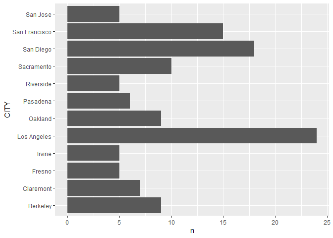
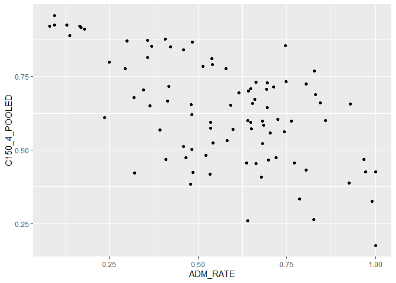
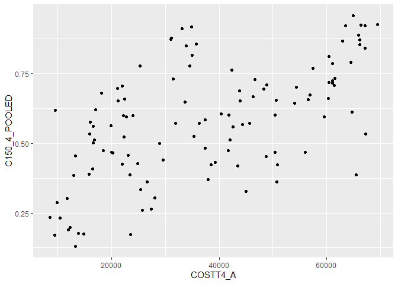
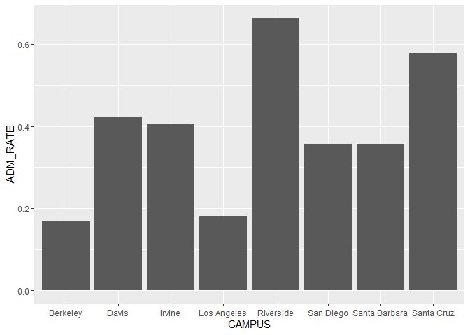
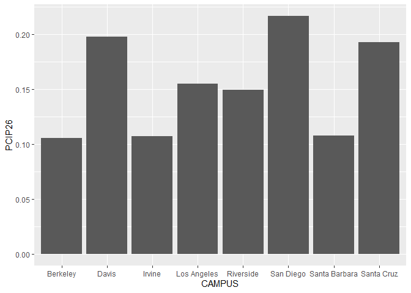

## Instructions
Answer the following questions and complete the exercises in RMarkdown. Please embed all of your code and push your final work to your repository. Your final lab report should be organized, clean, and run free from errors. Remember, you must remove the `#` for the included code chunks to run. Be sure to add your name to the author header above.  

Make sure to use the formatting conventions of RMarkdown to make your report neat and clean!  

## Load the libraries

```r
library(tidyverse)
library(janitor)
library(here)
library(naniar)
```

For this homework, we will take a departure from biological data and use data about California colleges. These data are a subset of the national college scorecard (https://collegescorecard.ed.gov/data/). Load the `ca_college_data.csv` as a new object called `colleges`.

```r
ca_college_data<-readr::read_csv("data/ca_college_data.csv")
```

```
## 
## -- Column specification --------------------------------------------------------
## cols(
##   INSTNM = col_character(),
##   CITY = col_character(),
##   STABBR = col_character(),
##   ZIP = col_character(),
##   ADM_RATE = col_double(),
##   SAT_AVG = col_double(),
##   PCIP26 = col_double(),
##   COSTT4_A = col_double(),
##   C150_4_POOLED = col_double(),
##   PFTFTUG1_EF = col_double()
## )
```

```r
clean_names(ca_college_data)
```

```
## # A tibble: 341 x 10
##    instnm city  stabbr zip   adm_rate sat_avg pcip26 costt4_a c150_4_pooled
##    <chr>  <chr> <chr>  <chr>    <dbl>   <dbl>  <dbl>    <dbl>         <dbl>
##  1 Gross~ El C~ CA     9202~       NA      NA 0.0016     7956        NA    
##  2 Colle~ Visa~ CA     9327~       NA      NA 0.0066     8109        NA    
##  3 Colle~ San ~ CA     9440~       NA      NA 0.0038     8278        NA    
##  4 Ventu~ Vent~ CA     9300~       NA      NA 0.0035     8407        NA    
##  5 Oxnar~ Oxna~ CA     9303~       NA      NA 0.0085     8516        NA    
##  6 Moorp~ Moor~ CA     9302~       NA      NA 0.0151     8577        NA    
##  7 Skyli~ San ~ CA     9406~       NA      NA 0          8580         0.233
##  8 Glend~ Glen~ CA     9120~       NA      NA 0.002      9181        NA    
##  9 Citru~ Glen~ CA     9174~       NA      NA 0.0021     9281        NA    
## 10 Fresn~ Fres~ CA     93741       NA      NA 0.0324     9370        NA    
## # ... with 331 more rows, and 1 more variable: pftftug1_ef <dbl>
```

The variables are a bit hard to decipher, here is a key:  

INSTNM: Institution name  
CITY: California city  
STABBR: Location state  
ZIP: Zip code  
ADM_RATE: Admission rate  
SAT_AVG: SAT average score  
PCIP26: Percentage of degrees awarded in Biological And Biomedical Sciences  
COSTT4_A: Annual cost of attendance  
C150_4_POOLED: 4-year completion rate  
PFTFTUG1_EF: Percentage of undergraduate students who are first-time, full-time degree/certificate-seeking undergraduate students  

1. Use your preferred function(s) to have a look at the data and get an idea of its structure. Make sure you summarize NA's and determine whether or not the data are tidy. You may also consider dealing with any naming issues.

```r
skimr::skim(ca_college_data)
```


Table: Data summary

|                         |                |
|:------------------------|:---------------|
|Name                     |ca_college_data |
|Number of rows           |341             |
|Number of columns        |10              |
|_______________________  |                |
|Column type frequency:   |                |
|character                |4               |
|numeric                  |6               |
|________________________ |                |
|Group variables          |None            |


**Variable type: character**

|skim_variable | n_missing| complete_rate| min| max| empty| n_unique| whitespace|
|:-------------|---------:|-------------:|---:|---:|-----:|--------:|----------:|
|INSTNM        |         0|             1|  10|  63|     0|      341|          0|
|CITY          |         0|             1|   4|  19|     0|      161|          0|
|STABBR        |         0|             1|   2|   2|     0|        3|          0|
|ZIP           |         0|             1|   5|  10|     0|      324|          0|


**Variable type: numeric**

|skim_variable | n_missing| complete_rate|     mean|       sd|      p0|      p25|      p50|      p75|     p100|hist                                     |
|:-------------|---------:|-------------:|--------:|--------:|-------:|--------:|--------:|--------:|--------:|:----------------------------------------|
|ADM_RATE      |       240|          0.30|     0.59|     0.23|    0.08|     0.46|     0.64|     0.75|     1.00|▂▃▆▇▃ |
|SAT_AVG       |       276|          0.19|  1112.31|   170.80|  870.00|   985.00|  1078.00|  1237.00|  1555.00|▇▇▅▂▂ |
|PCIP26        |        35|          0.90|     0.02|     0.04|    0.00|     0.00|     0.00|     0.02|     0.22|▇▁▁▁▁ |
|COSTT4_A      |       124|          0.64| 26685.17| 18122.70| 7956.00| 12578.00| 16591.00| 39289.00| 69355.00|▇▂▂▁▂ |
|C150_4_POOLED |       221|          0.35|     0.57|     0.21|    0.06|     0.43|     0.58|     0.72|     0.96|▂▃▇▇▅ |
|PFTFTUG1_EF   |        53|          0.84|     0.56|     0.29|    0.01|     0.32|     0.50|     0.81|     1.00|▃▇▆▅▇ |
so far it looks like theres only NA's and 0's that could be problematic 


```r
names(ca_college_data)
```

```
##  [1] "INSTNM"        "CITY"          "STABBR"        "ZIP"          
##  [5] "ADM_RATE"      "SAT_AVG"       "PCIP26"        "COSTT4_A"     
##  [9] "C150_4_POOLED" "PFTFTUG1_EF"
```

2. Which cities in California have the highest number of colleges?

```r
ca_college_data%>%
  select(INSTNM,CITY)%>%
  count(CITY,sort = T)
```

```
## # A tibble: 161 x 2
##    CITY              n
##    <chr>         <int>
##  1 Los Angeles      24
##  2 San Diego        18
##  3 San Francisco    15
##  4 Sacramento       10
##  5 Berkeley          9
##  6 Oakland           9
##  7 Claremont         7
##  8 Pasadena          6
##  9 Fresno            5
## 10 Irvine            5
## # ... with 151 more rows
```

3. Based on your answer to #2, make a plot that shows the number of colleges in the top 10 cities.

```r
ca_college_data%>%
  select(INSTNM,CITY)%>%
  count(CITY,sort = T)%>%
  top_n(10)%>%
  ggplot(aes(y=CITY,x=n))+
  geom_col()
```

```
## Selecting by n
```

<!-- -->

4. The column `COSTT4_A` is the annual cost of each institution. Which city has the highest average cost? Where is it located?

```r
ca_college_data%>%
  select(INSTNM,CITY,COSTT4_A)%>%
  group_by(CITY)%>%
  summarise(avg_cost=mean(COSTT4_A,na.rm=T))%>%
  arrange(desc(avg_cost))%>%
  top_n(10)
```

```
## `summarise()` ungrouping output (override with `.groups` argument)
```

```
## Selecting by avg_cost
```

```
## # A tibble: 10 x 2
##    CITY                avg_cost
##    <chr>                  <dbl>
##  1 Claremont              66498
##  2 Malibu                 66152
##  3 Valencia               64686
##  4 Orange                 64501
##  5 Redlands               61542
##  6 Moraga                 61095
##  7 Atherton               56035
##  8 Thousand Oaks          54373
##  9 Rancho Palos Verdes    50758
## 10 La Verne               50603
```

5. Based on your answer to #4, make a plot that compares the cost of the individual colleges in the most expensive city. Bonus! Add UC Davis here to see how it compares :>).

```r
ca_college_data%>%
  select(INSTNM,CITY,COSTT4_A)%>%
  filter(CITY=="Claremont"|CITY=="Davis")%>%
  select(INSTNM,COSTT4_A)%>%
  ggplot(aes(x=INSTNM, y=COSTT4_A))+
  geom_col()+
  coord_flip()
```

```
## Warning: Removed 2 rows containing missing values (position_stack).
```

<!-- -->

6. The column `ADM_RATE` is the admissions rate by college and `C150_4_POOLED` is the four-year completion rate. Use a scatterplot to show the relationship between these two variables. What do you think this means?

```r
ca_college_data%>%
  select(INSTNM,ADM_RATE,C150_4_POOLED)%>%
  filter(ADM_RATE!="NA")%>%
  filter(C150_4_POOLED!= "NA")%>%
  ggplot(aes(x=ADM_RATE,y=C150_4_POOLED))+
  geom_point()
```

<!-- -->


#The higher the admissions rate the lower the graduation rate


7. Is there a relationship between cost and four-year completion rate? (You don't need to do the stats, just produce a plot). What do you think this means?

```r
ca_college_data%>%
  select(COSTT4_A,C150_4_POOLED)%>%
  filter(COSTT4_A!="NA")%>%
  filter(C150_4_POOLED!="NA")%>%
  ggplot(aes(x=COSTT4_A,y=C150_4_POOLED))+
  geom_point()
```

<!-- -->


#The more expensive the college the more likely you are to graduate


8. The column titled `INSTNM` is the institution name. We are only interested in the University of California colleges. Make a new data frame that is restricted to UC institutions. You can remove `Hastings College of Law` and `UC San Francisco` as we are only interested in undergraduate institutions.

```r
univ_calif_final<-ca_college_data%>%
  select(INSTNM,COSTT4_A,CITY,C150_4_POOLED,ADM_RATE,PCIP26)%>%
  filter(grepl("University of California",INSTNM))%>%
  filter(INSTNM!="University of California-Hastings College of Law")%>%
  filter(INSTNM!="University of California-San Francisco")
  
univ_calif_final  
```

```
## # A tibble: 8 x 6
##   INSTNM                       COSTT4_A CITY       C150_4_POOLED ADM_RATE PCIP26
##   <chr>                           <dbl> <chr>              <dbl>    <dbl>  <dbl>
## 1 University of California-Sa~    31043 La Jolla           0.872    0.357  0.216
## 2 University of California-Ir~    31198 Irvine             0.876    0.406  0.107
## 3 University of California-Ri~    31494 Riverside          0.73     0.663  0.149
## 4 University of California-Lo~    33078 Los Angel~         0.911    0.180  0.155
## 5 University of California-Da~    33904 Davis              0.850    0.423  0.198
## 6 University of California-Sa~    34608 Santa Cruz         0.776    0.578  0.193
## 7 University of California-Be~    34924 Berkeley           0.916    0.169  0.105
## 8 University of California-Sa~    34998 Santa Bar~         0.816    0.358  0.108
```

Remove `Hastings College of Law` and `UC San Francisco` and store the final data frame as a new object `univ_calif_final`.


Use `separate()` to separate institution name into two new columns "UNIV" and "CAMPUS".

```r
univ_calif_separate<-univ_calif_final%>%
  separate(INSTNM,into = c("UNIV","CAMPUS"),sep = "-")
```

9. The column `ADM_RATE` is the admissions rate by campus. Which UC has the lowest and highest admissions rates? Produce a numerical summary and an appropriate plot.

```r
univ_calif_separate%>%
  select(CAMPUS,ADM_RATE)%>%
  group_by(CAMPUS)%>%
  summarise(ADM_RATE)%>%
  arrange(desc(ADM_RATE))
```

```
## `summarise()` ungrouping output (override with `.groups` argument)
```

```
## # A tibble: 8 x 2
##   CAMPUS        ADM_RATE
##   <chr>            <dbl>
## 1 Riverside        0.663
## 2 Santa Cruz       0.578
## 3 Davis            0.423
## 4 Irvine           0.406
## 5 Santa Barbara    0.358
## 6 San Diego        0.357
## 7 Los Angeles      0.180
## 8 Berkeley         0.169
```


```r
univ_calif_separate%>%
  select(CAMPUS,ADM_RATE)%>%
  group_by(CAMPUS)%>%
  summarise(ADM_RATE)%>%
  arrange(desc(ADM_RATE))%>%
  ggplot(aes(x=CAMPUS, y=ADM_RATE))+
  geom_col()
```

```
## `summarise()` ungrouping output (override with `.groups` argument)
```

<!-- -->

10. If you wanted to get a degree in biological or biomedical sciences, which campus confers the majority of these degrees? Produce a numerical summary and an appropriate plot.

```r
univ_calif_separate%>%
  select(CAMPUS,PCIP26)%>%
  group_by(CAMPUS)%>%
  summarise(PCIP26)%>%
  arrange(desc(PCIP26))
```

```
## `summarise()` ungrouping output (override with `.groups` argument)
```

```
## # A tibble: 8 x 2
##   CAMPUS        PCIP26
##   <chr>          <dbl>
## 1 San Diego      0.216
## 2 Davis          0.198
## 3 Santa Cruz     0.193
## 4 Los Angeles    0.155
## 5 Riverside      0.149
## 6 Santa Barbara  0.108
## 7 Irvine         0.107
## 8 Berkeley       0.105
```


```r
univ_calif_separate%>%
  select(CAMPUS,PCIP26)%>%
  group_by(CAMPUS)%>%
  summarise(PCIP26)%>%
  arrange(desc(PCIP26))%>%
  ggplot(aes(x=CAMPUS, y= PCIP26))+
  geom_col()
```

```
## `summarise()` ungrouping output (override with `.groups` argument)
```

<!-- -->
#Davis, san Diego and Santa Cruz have the best for biosci
## Knit Your Output and Post to [GitHub](https://github.com/FRS417-DataScienceBiologists)
