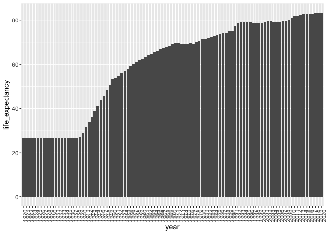
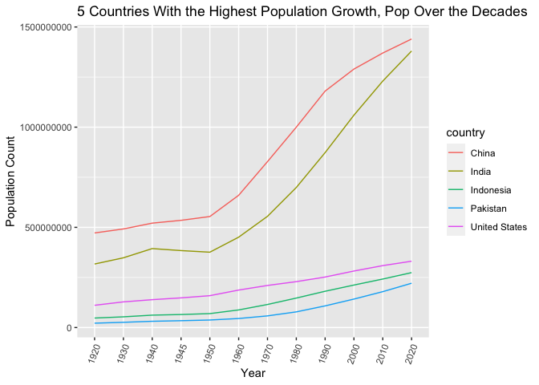
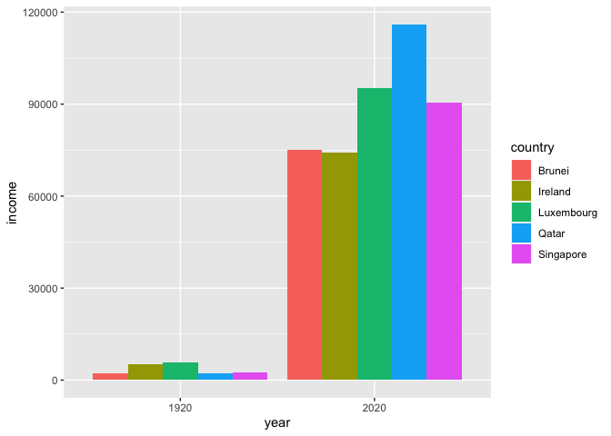

## Instructions
Answer the following questions and complete the exercises in RMarkdown. Please embed all of your code and push your final work to your repository. Your code should be organized, clean, and run free from errors. Be sure to **add your name** to the author header above. You may use any resources to answer these questions (including each other), but you may not post questions to Open Stacks or external help sites. There are 10 total questions.  

Make sure to use the formatting conventions of RMarkdown to make your report neat and clean! Your plots should use consistent aesthetics throughout. Feel free to be creative- there are many possible solutions to these questions!  

This exam is due by **12:00p on Tuesday, February 23**.  

## Load the libraries

```r
library(tidyverse)
```

```
## -- Attaching packages --------------------------------------- tidyverse 1.3.0 --
```

```
## v ggplot2 3.3.3     v purrr   0.3.4
## v tibble  3.0.4     v dplyr   1.0.2
## v tidyr   1.1.2     v stringr 1.4.0
## v readr   1.4.0     v forcats 0.5.0
```

```
## -- Conflicts ------------------------------------------ tidyverse_conflicts() --
## x dplyr::filter() masks stats::filter()
## x dplyr::lag()    masks stats::lag()
```

```r
library(janitor)
```

```
## 
## Attaching package: 'janitor'
```

```
## The following objects are masked from 'package:stats':
## 
##     chisq.test, fisher.test
```

```r
library(here)
```

```
## here() starts at C:/Users/Derrick/Documents/GitHub/BIS15W2021_dtran
```

```r
library(RColorBrewer)
library(paletteer)
options(scipen=999) #disables scientific notation when printing
```

## Gapminder
For this assignment, we are going to use data from  [gapminder](https://www.gapminder.org/). Gapminder includes information about economics, population, social issues, and life expectancy from countries all over the world. We will use three data sets, so please load all three.  

One thing to note is that the data include years beyond 2021. These are projections based on modeling done by the gapminder organization. Start by importing the data.

```r
population <- read_csv("data/population_total.csv")
```

```
## 
## -- Column specification --------------------------------------------------------
## cols(
##   .default = col_double(),
##   country = col_character()
## )
## i Use `spec()` for the full column specifications.
```

```r
population
```

```
## # A tibble: 195 x 302
##    country `1800` `1801` `1802` `1803` `1804` `1805` `1806` `1807` `1808` `1809`
##    <chr>    <dbl>  <dbl>  <dbl>  <dbl>  <dbl>  <dbl>  <dbl>  <dbl>  <dbl>  <dbl>
##  1 Afghan~ 3.28e6 3.28e6 3.28e6 3.28e6 3.28e6 3.28e6 3.28e6 3.28e6 3.28e6 3.28e6
##  2 Albania 4.00e5 4.02e5 4.04e5 4.05e5 4.07e5 4.09e5 4.11e5 4.13e5 4.14e5 4.16e5
##  3 Algeria 2.50e6 2.51e6 2.52e6 2.53e6 2.54e6 2.55e6 2.56e6 2.56e6 2.57e6 2.58e6
##  4 Andorra 2.65e3 2.65e3 2.65e3 2.65e3 2.65e3 2.65e3 2.65e3 2.65e3 2.65e3 2.65e3
##  5 Angola  1.57e6 1.57e6 1.57e6 1.57e6 1.57e6 1.57e6 1.57e6 1.57e6 1.57e6 1.57e6
##  6 Antigu~ 3.70e4 3.70e4 3.70e4 3.70e4 3.70e4 3.70e4 3.70e4 3.70e4 3.70e4 3.70e4
##  7 Argent~ 5.34e5 5.20e5 5.06e5 4.92e5 4.79e5 4.66e5 4.53e5 4.41e5 4.29e5 4.17e5
##  8 Armenia 4.13e5 4.13e5 4.13e5 4.13e5 4.13e5 4.13e5 4.13e5 4.13e5 4.13e5 4.13e5
##  9 Austra~ 2.00e5 2.05e5 2.11e5 2.16e5 2.22e5 2.27e5 2.33e5 2.39e5 2.46e5 2.52e5
## 10 Austria 3.00e6 3.02e6 3.04e6 3.05e6 3.07e6 3.09e6 3.11e6 3.12e6 3.14e6 3.16e6
## # ... with 185 more rows, and 291 more variables: `1810` <dbl>, `1811` <dbl>,
## #   `1812` <dbl>, `1813` <dbl>, `1814` <dbl>, `1815` <dbl>, `1816` <dbl>,
## #   `1817` <dbl>, `1818` <dbl>, `1819` <dbl>, `1820` <dbl>, `1821` <dbl>,
## #   `1822` <dbl>, `1823` <dbl>, `1824` <dbl>, `1825` <dbl>, `1826` <dbl>,
## #   `1827` <dbl>, `1828` <dbl>, `1829` <dbl>, `1830` <dbl>, `1831` <dbl>,
## #   `1832` <dbl>, `1833` <dbl>, `1834` <dbl>, `1835` <dbl>, `1836` <dbl>,
## #   `1837` <dbl>, `1838` <dbl>, `1839` <dbl>, `1840` <dbl>, `1841` <dbl>,
## #   `1842` <dbl>, `1843` <dbl>, `1844` <dbl>, `1845` <dbl>, `1846` <dbl>,
## #   `1847` <dbl>, `1848` <dbl>, `1849` <dbl>, `1850` <dbl>, `1851` <dbl>,
## #   `1852` <dbl>, `1853` <dbl>, `1854` <dbl>, `1855` <dbl>, `1856` <dbl>,
## #   `1857` <dbl>, `1858` <dbl>, `1859` <dbl>, `1860` <dbl>, `1861` <dbl>,
## #   `1862` <dbl>, `1863` <dbl>, `1864` <dbl>, `1865` <dbl>, `1866` <dbl>,
## #   `1867` <dbl>, `1868` <dbl>, `1869` <dbl>, `1870` <dbl>, `1871` <dbl>,
## #   `1872` <dbl>, `1873` <dbl>, `1874` <dbl>, `1875` <dbl>, `1876` <dbl>,
## #   `1877` <dbl>, `1878` <dbl>, `1879` <dbl>, `1880` <dbl>, `1881` <dbl>,
## #   `1882` <dbl>, `1883` <dbl>, `1884` <dbl>, `1885` <dbl>, `1886` <dbl>,
## #   `1887` <dbl>, `1888` <dbl>, `1889` <dbl>, `1890` <dbl>, `1891` <dbl>,
## #   `1892` <dbl>, `1893` <dbl>, `1894` <dbl>, `1895` <dbl>, `1896` <dbl>,
## #   `1897` <dbl>, `1898` <dbl>, `1899` <dbl>, `1900` <dbl>, `1901` <dbl>,
## #   `1902` <dbl>, `1903` <dbl>, `1904` <dbl>, `1905` <dbl>, `1906` <dbl>,
## #   `1907` <dbl>, `1908` <dbl>, `1909` <dbl>, ...
```


```r
income <- read_csv("data/income_per_person_gdppercapita_ppp_inflation_adjusted.csv")
```

```
## 
## -- Column specification --------------------------------------------------------
## cols(
##   .default = col_double(),
##   country = col_character()
## )
## i Use `spec()` for the full column specifications.
```

```r
income
```

```
## # A tibble: 193 x 242
##    country `1800` `1801` `1802` `1803` `1804` `1805` `1806` `1807` `1808` `1809`
##    <chr>    <dbl>  <dbl>  <dbl>  <dbl>  <dbl>  <dbl>  <dbl>  <dbl>  <dbl>  <dbl>
##  1 Afghan~    603    603    603    603    603    603    603    603    603    603
##  2 Albania    667    667    667    667    667    668    668    668    668    668
##  3 Algeria    715    716    717    718    719    720    721    722    723    724
##  4 Andorra   1200   1200   1200   1200   1210   1210   1210   1210   1220   1220
##  5 Angola     618    620    623    626    628    631    634    637    640    642
##  6 Antigu~    757    757    757    757    757    757    757    758    758    758
##  7 Argent~   1640   1640   1650   1650   1660   1660   1670   1680   1680   1690
##  8 Armenia    514    514    514    514    514    514    514    514    514    514
##  9 Austra~    817    822    826    831    836    841    845    850    855    860
## 10 Austria   1850   1850   1860   1870   1880   1880   1890   1900   1910   1920
## # ... with 183 more rows, and 231 more variables: `1810` <dbl>, `1811` <dbl>,
## #   `1812` <dbl>, `1813` <dbl>, `1814` <dbl>, `1815` <dbl>, `1816` <dbl>,
## #   `1817` <dbl>, `1818` <dbl>, `1819` <dbl>, `1820` <dbl>, `1821` <dbl>,
## #   `1822` <dbl>, `1823` <dbl>, `1824` <dbl>, `1825` <dbl>, `1826` <dbl>,
## #   `1827` <dbl>, `1828` <dbl>, `1829` <dbl>, `1830` <dbl>, `1831` <dbl>,
## #   `1832` <dbl>, `1833` <dbl>, `1834` <dbl>, `1835` <dbl>, `1836` <dbl>,
## #   `1837` <dbl>, `1838` <dbl>, `1839` <dbl>, `1840` <dbl>, `1841` <dbl>,
## #   `1842` <dbl>, `1843` <dbl>, `1844` <dbl>, `1845` <dbl>, `1846` <dbl>,
## #   `1847` <dbl>, `1848` <dbl>, `1849` <dbl>, `1850` <dbl>, `1851` <dbl>,
## #   `1852` <dbl>, `1853` <dbl>, `1854` <dbl>, `1855` <dbl>, `1856` <dbl>,
## #   `1857` <dbl>, `1858` <dbl>, `1859` <dbl>, `1860` <dbl>, `1861` <dbl>,
## #   `1862` <dbl>, `1863` <dbl>, `1864` <dbl>, `1865` <dbl>, `1866` <dbl>,
## #   `1867` <dbl>, `1868` <dbl>, `1869` <dbl>, `1870` <dbl>, `1871` <dbl>,
## #   `1872` <dbl>, `1873` <dbl>, `1874` <dbl>, `1875` <dbl>, `1876` <dbl>,
## #   `1877` <dbl>, `1878` <dbl>, `1879` <dbl>, `1880` <dbl>, `1881` <dbl>,
## #   `1882` <dbl>, `1883` <dbl>, `1884` <dbl>, `1885` <dbl>, `1886` <dbl>,
## #   `1887` <dbl>, `1888` <dbl>, `1889` <dbl>, `1890` <dbl>, `1891` <dbl>,
## #   `1892` <dbl>, `1893` <dbl>, `1894` <dbl>, `1895` <dbl>, `1896` <dbl>,
## #   `1897` <dbl>, `1898` <dbl>, `1899` <dbl>, `1900` <dbl>, `1901` <dbl>,
## #   `1902` <dbl>, `1903` <dbl>, `1904` <dbl>, `1905` <dbl>, `1906` <dbl>,
## #   `1907` <dbl>, `1908` <dbl>, `1909` <dbl>, ...
```


```r
life_expectancy <- read_csv("data/life_expectancy_years.csv")
```

```
## 
## -- Column specification --------------------------------------------------------
## cols(
##   .default = col_double(),
##   country = col_character()
## )
## i Use `spec()` for the full column specifications.
```

```r
life_expectancy
```

```
## # A tibble: 187 x 302
##    country `1800` `1801` `1802` `1803` `1804` `1805` `1806` `1807` `1808` `1809`
##    <chr>    <dbl>  <dbl>  <dbl>  <dbl>  <dbl>  <dbl>  <dbl>  <dbl>  <dbl>  <dbl>
##  1 Afghan~   28.2   28.2   28.2   28.2   28.2   28.2   28.1   28.1   28.1   28.1
##  2 Albania   35.4   35.4   35.4   35.4   35.4   35.4   35.4   35.4   35.4   35.4
##  3 Algeria   28.8   28.8   28.8   28.8   28.8   28.8   28.8   28.8   28.8   28.8
##  4 Andorra   NA     NA     NA     NA     NA     NA     NA     NA     NA     NA  
##  5 Angola    27     27     27     27     27     27     27     27     27     27  
##  6 Antigu~   33.5   33.5   33.5   33.5   33.5   33.5   33.5   33.5   33.5   33.5
##  7 Argent~   33.2   33.2   33.2   33.2   33.2   33.2   33.2   33.2   33.2   33.2
##  8 Armenia   34     34     34     34     34     34     34     34     34     34  
##  9 Austra~   34     34     34     34     34     34     34     34     34     34  
## 10 Austria   34.4   34.4   34.4   34.4   34.4   34.4   34.4   34.4   34.4   34.4
## # ... with 177 more rows, and 291 more variables: `1810` <dbl>, `1811` <dbl>,
## #   `1812` <dbl>, `1813` <dbl>, `1814` <dbl>, `1815` <dbl>, `1816` <dbl>,
## #   `1817` <dbl>, `1818` <dbl>, `1819` <dbl>, `1820` <dbl>, `1821` <dbl>,
## #   `1822` <dbl>, `1823` <dbl>, `1824` <dbl>, `1825` <dbl>, `1826` <dbl>,
## #   `1827` <dbl>, `1828` <dbl>, `1829` <dbl>, `1830` <dbl>, `1831` <dbl>,
## #   `1832` <dbl>, `1833` <dbl>, `1834` <dbl>, `1835` <dbl>, `1836` <dbl>,
## #   `1837` <dbl>, `1838` <dbl>, `1839` <dbl>, `1840` <dbl>, `1841` <dbl>,
## #   `1842` <dbl>, `1843` <dbl>, `1844` <dbl>, `1845` <dbl>, `1846` <dbl>,
## #   `1847` <dbl>, `1848` <dbl>, `1849` <dbl>, `1850` <dbl>, `1851` <dbl>,
## #   `1852` <dbl>, `1853` <dbl>, `1854` <dbl>, `1855` <dbl>, `1856` <dbl>,
## #   `1857` <dbl>, `1858` <dbl>, `1859` <dbl>, `1860` <dbl>, `1861` <dbl>,
## #   `1862` <dbl>, `1863` <dbl>, `1864` <dbl>, `1865` <dbl>, `1866` <dbl>,
## #   `1867` <dbl>, `1868` <dbl>, `1869` <dbl>, `1870` <dbl>, `1871` <dbl>,
## #   `1872` <dbl>, `1873` <dbl>, `1874` <dbl>, `1875` <dbl>, `1876` <dbl>,
## #   `1877` <dbl>, `1878` <dbl>, `1879` <dbl>, `1880` <dbl>, `1881` <dbl>,
## #   `1882` <dbl>, `1883` <dbl>, `1884` <dbl>, `1885` <dbl>, `1886` <dbl>,
## #   `1887` <dbl>, `1888` <dbl>, `1889` <dbl>, `1890` <dbl>, `1891` <dbl>,
## #   `1892` <dbl>, `1893` <dbl>, `1894` <dbl>, `1895` <dbl>, `1896` <dbl>,
## #   `1897` <dbl>, `1898` <dbl>, `1899` <dbl>, `1900` <dbl>, `1901` <dbl>,
## #   `1902` <dbl>, `1903` <dbl>, `1904` <dbl>, `1905` <dbl>, `1906` <dbl>,
## #   `1907` <dbl>, `1908` <dbl>, `1909` <dbl>, ...
```

1. (3 points) Once you have an idea of the structure of the data, please make each data set tidy and store them as new objects. You will need both the original and tidy data!

```r
structure(income)
```

```
## # A tibble: 193 x 242
##    country `1800` `1801` `1802` `1803` `1804` `1805` `1806` `1807` `1808` `1809`
##    <chr>    <dbl>  <dbl>  <dbl>  <dbl>  <dbl>  <dbl>  <dbl>  <dbl>  <dbl>  <dbl>
##  1 Afghan~    603    603    603    603    603    603    603    603    603    603
##  2 Albania    667    667    667    667    667    668    668    668    668    668
##  3 Algeria    715    716    717    718    719    720    721    722    723    724
##  4 Andorra   1200   1200   1200   1200   1210   1210   1210   1210   1220   1220
##  5 Angola     618    620    623    626    628    631    634    637    640    642
##  6 Antigu~    757    757    757    757    757    757    757    758    758    758
##  7 Argent~   1640   1640   1650   1650   1660   1660   1670   1680   1680   1690
##  8 Armenia    514    514    514    514    514    514    514    514    514    514
##  9 Austra~    817    822    826    831    836    841    845    850    855    860
## 10 Austria   1850   1850   1860   1870   1880   1880   1890   1900   1910   1920
## # ... with 183 more rows, and 231 more variables: `1810` <dbl>, `1811` <dbl>,
## #   `1812` <dbl>, `1813` <dbl>, `1814` <dbl>, `1815` <dbl>, `1816` <dbl>,
## #   `1817` <dbl>, `1818` <dbl>, `1819` <dbl>, `1820` <dbl>, `1821` <dbl>,
## #   `1822` <dbl>, `1823` <dbl>, `1824` <dbl>, `1825` <dbl>, `1826` <dbl>,
## #   `1827` <dbl>, `1828` <dbl>, `1829` <dbl>, `1830` <dbl>, `1831` <dbl>,
## #   `1832` <dbl>, `1833` <dbl>, `1834` <dbl>, `1835` <dbl>, `1836` <dbl>,
## #   `1837` <dbl>, `1838` <dbl>, `1839` <dbl>, `1840` <dbl>, `1841` <dbl>,
## #   `1842` <dbl>, `1843` <dbl>, `1844` <dbl>, `1845` <dbl>, `1846` <dbl>,
## #   `1847` <dbl>, `1848` <dbl>, `1849` <dbl>, `1850` <dbl>, `1851` <dbl>,
## #   `1852` <dbl>, `1853` <dbl>, `1854` <dbl>, `1855` <dbl>, `1856` <dbl>,
## #   `1857` <dbl>, `1858` <dbl>, `1859` <dbl>, `1860` <dbl>, `1861` <dbl>,
## #   `1862` <dbl>, `1863` <dbl>, `1864` <dbl>, `1865` <dbl>, `1866` <dbl>,
## #   `1867` <dbl>, `1868` <dbl>, `1869` <dbl>, `1870` <dbl>, `1871` <dbl>,
## #   `1872` <dbl>, `1873` <dbl>, `1874` <dbl>, `1875` <dbl>, `1876` <dbl>,
## #   `1877` <dbl>, `1878` <dbl>, `1879` <dbl>, `1880` <dbl>, `1881` <dbl>,
## #   `1882` <dbl>, `1883` <dbl>, `1884` <dbl>, `1885` <dbl>, `1886` <dbl>,
## #   `1887` <dbl>, `1888` <dbl>, `1889` <dbl>, `1890` <dbl>, `1891` <dbl>,
## #   `1892` <dbl>, `1893` <dbl>, `1894` <dbl>, `1895` <dbl>, `1896` <dbl>,
## #   `1897` <dbl>, `1898` <dbl>, `1899` <dbl>, `1900` <dbl>, `1901` <dbl>,
## #   `1902` <dbl>, `1903` <dbl>, `1904` <dbl>, `1905` <dbl>, `1906` <dbl>,
## #   `1907` <dbl>, `1908` <dbl>, `1909` <dbl>, ...
```


```r
structure(life_expectancy)
```

```
## # A tibble: 187 x 302
##    country `1800` `1801` `1802` `1803` `1804` `1805` `1806` `1807` `1808` `1809`
##    <chr>    <dbl>  <dbl>  <dbl>  <dbl>  <dbl>  <dbl>  <dbl>  <dbl>  <dbl>  <dbl>
##  1 Afghan~   28.2   28.2   28.2   28.2   28.2   28.2   28.1   28.1   28.1   28.1
##  2 Albania   35.4   35.4   35.4   35.4   35.4   35.4   35.4   35.4   35.4   35.4
##  3 Algeria   28.8   28.8   28.8   28.8   28.8   28.8   28.8   28.8   28.8   28.8
##  4 Andorra   NA     NA     NA     NA     NA     NA     NA     NA     NA     NA  
##  5 Angola    27     27     27     27     27     27     27     27     27     27  
##  6 Antigu~   33.5   33.5   33.5   33.5   33.5   33.5   33.5   33.5   33.5   33.5
##  7 Argent~   33.2   33.2   33.2   33.2   33.2   33.2   33.2   33.2   33.2   33.2
##  8 Armenia   34     34     34     34     34     34     34     34     34     34  
##  9 Austra~   34     34     34     34     34     34     34     34     34     34  
## 10 Austria   34.4   34.4   34.4   34.4   34.4   34.4   34.4   34.4   34.4   34.4
## # ... with 177 more rows, and 291 more variables: `1810` <dbl>, `1811` <dbl>,
## #   `1812` <dbl>, `1813` <dbl>, `1814` <dbl>, `1815` <dbl>, `1816` <dbl>,
## #   `1817` <dbl>, `1818` <dbl>, `1819` <dbl>, `1820` <dbl>, `1821` <dbl>,
## #   `1822` <dbl>, `1823` <dbl>, `1824` <dbl>, `1825` <dbl>, `1826` <dbl>,
## #   `1827` <dbl>, `1828` <dbl>, `1829` <dbl>, `1830` <dbl>, `1831` <dbl>,
## #   `1832` <dbl>, `1833` <dbl>, `1834` <dbl>, `1835` <dbl>, `1836` <dbl>,
## #   `1837` <dbl>, `1838` <dbl>, `1839` <dbl>, `1840` <dbl>, `1841` <dbl>,
## #   `1842` <dbl>, `1843` <dbl>, `1844` <dbl>, `1845` <dbl>, `1846` <dbl>,
## #   `1847` <dbl>, `1848` <dbl>, `1849` <dbl>, `1850` <dbl>, `1851` <dbl>,
## #   `1852` <dbl>, `1853` <dbl>, `1854` <dbl>, `1855` <dbl>, `1856` <dbl>,
## #   `1857` <dbl>, `1858` <dbl>, `1859` <dbl>, `1860` <dbl>, `1861` <dbl>,
## #   `1862` <dbl>, `1863` <dbl>, `1864` <dbl>, `1865` <dbl>, `1866` <dbl>,
## #   `1867` <dbl>, `1868` <dbl>, `1869` <dbl>, `1870` <dbl>, `1871` <dbl>,
## #   `1872` <dbl>, `1873` <dbl>, `1874` <dbl>, `1875` <dbl>, `1876` <dbl>,
## #   `1877` <dbl>, `1878` <dbl>, `1879` <dbl>, `1880` <dbl>, `1881` <dbl>,
## #   `1882` <dbl>, `1883` <dbl>, `1884` <dbl>, `1885` <dbl>, `1886` <dbl>,
## #   `1887` <dbl>, `1888` <dbl>, `1889` <dbl>, `1890` <dbl>, `1891` <dbl>,
## #   `1892` <dbl>, `1893` <dbl>, `1894` <dbl>, `1895` <dbl>, `1896` <dbl>,
## #   `1897` <dbl>, `1898` <dbl>, `1899` <dbl>, `1900` <dbl>, `1901` <dbl>,
## #   `1902` <dbl>, `1903` <dbl>, `1904` <dbl>, `1905` <dbl>, `1906` <dbl>,
## #   `1907` <dbl>, `1908` <dbl>, `1909` <dbl>, ...
```


```r
structure(population)
```

```
## # A tibble: 195 x 302
##    country `1800` `1801` `1802` `1803` `1804` `1805` `1806` `1807` `1808` `1809`
##    <chr>    <dbl>  <dbl>  <dbl>  <dbl>  <dbl>  <dbl>  <dbl>  <dbl>  <dbl>  <dbl>
##  1 Afghan~ 3.28e6 3.28e6 3.28e6 3.28e6 3.28e6 3.28e6 3.28e6 3.28e6 3.28e6 3.28e6
##  2 Albania 4.00e5 4.02e5 4.04e5 4.05e5 4.07e5 4.09e5 4.11e5 4.13e5 4.14e5 4.16e5
##  3 Algeria 2.50e6 2.51e6 2.52e6 2.53e6 2.54e6 2.55e6 2.56e6 2.56e6 2.57e6 2.58e6
##  4 Andorra 2.65e3 2.65e3 2.65e3 2.65e3 2.65e3 2.65e3 2.65e3 2.65e3 2.65e3 2.65e3
##  5 Angola  1.57e6 1.57e6 1.57e6 1.57e6 1.57e6 1.57e6 1.57e6 1.57e6 1.57e6 1.57e6
##  6 Antigu~ 3.70e4 3.70e4 3.70e4 3.70e4 3.70e4 3.70e4 3.70e4 3.70e4 3.70e4 3.70e4
##  7 Argent~ 5.34e5 5.20e5 5.06e5 4.92e5 4.79e5 4.66e5 4.53e5 4.41e5 4.29e5 4.17e5
##  8 Armenia 4.13e5 4.13e5 4.13e5 4.13e5 4.13e5 4.13e5 4.13e5 4.13e5 4.13e5 4.13e5
##  9 Austra~ 2.00e5 2.05e5 2.11e5 2.16e5 2.22e5 2.27e5 2.33e5 2.39e5 2.46e5 2.52e5
## 10 Austria 3.00e6 3.02e6 3.04e6 3.05e6 3.07e6 3.09e6 3.11e6 3.12e6 3.14e6 3.16e6
## # ... with 185 more rows, and 291 more variables: `1810` <dbl>, `1811` <dbl>,
## #   `1812` <dbl>, `1813` <dbl>, `1814` <dbl>, `1815` <dbl>, `1816` <dbl>,
## #   `1817` <dbl>, `1818` <dbl>, `1819` <dbl>, `1820` <dbl>, `1821` <dbl>,
## #   `1822` <dbl>, `1823` <dbl>, `1824` <dbl>, `1825` <dbl>, `1826` <dbl>,
## #   `1827` <dbl>, `1828` <dbl>, `1829` <dbl>, `1830` <dbl>, `1831` <dbl>,
## #   `1832` <dbl>, `1833` <dbl>, `1834` <dbl>, `1835` <dbl>, `1836` <dbl>,
## #   `1837` <dbl>, `1838` <dbl>, `1839` <dbl>, `1840` <dbl>, `1841` <dbl>,
## #   `1842` <dbl>, `1843` <dbl>, `1844` <dbl>, `1845` <dbl>, `1846` <dbl>,
## #   `1847` <dbl>, `1848` <dbl>, `1849` <dbl>, `1850` <dbl>, `1851` <dbl>,
## #   `1852` <dbl>, `1853` <dbl>, `1854` <dbl>, `1855` <dbl>, `1856` <dbl>,
## #   `1857` <dbl>, `1858` <dbl>, `1859` <dbl>, `1860` <dbl>, `1861` <dbl>,
## #   `1862` <dbl>, `1863` <dbl>, `1864` <dbl>, `1865` <dbl>, `1866` <dbl>,
## #   `1867` <dbl>, `1868` <dbl>, `1869` <dbl>, `1870` <dbl>, `1871` <dbl>,
## #   `1872` <dbl>, `1873` <dbl>, `1874` <dbl>, `1875` <dbl>, `1876` <dbl>,
## #   `1877` <dbl>, `1878` <dbl>, `1879` <dbl>, `1880` <dbl>, `1881` <dbl>,
## #   `1882` <dbl>, `1883` <dbl>, `1884` <dbl>, `1885` <dbl>, `1886` <dbl>,
## #   `1887` <dbl>, `1888` <dbl>, `1889` <dbl>, `1890` <dbl>, `1891` <dbl>,
## #   `1892` <dbl>, `1893` <dbl>, `1894` <dbl>, `1895` <dbl>, `1896` <dbl>,
## #   `1897` <dbl>, `1898` <dbl>, `1899` <dbl>, `1900` <dbl>, `1901` <dbl>,
## #   `1902` <dbl>, `1903` <dbl>, `1904` <dbl>, `1905` <dbl>, `1906` <dbl>,
## #   `1907` <dbl>, `1908` <dbl>, `1909` <dbl>, ...
```


```r
income_longer<-income%>%
  pivot_longer(-country,
               names_to = "year",
               values_to = "income")
income_longer
```

```
## # A tibble: 46,513 x 3
##    country     year  income
##    <chr>       <chr>  <dbl>
##  1 Afghanistan 1800     603
##  2 Afghanistan 1801     603
##  3 Afghanistan 1802     603
##  4 Afghanistan 1803     603
##  5 Afghanistan 1804     603
##  6 Afghanistan 1805     603
##  7 Afghanistan 1806     603
##  8 Afghanistan 1807     603
##  9 Afghanistan 1808     603
## 10 Afghanistan 1809     603
## # ... with 46,503 more rows
```


```r
life_expectancy_longer<-life_expectancy%>%
  pivot_longer(-country,
               names_to = "year", 
               values_to = "life_expectancy")
life_expectancy_longer
```

```
## # A tibble: 56,287 x 3
##    country     year  life_expectancy
##    <chr>       <chr>           <dbl>
##  1 Afghanistan 1800             28.2
##  2 Afghanistan 1801             28.2
##  3 Afghanistan 1802             28.2
##  4 Afghanistan 1803             28.2
##  5 Afghanistan 1804             28.2
##  6 Afghanistan 1805             28.2
##  7 Afghanistan 1806             28.1
##  8 Afghanistan 1807             28.1
##  9 Afghanistan 1808             28.1
## 10 Afghanistan 1809             28.1
## # ... with 56,277 more rows
```


```r
population_longer<-population%>%
  pivot_longer(-country,
               names_to = "year",
               values_to = "Pop")

population_longer
```

```
## # A tibble: 58,695 x 3
##    country     year      Pop
##    <chr>       <chr>   <dbl>
##  1 Afghanistan 1800  3280000
##  2 Afghanistan 1801  3280000
##  3 Afghanistan 1802  3280000
##  4 Afghanistan 1803  3280000
##  5 Afghanistan 1804  3280000
##  6 Afghanistan 1805  3280000
##  7 Afghanistan 1806  3280000
##  8 Afghanistan 1807  3280000
##  9 Afghanistan 1808  3280000
## 10 Afghanistan 1809  3280000
## # ... with 58,685 more rows
```


2. (1 point) How many different countries are represented in the data? Provide the total number and their names. Since each data set includes different numbers of countries, you will need to do this for each one.

```r
nrow(income)
```

```
## [1] 193
```

```r
#i think this is more efficient way to count the countries, because the dataset is written in a way that does not have repeats already, so I know that the number of rows should be the same as the number of countries. I will show that there isnt any repeats i belive
```


```r
income%>%
  count(country)%>%
  arrange(desc(n))
```

```
## # A tibble: 193 x 2
##    country                 n
##    <chr>               <int>
##  1 Afghanistan             1
##  2 Albania                 1
##  3 Algeria                 1
##  4 Andorra                 1
##  5 Angola                  1
##  6 Antigua and Barbuda     1
##  7 Argentina               1
##  8 Armenia                 1
##  9 Australia               1
## 10 Austria                 1
## # ... with 183 more rows
```

```r
#here im not using the tidy data because there are a huge increase in entries, and this is just to check if there are repeated countries
```


```r
nrow(population)
```

```
## [1] 195
```

```r
population%>%
  count(country)%>%
  arrange(desc(n))
```

```
## # A tibble: 195 x 2
##    country                 n
##    <chr>               <int>
##  1 Afghanistan             1
##  2 Albania                 1
##  3 Algeria                 1
##  4 Andorra                 1
##  5 Angola                  1
##  6 Antigua and Barbuda     1
##  7 Argentina               1
##  8 Armenia                 1
##  9 Australia               1
## 10 Austria                 1
## # ... with 185 more rows
```

```r
nrow(life_expectancy)
```

```
## [1] 187
```

```r
life_expectancy%>%
  count(country)%>%
  arrange(desc(n))
```

```
## # A tibble: 187 x 2
##    country                 n
##    <chr>               <int>
##  1 Afghanistan             1
##  2 Albania                 1
##  3 Algeria                 1
##  4 Andorra                 1
##  5 Angola                  1
##  6 Antigua and Barbuda     1
##  7 Argentina               1
##  8 Armenia                 1
##  9 Australia               1
## 10 Austria                 1
## # ... with 177 more rows
```

## Life Expectancy  

3. (2 points) Let's limit the data to the past 100 years (1920-2020). For these years, which country has the highest life expectancy? How about the lowest life expectancy?  

Highest

```r
life_expectancy_longer%>%
  filter(year>=1920 & year<=2020)%>%
  arrange(desc(life_expectancy))
```

```
## # A tibble: 18,887 x 3
##    country     year  life_expectancy
##    <chr>       <chr>           <dbl>
##  1 Singapore   2020             85.3
##  2 Singapore   2019             85.1
##  3 Singapore   2018             85  
##  4 Singapore   2017             84.8
##  5 Japan       2020             84.7
##  6 Singapore   2016             84.7
##  7 Japan       2019             84.5
##  8 Japan       2018             84.4
##  9 Singapore   2015             84.4
## 10 Switzerland 2020             84.4
## # ... with 18,877 more rows
```

Lowest

```r
life_expectancy_longer%>%
  filter(year>=1920 & year<=2020)%>%
  arrange(desc(-life_expectancy))
```

```
## # A tibble: 18,887 x 3
##    country         year  life_expectancy
##    <chr>           <chr>           <dbl>
##  1 Kazakhstan      1933             4.07
##  2 Kazakhstan      1932             8.15
##  3 Ukraine         1933             8.94
##  4 Rwanda          1994             9.64
##  5 Pakistan        1947            11.1 
##  6 Kyrgyz Republic 1921            11.9 
##  7 Lithuania       1941            12   
##  8 Belarus         1943            13.9 
##  9 Kyrgyz Republic 1922            13.9 
## 10 Turkmenistan    1933            14.2 
## # ... with 18,877 more rows
```

4. (3 points) Although we can see which country has the highest life expectancy for the past 100 years, we don't know which countries have changed the most. What are the top 5 countries that have experienced the biggest improvement in life expectancy between 1920-2020?

```r
life_expectancy_longer%>%
 filter(year=='1920'|year=='2020')%>%
  group_by(country)%>%
  mutate(growth_life=life_expectancy-lag(life_expectancy,default = life_expectancy[1]))
```

```
## # A tibble: 374 x 4
## # Groups:   country [187]
##    country     year  life_expectancy growth_life
##    <chr>       <chr>           <dbl>       <dbl>
##  1 Afghanistan 1920             30.6         0  
##  2 Afghanistan 2020             64.4        33.8
##  3 Albania     1920             35.4         0  
##  4 Albania     2020             78.6        43.2
##  5 Algeria     1920             29.6         0  
##  6 Algeria     2020             78.3        48.7
##  7 Andorra     1920             NA          NA  
##  8 Andorra     2020             NA          NA  
##  9 Angola      1920             30.4         0  
## 10 Angola      2020             65.4        35. 
## # ... with 364 more rows
```


```r
life_expectancy_longer%>%
 filter(year=='1920'|year=='2020')%>%
  group_by(country)%>%
  mutate(growth_life=life_expectancy-lag(life_expectancy,default = life_expectancy[1]))%>%
  arrange(desc(growth_life))%>%
  head(5)
```

```
## # A tibble: 5 x 4
## # Groups:   country [5]
##   country         year  life_expectancy growth_life
##   <chr>           <chr>           <dbl>       <dbl>
## 1 Kuwait          2020             83.4        56.8
## 2 Kyrgyz Republic 2020             73.1        56.5
## 3 Turkmenistan    2020             70.5        55.3
## 4 South Korea     2020             83.2        55  
## 5 Tajikistan      2020             71          54.3
```

5. (3 points) Make a plot that shows the change over the past 100 years for the country with the biggest improvement in life expectancy. Be sure to add appropriate aesthetics to make the plot clean and clear. Once you have made the plot, do a little internet searching and see if you can discover what historical event may have contributed to this remarkable change.  


```r
life_expectancy_longer%>%
  filter(country=="Kuwait")%>%
  filter(year>=1920&year<=2020)
```

```
## # A tibble: 101 x 3
##    country year  life_expectancy
##    <chr>   <chr>           <dbl>
##  1 Kuwait  1920             26.6
##  2 Kuwait  1921             26.6
##  3 Kuwait  1922             26.6
##  4 Kuwait  1923             26.6
##  5 Kuwait  1924             26.7
##  6 Kuwait  1925             26.7
##  7 Kuwait  1926             26.7
##  8 Kuwait  1927             26.7
##  9 Kuwait  1928             26.7
## 10 Kuwait  1929             26.7
## # ... with 91 more rows
```

```r
life_expectancy_longer%>%
  filter(country=="Kuwait")%>%
  filter(year>=1920&year<=2020)%>%
  ggplot(aes(x=year,y=life_expectancy))+
  geom_col()+
  theme(axis.text.x = element_text(angle = 90, hjust = 1))
```

<!-- -->

```r
#im not going to use this as is, im going to pull specific dates they should look similar anyways
```

```r
life_expectancy_longer%>%
  filter(country=="Kuwait")%>%
  filter(year==1920|year==1930|year==1940|year==1945|year==1950|year==1960|year==1970|year==1980|year==1980|year==1990|year==2000|year==2010|year==2020)%>%
  ggplot(aes(x=year,y=life_expectancy))+
  geom_col()+
  theme(axis.text.x = element_text(angle = 70, hjust=1)) +
  labs(title = "Life Expectancy of Kuwait Over the Years",
       x = "Year",
       y = "Life Expectancy",
       fill = "Country")
```

<!-- -->

```r
#according to wikipedia the large increase in life expectancy occurred around the time Kuwait became a major exporter of oil in that time period, which had led to an era of prosperity which had raised the standard of living to be on par with a modernizing world
```

## Population Growth
6. (3 points) Which 5 countries have had the highest population growth over the past 100 years (1920-2020)?

```r
population_longer%>%
  filter(year==1920|year==2020)%>%
  group_by(country)%>%
  mutate(growth_pop=Pop-lag(Pop,default = Pop[1]))
```

```
## # A tibble: 390 x 4
## # Groups:   country [195]
##    country     year       Pop growth_pop
##    <chr>       <chr>    <dbl>      <dbl>
##  1 Afghanistan 1920  10600000          0
##  2 Afghanistan 2020  38900000   28300000
##  3 Albania     1920    949000          0
##  4 Albania     2020   2880000    1931000
##  5 Algeria     1920   5750000          0
##  6 Algeria     2020  43900000   38150000
##  7 Andorra     1920      5820          0
##  8 Andorra     2020     77300      71480
##  9 Angola      1920   2880000          0
## 10 Angola      2020  32900000   30020000
## # ... with 380 more rows
```

```r
population_longer%>%
  filter(year==1920|year==2020)%>%
  group_by(country)%>%
  mutate(growth_pop=Pop-lag(Pop,default = Pop[1]))%>%
  summarise(country,growth_pop)%>%
  arrange(desc(growth_pop))
```

```
## `summarise()` regrouping output by 'country' (override with `.groups` argument)
```

```
## # A tibble: 390 x 2
## # Groups:   country [195]
##    country       growth_pop
##    <chr>              <dbl>
##  1 India         1063000000
##  2 China          968000000
##  3 Indonesia      226700000
##  4 United States  220000000
##  5 Pakistan       199300000
##  6 Brazil         185400000
##  7 Nigeria        182700000
##  8 Bangladesh     137700000
##  9 Mexico         114200000
## 10 Philippines    100600000
## # ... with 380 more rows
```

```r
population_longer%>%
  filter(year==1920|year==2020)%>%
  group_by(country)%>%
  mutate(growth_pop=Pop-lag(Pop,default = Pop[1]))%>%
  summarise(country,growth_pop)%>%
  arrange(desc(growth_pop))%>%
  head(5)
```

```
## `summarise()` regrouping output by 'country' (override with `.groups` argument)
```

```
## # A tibble: 5 x 2
## # Groups:   country [5]
##   country       growth_pop
##   <chr>              <dbl>
## 1 India         1063000000
## 2 China          968000000
## 3 Indonesia      226700000
## 4 United States  220000000
## 5 Pakistan       199300000
```


```r
population_longer%>%
  group_by(country)%>%
  filter(country=="India"|country=="China"|country=="Indonesia"|country=="United States"|country=="Pakistan")%>%
  filter(year==1920|year==1930|year==1940|year==1945|year==1950|year==1960|year==1970|year==1980|year==1980|year==1990|year==2000|year==2010|year==2020)%>%
  ggplot(aes(x=year,y=Pop,group=country,color=country))+
  geom_line(shape=0)+
  theme(axis.text.x = element_text(angle = 70, hjust=1)) +
  labs(title = "5 Countries With the Highest Population Growth, Pop Over the Decades",
       x = "Year",
       y = "Population Count",
       fill = "Country")
```

```
## Warning: Ignoring unknown parameters: shape
```

<!-- -->


```r
population_longer%>%
  filter(year==1920|year==2020)%>%
  group_by(country)%>%
  mutate(growth_pop=Pop-lag(Pop,default = Pop[1]))%>%
  summarise(country,year,Pop,growth_pop)%>%
  filter(country=="India"|country=="China"|country=="Indonesia"|country=="United States"|country=="Pakistan")
```

```
## `summarise()` regrouping output by 'country' (override with `.groups` argument)
```

```
## # A tibble: 10 x 4
## # Groups:   country [5]
##    country       year         Pop growth_pop
##    <chr>         <chr>      <dbl>      <dbl>
##  1 China         1920   472000000          0
##  2 China         2020  1440000000  968000000
##  3 India         1920   317000000          0
##  4 India         2020  1380000000 1063000000
##  5 Indonesia     1920    47300000          0
##  6 Indonesia     2020   274000000  226700000
##  7 Pakistan      1920    21700000          0
##  8 Pakistan      2020   221000000  199300000
##  9 United States 1920   111000000          0
## 10 United States 2020   331000000  220000000
```


7. (4 points) Produce a plot that shows the 5 countries that have had the highest population growth over the past 100 years (1920-2020). Which countries appear to have had exponential growth?  

```r
population_longer%>%
  filter(year==1920|year==2020)%>%
  group_by(country)%>%
  mutate(growth_pop=Pop-lag(Pop,default = Pop[1]))%>%
  summarise(country,year,Pop,growth_pop)%>%
  filter(country=="India"|country=="China"|country=="Indonesia"|country=="United States"|country=="Pakistan")
```

```
## `summarise()` regrouping output by 'country' (override with `.groups` argument)
```

```
## # A tibble: 10 x 4
## # Groups:   country [5]
##    country       year         Pop growth_pop
##    <chr>         <chr>      <dbl>      <dbl>
##  1 China         1920   472000000          0
##  2 China         2020  1440000000  968000000
##  3 India         1920   317000000          0
##  4 India         2020  1380000000 1063000000
##  5 Indonesia     1920    47300000          0
##  6 Indonesia     2020   274000000  226700000
##  7 Pakistan      1920    21700000          0
##  8 Pakistan      2020   221000000  199300000
##  9 United States 1920   111000000          0
## 10 United States 2020   331000000  220000000
```

```r
population_longer%>%
  filter(year==1920|year==2020)%>%
  group_by(country)%>%
  mutate(growth_pop=Pop-lag(Pop,default = Pop[1]))%>%
  summarise(country,year,Pop,growth_pop)%>%
  filter(country=="India"|country=="China"|country=="Indonesia"|country=="United States"|country=="Pakistan")%>%
  ggplot(aes(x=year,fill=country,y=Pop))+
  geom_col(position = "dodge")
```

```
## `summarise()` regrouping output by 'country' (override with `.groups` argument)
```

<!-- -->


## Income
The units used for income are gross domestic product per person adjusted for differences in purchasing power in international dollars.

8. (4 points) As in the previous questions, which countries have experienced the biggest growth in per person GDP. Show this as a table and then plot the changes for the top 5 countries. With a bit of research, you should be able to explain the dramatic downturns of the wealthiest economies that occurred during the 1980's.

```r
income_longer%>%
  filter(year==1920|year==2020)%>%
  group_by(country)%>%
  mutate(growth_income=income-lag(income,default = income[1]))%>%
  summarise(country,year,income,growth_income)
```

```
## `summarise()` regrouping output by 'country' (override with `.groups` argument)
```

```
## # A tibble: 386 x 4
## # Groups:   country [193]
##    country     year  income growth_income
##    <chr>       <chr>  <dbl>         <dbl>
##  1 Afghanistan 1920    1490             0
##  2 Afghanistan 2020    1800           310
##  3 Albania     1920    1530             0
##  4 Albania     2020   13200         11670
##  5 Algeria     1920    2360             0
##  6 Algeria     2020   14000         11640
##  7 Andorra     1920    4190             0
##  8 Andorra     2020   55000         50810
##  9 Angola      1920    1250             0
## 10 Angola      2020    5440          4190
## # ... with 376 more rows
```

```r
income_longer%>%
  filter(year==1920|year==2020)%>%
  group_by(country)%>%
  mutate(growth_income=income-lag(income,default = income[1]))%>%
  summarise(country,growth_income)%>%
  arrange(desc(growth_income))
```

```
## `summarise()` regrouping output by 'country' (override with `.groups` argument)
```

```
## # A tibble: 386 x 2
## # Groups:   country [193]
##    country              growth_income
##    <chr>                        <dbl>
##  1 Qatar                       113700
##  2 Luxembourg                   89370
##  3 Singapore                    88060
##  4 Brunei                       72970
##  5 Ireland                      68930
##  6 United Arab Emirates         63210
##  7 Kuwait                       61950
##  8 Norway                       58540
##  9 Monaco                       55370
## 10 San Marino                   54620
## # ... with 376 more rows
```

```r
income_longer%>%
  filter(year==1920|year==2020)%>%
  group_by(country)%>%
  mutate(growth_income=income-lag(income,default = income[1]))%>%
  summarise(country,growth_income)%>%
  arrange(desc(growth_income))%>%
  head(5)
```

```
## `summarise()` regrouping output by 'country' (override with `.groups` argument)
```

```
## # A tibble: 5 x 2
## # Groups:   country [5]
##   country    growth_income
##   <chr>              <dbl>
## 1 Qatar             113700
## 2 Luxembourg         89370
## 3 Singapore          88060
## 4 Brunei             72970
## 5 Ireland            68930
```

```r
#brunei makes a lot of its money on oil and natural gass
#Qutar also makes most of its money in oil and natural gas
#Luxembourg used to be big on steel and chemical products but shifted to finance and banking, attracting a lot of foreign countries and accounts being a major tax haven
#Singapore makes its money in banking, financial services, and oil refining. Is also a tax haven
#Ireland focused on tech and finance but had issues with recessions during the housing bubble in 2008
```


```r
income_longer%>%
  filter(year==1920|year==2020)%>%
  group_by(country)%>%
  mutate(growth_income=income-lag(income,default = income[1]))%>%
  summarise(country,year,growth_income,income)%>%
  filter(country=="Qatar"|country=="Luxembourg"|country=="Singapore"|country=="Brunei"|country=="Ireland")%>%
  ggplot(aes(x=year,fill=country,y=income))+
  geom_col(position = "dodge")
```

```
## `summarise()` regrouping output by 'country' (override with `.groups` argument)
```

<!-- -->


```r
income_longer%>%
  group_by(country)%>%
  filter(country=="Qatar"|country=="Luxembourg"|country=="Singapore"|country=="Brunei"|country=="Ireland")%>%
  filter(year==1920|year==1930|year==1940|year==1945|year==1950|year==1960|year==1970|year==1980|year==1980|year==1990|year==2000|year==2010|year==2020)%>%
  ggplot(aes(x=year,y=income,group=country,color=country))+
  geom_line()+
  theme(axis.text.x = element_text(angle = 70, hjust=1)) +
  labs(title = "5 Countries With the Highest Income Growth, Income Over the Decades",
       x = "Year",
       y = "Income",
       fill = "Country")
```

<!-- -->


#random assumption, I want to hypothesize that the decline in 1990's in Bruneis economy my also correlate with the rise of the other nations shown

9. (3 points) Create three new objects that restrict each data set (life expectancy, population, income) to the years 1920-2020. Hint: I suggest doing this with the long form of your data. Once this is done, merge all three data sets using the code I provide below. You may need to adjust the code depending on how you have named your objects. I called mine `life_expectancy_100`, `population_100`, and `income_100`. For some of you, learning these `joins` will be important for your project.  

life_expectancy_100

```r
life_expectancy_100<-life_expectancy_longer%>%
  filter(year>=1920|year<=2020)
```

population_100

```r
population_100<-population_longer%>%
  filter(year>=1920|year<=2020)
```

income_100

```r
income_100<-income_longer%>%
  filter(year>=1920|year<=2020)
```


```r
gapminder_join <- inner_join(life_expectancy_100, population_100, by= c("country", "year"))
gapminder_join <- inner_join(gapminder_join, income_100, by= c("country", "year"))
gapminder_join
```

```
## # A tibble: 45,067 x 5
##    country     year  life_expectancy     Pop income
##    <chr>       <chr>           <dbl>   <dbl>  <dbl>
##  1 Afghanistan 1800             28.2 3280000    603
##  2 Afghanistan 1801             28.2 3280000    603
##  3 Afghanistan 1802             28.2 3280000    603
##  4 Afghanistan 1803             28.2 3280000    603
##  5 Afghanistan 1804             28.2 3280000    603
##  6 Afghanistan 1805             28.2 3280000    603
##  7 Afghanistan 1806             28.1 3280000    603
##  8 Afghanistan 1807             28.1 3280000    603
##  9 Afghanistan 1808             28.1 3280000    603
## 10 Afghanistan 1809             28.1 3280000    603
## # ... with 45,057 more rows
```

10. (4 points) Use the joined data to perform an analysis of your choice. The analysis should include a comparison between two or more of the variables `life_expectancy`, `population`, or `income.`

```r
#what is the relationship between life expectancy and income for the country of vietnam? 

gapminder_join%>%
  filter(country=="Vietnam")%>%
  filter(year==1920|year==1930|year==1940|year==1945|year==1950|year==1960|year==1970|year==1980|year==1980|year==1990|year==2000|year==2010|year==2020)
```

```
## # A tibble: 12 x 5
##    country year  life_expectancy      Pop income
##    <chr>   <chr>           <dbl>    <dbl>  <dbl>
##  1 Vietnam 1920             30.6 18200000   1050
##  2 Vietnam 1930             30.3 17500000   1030
##  3 Vietnam 1940             33.8 18900000    998
##  4 Vietnam 1945             15.9 21600000    984
##  5 Vietnam 1950             48.2 24800000    971
##  6 Vietnam 1960             54.4 32700000   1180
##  7 Vietnam 1970             54.4 43400000   1070
##  8 Vietnam 1980             65.1 54300000   1090
##  9 Vietnam 1990             68.9 68000000   1460
## 10 Vietnam 2000             71.5 79900000   2570
## 11 Vietnam 2010             73.5 88000000   4430
## 12 Vietnam 2020             74.8 97300000   7350
```


```r
gapminder_join%>%
  filter(country=="Vietnam"|country=="Japan"|country=="South Korea"|country=="United States"|country=="Russia"|country=="China")%>%
  filter(year==1920|year==1930|year==1940|year==1945|year==1950|year==1960|year==1970|year==1980|year==1980|year==1990|year==2000|year==2010|year==2020)%>%
  ggplot(aes(x=year,y=life_expectancy,group=country,color=country))+
  geom_line()+
   theme(axis.text.x = element_text(angle = 70, hjust=1)) +
  labs(title = "Asian Countries involved in WWII and Cold War Over the Decades",
       x = "Year",
       y = "Life Expectancy",
       fill = "Country")
```

<!-- -->


```r
plo_2<-gapminder_join%>%
  filter(country=="Vietnam"|country=="Japan"|country=="South Korea"|country=="United States")%>%
  filter(year==1920|year==1930|year==1940|year==1945|year==1950|year==1960|year==1970|year==1980|year==1980|year==1990|year==2000|year==2010|year==2020)%>%
  ggplot(aes(x=life_expectancy))+
  geom_density()
```


```r
plo_2+facet_grid(~country)
```

<!-- -->
#I could not get anything useful out of facets for this particular problem, I'm just including it for the sake of completeness
